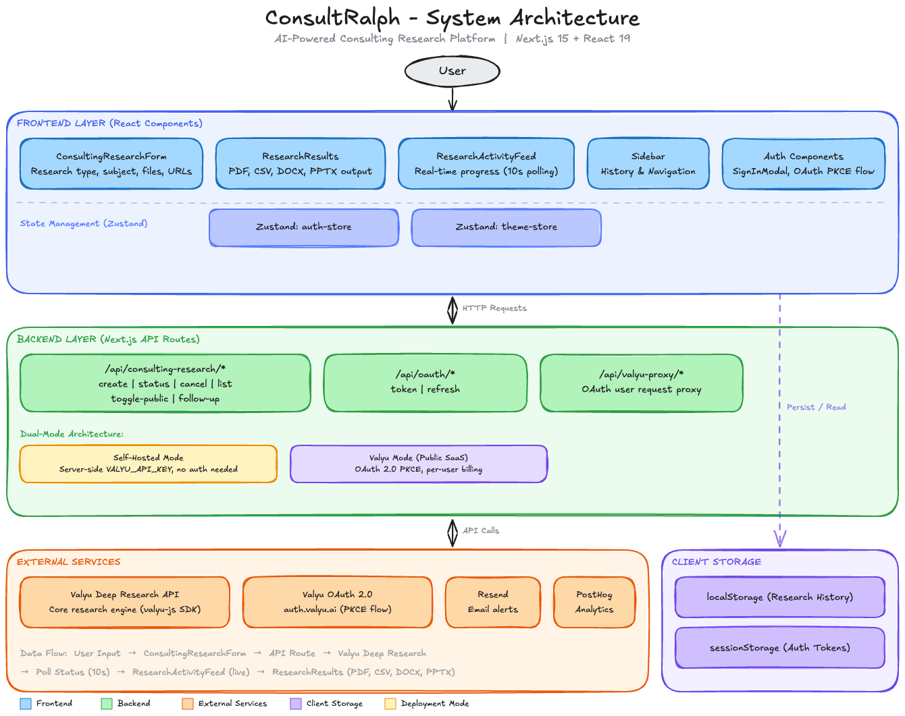

[


](https://medium.com/@unicodeveloper?source=post_page---byline--b5451b013051---------------------------------------)

20 min read

Mar 9, 2026

**The definitive guide to agent skills that change how Claude Code, Cursor, Gemini CLI, and other AI coding assistants perform in production.**


Humans watching agents work. Collaboration in N times!

## **What Are Agent Skills for Claude Code?**

Agent skills are **SKILL.md** files that extend what Claude Code and other AI coding assistants know how to do. When you install a skill, you give the agent a specialized playbook. Aset of instructions, templates, and context it can call on for a specific class of task. Skills can be invoked explicitly with a slash command (e.g. \`/frontend-design\`) or trigger automatically when the agent recognizes a relevant task.

Something shifted quietly in late 2025. Coding agents stopped being autocomplete tools and became actual collaborators. They don’t just suggest code, they build full features, run tests, query databases, generate artifacts, and send Slack updates.

But a raw Claude, Amp, Cline, Cursor, OpenCode or Copilot without skills is like a senior engineer on day one: brilliant, but missing all the project-specific context that makes them dangerous.

As of March 2026, the Claude Code skill ecosystem includes official Anthropic skills, verified third-party skills, and thousands of community-contributed skills compatible with the universal \`**SKILL.md**\` format. The same skill files work across Claude Code, Cursor, Gemini CLI, Codex CLI, and Antigravity IDE.

**The 10 must-have skills for Claude Code in 2026:**

1\. Frontend Design: Production-grade UI generation

2\. Browser Use: live web and browser automation

3\. Code Reviewer: automated quality and simplification

4\. Remotion: React-based programmatic video creation

5\. Google Workspace (GWS): 50+ Google API automation

6\. Valyu: Web search & real-time specialised data access

7\. Antigravity Awesome Skills: 1,234+ curated skill library

8\. PlanetScale Database Skills: Schema branching and query optimization

9\. Shannon: Autonomous AI pen testing

10\. Excalidraw Diagram Generator: Visual architecture diagrams

### **1\. Frontend Design**

**The problem:** Ask any LLM to build a landing page without guidance and you’ll get similar results almost every time: Inter font, purple gradient on white, minimal animations, grid cards. It’s not wrong, it’s just painfully average.

This is what Anthropic calls **“distributional convergence.”** Models are trained on the statistical center of design decisions, which means they reproduce the statistical center. The frontend design skill breaks that pattern.

**What it does:** The official Anthropic **frontend-design** skill (277,000+ installs as of March 2026) gives Claude a design system and philosophy before it touches any code. It outputs bold aesthetic choices, distinctive typography, purposeful color palettes, and animations that feel intentional rather than decorative.

The difference is dramatic. Without the skill, Claude defaults to a safe, forgettable design. With it, you get components that look like a senior designer reviewed them.

Press enter or click to view image in full size


This is the landing page of an app I built recently. I used the frontend-design skill

Here’s the [app](https://headliner.up.railway.app/) if you want to check it out 😉

**How to install:**

```
npx skills add anthropics/claude-code - skill frontend-design
```

Or directly via Claude’s plugin page. Once installed, invoke it with \`**/frontend-design**\` and describe what you want to build.

**The real value:** This isn’t about making things pretty. It’s about escaping the visual signature that users now recognize as “AI-generated.” Developers who care about shipping production apps need this. If you’re building anything user-facing, this is skill number one.

### **2\. Browser Use**

**The problem:** Coding agents are blind to the live web. They can write a scraper, but they can’t run it. They can describe what a page looks like, but they can’t interact with it. If your agent needs to fill out a form, log into a dashboard, scrape dynamic content, or verify that a deployed feature actually works end-to-end, you’ve hit a wall. It’s the major reason every app/system/infra is now been redesigned for agents to interact with.

Browser use solves this by giving the agent actual control of a browser.

**What it does:** The **browser use** skill connects Claude to a headless browser instance. The agent can navigate URLs, click elements, fill forms, extract content from JavaScript-rendered pages, take screenshots, and interact with complex web UIs, all as part of a natural language workflow.

This is different from scraping libraries. The agent doesn’t need to understand the DOM structure ahead of time. It navigates the web the same way a human does: look, click, read, act.

**How to install:**

```
npx skills add browser-use/claude-skill
```

**Example workflow:**

User: Check that the signup flow on our staging environment works end-to-end and screenshot any errors

Agent:

1.  Opens [https://staging.yourapp.com/signup](https://staging.yourapp.com/signup)
2.  Fills in test email and password
3.  Clicks “Create account”
4.  Follows verification email link
5.  Screenshots the dashboard (confirms successful signup)
6.  Reports: “Signup flow works. One issue: the ‘Verify email’ button is below the fold on mobile. Find attached screenshot.”

The same skill handles research tasks: “Find the three most recent funding announcements in climate tech and summarize the amounts and investors.” The agent actually opens pages, reads them, and synthesizes, not from cached training data, but from the live web.

**The real value:** Browser use turns Claude from a code-generation tool into an end-to-end QA engineer, research analyst, and automation operator. Any workflow that requires a human to open a browser and click through something is now a workflow the agent can handle. That covers a surprising percentage of developer toil.

### **3\. Code Reviewer**

**The problem:** Agents write code quickly. They have gotten really good at it. They review code a bit poorly (I’m counting my words here because these agents get better everyday). Left to their own defaults, most coding agents produce code that passes a first read but misses subtler issues: unnecessary abstractions, duplicated logic, functions doing too much, inconsistent naming, missing edge case handling.

The code works. It might not just hold up over time. Handling complex codebases is what made you a skillful senior engineer in the first place so you want to ensure every code the AI agent writes is written and abstracted properly for easier maintenance over time!

The code reviewer skill makes quality review a first-class step, not an afterthought.

**What it does:** The **code-reviewer** skill runs a structured review pass over any code the agent writes or modifies. It checks for:

-   Logic that could be simplified or extracted into reusable utilities
-   Functions that violate single responsibility
-   Inconsistent patterns compared to the rest of the codebase
-   Performance inefficiencies (unnecessary re-renders, N+1 queries, blocking operations)
-   Dead code and unused imports
-   Naming that doesn’t communicate intent

Crucially, it doesn’t just flag problems, it fixes them. The review loop happens before the code is presented to you.

**How to install:**

```
npx claude-code-templates@latest --skill development/code-reviewer
```

There’s also an official Anthropic skill that does something similar:

```
npx skills add anthropics/claude-code - skill simplify
```

The official Anthropic \`**simplify**\` skill covers the core of this: it reviews changed code for reuse, quality, and efficiency, then fixes what it finds. Pair it with a project-specific review checklist in \`**CLAUDE.md**\` for maximum effect.

**Configure review standards in \`CLAUDE.md\`:**

```
## Code Review Standards
After completing any implementation, review the code for:
- Functions longer than 30 lines (likely doing too much)
- Logic duplicated more than twice (extract to utility)
- Any `any` type usage in TypeScript (replace with real types)
- Components with more than 3 props that could be grouped into an object
- Missing error handling on async operations

Run /simplify before presenting code to the user.
```

**Example catch:**

```

const getUser = async (id: string) => {
const res = await fetch(`/api/users/${id}`);
const data = await res.json();
return data;
};

const getPost = async (id: string) => {
const res = await fetch(`/api/posts/${id}`);
const data = await res.json();
return data;
};
```

// After code review. Pattern extracted

```
const fetchResource = async (path: string) => {
  const res = await fetch(path);
  if (!res.ok) throw new Error(`Request failed: ${res.status}`);
  return res.json();
};

const getUser = (id: string) => fetchResource(`/api/users/${id}`);

const getPost = (id: string) => fetchResource(`/api/posts/${id}`);
```

**The real value:** Code review is the skill that keeps codebases maintainable. Technical debt compounds fast when agents ship first and nobody audits. A code reviewer that runs automatically, before you see the output, means the code you receive is already the second draft, not the first.

### **4\. Remotion**

**The problem:** Videos communicate things that documentation cannot. But video production requires a completely different workflow, different tools, different timelines, different teams. Most developers ship features without any video demos because the cost is too high.

Remotion removes that excuse.

**What it does:** Remotion is a React framework for creating videos programmatically. Instead of a timeline editor, you write components. Animation is just state changing over time. The Remotion agent skill for Claude Code translates natural language into working Remotion components.

**The workflow:** describe what you want in a prompt, Claude generates the React/Remotion code, you preview in the Remotion Studio, and render to MP4.

```
npx skills add remotion/agent-skills
```

Then in Claude:

```
/remotion Create a 30-second product demo video showing our API
dashboard with animated charts and transitions
```

**Example output:** A Remotion component with \`useCurrentFrame()\` driven animations, custom timing, and export-ready configuration.

```
import { AbsoluteFill, useCurrentFrame, interpolate } from "remotion";

export const ApiDemo = () => {
  const frame = useCurrentFrame();
  const opacity = interpolate(frame, [0, 30], [0, 1]);
  return (
    <AbsoluteFill style={{ backgroundColor: "#0a0a0a", opacity }}>
    <DashboardAnimation frame={frame} />
    </AbsoluteFill>
  );
};
```

**The real value:** Product demos, release announcements, explainer videos, animated README headers. The Remotion skill makes any developer capable of video production without leaving their code editor. Remotion’s agent skills integration was launched in January 2026 and has been widely covered in motion design communities since.

These promo videos for the products i built and launched were all made with Remotion.

### **5\. Google Workspace (GWS) Skills**

**The problem:** Google Workspace has 50+ APIs. Gmail, Drive, Calendar, Docs, Sheets, Slides, Chat, Admin each with its own client library, OAuth flow, and REST endpoints. Building an agent that interacts with Workspace has historically meant writing significant integration code just to get started.

Google shipped \`**gws**\` in March 2026 and changed this completely.

**What it does:** \`gws\` is a CLI that dynamically discovers all Google Workspace APIs through Google’s Discovery Service and exposes them as a unified interface. It ships with a built-in MCP server, run one command and your AI agent has full Workspace access.

The numbers are real: **gws** hit 4,900 GitHub stars in its first 3 days. This is not a niche tool.

```

npm install -g @googleworkspace/cli


gws mcp -s drive,gmail,calendar,sheets

npx skills add https://github.com/googleworkspace/cli

```

**Pre-built patterns (the “recipes”):**

-   **Executive assistant** persona: email drafting, calendar management, meeting notes to Docs
-   **Project manager**: task tracking in Sheets, status updates to Chat
-   **IT admin**: user management, permissions, audit logs
-   **Sales team**: CRM updates, proposal generation

**The real value:** Any workflow that currently involves copying between Google apps can become fully automated. Agents can read your Gmail, draft responses, update Sheets, create Calendar events, and generate Docs all from a single prompt. For developer teams using Google Workspace, this skill closes the last gap between **“agent that can code”** and **“agent that can operate.”**

### **6\. Valyu: Real-Time Web Search & Specialised Data Access**

**The problem:** Coding agents are excellent at working with code. They’re much worse at working with the real world because the real world is locked behind paywalls, proprietary databases, and specialized APIs that general-purpose search can’t reach.

Building a financial research app? You need **SEC filings.**

Building a biomedical tool? You need **PubMed** and **ChEMBL**.

Building an economic analysis dashboard? You need **FRED** and **BLS.**

Without these data sources, agents generate plausible-sounding but outdated or fabricated information.

**What it does:** The Valyu skill connects coding agents to 36+ specialised data sources, search for docs, and quality web search through a single API. One search call returns results from across the web AND sources like SEC 10-K filings, PubMed, ChEMBL (2.5M bioactive compounds), clinical trials, FRED economic indicators, patent databases, and academic publishers

**Install the Valyu skill:**

```
npx skills add https:
```

**Best practices for using Valyu in your agent:**

First, be specific about which data sources you need. The skill supports targeted search:

```
from valyu import Valyu
client = Valyu(api_key="your-key")


result = client.search(
  query="risk factors disclosed in latest 10-K filings for semiconductor companies",
  search_type="proprietary",
  included_sources=["valyu/valyu-sec-filings"],
  max_num_results=5
)


result = client.search(
  query="GLP-1 receptor agonists drug interactions clinical trial outcomes",
  search_type="all",
  included_sources=["valyu/valyu-pubmed", "valyu/valyu-chembl", "valyu/valyu-clinical-trials"],
  max_num_results=10
)
```

Second, use the Answer API when you need a direct response with citations rather than raw documents:

```

answer = client.context(
  query="What were the key risk factors disclosed by NVIDIA in their most recent 10-K?",
  search_type="proprietary"
)
```

Third, always surface sources to your users. The data is only as trustworthy as the citation trail.

**Performance benchmarks:** On FreshQA (600 time-sensitive queries), Valyu scores 79% vs Google’s 39% and Exa’s 24%. On Finance-specific queries, it scores 73% vs Google’s 55%. On MedAgent (562 complex medical queries), it leads at 48%.

**The real value:** Many open-source showcase apps that has driven some meaningful developer attention in the past year. [Global Threat Map](https://github.com/unicodeveloper/globalthreatmap) (1.3k stars), [Finance](https://github.com/yorkeccak/finance) (786 stars), [Bio](https://github.com/yorkeccak/bio) (230 stars), [Polyseer](https://github.com/yorkeccak/polyseer) (598 stars) used real specialised data as the core value proposition. Agents that can access current, authoritative, paywalled information are categorically more useful than those working from cached web data. This is what separates a demo from a tool people actually use.

### **7\. Antigravity Awesome Skills**

**The problem:** Every agent skill problem you have, someone else has already solved. But the solutions are scattered across GitHub repos, blog posts, and Discord servers. You spend time writing \`**SKILL.md**\` files from scratch for things like PR creation, debugging strategies, API design, security auditing when battle-tested versions already exist.

Antigravity Awesome Skills is the curated answer to this.

**What it does:** This is a community-maintained library of 1,234+ agentic skills designed to work across every major AI coding assistant. Claude Code, Cursor, Gemini CLI, Codex CLI, GitHub Copilot, Antigravity IDE, and more. The skills follow the universal \`**SKILL.md**\` format, are organized by category, and are installable with a single command.

22,000+ GitHub stars. 3,800+ forks. Updated as of March 2026 (v7.3.0). This is the most comprehensive skill collection that exists.

**Install for Claude Code:**

```
npx antigravity-awesome-skills - claude
```

For other tools:

```
npx antigravity-awesome-skills - cursor 
npx antigravity-awesome-skills - gemini 
npx antigravity-awesome-skills - antigravity 
npx antigravity-awesome-skills - path ./my-skills 
```

**The starter skills worth knowing immediately:**

-   `` `**@brainstorming** ``\`: structured planning before you write any code
-   **\`@architecture**\`: system design and component structure
-   \`**@debugging-strategies**\`: systematic troubleshooting playbooks
-   \`**@api-design-principles**\`: API shape, consistency, versioning
-   \`**@security-auditor\`:** security-focused code review
-   \`**@lint-and-validate**\`: lightweight quality checks
-   \`**@create-pr**\`: packages work into clean pull requests
-   \`**@doc-coauthoring**\`: structured technical documentation

**Example invocation in Claude Code:**

\>> **/brainstorming** help me plan the data model for a multi-tenant SaaS

\>> **/security-auditor** review the authentication flow in src/auth/

\>> **/api-design-principles** review the REST endpoints in routes/

**The bundles (role-based starter packs):**

Rather than installing all 1,234 skills and drowning in options, Antigravity ships curated bundles by role:

-   **Web Wizard:** frontend-design, api-design-principles, lint-and-validate, create-pr
-   **Security Engineer:** security-auditor, lint-and-validate, debugging-strategies
-   **Essentials:** brainstorming, architecture, debugging-strategies, doc-coauthoring, create-pr

**The real value:** This is the skill library that removes the **_“I should write a skill for that”_** backlog forever. The 1,234 skills cover territory most developers haven’t even thought to automate yet from AWS CloudFormation patterns to structured product thinking to multilingual documentation.

Installing it for Claude Code takes 30 seconds and immediately gives your agent a playbook for virtually any engineering task.

### **8\. PlanetScale Database Skills**

**The problem:** Database work is where agents make their worst mistakes. Schema design decisions that cause pain six months later. Queries that work fine at 100 rows and collapse at 100,000. Missing indexes discovered only in production.

Agents treat databases like any other code. They write something that runs and move on.

PlanetScale’s database skills change this by giving agents deep context about serverless MySQL, Postgres, branching workflows, and query performance from the start.

**What it does:** PlanetScale runs a serverless MySQL-compatible database platform with a branching model that maps directly to git: you create a database branch for each feature, merge it when done, and never touch production schema directly. The PlanetScale skill teaches agents to:

-   Design schemas using PlanetScale’s foreign key and branching conventions
-   Write queries that use indexes correctly (and flag when they won’t)
-   Use \`**pscale**\` CLI to create branches, deploy requests, and manage migrations
-   Treat schema changes as code. Reviewable, reversible, mergeable

**Install the PlanetScale CLI and skill:**

```

brew install planetscale/tap/pscale


pscale auth login


npx skills add planetscale/agent-skill
```

**Example workflow the agent handles end-to-end:**

**User:** Add user preferences to the schema

**Agent:**

1.  Creates a new database branch: pscale branch create mydb add-user-prefs
2.  Switches connection to the branch
3.  Designs the schema:

```
CREATE TABLE user_preferences (
id VARCHAR(36) PRIMARY KEY DEFAULT (UUID()),
user_id VARCHAR(36) NOT NULL,
theme ENUM('light', 'dark', 'system') DEFAULT 'system',
notifications_enabled TINYINT(1) DEFAULT 1,
created_at TIMESTAMP DEFAULT CURRENT_TIMESTAMP,
updated_at TIMESTAMP DEFAULT CURRENT_TIMESTAMP ON UPDATE CURRENT_TIMESTAMP,
INDEX idx_user_id (user_id)
);
```

4\. Verifies the index covers the expected query patterns

5\. Creates a deploy request: pscale deploy-request create mydb add-user-prefs

6\. Reports: “Schema ready for review. Deploy request #14 created. Note: no foreign key constraint on user\_id. Using PlanetScale conventions for horizontal scalability.”

**Query analysis. What agents miss without this skill:**

```
// Agent without skill writes this

SELECT * FROM orders WHERE status = 'pending' AND created_at > '2026–01–01';

// Agent with PlanetScale skill writes this + explains why

SELECT id, user_id, total, created_at
FROM orders
WHERE status = 'pending'
AND created_at > '2026–01–01';
 - Added composite index: INDEX idx_status_created (status, created_at)
 - SELECT * avoided - only fetch columns needed
 - Estimated query time at 10M rows: ~2ms with index vs ~8s without
```

**The real value:** Database decisions made at day one are the hardest to undo at day 365. An agent with PlanetScale skills doesn’t just write a schema that works, it writes a schema that scales, with the branching workflow baked in so every change is reviewable.

### **9\. Shannon: Autonomous AI Pentester**

**The problem:** Security testing is the step most development teams skip, not because they don’t care, but because it’s expensive, slow, and requires specialized knowledge.

A traditional pentest costs thousands of dollars and returns a PDF report two weeks later. Manual security review catches some vulnerabilities and misses others based on the reviewer’s specific expertise. Meanwhile, the codebase keeps moving.

Shannon is an autonomous pen testing agent that runs against your local or staging environment, executes real exploits, and reports only the vulnerabilities it can actually prove.

**What it does:** The Shannon skill wraps [**KeygraphHQ’s Shannon**](https://github.com/KeygraphHQ/shannon), a white-box security testing framework that analyzes source code, maps attack surfaces, and executes real attacks across 50+ vulnerability types in 5 OWASP categories.

The benchmark result worth knowing: **96.15% exploit success rate** on the XBOW security benchmark (100/104 exploits). This is not a scanner that flags potential issues, it’s an agent that either exploits the vulnerability or doesn’t report it.

**Install:**

```
npx skills add unicodeveloper/shannon
```

**Prerequisites:** Docker (runs everything in containers) and an Anthropic API key. That’s it.

**How to run:**

```


/shannon http://localhost:3000 myapp


/shannon - scope=xss,injection http://localhost:8080 frontend


/shannon - workspace=audit-q1 http://staging.example.com backend-api


/shannon status


/shannon results
```

**The 5-phase pipeline (runs in parallel where possible):**

**Phase 1: Pre-Recon**

Static source code analysis + external scans (Nmap, Subfinder, WhatWeb)

**Phase 2: Recon**

Live attack surface mapping via headless browser

**Phase 3: Vulnerability Analysis with 5 parallel agents**

Injection / XSS / SSRF / Authentication / Authorization

**Phase 4: Exploitation with parallel execution**

Each agent spawns dedicated exploitation agent, executes real attacks

**Phase 5: Reporting**

Executive summary + reproducible PoC for every finding

**What Shannon covers (50+ specific vulnerability types):**

-   **Injection:** SQL injection (union, blind, time-based), command injection, SSTI, NoSQL injection
-   **XSS:** Reflected, stored, DOM-based, via file upload, mutation XSS
-   **SSRF:** Internal service access, cloud metadata (AWS/GCP/Azure), DNS rebinding, protocol smuggling
-   **Broken Authentication:** Default credentials, JWT flaws (none algorithm, weak signing), session fixation, CSRF, MFA bypass
-   **Broken Authorization:** IDOR, privilege escalation, path traversal, forced browsing, mass assignment

**Runtime and cost:** ~1–1.5 hours per full pentest, ~$50 using Claude Sonnet. Compare that to a human pentest engagement.

**Safety gates built in:** Shannon confirms authorization before every run, warns against production targets, supports scope controls and avoid-list rules (e.g., skip \`**/logout**\`, \`**/admin/delete**\`), and runs all attack tools inside Docker. Nothing executes on your host.

**Important:** Shannon executes real attacks. Only run it against systems you own or have explicit written authorization to test. The skill enforces an authorization gate at every invocation.

**The real value:** Most codebases have security vulnerabilities that survive code review because reviewers aren’t thinking adversarially while reading feature code. Shannon is the adversarial pass, running automatically against every staging deployment, finding the IDOR in the API endpoint you shipped last Tuesday, proving the SQL injection in the search box that everyone assumed was parameterized.

The “**_no exploit, no report”_** policy means zero false-positive noise. You fix what’s confirmed broken.

### **10\. Excalidraw Diagram Generator**

**The problem:** Architecture decisions, system designs, data flow explanations, these are communicated in prose or in whiteboard sessions that nobody records.

Code comments describe what something does; diagrams show why it’s structured that way. Most agents can describe an architecture in text. Almost none can generate a diagram that makes the argument visually.

The Excalidraw Diagram Generator skill changes that.

**What it does:** This skill generates production-quality Excalidraw diagrams from natural language descriptions. But what makes it different from simpler diagram tools is the design philosophy baked into the skill itself:

-   **Diagrams that argue, not display.** Every shape and grouping mirrors the concept it represents. Fan-out structures for one-to-many relationships. Timeline layouts for sequential flows. Convergence shapes for aggregation. The agent doesn’t default to uniform card grids, it maps visual structure to conceptual structure.
-   **Evidence artifacts.** Technical diagrams include actual code snippets and real JSON payloads inline, not placeholder text.
-   **Visual self-validation.** The skill includes a Playwright-based render pipeline. The agent generates the Excalidraw JSON, renders it to PNG, reviews its own output for layout issues (overlapping text, misaligned arrows, unbalanced spacing), and fixes problems before presenting the result. No more broken diagrams.

Press enter or click to view image in full size



This is the architecture diagram for one of the apps I built

I made the diagram above with this skill for [consultralph.com](https://consultralph.com/) (one of the apps I built last month)

**How to install:**

```
npx skills add https://github.com/coleam00/excalidraw-diagram-skill --skill excalidraw-diagram
```

**Example prompts:**

```
Create an Excalidraw diagram showing how a request flows through
our API gateway, auth middleware, and downstream services
Generate an architecture diagram for a multi-tenant SaaS with
separate database schemas per tenant and a shared analytics layer
Draw a sequence diagram for our OAuth2 PKCE flow including
the browser, authorization server, and resource server
```

**Brand customization:** All colors live in \`_references/color-palette.md_\`. Edit once, every diagram follows your palette.

**The real value:** Diagrams are the artifact that survives longer than the conversation that produced them. A good architecture diagram in the repo communicates decisions to engineers joining six months later, explains the system to stakeholders who won’t read code, and forces the designer to think through edge cases that prose descriptions paper over.

An agent that generates these diagrams by default rather than requiring a separate diagramming session closes the documentation gap that every fast-moving team has.

The self-validation loop is what makes this usable in practice: you get a diagram you can actually publish, not a first draft you’d be embarrassed to share.

## **How to Think About Skills in 2026**

Skills are how you invest in your agent’s capabilities. A raw agent is general-purpose. A skilled agent is specialized. The 10 skills above represent roughly 80% of the workflow where agents produce suboptimal output without guidance:

-   **Design quality:** frontend-design
-   **Live web access:** browser use
-   **Code quality:** code reviewer
-   **Video content:** Remotion
-   **Workspace automation:** GWS
-   **Web search, deepresearch and proprietary data access:** Valyu
-   **Skill library:** Antigravity Awesome Skills (1,234+ skills, one install)
-   **Database architecture:** PlanetScale
-   **Security validation:** Shannon (96.15% exploit success rate, no false positives)
-   **Visual communication:** Excalidraw Diagram Generator

The key question when evaluating any skill: does it change the _default_ behavior, or does it just add a command you have to remember to invoke?

The best skills shift what the agent produces without requiring constant prompting.

**_Frontend-design_** changes what “build me a landing page” returns.

**_Shannon_** runs an adversarial pass before anything goes to production.

The **Excalidraw** skill generates a diagram you can actually share, not a placeholder you’d redraw yourself.

That’s the bar. Skills that clear it are worth the ten minutes to configure. Skills that don’t are just extra commands in a menu nobody reads.

**Installing skills in Claude Code, Codex, OpenCode, AntiGravity, Cursor, Cline:**

Most skills follow this pattern:

```

npx skills add anthropics/claude-code - skill <skill-name>


npx antigravity-awesome-skills - claude


npx skills add unicodeveloper/shannon


npx skills add https://github.com/coleam00/excalidraw-diagram-skill --skill excalidraw-diagram


npx skills list
```

The agent skills ecosystem is moving fast. The 10 skills above are stable enough to invest in now.

You can check out [https://www.aitmpl.com/skills](https://www.aitmpl.com/skills) and [skills.sh](https://skills.sh/) daily for skills to add to your growing arsenal!

**Note:** One more [GitHub repo](https://github.com/affaan-m/everything-claude-code) for you to consume to 100x your productivity!

## **Frequently Asked Questions**

**What is a Claude Code skill?**

A Claude Code skill is a **SKILL.md** file that gives the agent specialized instructions, context, and workflows for a specific task. Skills are invoked with a slash command (e.g. \`**/frontend-design**\`) or trigger automatically based on the task. The same **SKILL.md** format works across Claude Code, Cursor, Gemini CLI, and other compatible agents.

**How do I install skills in Claude Code?**

Most skills install via \`npx skills add <org>/<repo>\`. Official Anthropic skills use \`npx skills add anthropics/claude-code — skill <name>\`. The Antigravity Awesome Skills library installs 1,234+ skills at once with \`npx antigravity-awesome-skills — claude\`. List installed skills with \`npx skills list\`.

**What is the best skill for improving frontend code quality?**

For visual design quality, install the official Anthropic frontend-design skill (\`npx skills add anthropics/claude-code — skill frontend-design\`, 277K+ installs). For code quality and simplification, install the simplify skill (\`npx skills add anthropics/claude-code — skill simplify\`).

**What is the Valyu skill for Claude Code?**

The Valyu skill connects Claude Code to web search and 36+ specialised data sources including SEC filings, PubMed, ChEMBL, ClinicalTrials.gov, FRED economic indicators, and academic publishers. It installs with \`**npx skills add valyuAI/skills**\`. Valyu scores 79% on the FreshQA benchmark vs Google’s 39%.

**What is Shannon for Claude Code?**

Shannon is an autonomous AI pen testing skill that executes real security exploits against web applications. It achieves a 96.15% exploit success rate on the XBOW benchmark and covers 50+ vulnerability types across 5 OWASP categories. It runs entirely in Docker and costs ~$50 per full pentest. Install with \`**npx skills add unicodeveloper/shannon**\`. Only use it against systems you have authorization to test.

**What is Antigravity Awesome Skills?**

Antigravity Awesome Skills is a community-maintained library of 1,234+ agent skills compatible with Claude Code, Cursor, Gemini CLI, and 7 other AI coding tools. It has 22,034 GitHub stars and installs with \`npx antigravity-awesome-skills — claude\`. It includes skills for brainstorming, architecture, debugging, API design, security auditing, PR creation, and documentation.

**How does the Excalidraw diagram skill work?**

The Excalidraw diagram skill generates Excalidraw JSON from natural language, renders it to PNG using Playwright, reviews the image for layout issues, fixes problems, and delivers a clean diagram file. It uses a design philosophy where visual structure maps to conceptual structure rather than defaulting to uniform card grids.

**What skills work across Claude Code and Cursor?**

Skills in the universal **SKILL.md** format work across both. The Antigravity Awesome Skills library (\`npx antigravity-awesome-skills\`) is the largest cross-compatible collection. Google Workspace (\`gws\`) and the PlanetScale skill also support multiple agents. Remotion, Shannon, Valyu, and the Excalidraw skill are primarily Claude Code-focused but follow the portable format.

## **Summary: The 10 Skills and When to Use Each**

**Frontend Design** — Install if you’re building any user-facing UI and want generated code that doesn’t look generically AI-made.

**Browser Use** — Install if your agent needs to interact with live web pages, run end-to-end tests, or research dynamic content.

**Code Reviewer (Simplify)** — Install on every project. Turns first-draft agent code into second-draft code automatically.

**Remotion** — Install if you need video content (demos, releases, explainers) without a separate video production workflow.

**Google Workspace (GWS)** — Install if your team runs on Google Workspace and wants agents to read/write Gmail, Drive, Sheets, and Calendar.

**Valyu** — Install if your application needs current, authoritative, paywalled data: SEC filings, research papers, clinical data, economic indicators.

**Antigravity Awesome Skills**— Install on every machine. 1,234+ skills, one command, covers nearly every engineering workflow.

**PlanetScale Database Skills** — Install if you’re building on PlanetScale or MySQL-compatible/Postgres infrastructure and want index-aware schema generation by default.

**Shannon** — Install for development and staging environments where security validation before deployment is a priority. Never run against production or systems you don’t own.

**Excalidraw Diagram Generator** — Install if architecture decisions need to be documented visually and you want diagrams generated as part of the development workflow.