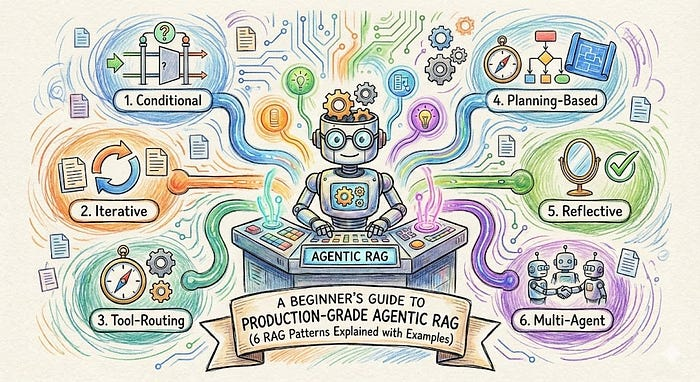
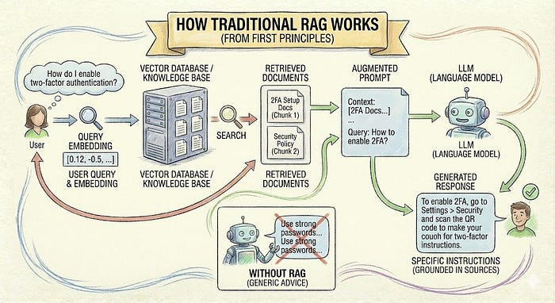
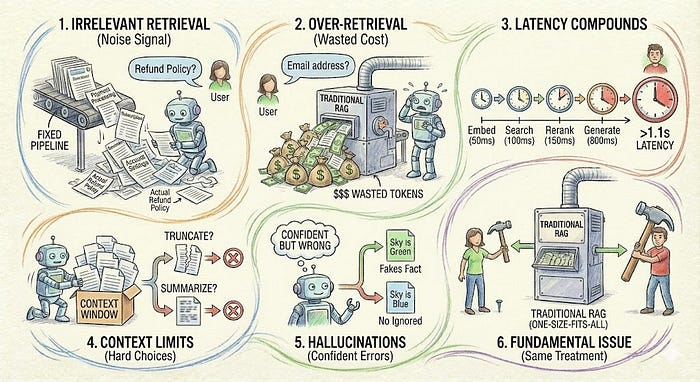
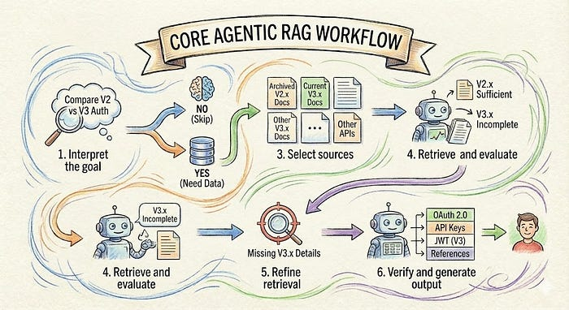
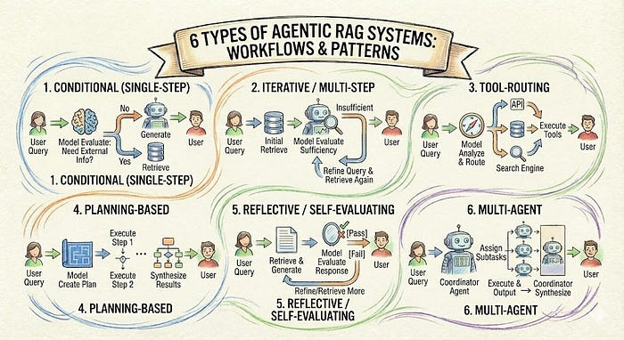

Press enter or click to view image in full size

Photo By Author

Member-only story

## Six Agentic RAG patterns explained with real production trade-offs

12 min read

Feb 10, 2026

Most RAG demos work until real users show up. Then they retrieve irrelevant context, waste tokens, and still hallucinate. The problem isn’t the model or retrieval itself.

**It’s that traditional RAG treats every query the same.**

Agentic RAG changes this. Instead of always retrieving, the system decides **when to retrieve, what to retrieve, and when to stop**.

This guide explains what Agentic RAG actually is, why traditional RAG breaks in production, and how to choose the right Agentic RAG pattern for real systems.

## How Traditional RAG Works (From First Principles)

Press enter or click to view image in full size

Photo By Author

Let’s get an idea of how traditional Rag works first. **Retrieval-Augmented Generation (RAG) combines various steps:**

-   **Retrieving relevant information** and generating a response based on it. Instead of relying only on what the model learned during training,
-   **Pulls in external data at query time**. **This matters because language models have a cutoff.** They don’t know your internal processes or recent changes. If the information isn’t in the prompt, the model can’t use it.
-   RAG solves this by searching a knowledge base, adding the relevant documents to the prompt, and **generating an answer grounded in those sources.**

**Example:** you’re building a support bot for a SaaS product. A user asks, “How do I enable two-factor authentication?” Without RAG, the model might give generic security advice. With RAG, the system retrieves your actual setup documentation and generates instructions specific to your product.

**The basic flow is straightforward:**

-   Convert the user query into a numerical representation (an embedding)
-   Search a vector database for documents with similar embeddings
-   Take the top results and add them to the prompt
-   Generate a response

This works. But it has problems.

## Why Traditional RAG Breaks in Production

Press enter or click to view image in full size

Photo By Author

The fixed pipeline approach fails in predictable ways.

-   **Irrelevant retrieval** happens constantly. A user asks, “What’s your refund policy?” The system retrieves documents about payment processing, subscription management, and account settings because they all mention money. The actual refund policy might be buried in the fifth result. The model now has to sift through noise to find the signal.
-   **Over-retrieval** wastes tokens and money. Simple questions get the same treatment as complex ones. A user asks, “What’s your email address?” The system still retrieves five documents and passes them to the model. You’ve just spent 10x the tokens you needed for something the model could have answered directly.
-   **Latency compounds** across the pipeline. Embed the query (50ms). Search the database (100ms). Rerank results (150ms). Generate response (800ms). You’re at 1.1 seconds for a simple question. Users notice.
-   **Context limits** force hard choices. You can retrieve 10 documents, but they don’t all fit in the context window. Do you truncate them? Summarize them first? Each choice introduces new failure modes.
-   **Hallucinations persist** even with good retrieval. The model might latch onto one sentence in the retrieved context and build an entire response around it, ignoring contradictory information in other documents. Or it might blend retrieved information with its training data, creating confident but wrong answers.

**The fundamental issue is that traditional RAG treats every query the same way. It retrieves the same number of documents, uses the same search strategy, and follows the same generation pattern regardless of what the user actually needs.**

## What “Agentic RAG” Actually Means

Press enter or click to view image in full size

Photo By Author

Agentic RAG gives the system decision-making ability. Instead of following a fixed pipeline, it reasons about what to do at each step.

Think of it this way: **if traditional RAG is a pipeline, agentic RAG is a decision tree.**

-   **In traditional RAG, every query follows the same path:** retrieve, then generate.
-   **In agentic RAG, the system branches based on what it observes:** Should I retrieve at all? Which sources should I search? Is the retrieved information sufficient? Do I need more?

**This doesn’t mean the system becomes autonomous or unpredictable. It means you’re using the language model’s reasoning capability to guide the retrieval process, not just the generation step.**

**A simple example clarifies this.**

A user asks, “What’s 15% of 240?” Traditional RAG might retrieve documentation about percentages. Agentic RAG recognizes this as a math problem that the model can solve directly and skips retrieval entirely.

Another user asks, “How has our pricing changed over the last two years?” Traditional RAG retrieves the current pricing page. Agentic RAG recognizes it needs historical data, searches archived documentation, compares versions, and synthesizes the changes.

**The “agentic” part refers to this decision-making loop.**

The system observes the query, decides on an action (retrieve, calculate, generate), evaluates the result, and decides whether to continue or return an answer.

## Core Agentic RAG Workflow

Let’s see how an Agentic RAG system handles a real query using a documentation assistant.

**Query:** _“Compare the authentication methods in versions 2.x and 3.x”_

The system moves through a series of decisions:

**1\. Interpret the goal**

The model recognizes this as a comparison task, not a simple lookup. It needs information from two different versions and must extract and contrast features.

**2\. Decide to retrieve**

The model checks whether this can be answered from training data alone. It cannot, so retrieval is required.

**3\. Select sources**

Instead of searching everything, the system chooses:

-   Archived documentation for version 2.x
-   Current documentation for version 3.x

A traditional RAG system would issue a single broad search across all sources.

**4\. Retrieve and evaluate**

The system retrieves documentation for both versions and evaluates completeness:

-   Version 2.x content is sufficient
-   Version 3.x content is incomplete and references another guide

The system decides to retrieve again.

**5\. Refine retrieval**

It issues a targeted search for the missing v3.x authentication details and retrieves the required information.

**6\. Verify and generate**

With sufficient information from both versions, the system generates a structured comparison:

-   OAuth 2.0 and API keys (both versions)
-   JWT (v3.x only)
-   References specific documentation sections

This is what makes the workflow agentic.

**The system chose when to retrieve, which sources to use, and whether another retrieval pass was necessary. A traditional RAG pipeline would have retrieved once and hoped the initial results were enough.**

Press enter or click to view image in full size

Photo By Author

## 6 Types of Agentic RAG Systems

Agentic RAG is not a single architecture. It’s a spectrum of patterns, each adding decision-making at different points in the retrieval process.

## Conditional (Single-Step) Agentic RAG

The simplest form of agentic behaviour is deciding whether to retrieve at all. Before any retrieval happens, the model evaluates the query.

Can this be answered from the model’s training data? Does it require current information? Is it a calculation or reasoning task that doesn’t need retrieval?

Based on this evaluation, the system either skips retrieval and generates directly or retrieves once and then generates.

**How it works:**

-   User query arrives
-   Model evaluates: Does this need external information?
-   If no: generate response directly from model knowledge
-   If yes: retrieve relevant documents, then generate
-   Return response

**This pattern shines when you have a mix of queries. Some need current data (product specs, documentation). Others don’t (general knowledge, math, reasoning). You want to avoid unnecessary retrieval costs.**

**Pros:**

-   Reduces retrieval costs on 30–40% of queries in mixed-use applications
-   Faster for queries that don’t need retrieval
-   Simple to implement and debug
-   Net result is usually lower cost with similar overall latency

**Cons:**

-   Adds one LLM call before retrieval (200–300ms)
-   The model might incorrectly decide to skip retrieval
-   Requires tuning the decision prompt for your use case

## Iterative / Multi-Step Agentic RAG

Sometimes the first retrieval isn’t enough. The system retrieves, evaluates the results, and decides whether to retrieve again with a refined query.

**How it works:**

-   Perform initial retrieval based on the user query
-   Model evaluates retrieved content for sufficiency and relevance
-   If insufficient: formulate a refined query, retrieve again
-   Repeat up to maximum iterations (typically 2–3)
-   Generate final response from accumulated context

Use this when queries are often ambiguous, or your knowledge base is large and diverse. Initial retrieval frequently misses the mark, and progressive refinement based on what’s found improves results.

**Pros:**

-   Significantly improves answer quality for complex queries
-   Handles ambiguous questions that need clarification
-   Can recover from poor initial retrieval

**Cons:**

-   Each iteration adds latency (retrieval + evaluation cycle)
-   Higher token usage from multiple steps
-   Needs careful stopping conditions to avoid infinite loops

## Tool-Routing Agentic RAG

Many applications have multiple retrieval sources: documentation databases, APIs, search engines,and user databases. Tool-routing systems analyze the query and decide which source(s) to use.

**How it works:**

-   Analyze user query to understand information needs
-   The model decides which data sources are relevant
-   Route to appropriate tool(s): API, database, search engine, etc.
-   Execute tools sequentially or in parallel as needed
-   Generate a response based on tool outputs

This pattern makes sense when you have heterogeneous data sources and different query types need different backends. You want to avoid searching everything for every query.

**Pros:**

-   Significantly improves relevance by using the right data source
-   Reduces unnecessary searches across irrelevant sources
-   Can combine real-time API data with static documentation
-   Optimises cost by only accessing needed sources

**Cons:**

-   Requires careful tool definition and clear descriptions
-   The routing decision adds one LLM call
-   Misrouting sends queries to the wrong source
-   More complex tool management and error handling

## Planning-Based Agentic RAG

For complex queries that need multiple steps in a specific order, planning-based systems create a plan before taking action. The system breaks down the query into steps, determines what information each step needs, and then executes the plan.

**How it works:**

-   Model analyzes query and creates a multi-step plan
-   The plan specifies what to retrieve, compute, and in what order
-   The system executes the plan step by step
-   Results from each step inform subsequent steps
-   The final step synthesizes all results into response

Use this when queries are consistently complex and multi-faceted, the sequence of operations matters, and you need to combine retrieval with computation or API calls.

**Pros:**

-   Handles complex queries requiring sequential operations
-   The plan provides transparency into the reasoning process
-   Can validate the plan before execution

**Cons:**

-   Planning step adds latency upfront
-   Plans can be incorrect, leading down the wrong path
-   Difficult to recover if early steps fail

## Reflective / Self-Evaluating Agentic RAG

After generating a response, some systems evaluate their own output for accuracy and completeness before returning it to the user.

**How it works:**

-   Generate an initial response from the retrieved information
-   The evaluation step assesses the response against the quality criteria
-   If evaluation passes: return response
-   If evaluation fails: retrieve more information or regenerate with feedback

This pattern fits when answer quality is critical, hallucinations are costly, and you have clear criteria for what makes a good answer.

**Pros:**

-   Catches hallucinations before they reach users
-   Improves answer completeness and accuracy
-   Provides a quality assurance layer

**Cons:**

-   Doubles the generation cost (initial + evaluation)
-   Adds 500–1000ms latency
-   Requires clear, measurable evaluation criteria

## Multi-Agent RAG

Multiple specialised agents work on different aspects of the query. A coordinator breaks the query into subtasks and assigns them to specialist agents. Each agent has its own context, tools, and instructions.

**How it works:**

-   The coordinator analyses the query and identifies subtasks
-   Assigns each subtask to a specialised agent
-   Agents execute in parallel with their own tools
-   Coordinator synthesizes final response from the agent outputs

Here’s the reality: you rarely need this. Use this pattern only when you have truly independent subtasks that can run in parallel and when simpler patterns have proven insufficient.

**Pros:**

-   Allows parallel execution of independent subtasks
-   Each agent optimized for a specific task type
-   Can reduce latency if parallelized well

**Cons:**

-   High implementation complexity
-   Difficult to debug
-   Context management between agents is tricky
-   Most production systems get better results from simpler patterns

## Pause: What We’ve Covered So Far

At this point, you understand the core distinction: traditional RAG is a fixed pipeline, agentic RAG is a decision-making system. You’ve seen six patterns, each adding progressively more agency. Most production systems use one or two of these patterns, not all six.

The patterns we’ve covered handle the “what” and “how” of agentic RAG. Now we’ll address the practical concerns: keeping latency and cost under control, and choosing which pattern actually fits your use case.

## Production Patterns to Manage Latency and Cost

Agentic behaviour adds flexibility but can also add cost and latency. Here’s how to keep both under control.

**Conditional retrieval based on confidence**

Before retrieving, ask the model: “On a scale of 1–10, how confident are you that this query requires external information?” If confidence is below 7, retrieve. If above, generate directly. This simple heuristic cuts unnecessary retrievals by 30–40% in mixed-use applications.

**Early stopping in iterative systems**

Set a quality threshold. After each retrieval, evaluate whether the information is sufficient. If it crosses the threshold, stop. Don’t iterate to a fixed count. This prevents unnecessary retrieval cycles when the first or second attempt succeeds.

**Caching at multiple levels**

-   Cache embeddings for common queries
-   Cache retrieval results for 1–24 hours (depending on data freshness requirements)
-   Cache full responses for truly identical queries
-   Use semantic caching to recognize that “How do I reset my password?” and “I forgot my password, what do I do?” are the same question.
-   Can reduce API calls by 50–70% for FAQ-style applications

**Shallow-first, deep-later retrieval**

Start with fast, approximate retrieval. Return 20 candidates quickly. If the model determines it needs more context or higher precision, do a slower but more thorough search. This keeps the common case fast while allowing depth when needed.

**Streaming evaluation in parallel**

Don’t wait for full retrieval to complete before starting evaluation. As chunks come back from the database, start evaluating relevance immediately. By the time all chunks arrive, you’ve already assessed the first batch and can make a retrieval decision faster.

**Budget-aware iteration limits**

Set a token budget per query. Track usage across retrieval and generation steps. When you approach the budget, force the system to generate with what it has. This prevents runaway costs on complex queries while still allowing iteration for most cases.

**Async refinement for non-critical paths**

Return an initial answer quickly. Continue refining in the background using the reflective pattern. If the refined answer is significantly better, notify the user. Most users prefer a fast, good-enough answer to waiting for perfect.

The key is measurement. Instrument every step. Track what percentage of queries use each code path. Measure latency and token usage per pattern. Optimize the slow paths that handle the most traffic.

## How to Choose the Right Agentic RAG Pattern

Start by answering these questions. Each narrows down which pattern fits your use case.

**Can the model answer most queries from its training data alone?**

If yes: Start with conditional single-step Agentic RAG. Let the system skip retrieval when possible. This is the simplest agentic pattern and often sufficient.

If no: Continue to next question.

**Do you have multiple distinct data sources that require different access methods?**

If yes: Use tool-routing Agentic RAG. Let the system choose which backend to query. This prevents searching irrelevant sources and improves precision.

If no: Continue to next question.

**Are queries frequently ambiguous or underspecified?**

If yes: Consider iterative Agentic RAG. Allow the system to refine its search based on what it finds. Limit iterations to 2–3 to control latency.

If no: Continue to next question.

**Do queries require multiple steps in a specific order?**

If yes: Use planning-based Agentic RAG. Have the system create and execute a plan. This works when the sequence matters (like looking up prerequisites before checking eligibility).

If no: Continue to next question.

**Is the cost of a wrong answer high?**

If yes: Add reflective/self-evaluating behavior on top of your chosen pattern. This catches errors before they reach users. Accept the latency cost.

If no: Your base pattern is probably sufficient.

**Additional considerations:**

How latency-sensitive is your application? Real-time chat needs conditional single-step. Batch processing can use planning-based with reflection.

What’s your error tolerance? High-stakes applications (medical, legal, financial) benefit from self-evaluation. Lower-stakes applications can skip it.

How complex is your data? Simple, well-structured documentation works fine with conditional retrieval. Messy, heterogeneous data benefits from tool-routing or iterative approaches.

What’s your budget? More agentic behavior means more LLM calls. If you’re cost-constrained, start simple and add agency only where measurement proves it’s needed.

Most applications end up with a hybrid: conditional retrieval to skip unnecessary searches, tool-routing to pick the right data source, and optional self-evaluation for queries flagged as high-risk.

## The Bottom Line

Agentic RAG is a spectrum, not a binary choice.

At one end, you have fixed-pipeline traditional RAG. At the other, you have fully autonomous systems that plan, execute, evaluate, and iterate. Most production systems live somewhere in between.

**Start with the simplest pattern that solves your immediate problem. Instrument it thoroughly. Measure where it fails. Add agency only to address those specific failures.**

If 90% of your queries work fine with traditional RAG, don’t add agentic behavior everywhere. Add it to the 10% that struggle.

**If retrieval is fast and cheap, you might not need conditional logic. If your data is homogeneous, you don’t need tool routing.**

The goal isn’t to build the most sophisticated system. It’s to build a system that reliably serves your users while staying within your latency and cost constraints.

**Agentic RAG gives you tools to handle the cases where simple retrieval falls short. Use them thoughtfully. The systems that work best in production are the ones that add complexity only where it’s justified, measure everything, and optimize for the user experience above all else.**