Member-only story

10 min read

Feb 3, 2026

Press enter or click to view image in full size

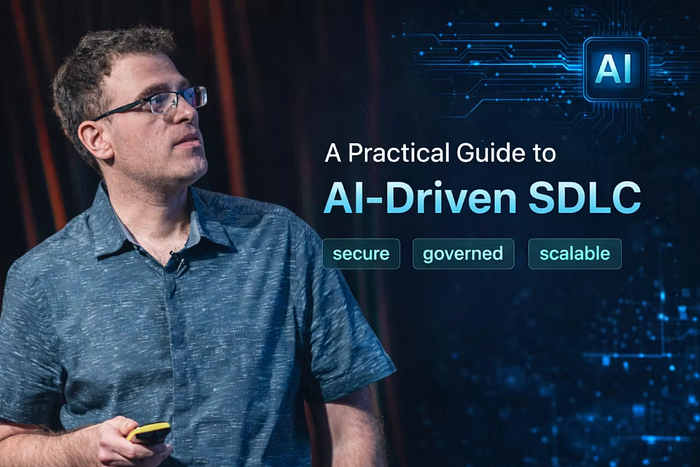

AI-Driven SDLC

We all follow some form of the Software Development Life Cycle to move ideas from product vision to production. For decades, this model has mainly been human-driven, supported by tools but governed by manual processes.

Over the past year, AI agents have entered everyday engineering workflows and begun reshaping how software is built. Developers now work alongside autonomous systems that can plan, design, implement, test, and operate services at unprecedented speed.

When applied correctly, this shift enables teams to deliver higher-quality software faster and allows new hires to contribute meaningfully from day one. When used without governance and security, however, it creates fragmentation, technical debt, and serious operational risk.

**In this post, I explore how AI is changing the SDLC, why unstructured adoption slows teams rather than accelerating them, and how organizations can build a secure, governed, and scalable AI-driven development model.**

Press enter or click to view image in full size

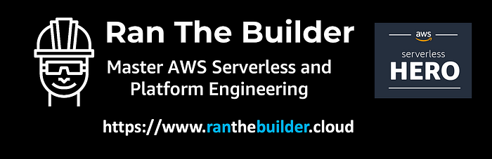

[https://www.ranthebuilder.cloud/](https://www.ranthebuilder.cloud/)

[**Book AWS Serverless or Platform Engineering consultation today!**](https://www.ranthebuilder.cloud/services)

## Table of Contents

1.  **Traditional Software Development Life Cycle**
2.  Where Current SDLC Fails
3.  **The New AI-powered Developer Vision**
4.  Introduction to AI Driven Software Development Lifecycle
5.  The Problems with Early AI Adoption
6.  **Building a Secure and Governed AI-SDLC**
7.  Governance and Security Layers in an AI-Driven SDLC
8.  **Challenges of AI-SDLC**
9.  **Summary**
10.  **References**

## Traditional Software Development Life Cycle

Traditional SDLC stages — [https://circleci.com/blog/ai-sdlc/](https://circleci.com/blog/ai-sdlc/)

The traditional SDLC that has helped deliver software in recent decades has several steps:

Press enter or click to view image in full size

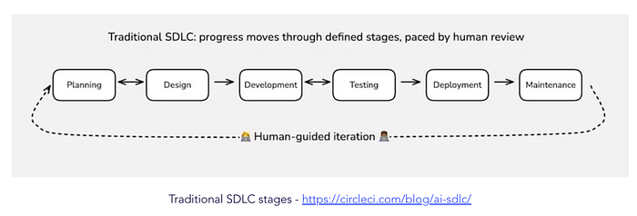

Traditional SDLC stages — [https://circleci.com/blog/ai-sdlc/](https://circleci.com/blog/ai-sdlc/)

The traditional SDLC that has helped deliver software in recent decades has several steps:

Press enter or click to view image in full size

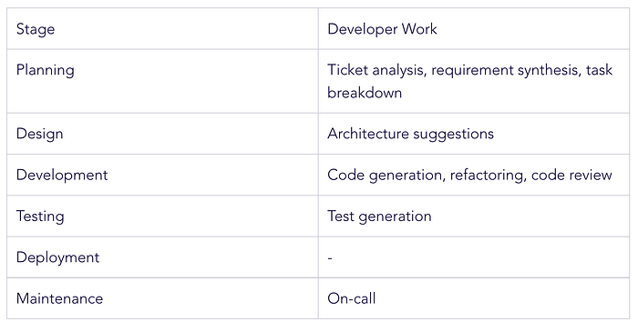

## Where Current SDLC Fails

While the traditional SDLC has enabled teams to deliver software reliably for decades, it also exposes several structural weaknesses when applied at scale.

> _AI-assisted development, where AI enhances specific tasks like documentation, code completion, and testing; and AI-autonomous development, where AI is expected to generate entire applications without human intervention based on user requirements. Both these approaches have produced suboptimal results in terms of velocity and software quality that AI-DLC aims to address. —_ [_AWS_](https://aws.amazon.com/blogs/devops/ai-driven-development-life-cycle/)

### 1\. Inconsistent Enforcement of Best Practices

Engineering standards, security guidelines, and architectural principles are often documented but unevenly applied. As teams grow, it becomes increasingly challenging to ensure that every developer consistently follows best practices. Much of this enforcement depends on manual reviews and individual discipline. While static code linters are effective to some degree, they are not enough.

### 2\. Code Reviews are a Subjective Art

Code review is both essential and subjective. Its quality depends heavily on the reviewer’s experience, availability, and attention to detail. Under time pressure, reviews often focus on surface-level issues rather than deeper architectural, security, or maintainability concerns. This leads to inconsistent feedback and missed risks.

### 3\. Ambiguous and Incomplete Planning

Effective planning requires clear requirements and well-structured task breakdowns. In reality, planning is often rushed or incomplete. Many developers dislike writing detailed specifications, leading to vague tickets. This ambiguity propagates downstream, leading to rework later in the process.

### 4\. Limited and Uneven Test Quality

Comprehensive and meaningful testing remains challenging to achieve. Few teams reach full coverage across all business scenarios, edge cases, and failure modes. High-quality test design often requires a specialized QA architect, but such a role is not always available. As a result, essential scenarios are frequently missed.

### 5\. Slow Feedback Loops

When planning is unclear, reviews are inconsistent, and tests are incomplete, feedback arrives late in the lifecycle. Issues are discovered during integration, deployment, or even in production, when they are far more expensive to fix.

**And it’s been like this for many years, and it won’t change altogether, but AI can optimize it, improve overall quality, and team velocity.**

## The New AI-powered Developer Vision

**TL;DR: Each developer works in their preferred IDE, using organization-configured, security-reviewed AI assistants that follow standardized, spec-driven processes across the entire SDLC.**

Press enter or click to view image in full size

AI empowered developer

In an AI-driven SDLC, developers collaborate with AI agents across every stage of delivery, from planning and design to development, testing, deployment, and operations. These agents can act as architects, engineers, security experts, or SREs, depending on the task at hand.

Rather than using disconnected AI tools, this model embeds agents directly into the lifecycle as always-available senior engineers, architects, and reviewers. The agents assist with ticket analysis, design, implementation, testing, reviews, deployment, and incident response, reducing manual overhead and shortening feedback cycles.

Behind the scenes, all agents follow consistent processes, generate repeatable outputs, and access internal tools, services, and data through centralized, secure, and auditable integration layers and configurations.

This approach preserves individual productivity and flexibility while ensuring that all work aligns with company standards and best practices.

### Introduction to AI Driven Software Development Lifecycle

AI has the potential to enhance every stage of the SDLC, from ticket creation and requirement analysis to design, implementation, testing, deployment, and operations.

Rather than treating AI as a collection of isolated tools, the AI-driven SDLC integrates agentic systems directly into existing workflows. These agents interact with platforms such as Jira, source control systems, MCP services, CI/CD pipelines, and observability tools, while operating under unified governance and security policies.

Here are several examples to how AI integrates into the SDLC:

Press enter or click to view image in full size

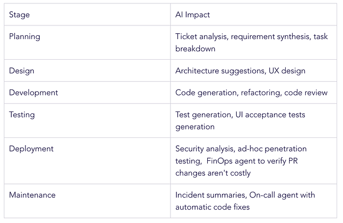

AI has the potential to enhance every stage of the SDLC, from ticket creation and requirements analysis to design, development, testing, deployment, and operations. Rather than acting as a collection of isolated tools, an AI-driven SDLC embeds agentic systems directly into existing workflows, integrating with platforms such as Jira, source control, MCP services, CI/CD pipelines, and observability tools under unified governance and security policies.

Across these stages, AI supports planning, architecture, coding, testing, security validation, and incident response, while providing large-scale analysis and continuous feedback. Together, these capabilities reduce manual overhead, accelerate delivery, and improve quality without sacrificing control.

### The Problems with Early AI Adoption

Most organizations adopt AI in a fragmented way (primarily during code development) and are driven by individual developers rather than a coordinated strategy. This leads to inconsistent workflows and unpredictable outcomes.

Different teams use different tools, prompts, and configurations, making it challenging to produce repeatable results. Without central security controls, AI integrations can expose sensitive data and create over-privileged access paths.

Lack of governance means AI-generated code often ignores internal standards, libraries, and naming conventions, increasing technical debt and refactoring work or even introduce security issues through [MCP servers that expose organisational data and services.](https://www.cyberark.com/resources/threat-research-blog/is-your-ai-safe-threat-analysis-of-mcp-model-context-protocol)

Unstructured “vibe coding” may work for experiments, but it does not scale to production systems.

Tool sprawl and configuration drift create operational complexity and reduce reliability.

In addition, poor developer AI coordination leads to wasted tokens, repeated context-building, longer review cycles, and higher costs rather than improved efficiency.

> _Teams that want to succeed need to update their mental model to match today’s reality, where work flows in multiple directions, decisions are more distributed, and humans and autonomous systems build side by side. —_ [_https://circleci.com/blog/ai-sdlc/_](https://circleci.com/blog/ai-sdlc/)

Successful AI adoption is not only a technical challenge. It is also a cultural and management one. Developers need to trust the tools, understand their value, consistently see high-quality output, and feel supported as they change how they work. When AI delivers real value, repeatable results, and shorter SDLC cycles, developers are far more likely to embrace it.

## Building a Secure and Governed AI-SDLC

In a governed AI-SDLC, developers continue to work in their IDE of choice while using organization-approved agentic assistants throughout every phase of delivery.

The organization provides a secure, standardized, and spec-driven development flow.

> _Spec-driven development means writing a “spec” before writing code with AI (“documentation first”). A spec is a structured, behavior-oriented artifact — or a set of related artifacts — written in natural language that expresses software functionality and serves as guidance to AI coding agents. —_ [_Martin Fowler_](https://martinfowler.com/articles/exploring-gen-ai/sdd-3-tools.html)

Each stage produces structured outputs that enrich the context for the next stage. These artifacts are stored alongside the code in the repository and serve as inputs for subsequent phases. For example, planning outputs inform architecture and design decisions, which in turn drive implementation and testing.

Press enter or click to view image in full size

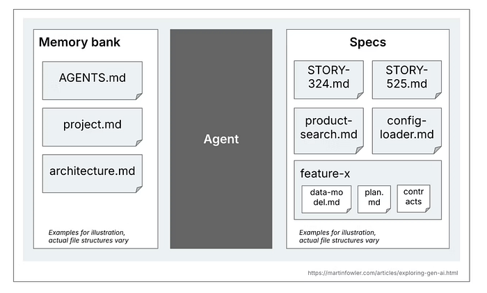

Spec definition

This continuous accumulation of context ensures consistency, traceability, and alignment with organizational standards.

Each stage of the SDLC follows a common sub-flow: plan, validate with stakeholders, and execute. This pattern creates predictable outcomes, enables early feedback, and reduces costly rework.

Together, these practices form the foundation of a scalable, secure, and repeatable AI-driven development lifecycle.

Press enter or click to view image in full size

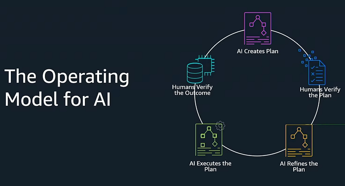

AWS — AWS re:Invent 2025 — Spec-driven development with Kiro (DEV314)

### Governance and Security Layers in an AI-Driven SDLC

To make AI-driven development scalable and trustworthy, governance and security must be embedded into every stage of the lifecycle and integrated with organizational data and tools.

A secure, spec-driven development model is built on several foundational layers.

Press enter or click to view image in full size

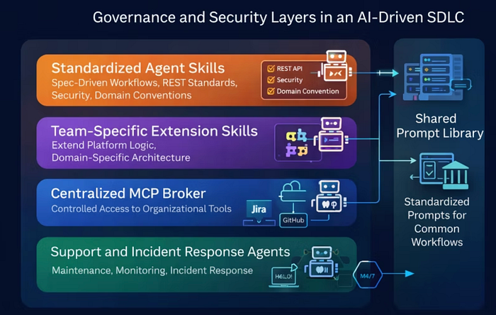

Governance and Security Layers in an AI-Driven SDLC

### Standardized Agent AI-SDLC Skills

All repositories and approved IDEs use a common set of agent skills. These skills enforce spec-driven workflows and standardize each stage of delivery, including requirements definition, architectural design, tool usage, and engineering practices. This ensures consistent application of REST standards, security patterns, domain conventions, and internal frameworks.

### Team-Specific Extension Skills

Service teams can extend the core platform with custom skills that reflect their domain logic, architectural patterns, and operational requirements, while still operating within organizational standards.

### Centralized MCP Broker

A centrally managed MCP broker, maintained by platform, IT, and security teams, controls access to internal and external tools. Only approved and configured services are exposed to agents, ensuring secure, auditable, and policy-compliant integrations across both local and remote environments.

### Shared Prompt Library

Reusable, reviewed prompt templates are provided for common workflows and specialized tasks such as onboarding, platform adoption, migrations, and compliance validation. These prompts are distributed through internal CLIs, libraries, and managed repositories, enabling consistent usage across teams.

### Support and Incident Response Agents

Dedicated operational agents support the maintenance phase by monitoring systems, summarizing incidents, assisting with root cause analysis, and coordinating automated remediation when appropriate.

## Example Flow: From Jira Ticket to Production

1.  The developer opens their IDE of choice.
2.  Using an approved prompt from the internal library, the developer initiates Jira ticket analysis and task decomposition through the agent interface.
3.  The agent generates a structured plan and stores it locally in the repository. It identifies open questions and requests clarification.
4.  The developer refines requirements and validates the proposed tasks.
5.  The agent iteratively implements the tasks (including tests), updating specifications and design artifacts as the system evolves.
6.  The developer reviews each change and commits both code and updated documentation.
7.  The agent runs the all PR required linters and opens a pull request.
8.  Specialized agents, including code quality, FinOps, and security reviewers, review the pull request.
9.  A human reviewer validates business intent and approves the merge.
10.  After deployment, support agents monitor production systems and surface anomalies through observability platforms.

## Example from spec-driven implementation of a task using Kiro

First, generating the current architecture of the service (done one time and updated per feature). Every generated file provides context for the next task in hand.

Press enter or click to view image in full size

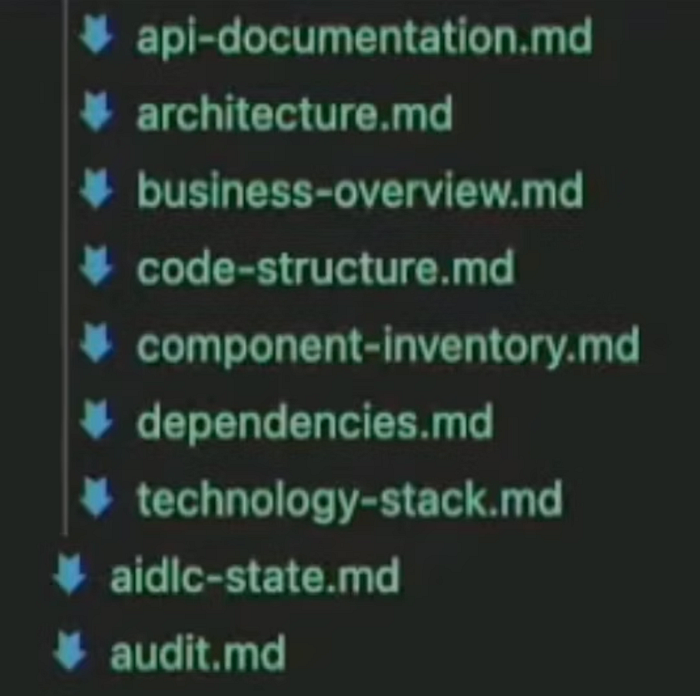

Every generated file provides context for the next task in hand.

Defining requirements and requesting clarifications using local files:

Press enter or click to view image in full size

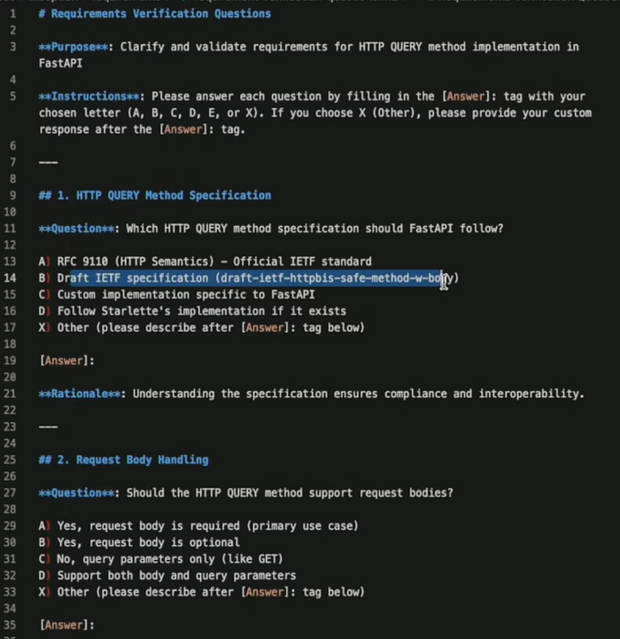

Defining requirements and requesting clarifications using local files

Creating the task spec and showing the steps, asking for human validation:

Press enter or click to view image in full size

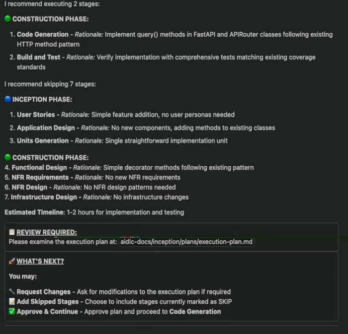

Creating the task spec and showing the steps, asking for human validation

Keeping track of the AI-SDLC:

Press enter or click to view image in full size

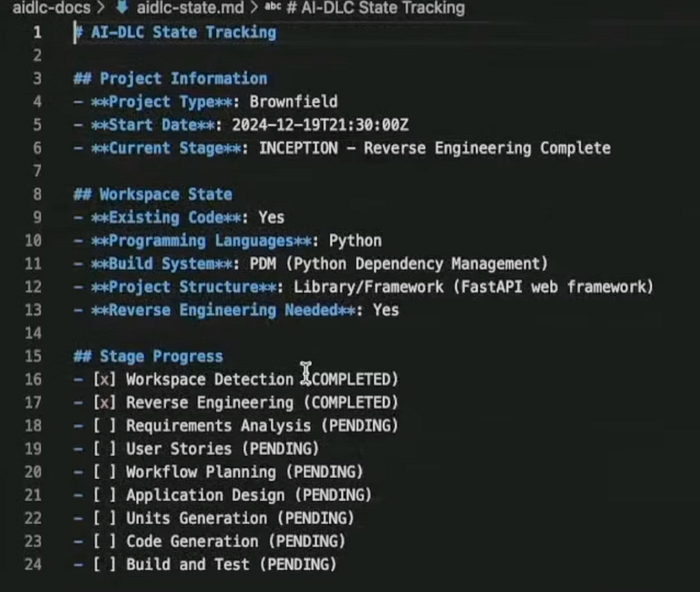

## Challenges of AI-SDLC

As with all new methodologies, there are several challenges:

1.  Working with AI is a skill that teams must actively develop. Governance helps accelerate this process by enabling better out-of-the-box results, reducing common mistakes, and supporting adoption through training, shared practices, and knowledge transfer.
2.  As development velocity increases, traditional code reviews risk becoming a bottleneck. Large, AI-generated pull requests are difficult to review and slow teams down. Keeping PRs small and introducing review agents helps standardize quality, allowing developers to focus on business intent rather than formatting and style.
3.  Hard to evaluate tools due to the nature of non-determinism and the difference between repositories, services, task complexities, and the used models.

In addition, Spec-Driven Development introduces several practical challenges:

1.  Designing workflows that are structured but not overly long or cumbersome. If the spec process becomes too heavy, developers will avoid it, so continuous fine-tuning is required.
2.  Selecting a specification tool that remains effective over time. Most tools are highly opinionated and follow different approaches, such as spec-first, where detailed specifications are written upfront, and spec-anchored, where specifications are maintained throughout the feature lifecycle. Tools like [Kiro](https://kiro.dev/), [Spec-It](https://github.com/github/spec-kit), and [BM](https://github.com/bmad-code-org/BMAD-METHOD)AD each emphasize different approaches ([**Spec-first vs. Spec-anchored**](https://martinfowler.com/articles/exploring-gen-ai/sdd-3-tools.html)**)**, making both standardization and switching tools difficult.
3.  Reviewing specifications (.md files) is more complicated than reviewing code, which slows feedback and reduces review quality.
4.  AI agents are not fully deterministic and may occasionally ignore or reinterpret parts of the specification, making continuous validation and human oversight essential.
5.  SDD can be an overkill for small tasks. Best practices for using it are unclear yet; it requires trial and error (it also depends on your configuration). See diagram below.

Press enter or click to view image in full size

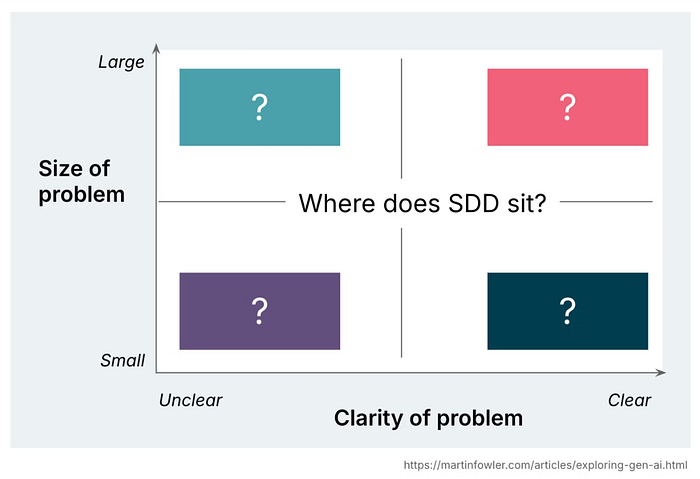

SDD balance — when to use SDD or just a simple prompt?

## Summary

Spec-Driven Development and AI-driven SDLC are still evolving, and early adopters should expect change and occasional disruption. Standards, tools, and workflows will continue to shift. However, the potential gains in speed, quality, and scalability are significant. Waiting for full maturity means missing these advantages. Organizations that invest early, experiment responsibly, and build strong governance will be best positioned to lead as the ecosystem stabilizes.