Member-only story

[


](https://medium.com/@joe.njenga?source=post_page---byline--0ab8422754d2---------------------------------------)

12 min read

Feb 27, 2026

Press enter or click to view image in full size

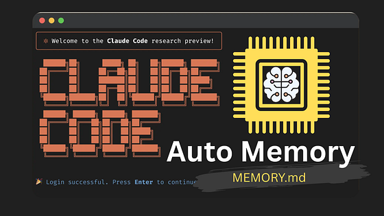

You don’t have to worry about losing your session context anymore. The new auto-memory feature on Claude Code is what you all needed.

> **If you have been using Claude Code for a while, you know that when you close a session, come back the next day, and Claude remembers nothing.**

You end up re-explaining the same things over and over to get Claude back up to speed.

> **Anthropic just rolled out auto-memory for Claude Code, and it solves this problem.**

Press enter or click to view image in full size

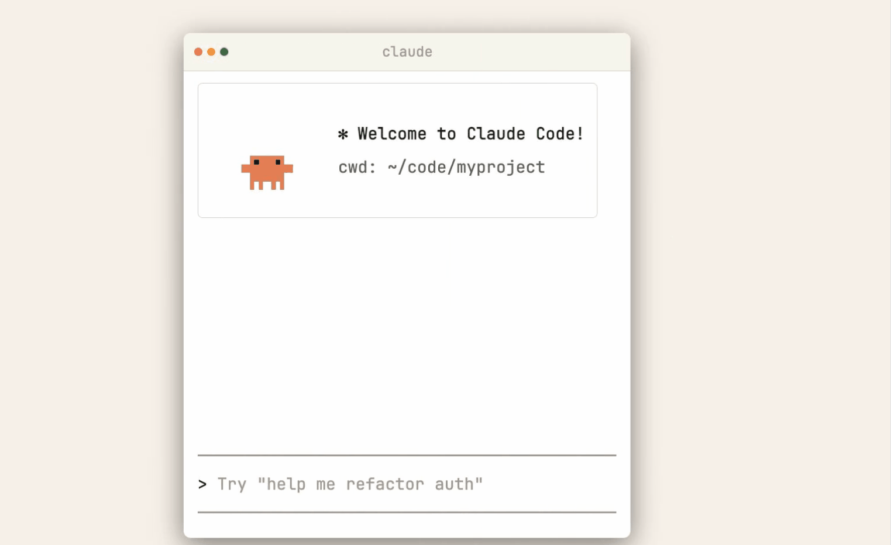

Claude now builds and maintains its own memory as it works with you.

> **It quietly takes notes on your project; the build commands, your code style preferences, architecture decisions, even the tricky bugs you solved together.**

Press enter or click to view image in full size

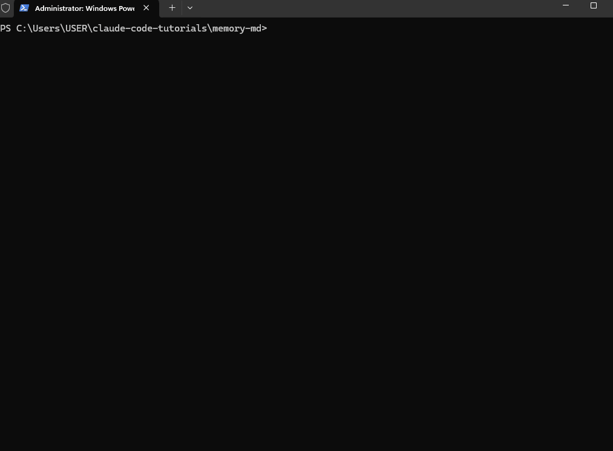

When you start a new session, that context is already loaded. You pick up right where you left off.

What makes this interesting is that you don’t write any of it; Claude does it automatically.

There is already a `CLAUDE.md` file that most users know — that is where _you_ write instructions for Claude.

> **I recently shared in my Claude Code newsletter an** [**in-depth masterclass on the CLAUDE.md file, where you can learn more.**](https://newsletter.claudecodemasterclass.com/p/claudemd-masterclass-from-start-to)

> Auto-memory introduces something different: a `MEMORY.md` file that _Claude_ writes and updates itself as a personal scratchpad across your sessions.

I tested the new Claude Code auto memory on a project to see what Claude decides to remember, where it stores everything, and whether it holds up when you return to a cold session.

> **In this article, I will walk you through how auto-memory works, show you the difference between** `**CLAUDE.md**` **and** `**MEMORY.md**` **, share my test results, and show you how to control the auto-memory when you need to.**

## How Auto-Memory Works

Auto-memory is enabled by default the moment you update Claude Code.

> **There is nothing to configure or install. it just starts working.**

As you work through a session, Claude quietly observes and takes notes. It makes its own judgment on what is worth keeping for next time.

Here is what Claude saves:

-   **_Project patterns_** _— build commands, test conventions, and how your code is structured_
-   **_Debugging insights_** _— solutions to tricky problems, what caused a specific error_
-   **_Architecture notes_** _— key files, how modules relate, important abstractions_
-   **_Your preferences_** _— communication style, workflow habits, tool choices_

None of this requires any input from you. Claude decides what is useful and writes it down on its own.

## Where the Memory Lives

Each project gets its own dedicated memory directory stored at:

```
~/.claude/projects/<project>/memory/
```

The `<project>` path is derived from your git repository root, so every subdirectory inside the same repo shares one memory directory.

> **If you use git worktrees, _(_**[**_as I previosuly showed you here_**](https://medium.com/@joe.njenga/i-tried-new-claude-code-git-worktree-i-now-run-smooth-parallel-agents-8e21627167b7)**_)_ each worktree gets its own separate memory directory.**

Outside a git repo, Claude uses the current working directory instead.

Inside that directory, you will find this structure:

```
~/.claude/projects/<project>/memory/
├── MEMORY.md          
├── debugging.md       
├── api-conventions.md 
└── ...                
```

`MEMORY.md` is the entry point, and it acts as an index of everything Claude has saved, and it is the only file loaded at the start of every session.

## 200-Line Rule

There is an important constraint you should know: Claude only loads the first **200 lines** of `MEMORY.md` into its system prompt at session start.

Anthropic designed it this way to keep memory concise and focused.

> **When** `**MEMORY.md**` **starts getting long, Claude is instructed to move detailed notes into separate topic files like** `**debugging.md**` **or** `**api-conventions.md**`**, keeping the main index tight.**

> If you read my [CLAUDE.md Masterclass](https://newsletter.claudecodemasterclass.com/p/claudemd-masterclass-from-start-to), I highlighted a similar approach to keeping the file lean to make it more effective.

Those topic files are not loaded at startup. Claude reads them on demand during your session when it needs that specific information.

So the flow looks like this:

-   Session starts → first 200 lines of `MEMORY.md` load automatically
-   Claude needs specific debugging history → reads `debugging.md` on demand
-   Claude learns something new → updates `MEMORY.md` or the relevant topic file

> **You will see this happen in real time, as you work, Claude reads and writes to the memory directory during the session, before testing I thought it was a background process.**

## CLAUDE.md vs MEMORY.md — What’s the Difference?

Most developers will get confused about why we need MEMORY.md while we already have a working CLAUDE.md, let me clarify and show the difference.

> **But incase, you dont quite understand the role of CLAUDE.md, I have written the ultimate guide that you will follow to go from beginner to pro level —** [**_CLAUDE.md Masterclass: From Start to Pro-Level User with Hooks & Subagents_**](https://newsletter.claudecodemasterclass.com/p/claudemd-masterclass-from-start-to)**_._**

Claude Code has always had `CLAUDE.md` — a file where _you_ write instructions, rules, and preferences for Claude to follow.

> But now for`MEMORY.md` you do not write it ; Claude writes it automatically!

A better way is Claude’s own scratchpad; it takes notes for itself based on what it learns while working with you.

-   Your preferences
-   Your project patterns
-   Your commands that work and those that don’t

And Claude builds this up over time without your input.

So, in summary :

`CLAUDE.md` — your instructions **to** Claude

`MEMORY.md` — Claude's notes **for** itself

> **Both files are loaded at the start of every session, and together they give Claude a better context of your project before you start working.**

## Claude Code Memory Hierarchy

Beyond those two files, Claude Code has a layered memory system you should already be familiar with.

> **Each layer serves a different purpose depending on who it applies to and how broadly it should reach.**

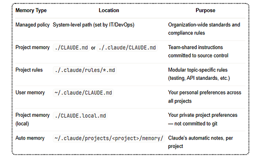

More specific instructions take precedence over broader ones.

So your project-level `CLAUDE.md` will override your global user memory, and auto-memory sits at the project level, scoped only to you and the current project.

> **You should also note that** `**CLAUDE.local.md**` **— is automatically added to** `**.gitignore**`**, making it ideal for private preferences like sandbox URLs or local test data that your team does not need.**

### Memory Loading

When you open a new Claude Code session, here is what gets loaded :

-   Your organization's policy (if one exists)
-   Your project `CLAUDE.md` with team instructions
-   Your personal `~/.claude/CLAUDE.md` preferences
-   The first 200 lines of `MEMORY.md` with Claude's own notes

> **Before you start coding, Claude already knows your project conventions, your preferences, and everything it has learned from working with you before.**

## Testing Claude Code Auto Memory

Documentation tells you what a feature is supposed to do, but we need to test it to see if it works.

> **So I set up a clean test from scratch — update, start a project, work a session, then check what Claude remembered.**

Here are the steps we can take to test it :

## Step 1 — Update Claude Code

Before anything else, make sure you are on the latest version. Auto-memory is a recent addition, so you need to update first.

Run this in your terminal:

```
claude update
```

Press enter or click to view image in full size

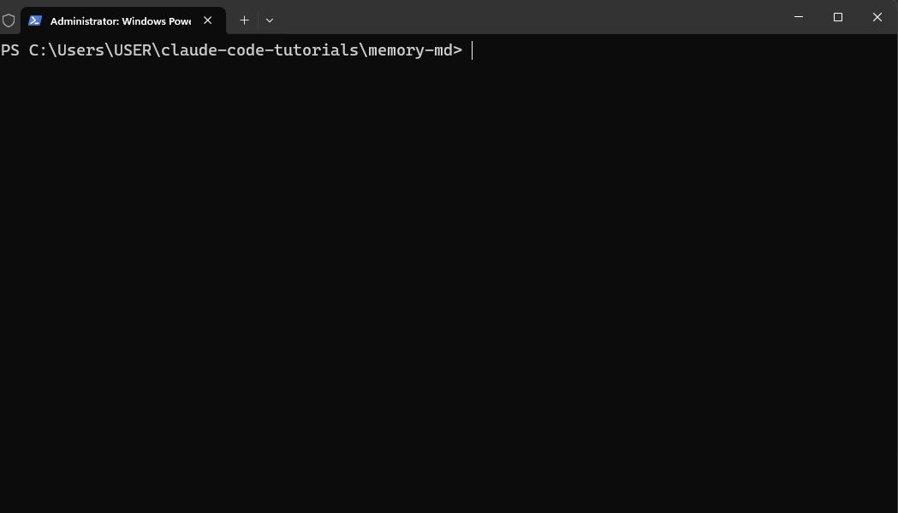

Follow any prompts to complete the update, then confirm your version:

```
claude --version
```

Press enter or click to view image in full size

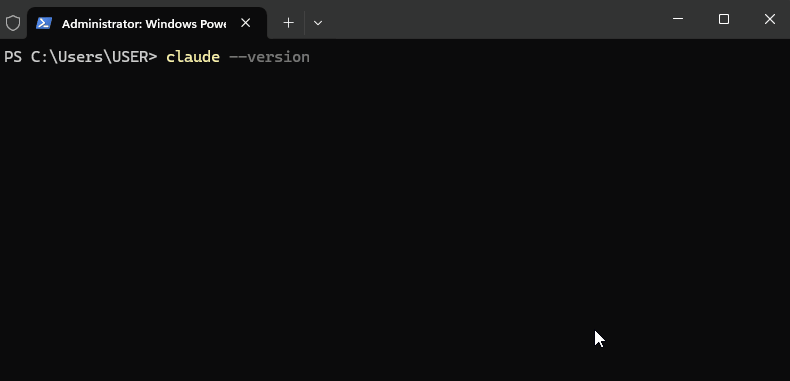

Once you are on the latest version, you are ready.

## Step 2 — Start a Test Project

I created a simple Node.js project for this test so I could see memory building from zero.

```
mkdir memory-md && cd memory-md
git init
npm init -y
```

Press enter or click to view image in full size

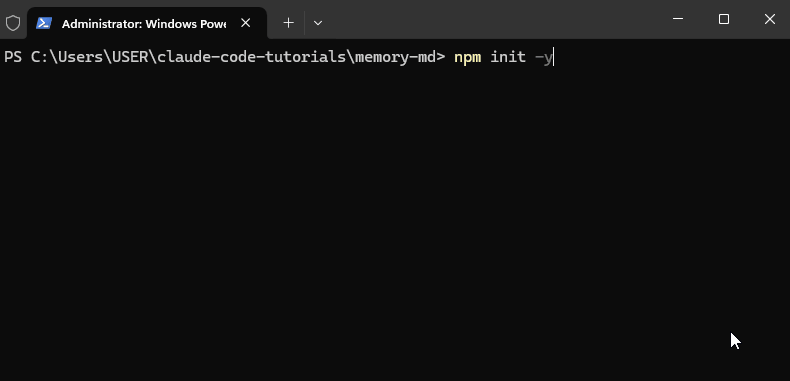

> **The git init is important since Claude Code uses your git repository root to determine the memory path, so your project needs to be a git repo for memory to work.**

Now open Claude Code in that directory:

```
claude
```

Press enter or click to view image in full size

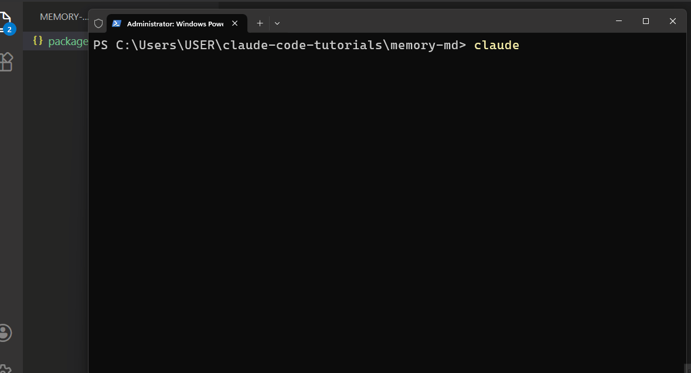

## Step 3 — Do Some Real Work

Auto-memory does not create files just because you opened a session. Claude needs to work with you on something before it starts taking notes.

I gave Claude a few tasks to work through:

```
Set up a basic Express server with two routes — a health check and a users endpoint.
Use async/await throughout and add error handling.
```

Press enter or click to view image in full size

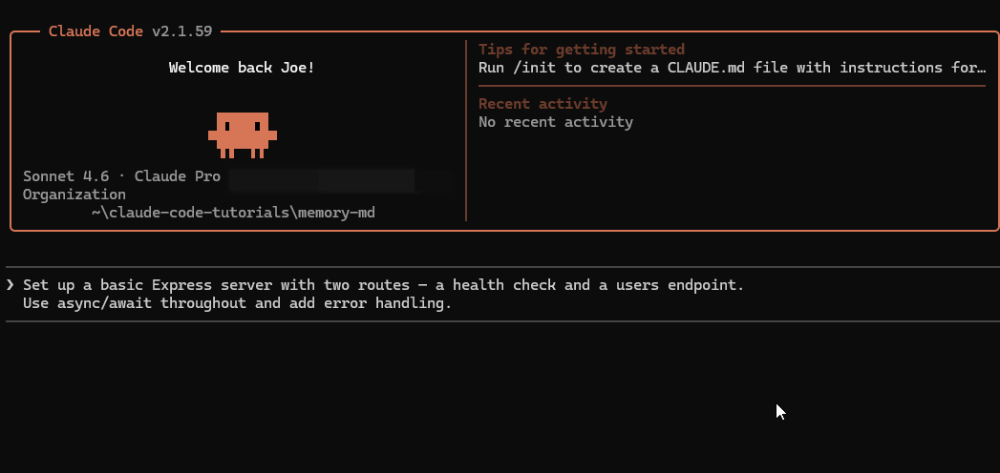

> **It spins up 3 tasks and follows through to execute each ot the tasks:**

-   Install Express
-   Create a server.js file
-   Update the package.json file

It creates the code as we expect:

Press enter or click to view image in full size

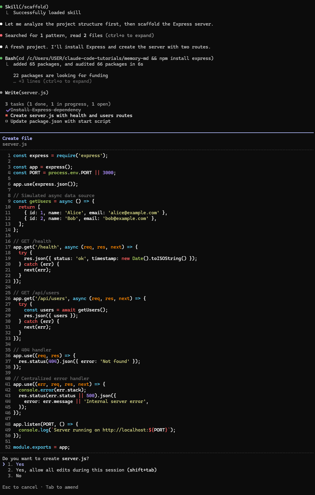

Finally, we have the server running :

Press enter or click to view image in full size

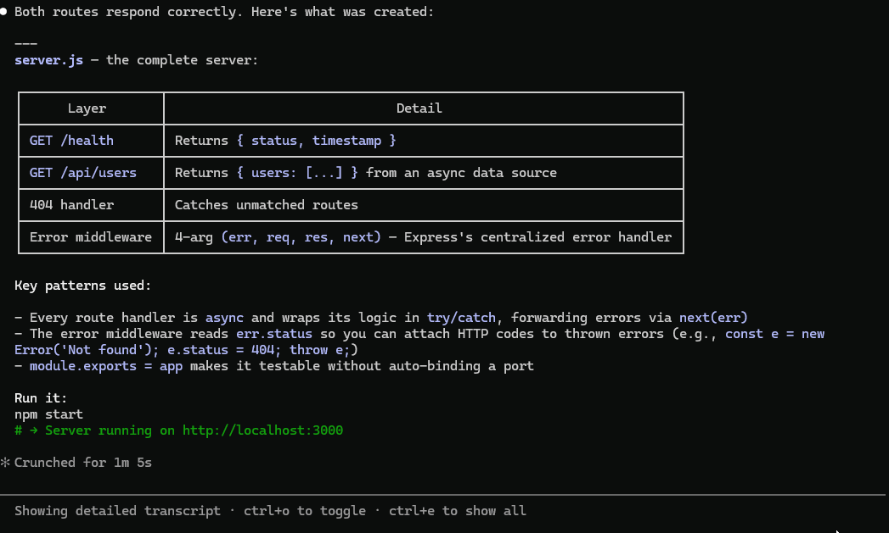

> **Then I followed up with:**

```
Add a test setup using Jest. We will always run tests before pushing.
Remember that we use npm for this project.
```

The second message gives Claude a workflow convention and explicitly tells it to remember the package manager.

> **I wanted to see both passive and active memory in action.**

> Let Claude work through these tasks fully. The more it does, the more it has to write down.

But just as I was about to give it some more time, I saw the memory was already working, you can see this line :

```
Recalled 1 memory (ctrl+o to expand)
```

Press enter or click to view image in full size

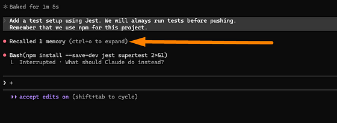

> **I pressed CTRL+O to see the memory :**

Press enter or click to view image in full size

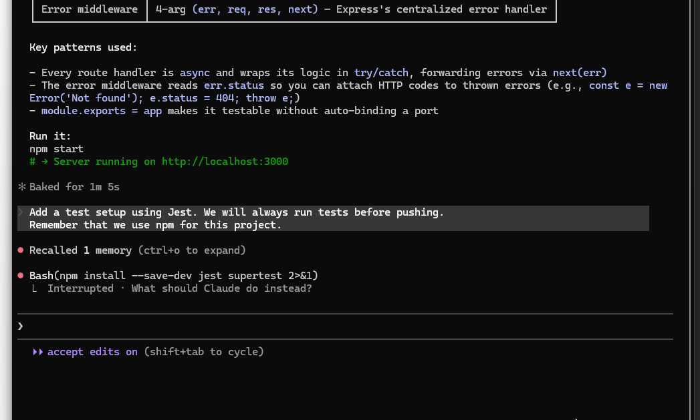

It reads the memory that has already been created in this file path :

```
Read(~\.claude\projects\C--Users-USER-claude-code-tutorials\memory\MEMORY.md)
```

> **Claude Code auto-memory is now active and working, and I can navigate to that path to view the file.**

## Step 4: Navigating the /memory Command

Once you have auto-memory enabled, the `/memory` Command is where you manage everything.

Press enter or click to view image in full size

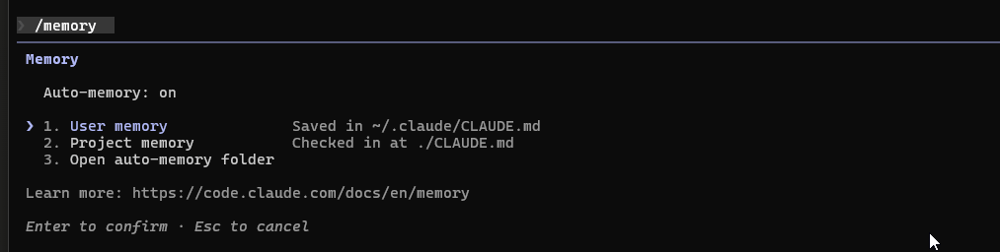

Type it inside any active Claude Code session, and you get this:

```
Memory
  Auto-memory: on
  1. User memory              Saved in ~/.claude/CLAUDE.md
  2. Project memory           Checked in at ./CLAUDE.md
  3. Open auto-memory folder
```

Let me walk you through what each option does.

Press enter or click to view image in full size

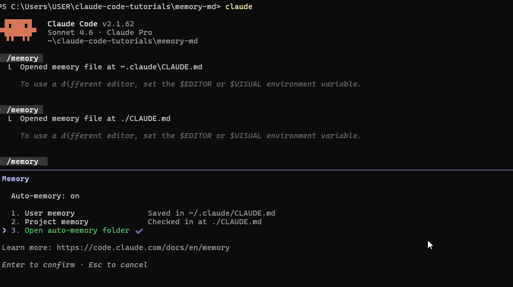

### Option 1 — User Memory

This opens your global `~/.claude/CLAUDE.md` file directly in your system editor.

> **This is your personal file — the instructions and preferences that follow you across every project you work on. Things like your preferred code style, tools you always use, or habits you want Claude to respect, regardless of what project you are in.**

You write and maintain this one yourself.

### Option 2 — Project Memory

This opens the `CLAUDE.md` file inside your current project.

> **This is the team-facing file — coding standards, architecture decisions, workflows your whole team shares. If your project is in source control, this file gets committed, and every team member benefits from it.**

Again, this is one you write. Claude reads it, but it does not touch it.

### Option 3 — Open Auto-Memory Folder

This is the one that belongs to Claude.

> **Selecting this opens the memory directory where Claude stores its own notes — the** `**MEMORY.md**` **file and any topic files it has created during your sessions. This is the folder we have been talking about in this article.**

On Windows, the folder opener may not launch automatically — if that happens, navigate to it in your terminal:

```
ls $env:USERPROFILE\.claude\projects\<your-project-path>\memory\
```

Press enter or click to view image in full size

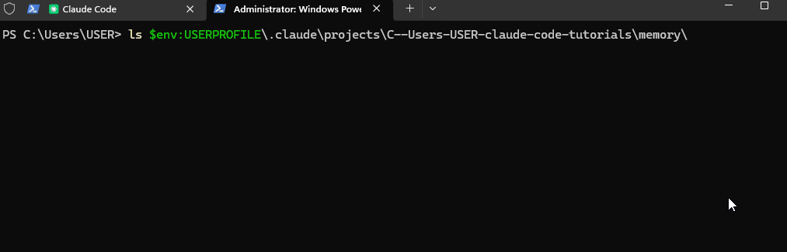

## Step 5 — Auto-Memory Toggle

At the top of the `/memory` panel you will see:

```
Auto-memory: on
```

Press enter or click to view image in full size

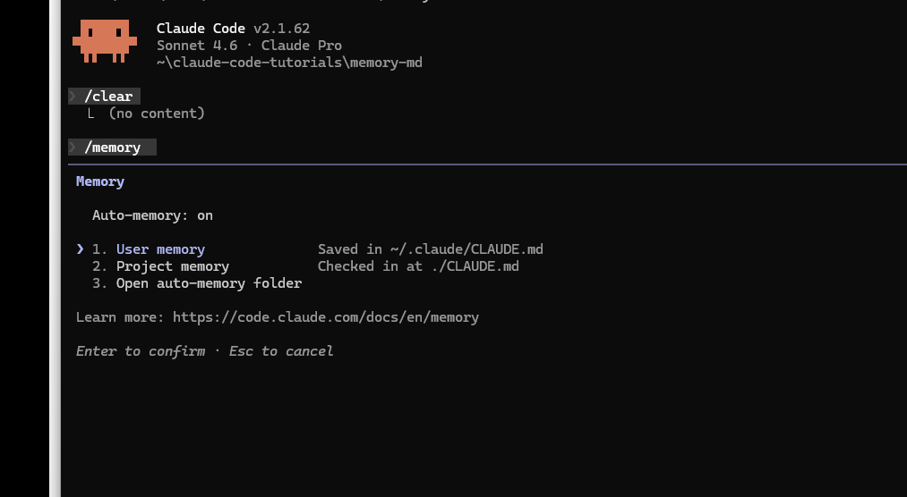

You can toggle this on or off from here without touching any config files.

> **If you are about to do exploratory work you do not want Claude to remember, or you are running a one-off session, this is the quickest way to pause memory for the current project.**

It's a good idea to run the `/memory` command at the start of any new project, _to confirm the toggle is on and to get familiar with where your files live before memory starts building up._

## Step 6— Prove It Survives a Cold Session

Close Claude Code completely. Then reopen it in the same project:

```
claude
```

Without giving any context, send this message:

```
What do you know about this project?
```

Press enter or click to view image in full size

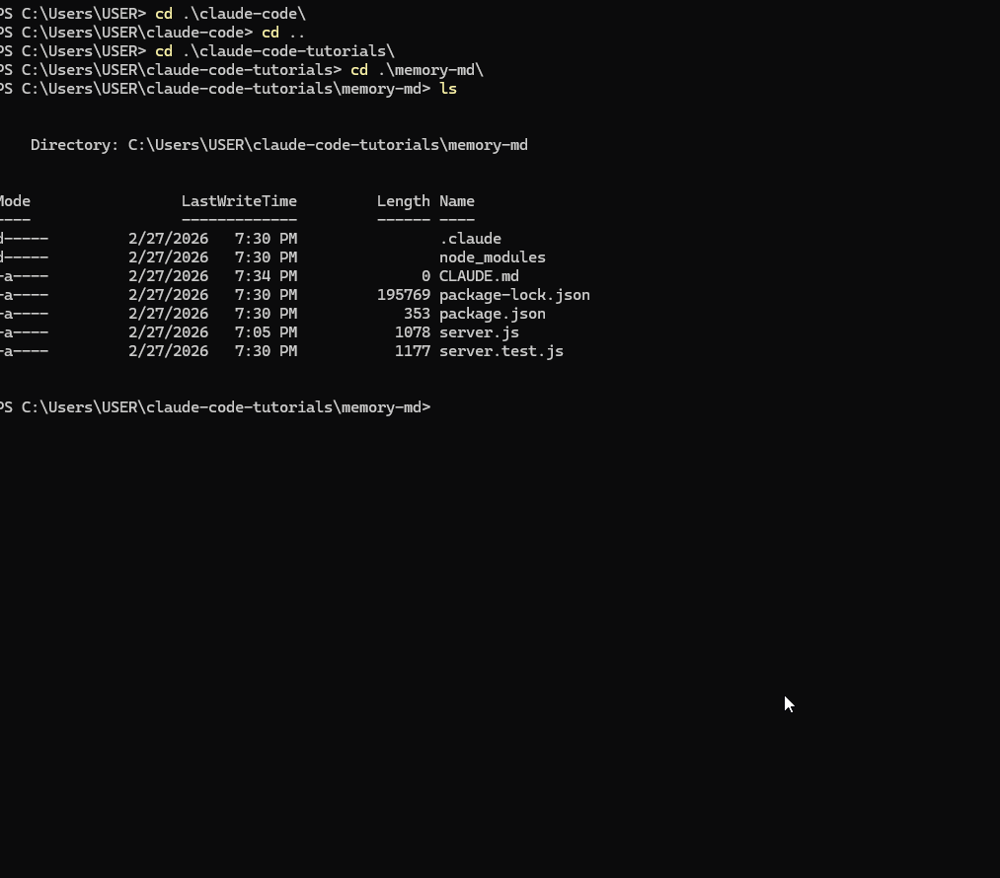

> Claude reads the memory for the new session and gives me a detailed overview of my project :

Press enter or click to view image in full size

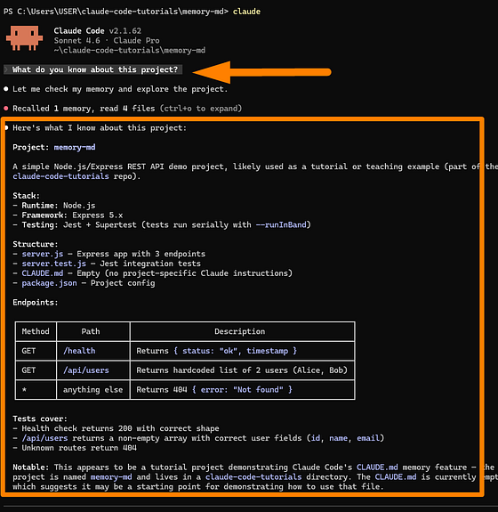

All of it was recalled from `MEMORY.md` the previous session. That is the Claude Code auto-memory working as designed.

## Controlling Auto-Memory

Auto-memory is on by default, and for most projects, that is what you want.

> **But there are situations where you need to turn it off — and Claude Code gives you a few different ways to do that.**

### Turning It Off for a Single Project

If you want to disable auto-memory for one specific project without affecting anything else, add this to your project settings file:

```

{
  "autoMemoryEnabled": false
}
```

This keeps auto-memory running on all your other projects while disabling it just for this one.

### Turning It Off Globally

To disable it across all your projects, add the same setting to your user settings instead:

```

{
  "autoMemoryEnabled": false
}
```

### Forcing It Off in CI Environments

If you are running Claude Code in a CI pipeline or any managed environment, you will want to override everything with an environment variable:

```
export CLAUDE_CODE_DISABLE_AUTO_MEMORY=1  
export CLAUDE_CODE_DISABLE_AUTO_MEMORY=0  
```

This environment variable takes precedence over both the `/memory` toggle and any `settings.json` configuration.

> **It is the safest way to ensure auto-memory never runs in automated environments where you do not want Claude accumulating notes from CI runs.**

### Editing Memory

Your memory files are plain markdown — you can open and edit them any time.

> **The quickest way is through the** `**/memory**` **command inside Claude Code, which opens the file selector and lets you jump into any memory file in your system editor.**

Use this to clean up outdated entries, remove notes that no longer apply, or reorganize content as your project evolves.

You can also edit the files from your terminal:

```
open ~/.claude/projects/<your-project>/memory/MEMORY.md
```

## Final Thoughts

As you start using Claude Code auto-memory across projects, a few habits will keep things clean and useful:

-   **_Review memory often —_** _Projects change direction. An architecture decision from three months ago might mislead Claude today. A quick review every few weeks keeps memory accurate._
-   **_Be explicit —_** _If you make a significant decision — switching package managers, changing your test strategy, restructuring the project — tell Claude._
-   **_Use CLAUDE.local.md for private preferences —_** _Things like your local sandbox URLs, personal test data, or machine-specific paths belong in_ `_CLAUDE.local.md_`_, not in auto-memory or the shared_ `_CLAUDE.md_`

The combination of `CLAUDE.md` and `MEMORY.md` makes Claude Code smarter the more you use it.

> **Have you updated Claude Code and experienced the auto-memory? Let me knowyour thoughts in the comments below.**

## Claude Code Masterclass Course


**_Every day, I’m working hard to build the ultimate Claude Code course, which demonstrates how to create workflows that coordinate multiple agents for complex development tasks. It’s due for release soon._**

It will take what you have learned from this article to the next level of complete automation.

**_New features are added to Claude Code daily, and keeping up is tough._**

The course explores Agents, Hooks, advanced workflows, and productivity techniques that many developers may not be aware of.

**_Once you join, you’ll receive all the updates as new features are rolled out._**

This course will cover:

-   _Advanced subagent patterns and workflows_
-   _Production-ready hook configurations_
-   _MCP server integrations for external tools_
-   _Team collaboration strategies_
-   _Enterprise deployment patterns_
-   _Real-world case studies from my consulting work_

If you’re interested in getting notified when the Claude Code course launches**,** [**click here to join the early access list →**](https://claudecodemasterclass.substack.com/)

**(** _Currently, I have 12,000+ already signed-up developers)_

> **I’ll share exclusive previews, early access pricing, and bonus materials with people on the list.**