Press enter or click to view image in full size

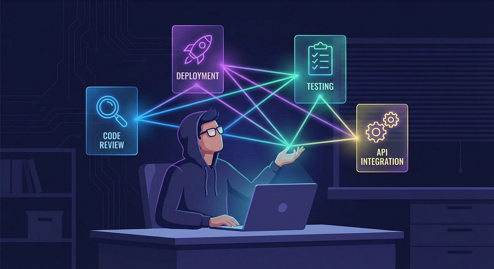

Claude Code Agent Skills 2.0

Member-only story

## Skills are no longer instructions. They are programs.

[


](https://medium.com/@richardhightower?source=post_page---byline--ab6e4563c176---------------------------------------)

17 min read

Mar 9, 2026

Claude Code’s skill system has evolved from simple markdown instructions to a full programmable agent platform with subagent execution, dynamic context injection, lifecycle hooks, and formal evaluation.

Your Claude Code skills just became programs.

When Claude Code first introduced commands, they were simple: drop a markdown file in `.claude/commands/`, give it some instructions, and invoke it with a slash command. Useful, but limited. Skills were custom instructions with a folder, nothing more.

That era is over.

The latest version of Claude Code has fundamentally rearchitected how skills work. Commands and skills are now unified. Skills can spawn isolated subagents with their own context windows. Shell commands can inject live data into skill prompts before Claude sees them. Skills can restrict which tools Claude uses, override the model, hook into lifecycle events, and run in forked contexts. Four powerful bundled skills ship out of the box, including one that decomposes large changes across a codebase and spawns parallel agents in separate git worktrees.

Some in the community are calling it “Agent Skills 2.0,” and the name fits. Skills are no longer instructions. They are programs.

Press enter or click to view image in full size

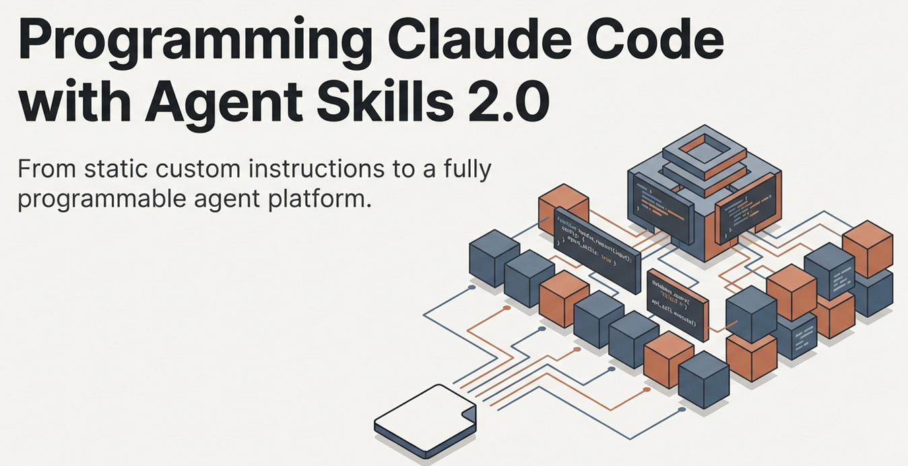

Skills 2.0 — Agentic Skills with context and parallel execution

## What Changed

The most visible change is simple: **commands and skills merged**. Files in `.claude/commands/` still work. Skills in `.claude/skills/` are now the recommended path, though, because they support directories, richer frontmatter, supporting files, and all the new capabilities described in this article.

Under that unification sits a set of deeper changes worth understanding individually.

**Bundled slash commands** ship with every Claude Code installation. `/simplify` spawns three parallel review agents —these agents look at code reuse, code quality, and efficiency. `/batch` orchestrates large-scale changes across your entire codebase — decomposing work into 5 to 30 independent units, presenting a plan for approval, then spawning one background agent per unit in an isolated git worktree. `/debug` troubleshoots your Claude Code session — misconfigured mcp, tool calls failing, etc. `/claude-api` loads Claude API reference material for your project's language. These are like bundled skills but built-in.

**Skills allow Subagent execution** lets any skill run in an isolated context window. Add `context: fork` to your frontmatter, and the skill's content becomes the task prompt for a fresh subagent with its own 200,000-token context. Your main conversation stays clean.

**Skills allow Dynamic context injection** preprocesses shell commands before the prompt reaches Claude. The `!` backtick syntax runs commands and replaces them with their output, so Claude receives live data rather than stale text. Example

```
! git branch
```

**Granular permissions** control who can invoke a skill (you, Claude, or both), which tools it can access, and what model it runs on.

**The Agent Skills open standard** at [agentskills.io](http://agentskills.io/) means skills are not locked to Claude Code. The format works across multiple AI tools, with Claude Code extending it with features like invocation control and subagent execution.

## Anatomy of a Skill

Every skill lives in its own directory with a `SKILL.md` file as the entry point:

```
my-skill/
├── SKILL.md           
├── reference.md       
├── examples/
│   └── sample.md      
└── scripts/
    └── validate.sh    
```

The directory structure matters for a reason: it keeps the primary instructions concise while still giving Claude access to rich supporting material when it needs it. Claude loads `SKILL.md` on invocation and references other files only when the task requires them.

The `SKILL.md` file has two parts: YAML frontmatter that configures behavior, and markdown content with the actual instructions.

```
---
name: explain-code
description: Explains code with visual diagrams and analogies. Use when
  explaining how code works or when the user asks "how does this work?"
---

When explaining code, always include:

1. **Start with an analogy**: Compare the code to something from everyday life
2. **Draw a diagram**: Use ASCII art to show flow, structure, or relationships
3. **Walk through the code**: Explain step-by-step what happens
4. **Highlight a gotcha**: What's a common mistake or misconception?
```

The `name` field becomes the slash command (`/explain-code`). The `description` is how Claude decides whether to load the skill automatically when your conversation matches. A vague description like "helps with code" rarely triggers correctly. A specific description like "explains code with diagrams and analogies" gives Claude enough signal to load the skill at the right moments.

Press enter or click to view image in full size

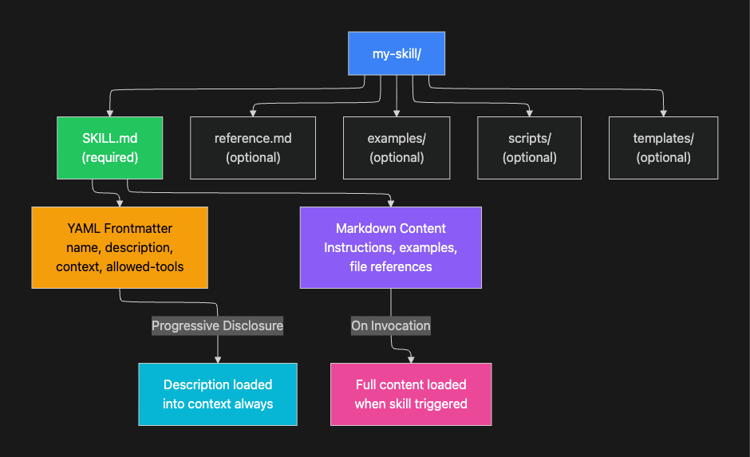

Press enter or click to view image in full size

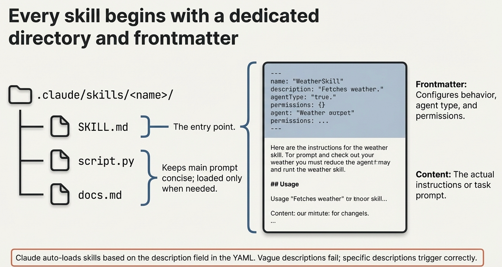

Dedicated frontmatter for skills

## Where Skills Live

Skills are scoped by location, with higher-priority levels overriding lower ones:

Press enter or click to view image in full size

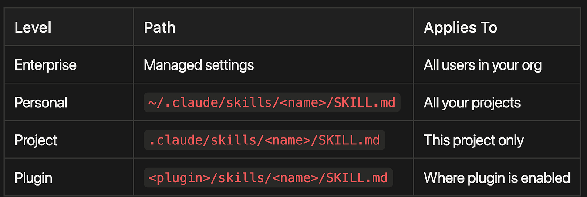

-   **Enterprise Level:** Managed through organizational settings, applies to all users in your organization
-   **Personal Level:** Located at `~/.claude/skills/&lt;name&gt;/SKILL.md`, applies across all your projects
-   **Project Level:** Located at `.claude/skills/&lt;name&gt;/SKILL.md`, applies only to the current project
-   **Plugin Level:** Located at `&lt;plugin&gt;/skills/&lt;name&gt;/SKILL.md`, applies wherever the plugin is enabled

Press enter or click to view image in full size

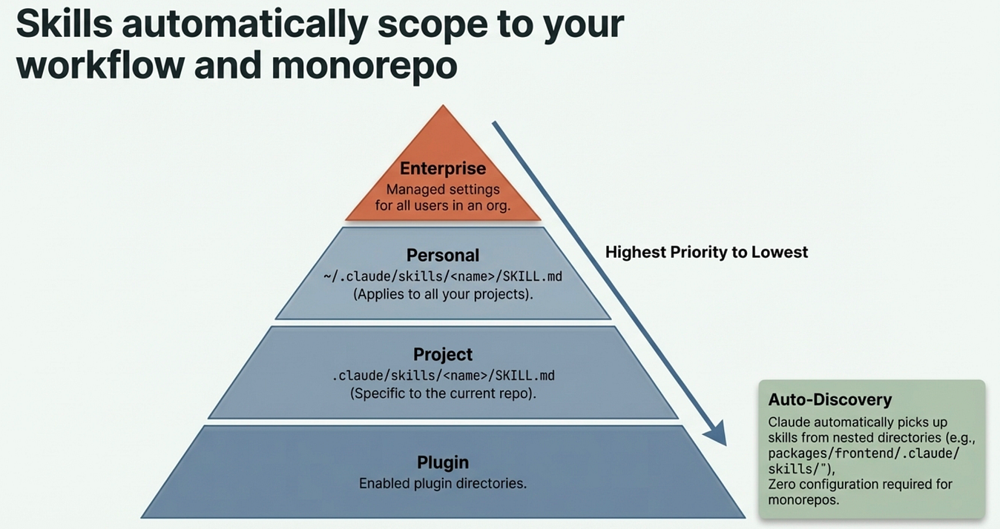

Skills automatically scope to your workflow and monorepo

Claude Code also discovers skills from nested directories automatically. If you are editing a file in `packages/frontend/`, it picks up skills from `packages/frontend/.claude/skills/`. This makes skills work naturally in monorepo setups without any extra configuration.

## The Full Frontmatter Reference

Here is every frontmatter field available:

Press enter or click to view image in full size

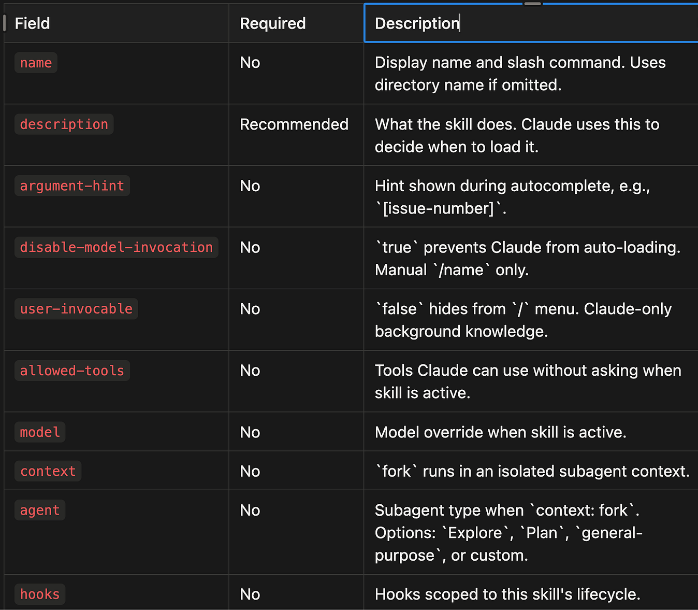

-   `**name**` (No) — Display name and slash command. Uses directory name if omitted.
-   `**description**` (Recommended) — What the skill does. Claude uses this to decide when to load it.
-   `**argument-hint**` (No) — Hint shown during autocomplete, e.g., `[issue-number]`.
-   `**disable-model-invocation**` (No) — `true` prevents Claude from auto-loading. Manual `/name` only.
-   `**user-invocable**` (No) — `false` hides from `/` menu. Claude-only background knowledge.
-   `**allowed-tools**` (No) — Tools Claude can use without asking when skill is active.
-   `**model**` (No) — Model override when skill is active.
-   `**context**` (No) — `fork` runs in an isolated subagent context.
-   `**agent**` (No) — Subagent type when `context: fork`. Options: `Explore`, `Plan`, `general-purpose`, or custom.
-   `**hooks**` (No) — Hooks scoped to this skill's lifecycle.

## The Big Four: Bundled Skill-like Commands

Claude Code now ships with four built-in skills like commands that demonstrate the full power of the new system. Each one solves a problem that previously required either manual orchestration or giving up on the task entirely.

Press enter or click to view image in full size

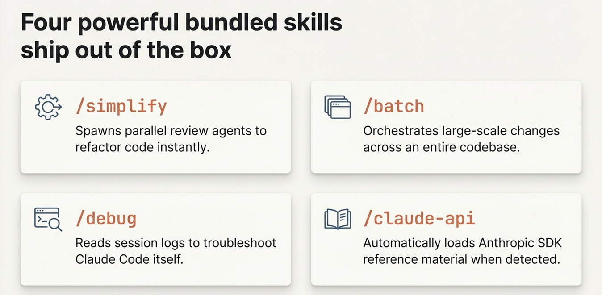

Bundled Skill Like Ship Out of the Box

## /simplify

After implementing a feature or fixing a bug, run `/simplify` and it spawns three review agents in parallel:

1.  **Code reuse** finds opportunities to reduce duplication
2.  **Code quality** checks for bugs, unclear logic, and maintainability issues
3.  **Efficiency** identifies performance improvements

The agents run concurrently, aggregate their findings, and apply fixes. You can also focus the review: `/simplify focus on memory efficiency`.

This is not a lint check. Each agent reads your recently changed files, understands the broader codebase context, and makes targeted improvements. The parallel execution means three thorough reviews complete faster than one sequential pass. This is the primary value of `context: fork` made concrete: work that used to block your conversation now runs in the background.

## /batch

This is the most ambitious bundled skill. Give `/batch` a description of a change, and it:

1.  **Researches** your codebase to understand the scope
2.  **Decomposes** the work into 5 to 30 independent units
3.  **Presents a plan** for your approval
4.  **Spawns one agent per unit**, each in an isolated git worktree
5.  Each agent **implements, tests, and opens a pull request**

Example: `/batch migrate src/ from Solid to React`. Claude analyzes which components need migration, groups them into independent units, spawns a parallel agent for each unit in its own worktree, and produces individual PRs you can review and merge.

This skill requires a git repository and uses git worktrees for isolation. Each agent works on a separate branch, so there are no merge conflicts during parallel execution. The trade-off is real: decomposition quality determines outcome quality. If Claude splits the work poorly, some agents will block on dependencies others have not resolved yet. Review the plan before approving, and use specific, well-scoped change descriptions for best results.

Press enter or click to view image in full size

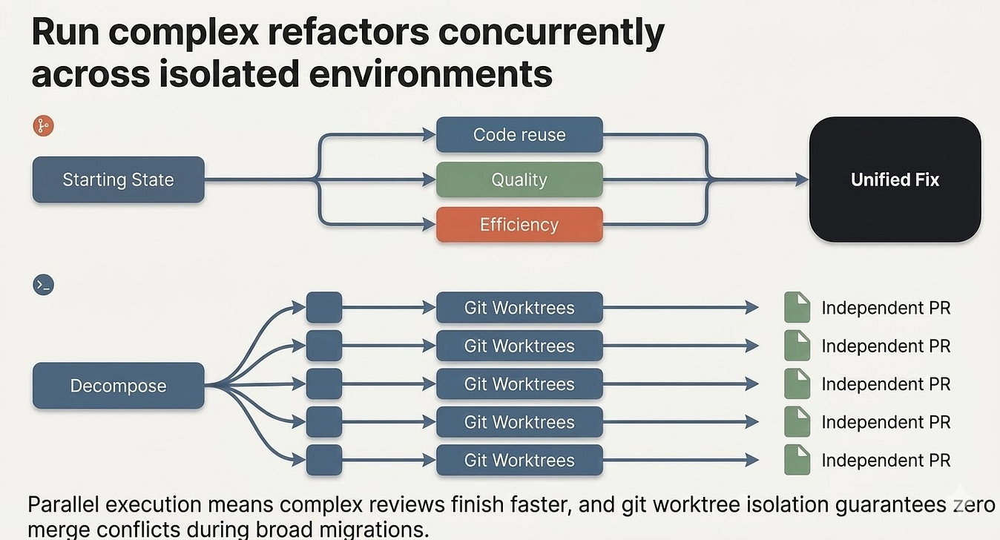

Run complex refactors concurrently across isolated environments

## /debug

When Claude Code itself is not behaving as expected, `/debug` reads the session debug log and diagnoses the issue. Pass an optional description to focus the analysis: `/debug why is the Bash tool failing?`

## /claude-api

When your code imports `anthropic`, `@anthropic-ai/sdk`, or `claude_agent_sdk`, this skill activates automatically. It loads API reference material for your project's language (Python, TypeScript, Java, Go, Ruby, C#, PHP, or cURL) covering tool use, streaming, batches, structured outputs, and common pitfalls.

This is a good example of a skill you never invoke manually. It simply makes Claude smarter about the Anthropic SDK whenever you are working in a project that uses it.

From simple instructions to a full agent programming platform

## Subagent Execution: context: fork

The `context: fork` frontmatter field is the single most important addition in Skills 2.0. It transforms a skill from inline instructions into an isolated agent.

Press enter or click to view image in full size

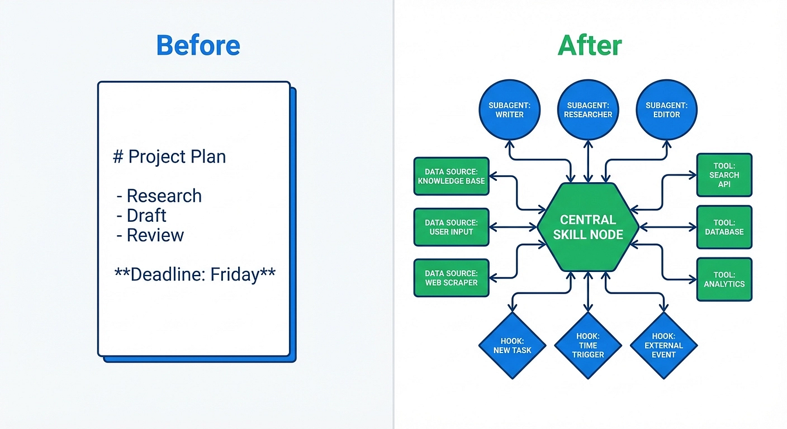

From simple instructions to a full agent programming platform

When a skill runs with `context: fork`:

1.  A new context window is created (fresh, no conversation history)
2.  The skill’s markdown content becomes the subagent’s task prompt
3.  The `agent` field determines the execution environment
4.  Results are summarized and returned to your main conversation

Your main conversation context stays completely clean. The subagent does all the heavy lifting in its own space.

Press enter or click to view image in full size

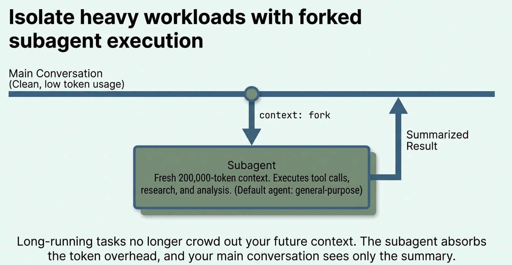

Isoloate heavy workloads with forked subagent execution

Why does this matter? Long-running research or analysis tasks can consume thousands of tokens just from intermediate thinking and tool calls. Without context isolation, that cost lands in your main conversation window, crowding out future context. With `context: fork`, the subagent absorbs all of that overhead. Your conversation sees only the summary.

```
---
name: deep-research
description: Research a topic thoroughly in the codebase
context: fork
agent: Explore
---
Research $ARGUMENTS thoroughly:
1. Find relevant files using Glob and Grep
2. Read and analyze the code
3. Summarize findings with specific file references

The agent field accepts built-in types (Explore, Plan, general-purpose) 
or any custom agent defined in .claude/agents/. If omitted, it defaults 
to general-purpose.
```

One important constraint: `context: fork` only makes sense for skills with explicit task instructions. If your skill contains guidelines like "use these API conventions" without a concrete task, the subagent receives guidelines with nothing to act on and returns without meaningful output. Fork skills are for tasks; guideline skills should run inline.

Press enter or click to view image in full size

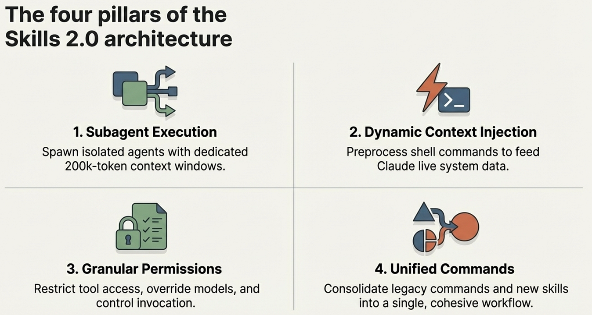

The four pillars of the Skills 2.0 architecture

## Dynamic Context Injection

The `!` backtick syntax runs shell commands before the skill content reaches Claude. The command output replaces the placeholder, so Claude receives actual data rather than placeholder text.

```
---
name: pr-summary
description: Summarize changes in a pull request
context: fork
agent: Explore
allowed-tools: Bash(gh *)
---


- PR diff: !`gh pr diff`
- PR comments: !`gh pr view --comments`
- Changed files: !`gh pr diff --name-only`


Summarize this pull request focusing on:
1. What changed and why
2. Potential risks or concerns
3. Suggested review focus areas
```

When this skill runs, each `!` backtick command executes immediately. `gh pr diff` runs, its output replaces the placeholder, and Claude sees the fully rendered prompt with live PR data. This is preprocessing: Claude never executes these commands itself. The data arrives already computed.

This separation matters for two reasons. First, it is faster: Claude does not need to call tools to gather context it already has. Second, it is cleaner: the skill prompt reads like a document, not a chain of tool calls, which means Claude can focus immediately on analysis rather than data gathering.

Press enter or click to view image in full size

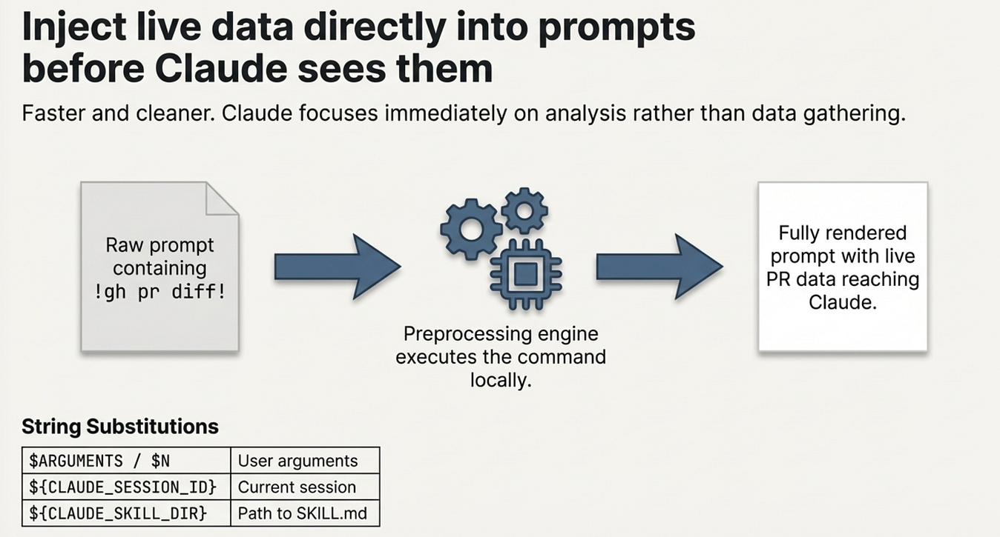

Inject Live Data Directly into prompts before Claude sees them

## String Substitutions

Skills support variable substitution for dynamic values:

Press enter or click to view image in full size

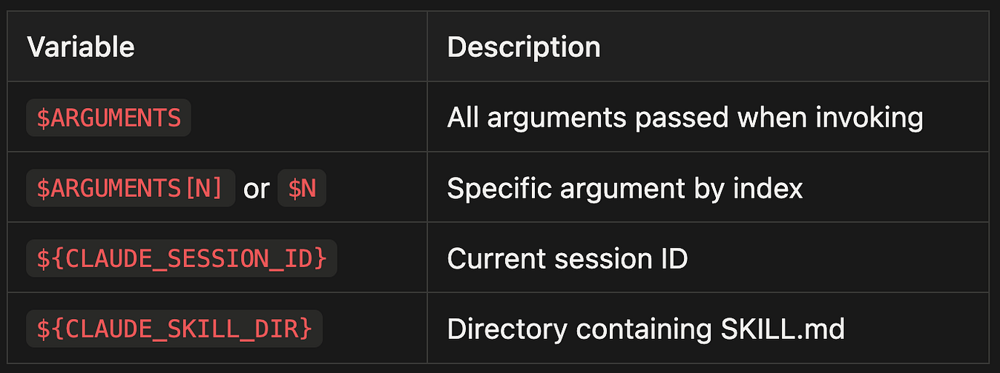

-   `$ARGUMENTS` - All arguments passed when invoking
-   `$ARGUMENTS[N]` or `$N` - Specific argument by index
-   `${CLAUDE_SESSION_ID}` - Current session ID
-   `${CLAUDE_SKILL_DIR}` - Directory containing SKILL.md

Example with positional arguments:

```
---
name: migrate-component
description: Migrate a component between frameworks
---

Migrate the $0 component from $1 to $2.
Preserve all existing behavior and tests.
```

Running `/migrate-component SearchBar React Vue` substitutes each positional argument. The skill becomes a template you call with specific values rather than a static prompt you rewrite each time.

## Permission Controls and Invocation

Skills 2.0 gives you fine-grained control over who can invoke a skill and what it can do. Getting these controls right is what separates safe automation from automation that surprises you.

## Invocation Control

Two frontmatter fields determine who triggers a skill:

`**disable-model-invocation: true**` means only you can invoke it. Use this for workflows with side effects: `/deploy`, `/commit`, `/send-slack-message`. You do not want Claude deciding to deploy because your code looks ready.

`**user-invocable: false**` means only Claude can invoke it. Use this for background knowledge that is not actionable as a command. A `legacy-system-context` skill explains how an old system works. Claude references it when relevant, but `/legacy-system-context` is not a meaningful action for users.

Here is the complete invocation matrix:

Press enter or click to view image in full size

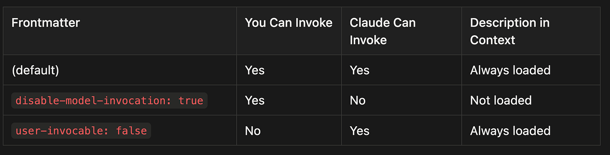

-   **Default (no restrictions):** Both you and Claude can invoke the skill, and it is always loaded in context
-   **disable-model-invocation: true:** Only you can invoke the skill (Claude cannot), and it is not loaded in context unless you call it
-   **user-invocable: false:** Only Claude can invoke the skill (you cannot), and it is always loaded in context for Claude to reference

Press enter or click to view image in full size

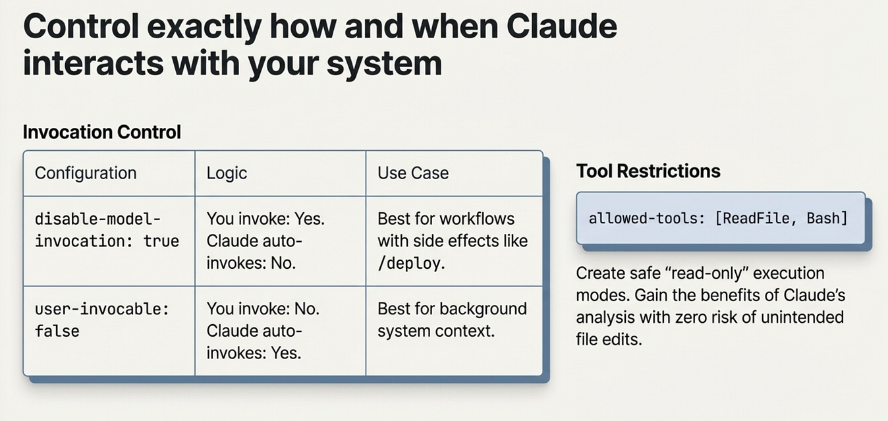

Control Exactly How and When Claude interacts with your system

## Tool Restrictions

The `allowed-tools` field limits what Claude can do when a skill is active:

```
---
name: safe-reader
description: Read files without making changes
allowed-tools: Read, Grep, Glob
---
```

This creates a read-only mode. Claude can explore files but not modify them. This is valuable for skills that gather information or audit code: you get the benefits of Claude’s analysis without any risk of unintended edits.

## Permission Rules

You can allow or deny specific skills globally:

```
# Allow only specific skills
Skill(commit)
Skill(review-pr *)
```

```
# Deny specific skills
Skill(deploy *)
```

The syntax `Skill(name)` matches exactly; `Skill(name *)` matches the prefix with any arguments.

## Supporting Files and Visual Output

Skills can include multiple files in their directory. This keeps `SKILL.md` focused while letting Claude access detailed material on demand.

```
codebase-visualizer/
├── SKILL.md                    
├── scripts/
│   └── visualize.py            
└── reference.md                
```

Reference supporting files from `SKILL.md` so Claude knows what they contain and when to load them:

```
## Additional resources
- For complete API details, see [reference.md](reference.md)
- For usage examples, see [examples.md](examples.md)
```

The visual output pattern is particularly powerful. Skills can bundle scripts in any language that generate interactive HTML files. The bundled `codebase-visualizer` example creates a collapsible tree view with file sizes, type colors, and aggregate statistics. Claude runs the Python script, generates the HTML, and opens it in your browser. This pattern works equally well for dependency graphs, test coverage reports, API documentation, or schema visualizations. The skill provides the intelligence; the script provides the output format.

To see this in action try the Playground Plugin with skills from Antrhopic.

Press enter or click to view image in full size

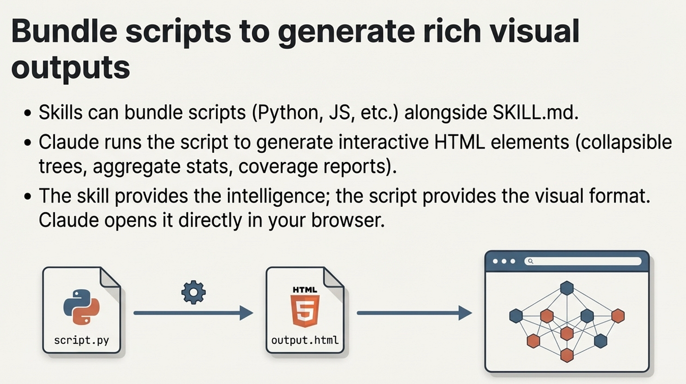

Bundle scripts to generate rich visual outputs

## Testing and Evaluating Skills

Building a skill is only half the work. Testing whether it actually improves Claude’s output is the other half, and it is the half most people skip.

## The Three Testing Dimensions

**Triggering tests** verify the skill loads when it should and stays quiet when it should not. Test with 10 to 20 sample queries: obvious matches (“explain this code”), paraphrases (“walk me through how this works”), and unrelated topics (“fix this bug”). Target 90% hit rate on relevant queries and zero false triggers.

**Functional tests** verify the skill produces correct output. Test the happy path, edge cases, and error scenarios. For a deploy skill: does it run tests first? Does it handle a failed build? Does it verify the deployment succeeded?

**Risk and quality tests** use A/B comparison to measure whether the skill actually helps. Run 5 to 8 parallel tests with and without the skill enabled. Compare output quality, token usage, and task completion speed. A skill that produces better output but costs three times as many tokens may not be worth keeping in every session.

## The Iterative Loop

The recommended workflow for skill development:

1.  **Start with one hard task.** Find a task where Claude struggles without help.
2.  **Iterate until Claude succeeds.** Adjust instructions, add examples, refine.
3.  **Extract the winning approach into a skill.** Capture what worked.
4.  **Expand test coverage.** Test variations, edge cases, and related scenarios.
5.  **Version like code.** Commit changes, document what changed and why, and roll back when performance degrades.

This loop works because it grounds the skill in a real failure before trying to generalize. Skills built from “I think this would be useful” often underperform skills built from “Claude failed on this specific task and here is how I fixed it.” I do this a lot.

> Once I master a workflow, I canonicalize it as an agentic skill so I don’t have to remember the secret prompts and magic spells I needed to get Claude Code to do what I want.

Press enter or click to view image in full size

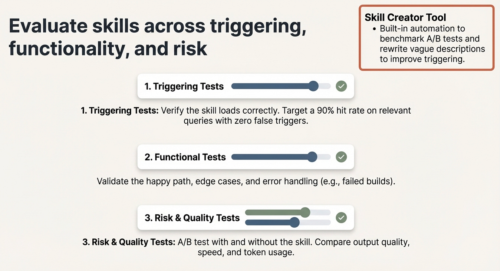

Test and eval your skill

## Using the Skill Creator

The Skill Creator tool (available as a skill itself) automates much of this process. It generates skills from descriptions, runs A/B benchmarks comparing skill-enabled versus baseline performance, identifies issues in existing skills, rewrites vague descriptions for better triggering, and produces evaluation reports. They just did a major update for this.

Feed it a failing skill with “Use issues from this chat to improve this skill” and it will analyze the failure patterns and suggest targeted revisions.

## Building Your First Skill: Quick Start

Here is the fastest path to a working skill:

```

mkdir -p ~/.claude/skills/review-pr


cat > ~/.claude/skills/review-pr/SKILL.md << 'EOF'
---
name: review-pr
description: Review a pull request for code quality, security, and correctness
disable-model-invocation: true
context: fork
agent: general-purpose
allowed-tools: Bash(gh *), Read, Grep, Glob
---

Review the current pull request:


- Diff: !`gh pr diff`
- Description: !`gh pr view`
- Changed files: !`gh pr diff --name-only`


1. **Correctness**: Does the code do what the PR description says?
2. **Security**: Any injection, auth, or data exposure risks?
3. **Performance**: Any N+1 queries, unnecessary allocations, or slow paths?
4. **Testing**: Are changes covered by tests?
5. **Style**: Does it follow the project's conventions?

Provide specific file and line references for every finding.
EOF


```

This skill demonstrates several Skills 2.0 features working together. `context: fork` keeps the PR analysis out of your main conversation. `disable-model-invocation` ensures you always trigger the review intentionally. `allowed-tools` scopes Claude to reading and running `gh` commands only. The `!` backtick commands inject live PR data before Claude reads the prompt.

Each of these choices is deliberate. A PR review with side effects would be dangerous. A PR review that consumes your main context on a large diff would be frustrating. A PR review that calls tools ad hoc would be slow. The combination solves all three problems.

## Best Practices

-   **Keep skills under 500 lines.** Move detailed reference material to separate files.
-   **Use structured formats.** Bullet points and numbered lists consume fewer tokens than prose.
-   **Include concrete examples.** Show correct and incorrect behavior to reduce ambiguity.
-   **Write specific descriptions.** “Review pull requests for security issues” triggers better than “helps with code.”
-   **Load conditionally.** Do not add every skill to every session; use task-specific loading.
-   **Version skills like code.** Commit changes, document why, and roll back regressions.

Press enter or click to view image in full size

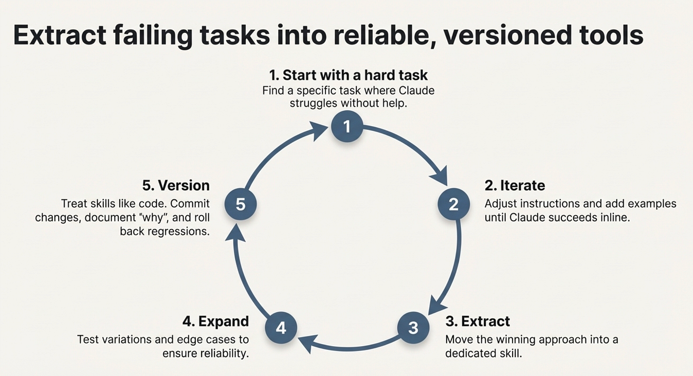

If there is a hard task, that you must repeat, then turn it into a skill.

> I often create skills for example, doing releases that include deployment steps, like branch from main, tag with the new version, how to update the version, publish to PyPi, generate a change log, create a release page on Github and add links to PyPi release. If you have to remember a complex set of steps, it is probably a good candidate for an agentic skill.

## The Bigger Picture

Skills 2.0 represents a shift in how we think about AI coding assistants. Claude Code is no longer a tool you talk to. It is a platform you program.

The progression is clear: [CLAUDE.md](http://claude.md/) gave us project-level instructions. Commands gave us slash-invocable workflows. Skills 1.0 added directories and supporting files. Skills 2.0 adds subagent execution, dynamic context injection, lifecycle hooks, permission controls, and formal evaluation. Each step moves further from “custom prompts” toward “agent programs.”

The Agent Skills open standard at [agentskills.io](http://agentskills.io/) means this is not a proprietary lock-in. Skills you write for Claude Code can work across AI tools. The format is portable by design.

Whether you are building a personal `review-pr` skill or distributing a plugin with dozens of specialized agents, the infrastructure is the same: a [SKILL.md](http://skill.md/) file, some optional supporting files, and a set of frontmatter fields that control exactly how the skill behaves.

Press enter or click to view image in full size

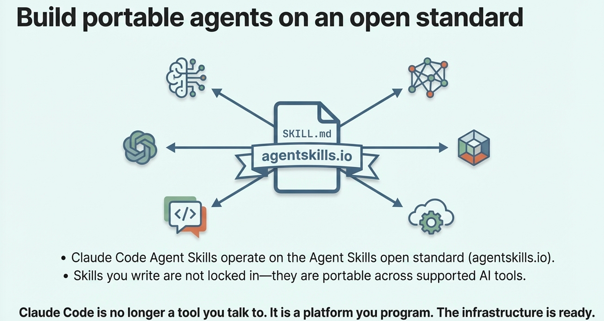

Build portable Agentic Skills

The tools are here. The question is what you build with them.

## About the Author

Rick Hightower is a technology executive and data engineer who led ML/AI development at a Fortune 100 financial services company. He created skilz, the [universal agent skill installer](https://skillzwave.ai/docs/), supporting 30+ coding agents including Claude Code, Gemini, Copilot, and Cursor, and co-founded the world’s largest agentic skill marketplace. Connect with Rick Hightower on [LinkedIn](https://www.linkedin.com/in/rickhigh/) or [Medium](https://medium.com/@richardhightower). Rick has been doing active agent development, GenAI, agents, and agentic workflows for quite a while. He is the author of many agentic frameworks and tools. He brings core deep knowledge to teams who want to adopt AI.

Related articles I wrote on agentic skills.

## Articles on Agent Skills

## 2026

## February

-   **Feb 23:** [Context Engineering: Agents — Injecting the Right Rules at the Right Moment](https://medium.com/@richardhightower/context-engineering-agents-injecting-the-right-rules-at-the-right-moment-5df91dc215ab)
-   **Feb 22:** [The End of Manual Agent Skill Invocation: Event-Driven AI Agents](https://medium.com/@richardhightower/the-end-of-manual-agent-skill-invocation-event-driven-ai-agents-670b470f26e9)
-   **Feb 19:** [Activating Agent Skills at the Right Time with Agent RuleZ](https://medium.com/ai-in-plain-english/activating-agent-skills-at-the-right-time-with-agent-rulez-c148281667ab)
-   **Feb 11:** [Agent RuleZ: A Deterministic Policy Engine for AI Coding Agents](https://medium.com/spillwave-solutions/agent-rulez-a-deterministic-policy-engine-for-ai-coding-agents-9489e0561edf)
-   **Feb 5:** [Agent Brain: A Code-First RAG System for AI Coding Assistants](https://medium.com/spillwave-solutions/agent-brain-a-code-first-rag-system-for-ai-coding-assistants-83e95c972255)
-   **Feb 4:** [From Approval Hell to Just Do It: How Agent Skills Fork Governed Sub-Agents in Claude Code 2.1](https://medium.com/@richardhightower/from-approval-hell-to-just-do-it-how-agent-skills-fork-governed-sub-agents-in-claude-code-2-1-c0438416433a)
-   **Feb 3:** [Agent Brain: Giving AI Coding Agents a Full Understanding of Your Entire Enterprise](https://medium.com/spillwave-solutions/agent-brain-agentic-skills-for-enterprise-context-engineering-b5f61d8f57f0)
-   **Feb 2:** [Build Agent Skills Faster with Claude Code 2.1 Release](https://medium.com/spillwave-solutions/build-agent-skills-faster-with-claude-code-2-1-release-6d821d5b8179)

## January

-   **Jan 29:** [Build Your First Agent Skill in 10 Minutes Using the Context7 Wizard, and Save Hours](https://medium.com/spillwave-solutions/build-your-first-agent-skill-in-10-minutes-using-the-context7-wizard-and-save-hours-2e5ab0319297)
-   **Jan 28:** [Supercharge Your React Performance with Vercel’s Best Practices Agent Skill for Claude Code, Codex…](https://medium.com/spillwave-solutions/supercharge-your-react-performance-with-vercels-best-practices-agent-skill-for-claude-code-codex-212d6d2c0d8e)
-   **Jan 27:** [Agent Skills: The Universal Standard Transforming How AI Agents Work](https://medium.com/spillwave-solutions/agent-skills-the-universal-standard-transforming-how-ai-agents-work-fc7397406e2e)
-   **Jan 20:** [Agent-Browser: AI-First Browser Automation That Saves 93% of Your Context Window](https://medium.com/spillwave-solutions/agent-browser-ai-first-browser-automation-that-saves-93-of-your-context-window-7a2c52562f8c)
-   **Jan 17:** [Empowering AI Coding Agents with Private Knowledge: The Doc-Serve Agent Skill](https://medium.com/spillwave-solutions/empowering-ai-coding-agents-with-private-knowledge-the-doc-serve-agent-skill-8d9683534758)
-   **Jan 15:** [Skilz: The Universal Package Manager for AI Skills](https://medium.com/spillwave-solutions/skilz-the-universal-package-manager-for-ai-skills-dac41e6879ec)
-   **Jan 12:** [Mastering Agent Development: The Architect Agent Workflow for Creating Robust AI Agent Skills](https://medium.com/spillwave-solutions/mastering-agent-development-the-architect-agent-workflow-for-creating-robust-ai-agent-skills-abd345e26696)
-   **Jan 5:** [Build Your First Claude Code Agent Skill: A Simple Project Memory System That Saves Hours](https://medium.com/spillwave-solutions/build-your-first-claude-code-skill-a-simple-project-memory-system-that-saves-hours-1d13f21aff9e)

## 2025

## December

-   **Dec 9:** [Mastering Agentic Skills: The Complete Guide to Building Effective Agent Skills](https://medium.com/spillwave-solutions/mastering-agentic-skills-the-complete-guide-to-building-effective-agent-skills-d3fe57a058f1)
-   **Dec 9:** [Claude Code Skills Deep Dive Part 2](https://medium.com/spillwave-solutions/claude-code-skills-deep-dive-part-2-8cc7a34511a2)

## November

-   **Nov 12:** [Claude Code Skills Deep Dive Part 1](https://medium.com/spillwave-solutions/claude-code-skills-deep-dive-part-1-82b572ad9450)

## October

-   **Oct 12:** [Claude Skills Conceptual Deep Dive](https://medium.com/spillwave-solutions/claude-skills-conceptual-deep-dive-5522a45c9477)