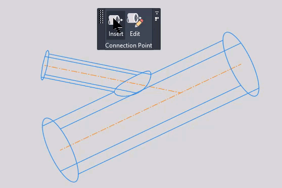
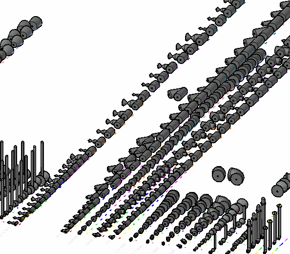
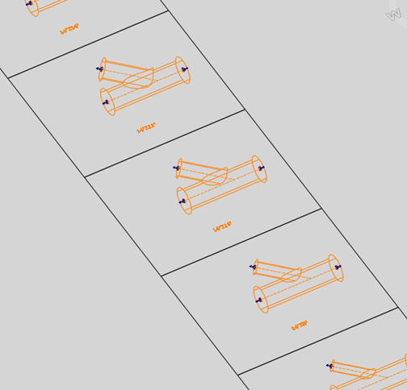
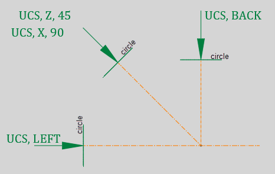

Pressure pipes in AutoCAD Civil 3D appeared back in 2013 in version 2014. Lots of Civil 3D veterans were very excited about this because pressure pipes were a wish list item for many years.

The initial release of pipe networks was very sad due to the limited tools provided for horizontal and vertical layout. The pressure pipes were so awkward to manipulate, many decided to not put them to use and stuck with a workflow using alignments and profiles as pipes. There were many advantages when laying out pipes with horizontal or vertical curves using this method. In recent releases, the pressure pipe tools were overhauled so that they are now alignment and profile dependent which allows us to edit pressure pipe alignments and profiles to influence horizontal and vertical layout. This improvement made a lot of sense and also made many people happy.

However, one of the biggest disappointments in pressure pipe is the stock libraries. Originally, three were provided: AWWA Flanged, AWWA Mechanical, and AWWA PushOn, all based on Ductile Iron. Only a few fitting and appurtenance sizes were there. In later releases, an attempt was made to provide some additional databases: AWWA HDPE, AWWA PVC, and AWWA Steel, but these additions had the same issues.

For many years, most Civil 3D users had repeatedly requested a completed pressure pipe library. Recently, the stock libraries were enhanced to provide more stuff. Using the libraries still does not reflect what we have traditionally provided in plans over the decades. Some of these issues prevent us from using the tool and/or prevent us from spending the time creating our own libraries.

1.  We don’t show pipe joints unless we draw them in a pump station detail, but pressure pipe is not a tool that creates pump station details easily.
2.  We don’t show outside diameter. We usually draw a pipe as a single segment in plan; in profile, the pipe is represented by two segments representing the top and the bottom and spaced according to nominal diameter.
3.  Not all traditional sizes, especially for variable branch sizes, have been provided in each stock library.
4.  The size names for pipes, fittings, and appurtenances in the stock libraries are very verbose and contain a lot of useless information.
5.  The “Display as Centerline” option in the pressure pipe styles can be customized during library construction to look like your standard symbols, not just a line.

Back in 2013, I developed a pressure pipe library with sizes based on nominal diameter and without modeled joints. I created metadata within the pressure pipe library that was label friendly. It contained a combination of variable branch sizes for tees, crosses, and wyes. It provided for sizes from less than an inch up to 48” initially. It came together rather quickly and worked very well. It was a library that could be duplicated and used for other materials.

Here is a view in the DWG file where I created each part in 3D:

Creating pressure part libraries consist of 4 steps:

1.  3D-model Parts
2.  Export to Content
3.  Import Content into Content Catalog Editor
4.  Customize Metadata

If you are interested in creating a library, here are the guidelines for Step 1.

**Step 1: 3D Model Your Part**

The good news is you do not have to have 3D model pipes; just fittings and appurtenances (the fun stuff). Pipes are created in the Content Catalog Editor simply by configuring metadata.

Pressure part fittings and appurtenances are not parametric. Unlike with Part Builder, you can’t create a part that will resize by adjusting a dropdown value. You must create each size of bend, tee, cross, or valve individually. Sounds time consuming but since it is a series of repetitive tasks, it goes by quickly, especially with a good audible selection. The libraries I created ended up with hundreds of parts, so it pays to be organized. My first stab at it involved creating all of the 3D parts in one file. Now, I’m creating all sizes of each type of fitting or appurtenance in its own file, i.e. one file for tees and another for crosses. Also, it pays to exercise good organizational skills inside your drawing as well, but do put all of your fittings on layer 0 to keep your 3D modeling layers out of your production drawings.

There are basically four 3D commands you will be using:

Before getting into the 3D shape building, you must create the “stick figure” version of the part as seen in the illustrations above. This is not only used in the 3D shape building process but it is a prerequisite for exporting the part size for the Content Catalog Editor.

_Note: When using the “stick figure” as a path during the SWEEP command, it will be consumed into the 3D part which means it will not exist for the export process. Duplicate these stick figures in place before using the SWEEP command with them._

Also, know that the shape or entity to be extruded, lofted, or swept must be drawn in a plane that it is perpendicular to the branch. The plane can be made current with the UCS command. Below is a guide to using the three planes I use:

-   Type UCS <enter> left <enter> to draw in the left plane
-   Type UCS <enter> back <enter> to draw in the back plane
-   Note: Using the View Cube will just change the view, not the current plane.
-   Incidentally, UCS <enter> <enter> returns you to the world coordinate system.
-   To draw in a plane perpendicular to the wye branch, you must first rotate the Z axis, then rotate the X axis.
    -   UCS <enter> Z <enter> 45 <enter>
    -   UCS <enter> X <enter> 90 <enter>

After the 3D shape building and unionizing, and prior to exporting, you must add “connectors” to each branch of the fitting or appurtenance. This will occur where a pipe will connect. The connector needs to be located at the outside end of the branch at the center of its circular shape. Incidentally, just in case you were wondering, a pressure pipe cannot be of any shape other than circular.

To insert the connectors, go to the Insert tab of the ribbon. When going through this process, I usually click on the Connection Point panel and drag it into my drawing area so that it is very close to where I am working. To return the panel to the Insert tab of the ribbon, drag it back to where it was and drop it. It should automatically dock but if it doesn’t drag it around a miniscule amount of distance over the docking area until it does.

1.   Click on the Insert button. The prompt will tell you to select an object. Use the pickbox to select any location on the 3D solid representing the fitting or appurtenance; you do not need to select anywhere near the branch opening you are attaching to.
2.  The prompt now tells you to pick the insertion point. This should be the end point of the “stick figure” which coincides with the branch opening you are adding the connector to.
3.  Next, you’ll be prompted to pick the 1st point for the direction. After picking you will be prompted to pick the 2nd point for the direction.
    
    The direction can be thought of as an arrow which points in the direction of the incoming pipe; the first point selected is the end point of the arrow and the next point selected is the location of the arrowhead.
4.  The last prompt will ask you if you want to add Engineering Data. It doesn’t  matter how you answer this prompt because for the purpose of creating pressure parts, answer yes or no will not add or subtract any data from the part.
5.  Repeat for each branch. You may create the connection points in any order.

This post may inspire you to take a deep dive into creating a custom pressure part library for your company that will be very functional and enable you to create very professional looking plans at the same time. This post will help you get through the first step of creating a custom pressure part library which will give you much flexibility in the long run when additional parts must be added.

The next post will focus on exporting your part entities to a content file.