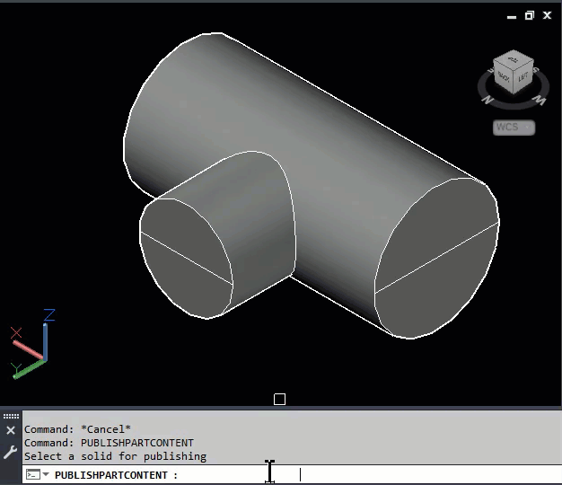
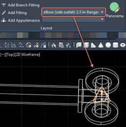
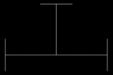
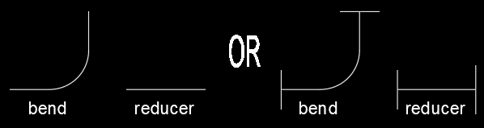

In this blog post, we expand on [Completing the Pressure Part Library – Part 1](https://zentekconsultants.net/completing-the-pressure-part-library-part-1/) by covering the process of exporting content.

When we plan and design our pressure pipe systems in AutoCAD Civil 3D, there is a lot of content in the stock libraries that are overkill for what we need to provide in plan.

-   Pipe Joints: Mechanical? Push-On? Flanged? How often on a site plan or a transportation plan to we need to show joints? Even at a scale of 1:20 on a 24”x36” sheet, joints would show as a blob of ink. We may at times refer to the joint type in a label, but this can be accounted for with metadata from the catalog or even the description from the part list. There isn’t a need to model hundreds of pipes or fittings with joints for every material possible to utilize pressure pipes in Civil 3D. Why not work with a jointless catalog which can be used in all scenarios?
-   Outside Diameter (OD) vs Nominal DiameteCr: There are differences in pipe thicknesses depending on the material, schedule, and class of pipe. You can make catalogs for each type of pipe ending up with 20, most of which would more than likely be seldomly used. Would these thicknesses be measurable on plotted plans? Traditionally, have we ever drawn to outside diameter in plan or profile? Why not just work with a catalog based on nominal diameter which would work in all scenarios?
-   Stock Part List Inconsistencies: When a bend is added to a pipe, a tee appears. This can be experienced when trying to add various fittings.
    
    
-   Part Size Names: The names of parts in the stock libraries contain just about everything you do not want or need to know about the part. To say the names are lengthy is an understatement. Most of the populated fields in the part catalog are not needed on our proposed plans. Plus, it isn’t necessary to give a part’s biography in its name.
-   In fitting or appurtenance styles, there is the option of using “Display as Centerline”. This will display a representation of the part that was used in its content definition process. This definition can resemble a block that is typically used in plans and can be defined during the process discussed in this post.
-   Missing Parts? If down the road you find you need to add a part for a unique situation, why spend the time creating something that’s consistent with the stock library if you have no use for 80% of it? Creating a generic and simple library that can be easily managed and quickly enhanced will facilitate additional content.

**Step 2: Exporting Content**

Exporting the content is a process that must be done for each part size. This produces a file. The file produces a ZIP file, but instead of using the ZIP extension it uses the CONTENT extension. This file contains the following files:

All three of these files will bear the same GUID name which has no resemblance to the GUID names given to the blocks in the DWG file.

The CONTENT file will be imported into the new catalog in the upcoming step of the process.

**“Display as Centerline” Entities**

As mentioned before, these entities will end up in one of the block definitions used by the Pressure Pipe styles in your drawing. So, a tee could look like this:

Or it could look like this:

Either way, you’ll be creating the block definition. You might as well make it look as it should appear in plan.

Parts such as bends or reducers technically do not require a block definition since you can use a single segment when defining the part’s “centerline entity”. But why define the centerline entity perfunctorily with a single segment when you can make it look more amazing with a block?

**PARTPUBLISHCONTENT**

The PUBLISHPARTCONTENT command will be executed continually until all AutoCAD part definitions have been exported each to a CONTENT file. It’s not a command that is conveniently located on the ribbon or a right-click menu, so it has to be called from the command line. What is helpful is to create a command alias that will enable you to type one or two letters to call it up. [Click here](https://help.autodesk.com/view/ACD/2023/ENU/?guid=GUID-D4CACED6-DFBA-43C3-BC42-8D980AB3AE75) for instructions on how to create and manage command aliases.

Before beginning, I recommend that you switch to a 3D view such as NW Isometric. The reason is that the PUBLISHPARTCONTENT command will apply a shaded visual style to your drawing environment, perform a ZOOM EXTENTS, and take a screenshot of your part for the creation of the PNG. Applying a 3D view, will make your part previews look amazing and interesting.

After applying the 3D view, select the 3D solid and the “display as centerline” entities. Do not include the connectors in your selection. Isolate the selected objects with the ISOLATEOBJECTS command. This will ensure that the entities you need for the CONTENT definition will be available, and the screenshot written to the PNG contains only the content relevant to the user.

To publish the CONTENT file, do the following:

1.  Set your 3D view and isolate your solid and “display as centerline” entities as described above. Remember, you will be working with one part at a time.
2.  Execute the PUBLISHPARTCONTENT command.
3.  Select the solid.
4.  Select the “display as centerline” entity.
5.  Type I or M for your units.
6.  Type the letter to indicate the part you are creating according to the indications at the command line.
7.  Browse out and save your file.
8.  End Object Isolation using the UNISOLATEOBJECTS command.
9.  Repeat 1 – 8 for the remaining parts.

After the parts have been exported, you will be ready to import them into the new catalog.

Use [Completing the Pressure Part Library – Part 1](https://zentekconsultants.net/completing-the-pressure-part-library-part-1/) to get started with the AutoCAD 3D part modeling process. Use this post to create CONTENT files that will seed your catalog with fittings and appurtenances that are ready for Civil 3D consumption. You will be on your way to enabling your staff to produce water distribution, force main, and even dry utility plans or profiles that look fantastic and produce construction friendly labels.