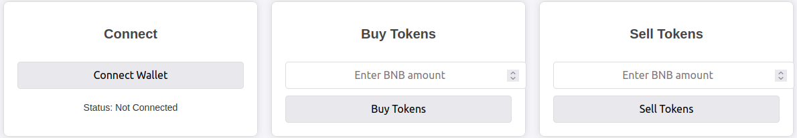
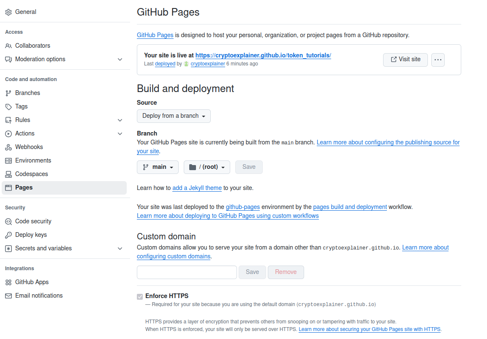

In Part I, we laid the foundations by providing a comprehensive guide on how to create a custom crypto token, compile and deploy it, and make it tradable for others. The main focus of this post is one specific type of cryptocurrency: [**stablecoins**](https://en.wikipedia.org/wiki/Stablecoin).

This post is self-contained, i.e. will teach you everything you need to know about developing and deploying your own stablecoin — but some fundamental topics will be introduced somewhat briefer, as we covered them extensively in Part I. Thus, if you haven’t read it yet, and want to dive deeper into this fascinating topic — I highly recommend checking it out.

Stablecoins have become a cornerstone of the cryptocurrency ecosystem, offering the stability of traditional currencies while maintaining the benefits of blockchain technology. Whether you’re trading, providing liquidity, or using [decentralized finance (DeFi)](https://www.investopedia.com/decentralized-finance-defi-5113835) platforms, stablecoins like [USDT](https://tether.to/en/), [USDC](https://www.circle.com/usdc), and [DAI](https://makerdao.com/en/) have proven invaluable for navigating the volatility of crypto markets.

Press enter or click to view image in full size


Image created by [ChatGPT](https://chatgpt.com/)

But have you ever wondered what goes into developing a stablecoin of your own?

In this post, I’ll take you through the fundamentals of building a collateral-backed stablecoin from scratch. From understanding the different types of stablecoins — **fiat-collateralized**, **crypto-collateralized**, and **algorithmic** — to writing and deploying a [Solidity](https://soliditylang.org/) smart contract that mints and burns stable tokens based on collateral reserves, we’ll cover it all.

By the end of this guide, you’ll have a solid grasp of the mechanisms that keep stablecoins “stable” and an appreciation for the intricacies of decentralized finance. Whether you’re a developer curious about Web3 technology or someone fascinated by the intersection of finance and code, this journey into stablecoin development is sure to broaden your understanding of the crypto space.

We’ll begin with an introduction to stablecoins, then code our smart contract, and eventually conclude the post by writing the necessary website for buying and selling our stablecoin. Code for all will be shared [GitHub](https://github.com/cryptoexplainer/token_tutorials). With that said, let’s dive into it.

## Introduction to Stablecoins

Over the last years, cryptocurrencies have made an unprecedented impact on the financial ecosystem, establishing themselves as a powerful new asset class. Whereas most of the introduced coins and tokens came with a purpose and problem they intended to solve, investors soon began to realize their enormous potential, among others for speculation — leading to high volatility of the market. This in turn gave birth to stablecoins: stablecoins are tied to some “real” asset, such as the US dollar, or gold — and thus combine the best of both words, traditional fiat money and blockchain technologies.

### Types of Stablecoins

Stablecoins mostly fall into one of two classes: **collateralized stablecoins** and **algorithmic stablecoins**. Collateralized stablecoins are tied, or _pegged_, to some other asset. When acquiring the stablecoin, the buyer transfers assets of corresponding value to the vendor, who keeps it safe — upon selling, the asset is returned. Algorithmic stablecoins on the other hand try to control supply and demand in an algorithmic way, manipulating the price to stay in the desired window.

Let’s first look at **collateralized stablecoins**. Here one can again distinguish **fiat-backed**, **asset-backed** and **crypto-backed** coins — which denote against which kind of asset the coin is pegged against. Fiat-backed stablecoins are tied against some traditional fiat money. One example is Tether, which is pegged against the US dollar. Asset-backed stablecoins are tied against some “physical” assets, such as gold or silver. And lastly, crypto-backed coins (you guessed it), are pegged against other crypto currencies.

In this post, we will develop such stablecoin together. Before diving into the details in the next section, let’s roughly sketch how this is done. Core idea is to always store amounts of the asset corresponding to the value of the minted crypto coin. For example: we could make a coin and open a shop. Whenever somebody brings us one nugget of cold, we mint one of our coins, and send it to their crypto wallet. Now, one coin is worth one gold nugget! The gold we keep safe in our vault. When the person wants to sell the coins, they send them to us — we burn them, and return the gold — thus keeping the needed ratio of gold in our vault / available tokens. Of course, the given example is not the most convenient for a Medium tutorial. Thus, we create a virtual shop, and develop a crypto-backed stablecoin — in particular, we will peg against BNB. The “shop” is a small website, where one can connect their [Metamask](https://metamask.io/) wallet and then buy or sell coins with a fixed BNB price: we keep the client’s BNB “safe” while they hold our stablecoin, and return it when they sell the stablecoin. One consequence of this is, that we cannot list our token on a common cryptoexchange, such as PancakeSwap — doing so would allow users to freely trade our token, and the price would go up or down based on demand.

A token allowing that we will develop in the next post — where we will introduce **algorithmic stablecoins**. These are traded on “common” cryptoexchanges — and contain a smart algorithm manipulating the price in the desired way. When the token is bought, additional tokens are minted, to keep the price at the desired level. When the token is sold, a corresponding amount of token is burned.

Now that we have a theoretical understanding of stablecoins, let’s come to the practical implementation. As mentioned, we’ll implement our own crypto-collaterialized stablecoin, pegged to BNB.

## Writing a Collaterialized BEP-20 Stablecoin Contract

For important details and fundamentals of developing custom crypto tokens, I’d like to refer to my [previous post](https://medium.com/ai-advances/create-your-own-crypto-token-1cfd7c274eeb). There, I guide you through all steps involved in details and explain all necessary tools. Here, we will go somewhat quicker.

To write, compile and deploy our token we will use [Remix](https://remix.ethereum.org/). There, we create the file [basic\_stable\_token.sol](https://github.com/cryptoexplainer/token_tutorials/blob/main/contracts/basic_stable_token.sol) with the following content:

```

pragma solidity ^0.8.0;

contract CollateralizedStableCoin {
    string public name = "Collateralized Basic Stable Token";
    string public symbol = "CBST";
    uint8 public decimals = 18;
    uint256 public totalSupply;
    uint256 public collateralizationRatio = 150; 

    mapping(address => uint256) public balanceOf;
    mapping(address => uint256) public collateralBalance;

    
    event Mint(address indexed user, uint256 amount, uint256 collateral);
    event Burn(address indexed user, uint256 amount, uint256 collateralReturned);

    
    function depositCollateralAndMint() external payable {
        require(msg.value > 0, "Collateral must be greater than zero");

        
        uint256 mintAmount = (msg.value * 100) / collateralizationRatio;
        balanceOf[msg.sender] += mintAmount;
        collateralBalance[msg.sender] += msg.value;
        totalSupply += mintAmount;

        emit Mint(msg.sender, mintAmount, msg.value);
    }

    
    function burnAndWithdrawCollateral(uint256 amount) external {
        require(balanceOf[msg.sender] >= amount, "Insufficient stablecoin balance");
        uint256 collateralToReturn = (amount * collateralizationRatio) / 100;

        require(collateralBalance[msg.sender] >= collateralToReturn, "Insufficient collateral balance");

        
        balanceOf[msg.sender] -= amount;
        collateralBalance[msg.sender] -= collateralToReturn;
        totalSupply -= amount;

        
        (bool success, ) = msg.sender.call{value: collateralToReturn}("");
        require(success, "Collateral transfer failed");

        emit Burn(msg.sender, amount, collateralToReturn);
    }
}
```

In the beginning, as we are accustomed to from the previous post, we define basic attributes of our tokens, such as name and decimals. However, we soon encounter a new variable: `collateralizationRatio` — which introduces us to the concept of over-collateralization.

**Over-collateralization** is a safety mechanism designed to enhance stability by maintaining additional reserves of collateral. This is especially important when the collateral itself is subject to high price fluctuations. Let’s see how this works with a collateralization ratio of 150%: When users mint 100 units of our stablecoin, they are required to deposit 150 units of collateral. However, the stablecoin remains pegged 1:1 to the collateral value, meaning those 100 units are worth exactly 100 collateral units. The additional 50 collateral units serve as a reserve buffer, meant to safeguard the system during “emergencies” such as sudden drops in the collateral’s value. However, under normal circumstances, when users redeem their stablecoins, they receive back their full 150 units of collateral — provided they burn the corresponding 100 units of the stablecoin.

Coming back to the contract: eventually we only define two functions, `depositCollateralAndMint` and `burnAndWithdrawCollateral`. Let’s look at `depositCollateralAndMint` first:

```

  function depositCollateralAndMint() external payable {
      require(msg.value > 0, "Collateral must be greater than zero");

      
      uint256 mintAmount = (msg.value * 100) / collateralizationRatio;
      balanceOf[msg.sender] += mintAmount;
      collateralBalance[msg.sender] += msg.value;
      totalSupply += mintAmount;

      emit Mint(msg.sender, mintAmount, msg.value);
  }
```

This function is called with the usual `msg` keyword, which contains the field `value` — indicating the amount of BNB (remember, this is the crypto asset we want to peg against) the user wants to deposit. How do we know this is BNB you might ask, and not BTC, USD, or whatever? This is determined by the keyword `payable`: functions declared like this only accept the native tokens of the underlying blockchain, in our case BNB, as input.

We then compute the amount of tokens to mint, and add it to the wallet of the sender, while storing the deposited amount of collateral in the sender’s balance. Sending tokens to the sender is done via the `mint` function: this mints tokens and sends them to the passed wallet address. The balances of all users are stored as a mapping, which maps from keys (users) to values (deposited collateral amounts) — Python developers know this as a [dictionary](https://docs.python.org/3/tutorial/datastructures.html#dictionaries), C++ as a [map](https://en.cppreference.com/w/cpp/container/map).

Now we come to `burnAndWithdrawCollateral`:

```

function burnAndWithdrawCollateral(uint256 amount) external {
    require(balanceOf[msg.sender] >= amount, "Insufficient stablecoin balance");
    uint256 collateralToReturn = (amount * collateralizationRatio) / 100;

    require(collateralBalance[msg.sender] >= collateralToReturn, "Insufficient collateral balance");

    
    balanceOf[msg.sender] -= amount;
    collateralBalance[msg.sender] -= collateralToReturn;
    totalSupply -= amount;

    
    (bool success, ) = msg.sender.call{value: collateralToReturn}("");
    require(success, "Collateral transfer failed");

    emit Burn(msg.sender, amount, collateralToReturn);
}
```

This is a direct reversal of `depositCollateralAndMint`: when sufficient funds, the deposited BNB is returned to the user (`msg.sender`), while the amount of our stable coin held by the user is returned, and burned — to keep the price stable.

### Deploying the Token

With the contract written, it is time to deploy it. Again, I would like to refer to the [previous post](https://medium.com/ai-advances/create-your-own-crypto-token-1cfd7c274eeb) for details, and here just quickly go over the process: assuming you setup Metamask, select “Deploy & run transaction” in the left side bar of Remix. Select “Injected Provider — Metamask” under “Environment”, and make sure the BSC Testnet is selected on Metamask: to enable safe testing without any risk or associated costs, we will be using the testnet of Binance, instead of the “real” one. With a click on “Deploy”, your contract is live!

Next, you can verify the contract as described in the previous post — concluding this section. You can find my contract [here](https://testnet.bscscan.com/address/0xc1cB1B6d72A7E839764d7BFbcf333651B0A189C7).

## Writing a Platform to Buy and Sell our Stablecoin

Our contract is running now. What we’re missing is way for users to buy and sell it. Remember, as said in the introduction — collateralized stablecoins cannot be acquired or sold “traditionally” — meaning, we e.g. won’t list the token on Pancakeswap, as transactions there would influence the price in undesired ways. Also note, that any function related to this is missing in our contract, as opposed to contract we developed in our previous post (e.g. `transfer`, `approve` …).

Thus, we need a new way of distributing our token: a website. Here, we will design a simple frontend with HTML and JavaScript. We’ll show and explain the code, use VS Code Server to test it locally — and eventually introduce [Github Pages](https://pages.github.com/), on which we will host our webinterface s.t. it’s accessible for everyone.

### Designing the Frontend

Let’s start with the frontend. Our simple, but functional website will look like this:

Press enter or click to view image in full size



On the left we have a “Connect & Status” section. To begin using the website, the users has to click on “Connect Wallet” and connect their Metamask wallet. Additionally it will show status messages, such as connection status and the status of transactions. The other two columns are for buying / selling tokens: just enter the desired amount, and hit the corresponding button. When doing so, the status textfield will first show “Transaction sent” — and upon completion (this will take a few seconds up to minutes) verify the transaction was executed, or indicate it failed. Let’s have a look at the code. There are two parts: the design will be handled in index.html, the functionality in app.js.

**index.html:**

```
<!DOCTYPE html>
<html>
<head>
  <title>My DApp</title>
  <script src="https://cdn.jsdelivr.net/npm/ethers/dist/ethers.umd.min.js"></script>
  <style>
    body {
      font-family: Arial, sans-serif;
      display: flex;
      justify-content: center;
      align-items: center;
      height: 100vh;
      margin: 0;
      background-color: #f4f4f9;
    }
    .container {
      display: flex;
      justify-content: space-around;
      width: 80%;
      max-width: 1200px;
    }
    .column {
      background-color: #ffffff;
      border: 1px solid #ddd;
      border-radius: 8px;
      padding: 20px;
      text-align: center;
      box-shadow: 0 0 10px rgba(0, 0, 0, 0.1);
      flex: 1;
      margin: 10px;
    }
    button, input {
      padding: 10px;
      font-size: 16px;
      margin-top: 10px;
      border-radius: 5px;
      border: 1px solid #ddd;
      width: 100%;
    }
    #status {
      margin-top: 20px;
      font-size: 14px;
      color: #333;
    }
    h2 {
      font-size: 20px;
      margin-bottom: 20px;
      color: #444;
    }
    input {
      text-align: center;
    }
  </style>
</head>
<body>
  <div class="container">
    
    <div class="column">
      <h2>Connect</h2>
      <button onclick="connectMetaMask()">Connect Wallet</button>
      <div id="status">Status: Not Connected</div>
    </div>

    
    <div class="column">
      <h2>Buy Tokens</h2>
      <input type="number" id="bnbAmountBuy" placeholder="Enter BNB amount" step="0.01" min="0">
      <button onclick="buyTokens()">Buy Tokens</button>
    </div>

    
    <div class="column">
      <h2>Sell Tokens</h2>
      <input type="number" id="bnbAmountSell" placeholder="Enter BNB amount" step="0.01" min="0">
      <button onclick="sellTokens()">Sell Tokens</button>
    </div>
  </div>

  
  <script src="app.js"></script>
</body>
</html>
```

**app.js:**

```

if (typeof window.ethereum !== 'undefined' && typeof ethers !== 'undefined') {
  console.log("MetaMask and Ethers.js are both installed!");
} else {
  alert("MetaMask or Ethers.js is not installed. Please make sure both are available to use this DApp.");
}


let contract;
let signer;
const contractAddress = "0xc1cB1B6d72A7E839764d7BFbcf333651B0A189C7";
const contractABI = [
  "function depositCollateralAndMint() external payable",
  "function burnAndWithdrawCollateral(uint256 amount) external"
];


async function connectMetaMask() {
  try {
    await window.ethereum.request({ method: 'eth_requestAccounts' });
    const provider = new ethers.BrowserProvider(window.ethereum);
    signer = await provider.getSigner();
    contract = new ethers.Contract(contractAddress, contractABI, signer);

    document.getElementById("status").innerText = "Status: Connected";
    console.log("Connected to MetaMask!");
  } catch (error) {
    console.error("Error connecting to MetaMask:", error);
  }
}


async function buyTokens() {
  if (!contract) {
    alert("Please connect to MetaMask first.");
    return;
  }
  try {
    const bnbAmount = document.getElementById("bnbAmountBuy").value;
    if (!bnbAmount || parseFloat(bnbAmount) <= 0) {
      alert("Please enter a valid BNB amount.");
      return;
    }

    
    const transaction = await contract.depositCollateralAndMint({
      value: ethers.parseEther(bnbAmount)
    });
    document.getElementById("status").innerText = "Transaction sent: " + transaction.hash;
    await transaction.wait(); 
    document.getElementById("status").innerText = "Tokens bought successfully!";
  } catch (error) {
    console.error("Error buying tokens:", error);
    document.getElementById("status").innerText = "Error: " + error.message;
  }
}


async function sellTokens() {
  if (!contract) {
    alert("Please connect to MetaMask first.");
    return;
  }
  try {
    const bnbAmount = document.getElementById("bnbAmountSell").value;
    if (!bnbAmount || parseFloat(bnbAmount) <= 0) {
      alert("Please enter a valid BNB amount.");
      return;
    }

    const amount = ethers.parseEther(bnbAmount);
    const transaction = await contract.burnAndWithdrawCollateral(amount);
    document.getElementById("status").innerText = "Transaction sent: " + transaction.hash;
    await transaction.wait(); 
    document.getElementById("status").innerText = "Tokens sold successfully!";
  } catch (error) {
    console.error("Error selling tokens:", error);
    document.getElementById("status").innerText = "Error: " + error.message;
  }
}
```

I don’t want to spend much time on the HTML code — I think it’s fairly readable, and nowadays can be easily auto-generated. In it, we simply define the design of our website, including the three columns Connect / Buy / Sell with the appropriate control elements inside. However I want to highlight the line:

```
<script src="https://cdn.jsdelivr.net/npm/ethers/dist/ethers.umd.min.js"></script>
```

This includes the [Ethers library](https://docs.ethers.org/v5/), which is a Javascript library for interacting with the Ethereum blockchain.

So, let’s come to the Javascript part. In the beginning, we check whether MetaMask and Ethers.js are installed and available, and otherwise alert the user:

```

if (typeof window.ethereum !== 'undefined' && typeof ethers !== 'undefined') {
  console.log("MetaMask and Ethers.js are both installed!");
} else {
  alert("MetaMask or Ethers.js is not installed. Please make sure both are available to use this DApp.");
}
```

Next we define some important variables, such as the contract address, and also, in particular, the _contract ABI_:

```
let contract;
 let signer;
 const contractAddress = "0xc1cB1B6d72A7E839764d7BFbcf333651B0A189C7";
 const contractABI = [
   "function depositCollateralAndMint() external payable",
   "function burnAndWithdrawCollateral(uint256 amount) external"
 ];
```

[Contract ABI](https://docs.soliditylang.org/en/latest/abi-spec.html) stands for Contract Application Binary Interface and is the standard way how to interact with contracts on the Ethereum blockchain. As you surely already spotted, here we list the names, types and arguments of the functions we defined in our contract — and which we want to call.

Next, we define a function to connect a Metamask wallet — which is called from the HTML (file) upon clicking the corresponding button:

```

async function connectMetaMask() {
  try {
    await window.ethereum.request({ method: 'eth_requestAccounts' });
    const provider = new ethers.BrowserProvider(window.ethereum);
    signer = await provider.getSigner();
    contract = new ethers.Contract(contractAddress, contractABI, signer);

    document.getElementById("status").innerText = "Status: Connected";
    console.log("Connected to MetaMask!");
  } catch (error) {
    console.error("Error connecting to MetaMask:", error);
  }
}
```

And here in my opinion the magic of Ethers starts to show — when first writing this code, I was amazed by how little effort it was. Same for buying a token:

```

async function buyTokens() {
  if (!contract) {
    alert("Please connect to MetaMask first.");
    return;
  }
  try {
    const bnbAmount = document.getElementById("bnbAmountBuy").value;
    if (!bnbAmount || parseFloat(bnbAmount) <= 0) {
      alert("Please enter a valid BNB amount.");
      return;
    }

    
    const transaction = await contract.depositCollateralAndMint({
      value: ethers.parseEther(bnbAmount)
    });
    document.getElementById("status").innerText = "Transaction sent: " + transaction.hash;
    await transaction.wait(); 
    document.getElementById("status").innerText = "Tokens bought successfully!";
  } catch (error) {
    console.error("Error buying tokens:", error);
    document.getElementById("status").innerText = "Error: " + error.message;
  }
}
```

We parse the input BNB account, and call our contract’s `depositCollateralAndMint` with it. Apart from a few status messages for the user, that’s it!

The sell function is very similar, thus we will skip an explanation here.

### Running a Local Development Server

Now that we have implemented our frontend, it is time to test it. In this section we will do so locally, before deploying our webpage to the web, and thus opening it up for everyone.

There’s an abundance of possibilities how one can run a local server, in particular with VS Code (which I am using): I chose the [Live Server plugin](https://marketplace.visualstudio.com/items?itemName=ritwickdey.LiveServer). With it installed, you can simply right-click on the HTML file (index.html), and select “Open with Live Server”. This will open a new browser window running our frontend, which you can now try out — buy and sell some of your stablecoin using (t)BNB!

### Deploying with Github Pages

Once you’re satisfied with your frontend and the functionality, it’s time to publish your website / project to the web, s.t. everyone can buy and sell your new stable token.

Again, there are a multitude of options for this. Here we chose [GitHub Pages](https://pages.github.com/), which is an easy way of hosting project websites and perfect for educational purposes.

GitHub Pages offers two functions: creating a personal website for your account, or a project page. The first is global for all your account, and you can only have one — whereas you can have an unlimited number of webpages for projects, one for each repository you own. Thus here we go with option 2.

For this, you need a file named “index.html” in the main folder of your repository (check the file structure in [mine](https://github.com/cryptoexplainer/token_tutorials)). Then, open the repository in GitHub, and go to “Settings” / “Pages”:

Press enter or click to view image in full size



Image by author

In this window, select the desired branch (most likely “main”), and then save — your page is now automatically being build and hosted. Eventually, you can find it under [https://username.github.io/repository\_name](https://username.github.io/repository_name) (note: changes, e.g. in the frontend / site take a while to load, so just wait a while or try re-deploying if your changes are not picked up).

Mine is live under: [https://cryptoexplainer.github.io/token\_tutorials/](https://cryptoexplainer.github.io/token_tutorials/). There, you can actually buy and sell the stable coin we here created together! As mentioned, it lives on the BSC testnet, i.e. there is no risk or aim for profits. Still, give it a try if you’re curious — and I’ll be curious to see how many tBNB you explorers will store in my contract!

To view your bought CSC tokens on Metamask, click the “Import” button and insert my token contract address: 0xc1cB1B6d72A7E839764d7BFbcf333651B0A189C7

## Conclusion

This brings us to the end of this post. If you have made it this far, thanks for reading! In that case, I’d be grateful if you considered leaving some claps or comments, and following me on Medium. It helps my channel grow and enables me to create more educational content.

With that said, let’s recap what we discussed in this post: we started with a theoretical introduction about stablecoins, explaining fundamentals and introducing two basic types of stablecoins: collateralized and algorithmic stablecoins.

**Collateralized stablecoins** are pegged to the value of some other asset, such as the US dollar, gold, or another crypto currency. They can only be bought and sold via designated websites / shops, which take care that for every stablecoin bought an appropiate amount of resource is withheld as collateral — and that this collateral is returned in the case of a sale.

On the other hand, **algorithmic stablecoins** can be traded like any other crypto currency — and their contracts contain algorithms burning or minting coins on demand to keep the desired price level.

Then, we moved to creating our own stablecoin: in this post we explained how to generate a collateralized BEP-20 token — i.e. a stablecoin pegged against BNB. We first introduced the necessary Solidity token contract and deployed this to the BSC testnet. Then, we introduced a web interface with which the token can be bought and sold. For this we used plain HTML and Javascript, as well as the Ethers library. We showed how to use VS Code to inspect and test the resulting webpage, and then introduced GitHub Pages as a way of hosting the website and making it public.

All code is available on [GitHub](https://github.com/cryptoexplainer/token_tutorials/tree/main).

In the next post, we will create an algorithmic stablecoin together. Once again, thanks for reading!

**Other Posts in this Series**

-   Part 1: [Create your Own Crypt Token](https://medium.com/ai-advances/create-your-own-crypto-token-1cfd7c274eeb)