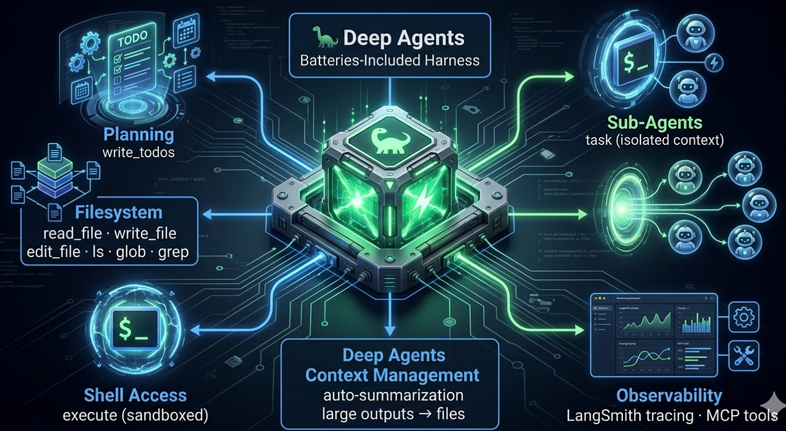
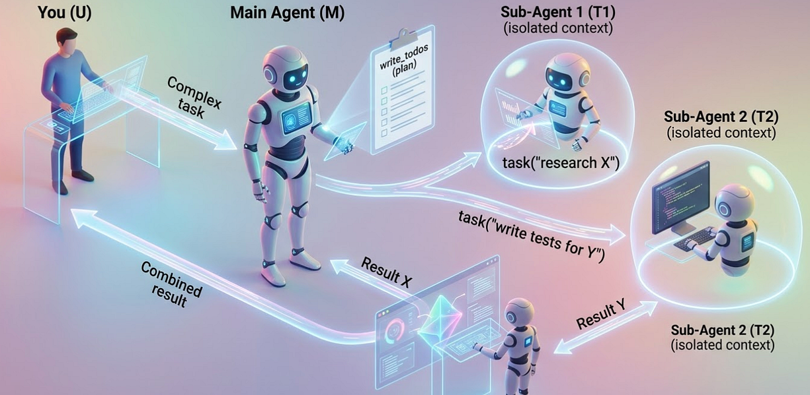
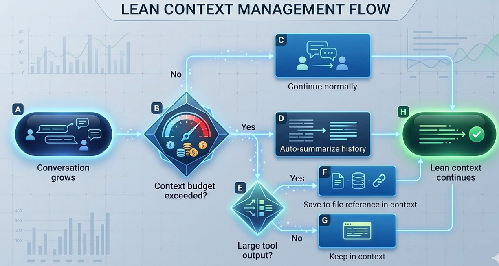

LangChain Deep Agents: Claude Code Clone — A retro pixel art dinosaur coding agent on a dark terminal, surrounded by floating tool icons connected with glowing lines in LangChain green on dark background

## Exploring Deep Agents: An Open-Source LangChain Framework for Coding Agents Inspired by Claude Code

> Dive into the world of coding agents with LangChain’s newly open-sourced Deep Agents! Discover how this powerful toolkit can elevate your development workflow, whether you’re curious about agent architecture or just looking to enhance your coding efficiency. Don’t miss out on exploring the future of AI-driven coding! #LangChain #DeepAgents #OpenSource

**Summary**: LangChain has open-sourced Deep Agents, a replica of Claude Code, designed to facilitate coding agents with a customizable framework. It includes features like task planning, file system tools, sandboxed shell access, and sub-agents for parallel tasks. The system promotes smart defaults for agent behavior, automatic context management, and built-in observability. Deep Agents supports both Python and TypeScript, making it versatile for developers seeking an open-source alternative to proprietary solutions like Claude Code.

LangChain just open-sourced a replica of Claude Code.

It is called **Deep Agents** (v0.4.11, MIT), and it recreates the core workflow behind coding agents like Claude Code in an open system you can inspect, modify, and extend. The LangChain team built it on top of LangGraph, taking inspiration from Claude Code, Perplexity Deep Research, and Manus.

If you are curious how coding agents actually work under the hood, this is the repo to read.

## What Is an Agent Harness?

Every team that builds a coding agent from scratch wires up the same primitives: file access, shell execution, task planning, context management, sub-agents for parallel work. This is not domain logic. It is scaffolding. Boilerplate for agents.

An agent harness ships that scaffolding as defaults. You get a working agent on first run and customize from there.

That is deepagents.

## What Ships in the Box

Press enter or click to view image in full size



Deep Agents — Batteries Include Agent Harness

## Planning: `write_todos`

Before acting, the agent plans. `write_todos` gives it a structured way to break down tasks, track progress, and reason about next steps. If you have used Claude Code, this maps directly to its task tracking. Think first, act second.

## Filesystem: Seven Tools for Working with Code

```
read_file("src/api/handlers.py")
write_file("src/api/handlers.py", new_content)
edit_file("src/api/handlers.py", old_str, new_str)
ls("src/api/")
glob("**/*.py")
grep("class.*Handler", "src/")
```

Reading, writing, targeted edits, directory listing, glob pattern search, content search by regex. The full toolkit for navigating and modifying a codebase.

## Shell: `execute` with Sandboxing

```
execute("pytest tests/")
execute("pip install -r requirements.txt")
execute("git diff HEAD~1")
```

Direct shell access with a sandboxing layer. The agent can run tests, install dependencies, and check git history. It is not a root shell handed to an LLM.

## Sub-Agents: `task` with Isolated Context Windows

This is the most interesting piece.

```
task("Research the deepagents API and summarize key interfaces")
task("Write unit tests for the new FileProcessor class")
```

Each `task` call spawns a sub-agent defined as:

```
{
    "name": "researcher",
    "description": "Researches topics and returns summaries",
    "system_prompt": "You are a research assistant...",
    "tools": [read_file, grep, glob]
}
```

The sub-agent gets an isolated context window: a clean slate with just the task description, not the main agent’s full conversation history. You can also wrap compiled LangGraph graphs directly as `CompiledSubAgent` objects for more complex sub-agent behavior.

Press enter or click to view image in full size



Main Agent and SubAgents

This is how you tackle genuinely large problems without context limits collapsing the main thread.

## Smart Defaults: Prompts That Teach the Model

deepagents ships system prompts that teach the model how to use its tools: plan before acting, search before writing, delegate to sub-agents for parallel work. These behaviors are defaults, not configuration tasks for you.

## Context Management: Zero-Config Auto-Summarization

Introduced in v0.2, auto-summarization runs as middleware with no configuration required. When the conversation gets long, it compresses older history automatically. When tool output is large, it offloads to a file and keeps a reference in context.

Press enter or click to view image in full size



Lean Context Management Flow

## Observability from Day One

**LangSmith tracing** requires two environment variables and nothing else:

```
export LANGSMITH_API_KEY=your_key
export LANGSMITH_TRACING_V2=true
```

Every run is traced: what the agent planned, what tools it called, what each tool returned, where it failed. No code changes. No instrumentation work.

**MCP tool support** follows the standard `mcp_server_tools` bridging pattern. Any MCP-compatible tool server works: databases, APIs, custom services.

## Python and TypeScript

deepagents ships for both ecosystems:

**Python:**

```
pip install deepagents
deepagents
```

**TypeScript** (`deepagentsjs`):

```
npm install deepagents

import { createDeepAgent } from "deepagents";
const agent = createDeepAgent({ tools: [...] });
```

Same harness architecture, both languages.

## How It Compares to Claude Code

Both converge on the same primitive set. The differences are in orientation:

### Model

-   **Deep Agents:** Any LangChain provider (100s)
-   **Claude Code:** Claude: Opus, Sonnet, Haiku

### Planning

-   **Deep Agents:** `write_todos`
-   **Claude Code:** Task tracking

### Filesystem

-   **Deep Agents:** 6 tools
-   **Claude Code:** Read, Write, Edit, Glob, Grep

### Shell

-   **Deep Agents:** `execute` (sandboxed)
-   **Claude Code:** Bash (sandboxed)

### Sub-agents

-   **Deep Agents:** `task` (isolated context)
-   **Claude Code:** Agent tool

### Context Management

-   **Deep Agents:** Auto-summarization + file offload
-   **Claude Code:** Auto-compression

### Observability

-   **Deep Agents:** LangSmith (built-in)
-   **Claude Code:** Claude Code hooks

### Extension

-   **Deep Agents:** MCP + LangGraph
-   **Claude Code:** MCP + Skills

### Underlying Framework

-   **Deep Agents:** LangGraph
-   **Claude Code:** Proprietary

### License

-   **Deep Agents:** MIT
-   **Claude Code:** Proprietary

For teams committed to Anthropic, Claude Code is excellent. For teams that want to run across multiple models, inspect the internals, or build on an open stack, deepagents is the better starting point.

## Why This Repo Is Worth Reading Even If You Do Not Use It

If you want to understand how Claude Code, Cursor, or Devin are structured, deepagents is a clean open-source reference. The implementation shows you:

-   How planning loops work
-   How tool-calling cycles are structured
-   How context compression is handled in practice
-   How sub-agent delegation patterns are implemented

The tooling around coding agents is converging on the same primitives. deepagents shows you what those primitives are, in code you can read.

**Are you building on deepagents, LangGraph, or rolling your own? What would you add to the default toolkit? Drop a comment.**

**Follow for more coverage of agent frameworks and developer tooling.**

`#LangChain #AIAgents #DeepAgents #DeveloperTools #LLM #AgentEngineering #OpenSource`

## Further Reading — LangChain Articles

1.  [LangChain Deep Agents: Real-World Use Cases and the Democratization of AI Agents](https://medium.com/@richardhightower/langchain-deep-agents-real-world-use-cases-and-the-democratization-of-ai-agents-a73787db0d28) — Rick Hightower, March 21, 2026
2.  [LangChain’s Harness Engineering: From Top 30 to Top 5 on Terminal Bench 2.0](https://medium.com/@richardhightower/langchains-harness-engineering-from-top-30-to-top-5-on-terminal-bench-2-0-8895dbab4932) — Rick Hightower, March 21, 2026
3.  [The Agent Framework Landscape: LangChain Deep Agents vs. Claude Agent SDK](https://medium.com/@richardhightower/the-agent-framework-landscape-langchain-deep-agents-vs-claude-agent-sdk-1dfed14bb311) — Rick Hightower, March 20, 2026
4.  [LangChain Deep Agents: Harness and Context Engineering: Memory, Skills, and Security](https://medium.com/@richardhightower/langchain-deep-agents-harness-and-context-engineering-memory-skills-and-security-a68737d84940) — Rick Hightower, March 18, 2026
5.  [Introduction to LangChain Deep Agents and the Shift to “Agent 2.0”](https://medium.com/ai-in-plain-english/introduction-to-langchain-deep-agents-and-the-shift-to-agent-2-0-e6ec3dc45cff) — Rick Hightower, March 15, 2026
6.  [From Chatbots to AI Agents: Building Real-Time, Tool-Using Systems with LangChain](https://medium.com/ai-in-plain-english/from-chatbots-to-ai-agents-building-real-time-tool-using-systems-with-langchain-833d8979d8ff) — Rick Hightower, February 26, 2026
7.  [LangChain and MCP: Building Enterprise AI Workflows with Universal Tool Integration](https://medium.com/@richardhightower/langchain-and-mcp-building-enterprise-ai-workflows-with-universal-tool-integration-e0547742233f) — Rick Hightower, June 23, 2025
8.  [LangChain: Building Intelligent AI Applications with LangChain](https://medium.com/@richardhightower/langchain-building-intelligent-ai-applications-with-langchain-bd7e6863d0cb) — Rick Hightower, June 10, 2025

## About the Author

Rick Hightower is a technology executive and data engineer who led ML/AI development at a Fortune 100 financial services company. He created skilz, the [universal agent skill installer](https://skillzwave.ai/docs/), supporting 30+ coding agents including Claude Code, Gemini, Copilot, and Cursor, and co-founded the world’s largest agentic skill marketplace. Connect with Rick Hightower on [LinkedIn](https://www.linkedin.com/in/rickhigh/) or [Medium](https://medium.com/@richardhightower). Check out [SpillWave](https://spillwave.com/), your source for AI expertise.

Rick has been actively developing generative AI systems, agents, and agentic workflows for years. He is the author of numerous agentic frameworks and developer tools and brings deep practical expertise to teams looking to adopt AI.