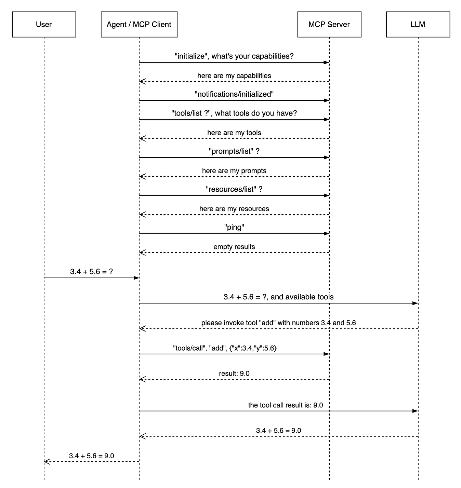

[


](https://medium.com/@jamestang?source=post_page---byline--aa4782a65991---------------------------------------)

5 min read

Jul 28, 2025

## Introduction

The Model Context Protocol (MCP) represents a significant advancement in how Large Language Models (LLMs) interact with external tools and data sources. This technical deep dive explores the intricate communication flows between LLM, agent, MCP clients, and MCP servers, complete with real-world HTTP payload examples.

## Architecture Overview

Before diving into the communication details, let’s establish the key components:

-   **LLM**: The language model that processes natural language and generates responses
-   **Agent/MCP Host**: The application layer that orchestrates LLM interactions and manages MCP connections
-   **MCP Client**: The component within the agent that communicates with MCP servers. Usually, it runs on MCP Host.
-   **MCP Server**: External services that provide tools, resources, and capabilities. These services are running outside of the Agent process. They can be on local or remote host

Press enter or click to view image in full size



## Example:

This discussion uses a MCP server which perform summation in Python.

```
from typing import Any
import httpx
from mcp.server.fastmcp import FastMCP


mcp = FastMCP("Math", log_level="ERROR")

@mcp.tool()
async def add(x: float, y: float) -> str:
    """
    Add two float numbers, returning the result as a float
    """

    return x + y

if __name__ == "__main__":
    
    mcp.run(transport='stdio')
```

MCP server JSON configuration:

```
{
  "mcpServers": {
    "weather": {
      "timeout": 60,
      "command": "uv",
      "args": [
        "--directory",
        "/Users/james/mcp-server/math",
        "run",
        "math.py"
      ],
      "transportType": "stdio"
    }
  }
}
```

User query:

```
3.4 + 5.6
```

## Step 1: Initial Connection and Handshake

### 1.1 MCP Client Initiates Connection

When an agent starts up, the MCP client establishes connections with configured MCP servers.

**HTTP Request: MCP Client to MCP Server**

```
{
    "method": "initialize",
    "params": {
        "protocolVersion": "2025-03-26",
        "capabilities": {},
        "clientInfo": {
            "name": "Math Agent",
            "version": "1.0.0"
        }
    },
    "jsonrpc": "2.0",
    "id": 0
}
```

**HTTP Response: MCP Server to MCP Client**

```
{
    "jsonrpc": "2.0",
    "id": 0,
    "result": {
        "protocolVersion": "2024-11-05",
        "capabilities": {
            "experimental": {},
            "prompts": {
                "listChanged": false
            },
            "resources": {
                "subscribe": false,
                "listChanged": false
            },
            "tools": {
                "listChanged": false
            }
        },
        "serverInfo": {
            "name": "Math",
            "version": "1.0.0"
        }
    }
}
```

### 1.2 MCP Client Sends Initialized Notification

**HTTP Request: MCP Client to MCP Server**

```
{
    "method": "notifications/initialized",
    "jsonrpc": "2.0"
}
```

## Step 2: Discovery Phase — Listing Available Tools, Prompts, and Resources

### 2.1 Agent Discovers Available Tools

The agent queries the MCP server for available tools that the LLM can use.

**HTTP Request: MCP Client to MCP Server**

```
{
    "method": "tools/list",
    "jsonrpc": "2.0",
    "id": 1
}
```

**HTTP Response: MCP Server to MCP Client**

```
{
    "jsonrpc": "2.0",
    "id": 1,
    "result": {
        "tools": [
            {
                "name": "add",
                "description": "\nAdd two float numbers, returning the result as a float\n",
                "inputSchema": {
                    "properties": {
                        "x": {
                            "title": "X",
                            "type": "number"
                        },
                        "y": {
                            "title": "Y",
                            "type": "number"
                        }
                    },
                    "required": [
                        "x",
                        "y"
                    ],
                    "title": "addArguments",
                    "type": "object"
                }
            }
        ]
    }
}
```

### 2.2 Agent Discovers Available Prompts

The agent queries the MCP server for available prompts that the LLM can use.

**HTTP Request: MCP Client to MCP Server**

```
{
    "method": "prompts/list",
    "jsonrpc": "2.0",
    "id": 5
}
```

**HTTP Response: MCP Server to MCP Client**

```
{
    "jsonrpc": "2.0",
    "id": 5,
    "result": {
        "prompts": []
    }
}
```

### 2.3 Agent Discovers Available Resources

The agent queries the MCP server for available resources that the LLM can use.

**HTTP Request: MCP Client to MCP Server**

```
{
    "method": "resources/list",
    "jsonrpc": "2.0",
    "id": 7
}
```

**HTTP Response: MCP Server to MCP Client**

```
{
    "jsonrpc": "2.0",
    "id": 7,
    "result": {
        "resources": []
    }
}
```

## Step 3: User Interaction and LLM Processing

### 3.1 User Sends Query to Agent

The user interacts with the agent, which forwards the query to the LLM along with available tool context.

**Http Request: Agent to LLM**

```
{
  "model": "gpt-4.1-nano",
  "messages": [
    {
      "role": "user",
      "content": "3.4 + 5.6"
    }
  ],
  "temperature": 0.0,
  "stream": false,
  "response_format": {
    "type": "json_schema",
    "json_schema": {
      "name": "number",
      "strict": true,
      "schema": {
        "type": "object",
        "properties": {
          "value": {
            "type": "number"
          }
        },
        "required": [
          "value"
        ],
        "additionalProperties": false
      }
    }
  },
  "tools": [
    {
      "type": "function",
      "function": {
        "name": "add",
        "description": "Add two float numbers, returning the result as a float",
        "strict": true,
        "parameters": {
          "type": "object",
          "properties": {
            "arg0": {
              "type": "number"
            },
            "arg1": {
              "type": "number"
            }
          },
          "required": [
            "arg0",
            "arg1"
          ],
          "additionalProperties": false
        }
      }
    }
  ]
}
```

### 3.2 LLM Responds with Tool Call

The LLM analyzes the query and determines it needs to use the `add` tool.

**Http Response: LLM to Agent**

```
{
  "id": "chatcmpl-ByAjuwgnLKxlGsAdjjUNSutyLXbLP",
  "object": "chat.completion",
  "created": 1753680662,
  "model": "gpt-4.1-nano-2025-04-14",
  "choices": [
    {
      "index": 0,
      "message": {
        "role": "assistant",
        "content": null,
        "tool_calls": [
          {
            "id": "call_yyRkK4YzftpzZdXogyDtDBHZ",
            "type": "function",
            "function": {
              "name": "add",
              "arguments": "{\"arg0\":3.4,\"arg1\":5.6}"
            }
          }
        ],
        "refusal": null,
        "annotations": []
      },
      "logprobs": null,
      "finish_reason": "tool_calls"
    }
  ],
  "usage": {
    "prompt_tokens": 201,
    "completion_tokens": 23,
    "total_tokens": 224,
    "prompt_tokens_details": {
      "cached_tokens": 0,
      "audio_tokens": 0
    },
    "completion_tokens_details": {
      "reasoning_tokens": 0,
      "audio_tokens": 0,
      "accepted_prediction_tokens": 0,
      "rejected_prediction_tokens": 0
    }
  },
  "service_tier": "default",
  "system_fingerprint": "fp_38343a2f8f"
}
```

## Step 4: Tool Execution via MCP Server

### 4.1 Agent Forwards Tool Call to MCP Client

The agent receives the LLM’s tool call and forwards it to the MCP client for execution.

**HTTP Request: MCP Client to MCP Server**

```
{
    "method": "tools/call",
    "params": {
        "name": "add",
        "arguments": {
            "x": 3.4,
            "y": 5.6
        },
        "_meta": {
            "progressToken": 9
        }
    },
    "jsonrpc": "2.0",
    "id": 9
}
```

### 4.2 MCP Server Executes Tool and Returns Result

**HTTP Response: MCP Server to MCP Client**

```
{
    "jsonrpc": "2.0",
    "id": 9,
    "result": {
        "content": [
            {
                "type": "text",
                "text": "9.0"
            }
        ],
        "isError": false
    }
}
```

## Step 5: Results Processing and Final Response

### 5.1 Agent Forwards Results to LLM

The agent takes the MCP server response and sends it back to the LLM for processing.

**Http Request: Agent to LLM**

```
{
  "model": "gpt-4.1-nano",
  "messages": [
    {
      "role": "user",
      "content": "3.4 + 5.6"
    },
    {
      "role": "assistant",
      "tool_calls": [
        {
          "id": "call_yyRkK4YzftpzZdXogyDtDBHZ",
          "type": "function",
          "function": {
            "name": "add",
            "arguments": "{\"arg0\":3.4,\"arg1\":5.6}"
          }
        }
      ]
    },
    {
      "role": "tool",
      "tool_call_id": "call_yyRkK4YzftpzZdXogyDtDBHZ",
      "content": "9.0"
    }
  ],
  "temperature": 0.0,
  "stream": false,
  "response_format": {
    "type": "json_schema",
    "json_schema": {
      "name": "number",
      "strict": true,
      "schema": {
        "type": "object",
        "properties": {
          "value": {
            "type": "number"
          }
        },
        "required": [
          "value"
        ],
        "additionalProperties": false
      }
    }
  },
  "tools": [
    {
      "type": "function",
      "function": {
        "name": "add",
        "description": "Add two float numbers, returning the result as a float",
        "strict": true,
        "parameters": {
          "type": "object",
          "properties": {
            "arg0": {
              "type": "number"
            },
            "arg1": {
              "type": "number"
            }
          },
          "required": [
            "arg0",
            "arg1"
          ],
          "additionalProperties": false
        }
      }
    }
  ]
}
```

### 5.2 LLM Generates Final Response

**Http Response: LLM to Agent**

```
{
  "id": "chatcmpl-ByAjvfNrWcwRsEplPiq7ZPy6S7eCA",
  "object": "chat.completion",
  "created": 1753680663,
  "model": "gpt-4.1-nano-2025-04-14",
  "choices": [
    {
      "index": 0,
      "message": {
        "role": "assistant",
        "content": "{\"value\":9.0}",
        "refusal": null,
        "annotations": []
      },
      "logprobs": null,
      "finish_reason": "stop"
    }
  ],
  "usage": {
    "prompt_tokens": 234,
    "completion_tokens": 11,
    "total_tokens": 245,
    "prompt_tokens_details": {
      "cached_tokens": 0,
      "audio_tokens": 0
    },
    "completion_tokens_details": {
      "reasoning_tokens": 0,
      "audio_tokens": 0,
      "accepted_prediction_tokens": 0,
      "rejected_prediction_tokens": 0
    }
  },
  "service_tier": "default",
  "system_fingerprint": "fp_38343a2f8f"
}
```

## Conclusion

The MCP architecture provides a robust, standardized way for LLM agents to interact with external tools and services. The JSON-RPC based communication protocol ensures reliable, structured exchanges between all components in the system.

Key takeaways:

1.  **Initialization**: Proper handshake and capability negotiation
2.  **Discovery**: Dynamic tool and resource discovery
3.  **Execution**: Structured tool calling with comprehensive error handling

Understanding these communication flows is essential for building robust LLM applications that can effectively leverage external capabilities through the MCP protocol. In future posts, we will discuss MCP security and performance from developer’s perspective, and MCP server management.