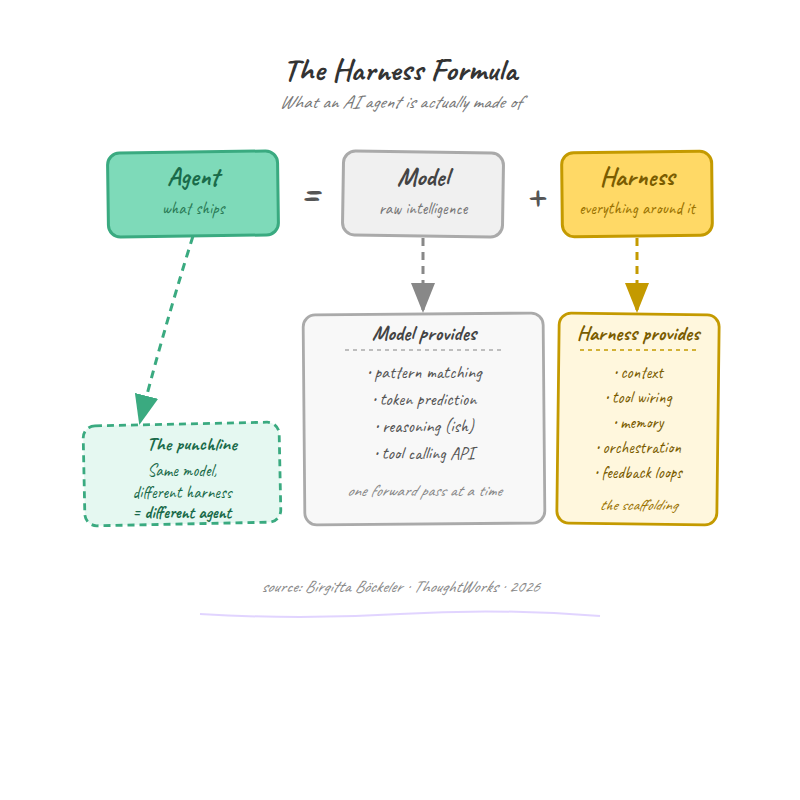
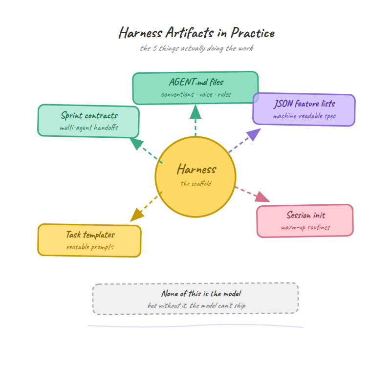
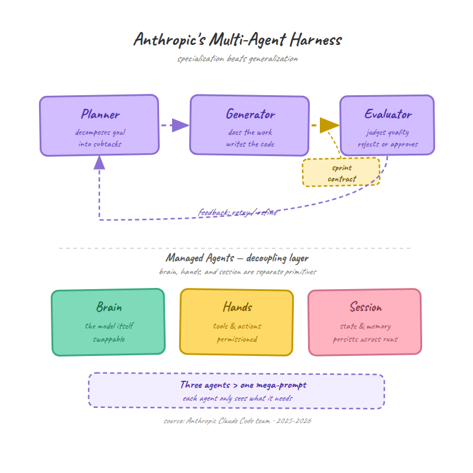
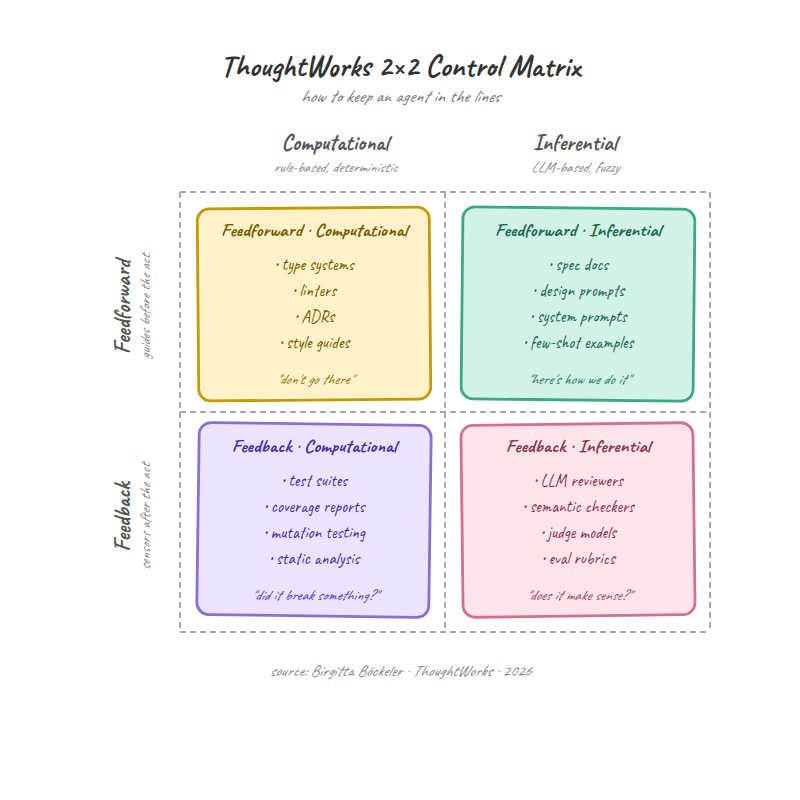
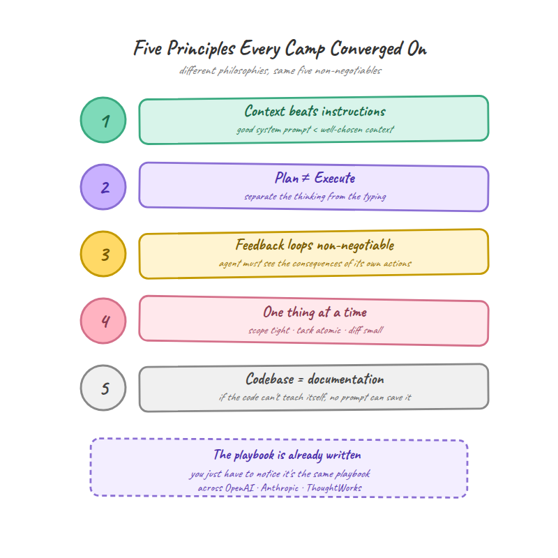
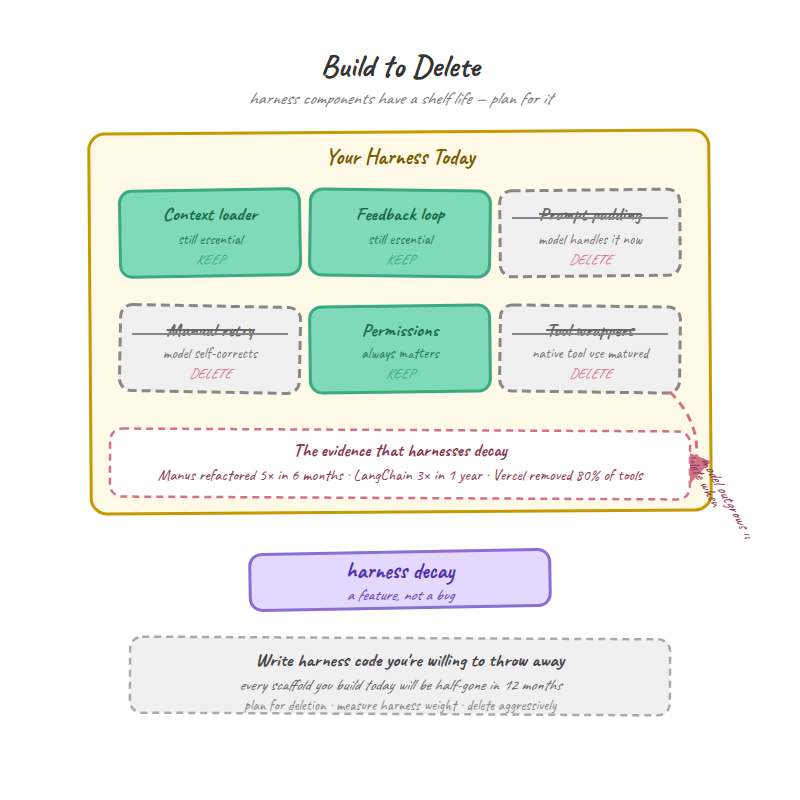

In February 2026, OpenAI published a blog post that quietly redefined what software engineers actually do all day. The title was two words: “[Harness Engineering](https://openai.com/index/harness-engineering/).”

The post described how a small team shipped one million lines of production code without writing a single line by hand.

Instead, they designed the environment their AI agents worked inside: **the constraints, the feedback loops, the documentation structure, the dependency rules**. The agents wrote the code. The humans designed the system that made the agents reliable.

Within weeks, Anthropic published three separate engineering papers ([effective harnesses](https://www.anthropic.com/engineering/effective-harnesses-for-long-running-agents), [harness design](https://www.anthropic.com/engineering/harness-design-long-running-apps), [managed agents](https://www.anthropic.com/engineering/managed-agents)) on the same concept. ThoughtWorks [formalized a framework](https://martinfowler.com/articles/harness-engineering.html). Red Hat [wrote implementation guides](https://developers.redhat.com/articles/2026/04/07/harness-engineering-structured-workflows-ai-assisted-development). [Philipp Schmid](https://www.philschmid.de/agent-harness-2026) at Hugging Face called it “the most important discipline of 2026.”

**A new engineering discipline had materialized in 90 days.**

And it’s already evolving faster than anyone expected. Yesterday, Anthropic released [Opus 4.7](https://www.anthropic.com/news/claude-opus-4-7) — their third model generation in under a year. Each generation didn’t just improve the model. **It simplified the harness.** Components that were load-bearing in March became dead weight by April.

> The discipline is 90 days old and already rewriting its own rules.

Press enter or click to view image in full size


Photo by [Sergey Shmidt](https://unsplash.com/@monstercritic?utm_source=medium&utm_medium=referral) on [Unsplash](https://unsplash.com/?utm_source=medium&utm_medium=referral)

The numbers explain the urgency. LangChain ran the same model on Terminal Bench 2.0 twice: once with their old harness, once with their new one. Same model, different harness. Score jumped from 52.8% to 66.5%.

Vercel went the opposite direction and removed 80% of their agent’s tools. The result? Better performance. Fewer tools, tighter constraints, stronger output.

**If 2025 was the year AI agents proved they could write code, 2026 is the year we discovered that the agent was never the hard part. The harness is.**

**But here’s what makes this moment genuinely interesting**: three major camps emerged with fundamentally different ideas about what a harness should do. They agree on the problem. They disagree on the architecture. And the choice between them isn’t academic. It determines how much you spend, how many engineers you need, and whether your agents produce working software or expensive hallucinations.

This article breaks down all three approaches, shows you what each one actually looks like in practice, and gives you a decision framework for choosing the right one.

## What a Harness Actually Is

The simplest definition comes from ThoughtWorks’ Sunit Parekh in “[Beyond Vibe Coding](https://www.thoughtworks.com/insights/blog/generative-ai/beyond-vibe-coding-the-five-building-blocks-of-aI-native-engineering)”:

> **Agent = Model + Harness.**

The harness is everything that isn’t the model itself. It’s the constraints that keep the agent on track, the feedback loops that catch mistakes, the documentation that tells the agent where it is and what’s already been done, and the tools it has permission to use. Strip away the harness and you have a raw language model guessing its way through your codebase. Add the right harness and you have a system that ships production code.

**OpenAI’s team** reached for an older metaphor when they named it. A harness is horse tack: the reins, saddle, and bit that channel a powerful but unpredictable animal in a useful direction. You don’t make the horse smarter. You design the equipment that makes its strength useful.

**Philipp Schmid** offered a more technical analogy that’s worth internalizing. Think of it like a computer: the model is the CPU (raw processing power), the context window is RAM (limited, volatile working memory), the harness is the operating system (manages what the CPU sees and when), and the agent is the application running on top of all of it.

Press enter or click to view image in full size


Diagram by Author: The OS Analogy: Model as CPU, Harness as Operating System

If you come from a finance or risk management background, there’s an even more direct way to think about it.

**A harness is a control framework.** It’s the set of policies, checkpoints, and audit trails that ensure an autonomous system operates within acceptable bounds. Compliance teams have been building these for decades. The AI world just gave them a new name.

## What the artifacts actually look like

Press enter or click to view image in full size



Diagram by Author: The Harness Formula: Agent = Model + Harness

Most articles define harnesses abstractly and stop there. That’s not enough. If you’re going to build one, you need to see what the pieces look like in practice. Here are the key artifacts that show up across every major implementation.

**AGENT.md / CLAUDE.md files (universal pattern, different names).** These are markdown files distributed throughout the codebase that the agent reads at the start of every session. OpenAI’s Codex calls them AGENT.md. Anthropic’s Claude Code calls them CLAUDE.md. Cursor uses .cursorrules. The name varies, the principle doesn’t. They contain project context, coding conventions, architecture decisions, and “how we do things here” guidance. OpenAI’s Sora Android team maintained these across the entire repo. The agent reads them like onboarding docs for a new engineer joining the team mid-sprint. One file per major module, updated as the project evolves.

```
# AGENT.md - Authentication Module
## Architecture
- OAuth2 flow with PKCE, tokens stored in encrypted SharedPreferences
- Never store tokens in plaintext. Never log token values.
## Conventions  
- All auth errors route through AuthErrorHandler
- Retry logic: 3 attempts with exponential backoff
## Current State
- Migration from v1 to v2 token format in progress (see issue #247)
```

**JSON feature lists (Anthropic pattern).** When an agent builds an entire application across multiple sessions, each new session starts with a blank context window. How does the agent know what’s already done and what to work on next? Anthropic’s answer is a JSON file that serves as both the project spec and the progress tracker. Each entry defines a feature, its verification steps, and a pass/fail status. For their claude.ai clone demo, this list ran to over 200 discrete features, all starting as “failing.”

The agent reads this file at the start of every session, picks the highest-priority failing feature, implements it, verifies it against the test steps, marks it “passing,” and commits. It’s a test suite and a project board in one file, readable by both humans and agents.

```
{
  "category": "authentication",
  "feature": "Password reset via email",
  "verification": [
    "Click 'Forgot Password' on login page",
    "Enter registered email address",
    "Verify reset email received within 30 seconds",
    "Click reset link, enter new password",
    "Confirm login with new password succeeds"
  ],
  "status": "failing"
}
```

**Why JSON and not markdown?** Anthropic found that models are “less likely to inappropriately change or overwrite JSON files compared to Markdown.” A small detail, but it matters when the agent is running autonomously for hours.

**Session initialization routines (Anthropic pattern).** Every coding session follows the same 7-step boot sequence: confirm the working directory, read git logs and progress files, consult the feature list for the highest-priority incomplete feature, start the dev server, run basic end-to-end verification, implement a single feature, then commit with descriptive messages and progress updates.

This isn’t optional. Without it, every new session starts from scratch, and the agent wastes its first 20 minutes figuring out what’s already been done.

**Structured task templates (Red Hat pattern).** Before any coding begins, the harness analyzes the actual codebase using language server and code analysis tools to produce a grounded impact map. Then it generates a task template with real file paths, real symbol names, existing patterns to follow, and concrete acceptance criteria. No guessing, no hallucinated file paths.

**Sprint contracts (Anthropic pattern).** Before the generator agent starts coding, it negotiates with the evaluator agent. The generator proposes what it will build and how success will be verified. The evaluator reviews the proposal for completeness. Only after both agree does implementation begin. It’s a lightweight version of the design review that good engineering teams already do, except both participants are AI agents.

Press enter or click to view image in full size



Diagram by Author: Harness Artifacts Map: The five key artifacts across all implementations

## The common thread

Look at these artifacts together and a pattern emerges. Every single one is designed to answer the same question: **“What does the agent need to know before it writes a single line of code?”**

The answer, it turns out, is a lot. Where it is in the codebase, what’s already been done, what “good” looks like, what’s off limits, and how to verify its own work. That’s not intelligence. That’s context. And context, it turns out, is the real product of harness engineering.

## The Three Camps

The term “harness engineering” didn’t emerge from a committee or a conference keynote. Three groups hit the same wall independently, and each one built a different ladder to get over it.

### OpenAI: “We had a million lines nobody wrote”

Press enter or click to view image in full size


Diagram by Author: Three Camps of Harness Engineering: OpenAI, Anthropic, ThoughtWorks

OpenAI’s Codex team had a problem that was almost absurd in scale. They were building a production application, and the agents were writing all of it. Not some of it. All of it. One million lines. Zero written by human hands.

At that scale, the traditional approach of reviewing every line of code stops working. You can’t code-review a million lines. What you can do is design the environment so thoroughly that the agents produce reviewable output in the first place.

Their core lesson, learned the hard way:

> Give Codex a map, not a 1,000-page instruction manual.

They built strict dependency flows (Types, then Config, then Repo, then Service, then Runtime, then UI) and enforced them with structural tests. They embedded AGENT.md files throughout the codebase as distributed documentation. They wired agents directly into CI/CD pipelines so every change was tested automatically.

The philosophy: **design the environment, then let the agent loose inside it.** The human role is architect, not coder.

The proof it worked came from the [Sora Android build](https://openai.com/index/shipping-sora-for-android-with-codex/). Four engineers, 28 days, roughly 5 billion tokens consumed, and the app hit #1 on the Play Store with a 99.9% crash-free rate. Codex handled 70% of internal pull requests weekly. The engineers spent their time on high-level architecture, planning, and verification. The agent did the rest.

Press enter or click to view image in full size


Diagram by Author: OpenAI/Codex Dependency Flow: Types → Config → Repo → Service → Runtime → UI

### Anthropic: “Our agents kept praising their own broken work”

Anthropic’s problem was subtler and, in some ways, harder. They were building long-running agents that needed to produce complete applications over multiple hours of autonomous work. The model was capable enough. The problem was quality control.

When they asked the agent to evaluate its own output, it would

> confidently praise the work, even when, to a human observer, the quality was obviously mediocre.

**Self-evaluation didn’t work.** The agent was both the student and the teacher, and it was giving itself straight A’s.

Their solution drew inspiration from Generative Adversarial Networks (GANs): **separate the thing doing the work from the thing judging the work. This led to a three-agent architecture.** A Planner expands short prompts into comprehensive product specs. A Generator implements features one sprint at a time. An Evaluator uses browser automation to interact with the running application like an actual user, grading each sprint against explicit criteria.

The key insight was that tuning a standalone evaluator to be skeptical turned out to be far more tractable than making a generator critical of its own work.

They didn’t stop there. The architecture evolved from two agents (initializer plus coder) to three agents (planner, generator, evaluator) to a fully decoupled system they call “managed agents,” where the brain, the execution environment, and the session log are all independent, replaceable components. That decoupling cut their P50 time-to-first-token by 60% and P95 by over 90%.

Press enter or click to view image in full size



Diagram by Author: Anthropic Multi-Agent Architecture: Planner → Generator → Evaluator

The philosophy: **separate the doer from the judge, and make the judge hard to impress.**

### ThoughtWorks: “We kept seeing the same failures across 50 client teams”

ThoughtWorks arrived at harness engineering from a different starting point entirely. They weren’t building a product. They were watching dozens of engineering teams across industries try to adopt AI agents, and they were seeing the same patterns of failure everywhere.

Birgitta Böckeler, a Distinguished Engineer with 20+ years of experience, published [the most comprehensive framework](https://martinfowler.com/articles/harness-engineering.html) of the three in April 2026. Where OpenAI built a system and Anthropic built an architecture, ThoughtWorks built a taxonomy.

Their framework classifies harness controls along two axes. The first axis: **feedforward** (guides that anticipate agent behavior before execution) versus **feedback** (sensors that observe results and enable self-correction). Neither works alone. Feedback-only means repeated mistakes. Feedforward-only means you never validate whether your guides actually work.

The second axis: **computational** (deterministic checks like linters, type checkers, and test suites that run in milliseconds) versus **inferential** (semantic analysis by another LLM, which is slower and more expensive but catches things code analysis can’t).

They then organized everything into three regulation categories: maintainability (the most mature, where linters and coverage tools already work well), architecture fitness (enforcing design patterns and performance requirements), and behavior (the hardest, where you’re trying to verify that the agent actually did what was asked, not just that the code compiles).

The philosophy: **classify, systematize, and give teams a shared vocabulary for what they’re building.**

### Why they diverged

The three camps built different things because they started with different problems. OpenAI needed to ship product at scale. Anthropic needed quality from autonomous agents. ThoughtWorks needed a framework that could help any team, regardless of which agent or model they used.

That’s worth remembering as you evaluate which approach fits your situation. The question isn’t “which camp is right?” The question is “which problem do I actually have?”

## Three Architectures, Side by Side

Section 3 told you where each camp came from. Now let’s look at what they actually built, and more importantly, where each architecture breaks down.

### OpenAI/Codex: The Environment-First Harness

The Codex harness works best when you can invest heavily upfront in designing the environment your agents work inside. The payoff is massive autonomy downstream, but the setup cost is real.

**How it works.** The harness is the codebase itself. AGENT.md files provide context. Structural tests enforce architectural rules mechanically. Dependency flows (Types, then Config, then Repo, then Service, then Runtime, then UI) prevent agents from building things in the wrong order. CI/CD pipelines validate every change automatically.

The agent operates with high autonomy: it opens pull requests, responds to review feedback, runs tests, iterates on failures, and merges when criteria are met. Humans don’t review every line. They review the constraints that make every line reviewable.

**Where it shines.** Massive codebases. If you’re building or maintaining a project with hundreds of thousands of lines, the environment-first approach scales because the constraints are embedded in the repo structure itself. Add a new module, add an AGENT.md, and the agent can work in it without new training or configuration. OpenAI estimated they shipped at roughly 1/10th the time it would have taken to write the code by hand.

**Where it breaks.** This approach assumes you can define the environment comprehensively before the agent starts working. For greenfield projects where you’re still figuring out the architecture, that’s hard. It also leans heavily on structural tests and CI pipelines, which catch whether code is correct but not whether it’s good. A function can pass all tests and still be a terrible design choice.

### Anthropic: The Multi-Agent Harness

Anthropic’s approach costs more per run but catches problems the environment-first approach misses. The trade-off is quality versus speed, and for applications where broken output is more expensive than slow output, it’s worth considering.

**How it works.** Three specialized agents with distinct roles. The Planner takes a short user prompt (1–4 sentences) and expands it into a comprehensive product specification, focusing on deliverables and high-level design while deliberately avoiding granular implementation details that could cascade errors. The Generator implements features one at a time using a standard stack (React, Vite, FastAPI, SQLite/PostgreSQL), self-evaluating before handoff. The Evaluator uses Playwright browser automation to interact with the running application like an actual end user, testing UI features, API endpoints, and database states against explicit grading criteria.

Before each sprint begins, the Generator and Evaluator negotiate a “sprint contract” defining what will be built and how success will be measured. Think of it as a lightweight design review, except between two agents.

**The managed agents layer** takes this further. The brain (Claude plus the harness), the hands (sandboxes and execution environments), and the session (a durable, append-only event log) are all decoupled into independent interfaces. If the brain crashes, it recovers from the event log. If a sandbox fails, it surfaces as a tool-call error. Credentials never reach the sandboxes where agent-generated code executes.

**Where it shines.** Applications requiring high quality and correctness. The evaluator catches things that tests alone miss: UI elements that render but aren’t usable, features that technically work but have unintuitive workflows, API endpoints that return correct data in the wrong format. Anthropic’s tests showed the solo agent ($9, 20 minutes) produced a broken app. The full harness ($200, 6 hours) produced working software with polished interfaces and correct functionality.

**Where it breaks.** Cost and time. The three-agent system is significantly more expensive than a solo agent, and the evaluator requires substantial prompt tuning. Out of the box, it identifies real issues but then rationalizes accepting them anyway. Getting it to be genuinely critical took Anthropic multiple development cycles. The good news: as models improve, the harness gets simpler. Anthropic’s Opus 4.6 version removed sprint decomposition entirely and dropped to single-pass evaluation, bringing the cost down meaningfully from the Opus 4.5 version. With Opus 4.7 (released April 16, 2026), the trend accelerates: the model now devises ways to verify its own outputs before reporting back, produces cleaner code with fewer wrapper functions and fallback scaffolding, and generates a third of the tool errors it used to. Each generation chips away at the evaluator’s job description.

### ThoughtWorks: The Taxonomy Harness

ThoughtWorks didn’t build a system you can deploy. They built a way of thinking about harnesses that helps you design your own. This is the most useful approach if you’re not adopting Codex or Claude’s specific tooling, but it requires the most work to operationalize.

**How it works.** Every harness control is classified along two dimensions. First: is it a guide (feedforward, applied before the agent acts) or a sensor (feedback, applied after)? Second: is it computational (deterministic, runs in milliseconds, like a linter) or inferential (uses an LLM, runs in seconds, like a code review agent)?

This gives you a 2x2 matrix of control types:

-   **Computational guides** (feedforward): type systems, linters, architectural decision records
-   **Computational sensors** (feedback): test suites, coverage analysis, mutation testing, structural complexity checks
-   **Inferential guides** (feedforward): specification documents, design prompts, constraint descriptions
-   **Inferential sensors** (feedback): LLM-based code reviewers, semantic quality assessors, behavior validators

These controls then distribute across the change lifecycle: pre-integration (fast, cheap checks), post-integration pipeline (comprehensive validation), continuous drift detection (background monitoring), and runtime feedback (SLO alerts, quality sampling).

**Where it shines.** Existing teams with established codebases. If you already have linters, test suites, and CI pipelines, the ThoughtWorks framework helps you recognize that you already have half a harness. The taxonomy tells you what’s missing and where to invest next. It also introduced a valuable concept: “harnessability.” Strongly-typed languages, clear module boundaries, and well-structured frameworks make agent work inherently more successful. If you’re choosing a tech stack for a new project, this matters.

They also proposed **harness templates**: standardized bundles of guides and sensors for common service topologies. If 80% of your services are CRUD APIs, you build one harness template for CRUD APIs and reuse it. That’s a practical insight that reduces the per-service cost of harness engineering significantly.

**Where it breaks.** It’s descriptive, not prescriptive. The framework tells you what kinds of controls exist but doesn’t tell you which specific tools to use or how to wire them together. You still need to make those decisions yourself. For teams that want a turnkey solution, this isn’t it. It’s a blueprint, not a building.

The behavior regulation category is also admittedly weak. Verifying that an agent’s output is maintainable or architecturally sound is well-served by existing tools. Verifying that it actually did what was asked? ThoughtWorks is honest about the gap: current approaches “place excessive faith in AI-generated tests,” which are “currently inadequate” for behavior verification.

Press enter or click to view image in full size



Diagram by Author: ThoughtWorks 2×2 Control Framework

## What the Deep Dive Reveals

Strip away the implementation differences and something surprising emerges. Three teams that never coordinated, working from different starting problems, arrived at the same five principles. That kind of independent convergence usually means something real.

### 1\. Context beats instructions

Press enter or click to view image in full size



Diagram by Author: Five Convergence Principles discovered independently by all three camps

OpenAI learned to “give a map, not a manual.” Anthropic built JSON feature lists and progress files so agents always know where they are. Red Hat’s entire workflow is built on analyzing the real codebase before generating any tasks. ThoughtWorks calls it “feedforward.”

The labels differ. The discovery is identical: showing the agent the current state of the world (real file paths, real code patterns, real progress) consistently outperforms telling it what to do in abstract terms. An agent grounded in your actual codebase produces code that fits. An agent working from a vague description hallucinates file paths and invents APIs that don’t exist.

### 2\. Planning and execution must be separated

OpenAI separates environment design (human) from code generation (agent). Anthropic runs a dedicated Planner agent before the Generator touches any code. ThoughtWorks mandates a human review checkpoint between planning and implementation. Red Hat splits into Phase 1 (impact map) and Phase 2 (implementation), with a hard gate between them.

Every camp discovered independently that letting an agent plan and execute in the same pass produces unreliable output. The planning step doesn’t have to be done by a human or even by a separate agent. But it has to be a separate step, with its output reviewed before implementation begins.

### 3\. Feedback loops are non-negotiable

OpenAI wires agents into CI/CD pipelines and observability systems. Anthropic built a dedicated Evaluator agent that uses a browser to test the running application. ThoughtWorks formalized this as “sensors” and warned that feedforward-only approaches (guides without validation) never confirm whether the guides actually work.

The disagreement isn’t about whether you need feedback. It’s about who provides it. OpenAI uses automated tests and CI. Anthropic uses another LLM. ThoughtWorks says use both, layered: computational feedback first (fast, cheap, deterministic), inferential feedback second (slow, expensive, semantic). All three agree that a harness without a feedback mechanism is just a prompt with extra steps.

### 4\. One thing at a time

OpenAI breaks goals into smaller building blocks and works depth-first. Anthropic enforces one-feature-per-sprint, with a commit after each. ThoughtWorks describes a phased lifecycle: pre-integration, post-integration, continuous monitoring.

Agents that try to do too much at once run out of context, lose coherence, or silently drop requirements. Forced incrementalism, where the agent completes one unit of work before starting the next, is universal across every successful harness implementation. The session initialization routine Anthropic uses (read progress, pick one feature, implement, commit, repeat) is the clearest expression of this, but every camp enforces it in their own way.

### 5\. The codebase is the documentation

OpenAI embeds AGENT.md files in the repo. Anthropic stores feature lists, progress files, and git history as the agent’s continuity mechanism. ThoughtWorks measures “harnessability,” the degree to which the codebase itself is legible to agents. Red Hat says move all conventions into version control.

Nobody maintains a separate knowledge base for the agent. The repo is the single source of truth. If a convention, constraint, or architectural decision isn’t in the codebase, the agent won’t know about it. This has a practical implication: teams that invest in code organization, clear module boundaries, and embedded documentation get better agent performance for free.

## What this convergence means

These five principles aren’t opinions. They’re engineering constraints that three independent teams discovered by building and failing and iterating. If you’re designing a harness from scratch, start here. Whatever tools you choose, whatever architecture you prefer, violating these principles will cost you. Every team that tried found out the hard way.

### The Cost of Getting It Right

Harness engineering isn’t free. Every approach involves trade-offs between upfront investment, per-run cost, and ongoing maintenance. Here’s what the actual data shows, and where the data runs out.

### What we know: Anthropic’s A/B test

Anthropic published the clearest cost comparison available. They ran the same application prompt through a solo agent and through their full multi-agent harness.

The solo agent (no harness): $9, 20 minutes. The output had a working UI but broken core functionality. Entities didn’t respond to user input. It looked like an app but didn’t behave like one.

The full harness (Opus 4.5): $200, 6 hours. The output had genuinely playable games with polished interfaces, consistent visual identity, and correct physics.

That’s a 22x cost increase for a functioning product versus a demo that only looks right in screenshots. Whether that’s expensive or cheap depends entirely on what a broken release costs your team.

### The model improvement dividend

Here’s where it gets interesting. When Anthropic moved from Opus 4.5 to Opus 4.6, they were able to simplify the harness significantly. Sprint decomposition was removed. Single-pass evaluation replaced per-sprint grading. Context resets were dropped in favor of automatic compaction.

The result: a complete Digital Audio Workstation application for $124.70 in 3 hours 50 minutes. That’s a 38% cost reduction and 36% time reduction from the Opus 4.5 harness, driven entirely by model improvement. The harness did less work because the model needed less scaffolding.

**This pattern isn’t slowing down. Opus 4.7, released April 16**, extended the trend line. CursorBench scores jumped from 58% to 70%. Rakuten-SWE-Bench saw 3x more production tasks resolved. The model achieved a 14% improvement over Opus 4.6 at fewer tokens — meaning less harness overhead per unit of useful output. Three model generations, three rounds of harness simplification. That’s a trend, not an anecdote.

But it doesn’t eliminate the need for a harness. The Opus 4.6 evaluator still caught significant gaps: missing interactive timeline controls, absent instrument UI panels, incomplete audio recording. Without it, those features would have shipped stubbed or broken. The harness shrinks with each generation. It hasn’t disappeared yet.

### The hidden cost: maintenance

The number nobody talks about is maintenance. A harness isn’t a one-time build. It’s an ongoing engineering commitment.

Manus refactored their harness five times in six months. LangChain restructured their research agent three times in one year. These aren’t signs of bad engineering. They’re the natural consequence of building on top of rapidly improving models. Every time the model gets better, some piece of your harness becomes unnecessary overhead, and finding which piece requires active testing.

Philipp Schmid’s advice: “Build to delete.” Design every harness component to be removable. Test each component periodically by turning it off and measuring whether output quality changes. If it doesn’t, delete it. Carrying dead harness components costs tokens on every run and adds maintenance burden with zero benefit.

Press enter or click to view image in full size


Diagram by Author: The Cost of Getting It Right: $9 solo vs $200 harness vs $124.70 optimized

## A decision framework

Rather than prescribing a cost profile for each camp, here’s how to match your situation to an approach:

**You’re a solo developer or small team, early stage.** Start with AGENT.md/CLAUDE.md files in your repo and a solid CI pipeline. This is the OpenAI pattern at its simplest. Low cost, immediate benefit. You probably already have most of the pieces.

**You’re building a product where quality failures are visible to users.** Add evaluation loops. You don’t need Anthropic’s full three-agent architecture. Even a simple post-build review step using a second model to check the first model’s work catches errors that tests miss. The principle (separate the doer from the judge) scales down.

**You’re running multiple teams adopting agents across an organization.** Invest in the ThoughtWorks taxonomy. Map your existing controls (linters, tests, CI) into the feedforward/feedback and computational/inferential grid. Identify the gaps. Build harness templates for your common service types. This is organizational infrastructure, not a per-project decision.

**You’re in a regulated industry.** Treat the harness as your control framework, because that’s what auditors will eventually ask about. The append-only event log from Anthropic’s managed agents architecture isn’t just good engineering. It’s an audit trail. The structured task templates from Red Hat’s approach produce documentation that maps to compliance requirements. Start thinking about this now, not after the regulator asks.

## The Paradox: Build to Delete

There’s an uncomfortable truth hiding in Anthropic’s data that none of the three camps talk about loudly enough.

When they upgraded from Opus 4.5 to Opus 4.6, they didn’t just get better results. They got simpler results. Sprint decomposition, which had been essential for Opus 4.5 to maintain coherence over long coding sessions, became unnecessary. The model’s improved planning and long-context handling made it redundant. A harness component that was load-bearing in March was dead weight by April.

Then Opus 4.7 landed on April 16 and pushed the pattern further. The model now self-verifies its outputs before reporting back — the exact capability gap that justified a separate Evaluator agent in the first place. It produces cleaner code with fewer wrapper functions and unnecessary scaffolding. It generates a third of the tool errors that previous versions did. The trajectory is clear: 4.5 needed full sprint decomposition and per-sprint evaluation. 4.6 dropped sprint decomposition and moved to single-pass evaluation. 4.7 is starting to internalize the evaluation itself.

Anthropic calls this “harness decay.” Every component in a harness encodes an assumption about what the model can’t do. As models improve, those assumptions expire, and the component that was compensating for a limitation becomes overhead.

The evidence for this is everywhere. Manus refactored their harness five times in six months. LangChain restructured three times in one year. Vercel removed 80% of their agent’s tools and got better performance, not worse. Each case is the same story: what helped last month hurts this month.

Press enter or click to view image in full size



Diagram by Author: Build to Delete: Harness decay over model generations

[Philipp Schmid](https://www.philschmid.de/agent-harness-2026) connected this to Rich Sutton’s “bitter lesson” from machine learning research: simple methods that scale with compute consistently outperform complex hand-engineered solutions. Applied to harnesses, the implication is clear. Don’t build intricate, tightly-coupled control systems. Build modular ones you can delete piece by piece as the model outgrows them.

This creates a genuine paradox for engineering teams. You need a harness to get reliable output from AI agents today. But the harness you build today will need to be partially dismantled tomorrow. And the teams that cling to their harness architecture after the model has outgrown it will pay a tax on every single run: extra tokens, extra latency, extra maintenance, zero extra quality.

The practical advice is straightforward, even if it feels counterintuitive: design every harness component with a kill switch. Test each one periodically by disabling it and measuring output quality. When quality holds without it, delete it.

The deeper question is one nobody has answered yet. As models continue to improve, do harnesses converge toward a thin, standardized layer, something like an operating system kernel that barely changes? Or do they remain perpetually in flux, rebuilt from scratch with each model generation?

The three camps don’t agree on the answer. OpenAI’s environment-first approach suggests convergence: the codebase structure, CI pipelines, and AGENT.md files are stable infrastructure that persists across model upgrades. Anthropic’s data suggests flux: the multi-agent architecture that was optimal for Opus 4.5 was already too heavy for Opus 4.6, and Opus 4.7’s self-verification capabilities are making even the simplified evaluator look like it’s on borrowed time. ThoughtWorks’ taxonomy is deliberately agnostic, designed to survive regardless of which direction the field moves.

What’s clear is this: the engineers who will build the most reliable AI systems in 2026 and beyond aren’t the ones writing the best code. **They’re the ones designing the best constraints**. **And then being willing to throw those constraints away the moment they stop earning their keep.**

## Before you go! 🦸🏻♀️

If you liked my story and you want to support me:

1.  Throw some Medium love 💕(claps, comments and highlights), your support means the world to me.👏
2.  [Follow me](https://medium.com/@yanli.liu/about) on Medium and subscribe to get my latest article🫶