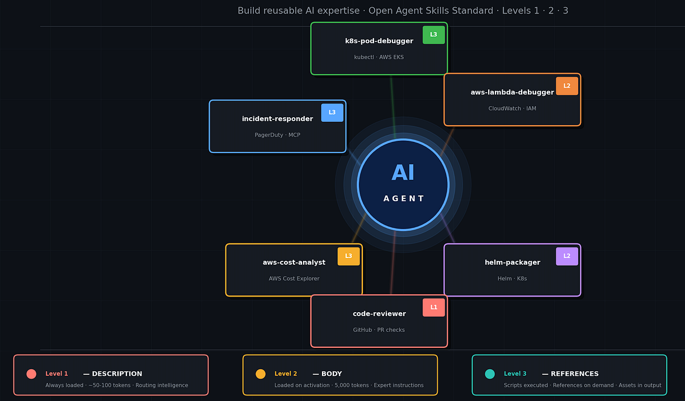
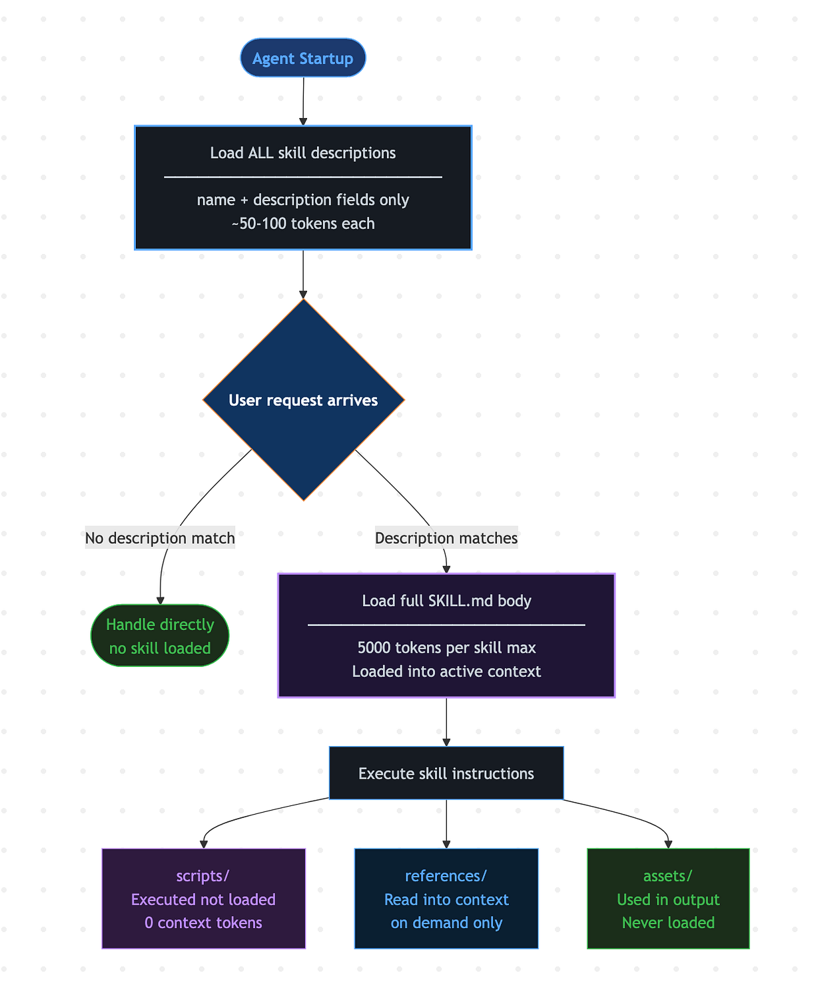
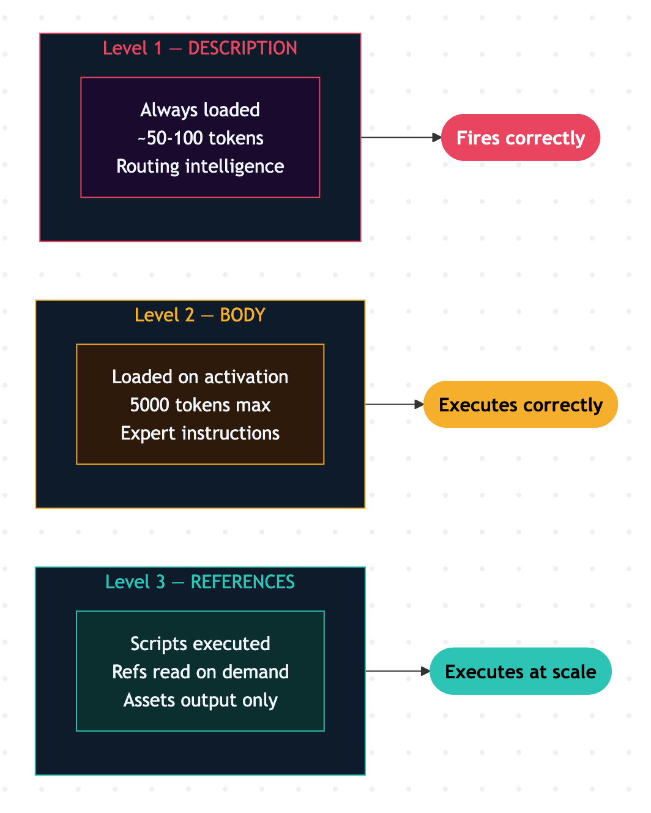

AI agents are only as capable as the instructions they carry. You can give an agent access to every tool in the world, but without structured, reusable knowledge about **_how_** to use those tools in specific contexts, you end up re-prompting the same patterns over and over — in system prompts, in CLAUDE.md files, in Copilot instructions, in LangChain agent configs.

Agent skills solve this. They are the emerging standard for packaging reusable intelligence into shareable, portable, and composable units — the “npm packages” of the agentic world.

**This guide covers:**

1.  **What Are Agent Skills?**
2.  **The Format of a Skill**
3.  **Level 1: The Skill Description**
4.  **Level 2: The Skill Body**
5.  **Level 3: Scripts, Assets, and References**
6.  **Evals: Validating and Testing Skills**
7.  **Security in Agent Skills**
8.  **Antrhopic’s The \`skill-creator\` Skill**

Throughout this guide, one example runs end-to-end: a **Kubernetes Pod Failure Debugger** skill — a real-world skill any platform engineering team would want, and a perfect illustration of all three skill-building levels.

## **1\. What Are Agent Skills?**

An **agent skill** is a structured, self-contained instruction set that tells an AI agent **_when_** to activate and **_how_** to perform a specific task. Think of a skill as a micro-expertise module — a reusable capsule of knowledge that an agent can load and apply without needing it baked into its system prompt.

**The Problem Skills Solve

**Modern AI agents are capable generalists — they write code, analyze data, and reason through complex problems. But they lack:

-   Your company’s internal Kubernetes cluster topology and naming conventions
-   Your organization’s AWS account structure and tagging policies
-   Domain-specific runbooks and escalation procedures
-   Procedural expertise for specialized platform tasks

Without skills, every session becomes a tedious process of re-explaining context that should persist. Skills solve this by packaging that context as a portable, reusable module.

> _\> If a system prompt is a résumé (generic background), a skill is a certification — specific, proven expertise for a defined task._

**How Skills Work: Progressive Disclosure

**Skills use a **progressive disclosure** model that keeps agent context lean while providing deep expertise on demand:

Press enter or click to view image in full size



**SKILL LOADING LIFECYCLE**

Skills should be built on the [**Open Agent Skills Standard**](https://agentskills.io/home) , ensuring interoperability across platforms.

## **2\. Format of Skills**

A skill is a **folder** containing instructions, scripts, and resources that agents discover and load dynamically.

> **Minimal Structure:
> 
> **k8s-pod-debugger/
> 
> └── SKILL.md. # Required: instructions + metadata

**Full Structure**

```
k8s-pod-debugger/
├── SKILL.md          # Required: instructions + metadata
├── scripts/          # Optional: executable code (run, not loaded)
├── references/       # Optional: documentation (loaded on demand)
└── assets/           # Optional: templates, output resources (never loaded)
```

### **The SKILL.md File**

The _\`SKILL.md\`_ file is the heart of every skill.

It has two parts:

-   **YAML formatter block**

**Required Fields for YAML Formatter :**

```
| Field         | Rules                                                   |
|---------------|---------------------------------------------------------|
| `name`        | Lowercase letters, numbers, hyphens only. Max 64 characters. |
| `description` | When and why to use this skill. Max 1024 characters. This is the trigger. |
```

**Optional Fields for YAML Formatter:**

```
| Field     | Purpose                                           |
|-----------|---------------------------------------------------|
| `version` | Semantic versioning for lifecycle management      |
| `author`  | Owner or team for accountability                  |
| `tags`    | Searchable categories for skill registries        |
| `tools`   | Pre-approved tools (enforced in enterprise runtimes) |
| `license` | License applied to the skill                      |
| `compatibility` | Environment requirements                    |
| `metadata`| Arbitrary key-value pairs for custom properties   |
```

-   **Markdown body:**

The markdown body contains the actual instructions. Effective skills typically include:

-   Step-by-step procedures
-   Examples of inputs and outputs
-   Common edge cases
-   References to bundled resources

### **The 15,000 Token Budget**

The total context allocated to loaded skills is designed to stay under ~15,000 tokens to leave sufficient room for conversation history, tool outputs, and reasoning. This shapes every decision in skill design:

```
| Component      | Token Budget                | Loaded When                    |
|----------------|-----------------------------|--------------------------------|
| `description`  | ≤ 1,024 chars (~250 tokens) | Always — at agent startup      |
| `SKILL.md` body| ≤ 5,000 tokens              | On activation — when description matches |
| `references/` files | Variable, on demand    | When skill body explicitly requests them |
| `scripts/`     |Not loaded — executed        | When skill body calls them     |
| `assets/`      | Never loaded into context   | Used in output only            |
```

> With a 15k budget and ~5k per skill body, you can have **three skills active simultaneously** before hitting budget pressure. This is why lean skill bodies and on-demand references are not just best practice — they are architectural constraints.

## **The Three-Level Mental Model**

The craft of skill-writing is layered:

1.  **Level 1 — Description**: the trigger mechanism — always loaded, determines correct activation
2.  **Level 2 — Body**: the instructions — loaded on activation, guides expert execution
3.  **Level 3 — Resources**: loaded on demand, provides depth and automation at scale

Press enter or click to view image in full size



## **3\. _Level 1_: The Skill Description**

The description is the **_routing intelligence_** of your skill. It is the text the agent reads to decide: **“Should I activate this skill right now?”** It is always loaded at startup and costs ~50–100 tokens — a small price for the enormous leverage of correct activation.

If your description is vague, the skill fires in the wrong contexts. If it is too narrow, the skill never fires when you need it. Getting descriptions right is the single most impactful thing you can do to improve skill quality.

**How Skill Triggering Works**

```
User says: "My pod is stuck in CrashLoopBackOff on the prod cluster"
                          │
                          ▼
        Agent scans all loaded descriptions
                          │
          ┌───────────────┼───────────────┐
          ▼               ▼               ▼
    k8s-pod-debugger  aws-cost-analyst  helm-packager
    description       description       description
          │               │               │
        MATCH           no match        no match
          │
          ▼
   Load k8s-pod-debugger SKILL.md body → Execute
```

**Poor Description Quality:**

```
description: Helps debug Kubernetes issues.
```

**The TRIGGER / DO NOT TRIGGER Pattern**

The most effective description format is the explicit trigger pattern. It tells the agent exactly when to activate _and_ when not to — preventing the most common failure mode: over-activation.

```
description: |
  Diagnoses Kubernetes pod failures including CrashLoopBackOff, OOMKilled,
  ImagePullBackOff, and pending pod states on any Kubernetes cluster.
  TRIGGER when: the user reports pods not starting, containers crashing,
    kubectl describe showing error events, deployment rollouts stuck, or
    asks to investigate why a workload is failing in Kubernetes.
  DO NOT TRIGGER when: the user is asking about Helm chart syntax, Customize
    overlays, Terraform EKS module configuration, or container failures on
    Docker Compose or ECS (non-Kubernetes runtimes).
```

**Why Negative Triggers Matter as Much as Positive Ones**

Without explicit _\`_**_DO NOT TRIGGER_**_\`_ conditions, agents over-activate skills. A skill for “Kubernetes debugging” might activate for any container question, even simple Docker Compose questions that need no special Kubernetes handling. Negative triggers create clean boundaries between related skills and prevent noisy, costly invocations.

### **Description Optimization Checklist**

```
- [ ] One sentence summary of the skill's purpose
- [ ] At least 2–3 concrete TRIGGER conditions using specific technical terms users will actually say or type
- [ ] At least 1–2 DO NOT TRIGGER conditions covering the most common misfire scenarios
- [ ] No ambiguous verbs ("handle", "deal with") — prefer specific actions ("debug", "diagnose", "deploy", "migrate")
- [ ] Mention key error messages, CLI tools, or service names agents can pattern-match on
- [ ] Under 150 words total
```

## **4\. Level 2: The Skill Body**

The skill body is where the actual expertise lives. When a task matches a skill’s description, the agent loads the full _\`SKILL.md\`_ body into active context (≤ 5,000 tokens). This is the skill’s **“activation”** moment — and the body is everything the agent knows about executing the task.

A well-written skill body transforms an agent from a generic assistant into a domain expert. It should read like an expert colleague’s runbook — specific, opinionated, and actionable.

### **Structural Template**

```
---
name: k8s-pod-debugger
description: [What it does] + [TRIGGER when:] + [DO NOT TRIGGER when:]
---

# Kubernetes Pod Failure Debugger

## Overview
Brief context: why this task exists, what success looks like.

## Prerequisites
- kubectl configured with access to the target cluster
- Namespace and pod name, or deployment name, from the user

## Workflow

### Step 1: [First Action]
Clear instruction. Include decision branches:
- If X: do Y
- If Z: do W

### Step 2: [Next Action]
...

## Examples

### Example 1: [Common Case]
Input: ...
Expected output / behavior: ...

## Error Handling
- Common failure mode: how to recover

## Reference Files
- **scripts/collect_pod_state.sh**: [What it does, when to run it]
- **references/exit_codes.md**: [When to read it]

## Output Format
Describe what the agent should return or produce.
```

### **Writing Principles for the Body**

-   **Be specific, not general:** Instead of **“check the pod status,”** write “**run _\`kubectl describe pod \[pod-name\] -n \[namespace\]_**_\`_ and look for the _\`Last State\`_, _\`Exit Code\`_, and _\`Events\`_ sections — these three fields contain 90% of failure information.
-   **Make decisions explicit:** Agents follow instructions literally. If there are branches, state them. If the user has not provided a namespace, default to _\`default\`_ and confirm with the user before proceeding.
-   **Include anti-patterns:** Tell the agent what NOT to do. Do not delete and recreate the pod as a first step — always diagnose the root cause first, or the same failure will recur immediately.
-   **Embed domain knowledge:** This is the key differentiator. The skill should know the difference between _\`_**_CrashLoopBackOff_**_\`_ (the container is starting and crashing, check exit code and logs) and _\`_**_OOMKilled_**_\`_ (the container hit its memory limit, check _\`resources.limits.memory\`_) and handle them differently — that knowledge belongs in the body.
-   **Keep steps atomic:** Each step should produce a verifiable intermediate result. This makes skills easier to test and easier for agents to self-correct.
-   **Match freedom to fragility:** Not all steps need the same level of prescription:

```
| Freedom Level                          | When to Use                                | Example                        |
|----------------------------------------|--------------------------------------------|--------------------------------|
| **High** (text instructions)           | Multiple valid approaches exist            | General guidance               |
| **Medium** (pseudocode/parameterized)  | Preferred pattern exists, some variation OK| Templated workflows            |
| **Low** (specific scripts, exact steps)| Operations are fragile or irreversible     | Production deploys, config changes|
```

-   **Be concise:** The context window is a shared resource. Challenge each paragraph: “**_Does this justify its token cost?”_** Prefer concrete examples over verbose prose.
-   **Avoid redundancy:** Information should live in either _\`SKILL.md\`_ or reference files — not both. If it belongs in references, put a pointer in _\`SKILL.md\`_, not a copy.
-   **Don’t over-document:** Skills are for agents, not humans. Do not create _\`README.md\`_, _\`INSTALLATION\_GUIDE.md\`_, or _\`CHANGELOG.md\`_ alongside your skill. If an agent needs it, put it in _\`SKILL.md\`_. If it is for humans, it does not belong in the skill directory.

### **Example:**

```
# Kubernetes Pod Failure Debugger

## Overview
This skill diagnoses why pods are failing or not reaching Running state on
Kubernetes clusters. The four most common root causes are:
1. Application crash (CrashLoopBackOff) — check exit code and logs
2. Memory limit exceeded (OOMKilled) — check resource limits and usage
3. Image pull failure (ImagePullBackOff) — check image name and registry credentials
4. Scheduling failure (Pending) — check node resources and taints

## Steps

### Step 1: Identify the pod state
Run: `kubectl get pod [pod-name] -n [namespace]`
Check the STATUS column:
- CrashLoopBackOff → go to Step 2a
- OOMKilled → go to Step 2b
- ImagePullBackOff / ErrImagePull → go to Step 2c
- Pending → go to Step 2d
- Running but unhealthy → check readiness probe via Step 3

### Step 2a: Diagnose CrashLoopBackOff
Run: `kubectl logs [pod-name] -n [namespace] --previous`
- Inspect the last log lines before the crash for the application error
Run: `kubectl describe pod [pod-name] -n [namespace]`
- Check `Last State > Exit Code`:
  - Exit code 1: application error — share logs with the user
  - Exit code 137: OOMKilled — redirect to Step 2b
  - Exit code 139: segfault — likely a native dependency issue
  - Exit code 255: SSH/connection refused — check entrypoint command

### Step 2b: Diagnose OOMKilled
Run: `kubectl describe pod [pod-name] -n [namespace]`
Look for: `Last State: Terminated Reason: OOMKilled`
Run: `kubectl top pod [pod-name] -n [namespace]`
- Compare current memory usage to the configured limit
- Show the user the exact `resources.limits.memory` value from the pod spec
- Recommend increasing the limit by 25–50% as a starting point
- Do NOT recommend removing limits entirely — explain why this is unsafe

### Step 2c: Diagnose ImagePullBackOff
Run: `kubectl describe pod [pod-name] -n [namespace]`
Look in the Events section for the exact pull error message.
- "not found": verify the image tag exists in the registry
- "unauthorized" / "access denied": check the imagePullSecret is present
  and points to a valid Secret with correct registry credentials
- "connection refused": check network policy or VPC endpoint for ECR/GCR/ACR

### Step 3: Check readiness and liveness probes
Run: `kubectl describe pod [pod-name] -n [namespace]`
Look for: `Liveness probe failed` or `Readiness probe failed` in Events
- If failing: show the probe configuration and explain what endpoint it expects
- Do not remove probes — help the user fix them to match the actual health endpoint
```

## **5\. Level 3: Scripts, Assets, and References**

Level 3 is where skills graduate from static instructions to dynamic, executable workflows. Bundled files in _\`scripts/\`_, _\`references/\`_, and _\`assets/\`_ are loaded only when required — keeping agents fast while giving them access to deep context and reliable automation on demand.

```
┌─────────────────────────────────────────────────────────────┐
│                    LEVEL 3 ARCHITECTURE                     │
│                                                             │
│   SKILL.md body (active context, ≤5000 tokens)              │
│        │                                                    │
│        ├──── "run scripts/collect_pod_state.sh"─→ scripts/  │
│        │                                    (executed,      │
│        │                                     NOT loaded)    │
│        │                                                    │
│        ├──── "read references/exit_codes.md"──→ references/ │
│        │                                    (loaded into    │
│        │                                     context when   │
│        │                                     needed)        │
│        │                                                    │
│        └──── "use assets/incident_template.md"─→ assets/    │
│                                             (used in        │
│                                              output, never  │
│                                              loaded)        │
└─────────────────────────────────────────────────────────────┘
```

### **Scripts (**_\`scripts/\`_**)**

Executable code for tasks requiring deterministic reliability or that would otherwise be regenerated repeatedly during a conversation.

```
k8s-pod-debugger/scripts/
├── collect_pod_state.sh    # Snapshot pod status, events, logs, resource usage
├── check_ecr_access.sh     # Verify IAM role has ECR pull permissions
└── apply_manifest.sh       # Validate and apply a corrected pod manifest
```

Scripts are **executed without being loaded into context** — the agent calls them and receives their output, saving the tokens their source code would consume. This is a critical distinction from references.

**When to bundle as a script:**

-   Operations requiring 100% reliability (use tested code, not LLM-generated shell)
-   Complex procedures that would clutter the _\`SKILL.md\`_ body
-   Code that gets regenerated repeatedly across conversations
-   Anything with fragile syntax (AWS CLI pipelines, jq transforms, kubectl patch commands)

In the skill body, tell the agent when and how to invoke scripts:

```
## Automated State Collection
If kubectl access is available, run `scripts/collect_pod_state.sh [namespace] [pod-name]`
to snapshot pod status, recent events, logs, and resource metrics in one pass.
The script outputs structured JSON at `/tmp/pod_state_[timestamp].json` — parse
this for Steps 1–3 instead of running kubectl commands individually.

If kubectl access is unavailable (read-only environment), proceed with the
manual kubectl commands in Steps 1–3.
```

### **References (**_\`references/\`_**)**

Documentation intended to be **read into context** when the skill body needs deeper detail — schemas, API docs, compliance policies, decision trees, domain reference tables.

```
k8s-pod-debugger/references/
├── exit_codes.md          # Container exit codes and their meanings
├── aws_ecr_auth.md        # ECR authentication patterns (IRSA, ECR login, pull secrets)
├── resource_limits.md     # Kubernetes resource request/limit sizing guidelines
└── escalation.md          # When and how to escalate to the cluster admin
```

**Best practice:** For any reference file longer than 100 lines, add a table of contents at the top so the agent can see the full scope before deciding whether to load the entire file or a specific section.

**When to bundle as a reference:**

-   Documentation needed for accurate, context-aware decisions
-   Domain reference tables too large for the _\`SKILL.md\`_ body (would exceed 5,000 tokens)
-   Policies or guidelines that change independently of the skill logic

### **Assets (**_\`assets/\`_**)**

Files **not intended for context loading** — they are used in the skill’s output, copied, modified, or referenced, but never read into the agent’s context window.

```
k8s-pod-debugger/assets/
├── incident_report_template.md   # Incident write-up template
├── k8s_deployment_template.yaml  # Corrected deployment manifest template
├── aws_ecr_policy_template.json  # IAM policy for ECR pull permissions
└── runbook_boilerplate.md        # Starter runbook for a new failure class
```

Assets consume **zero context tokens**. They are the right place for binary files, large templates, lookup tables, and any resource where the agent needs to **_produce_** or **_reference_** the file without needing to _understand_ its contents.

### **How to Bundle resources**

```
| Question                                                  | Action              |
| - - ------------------------------------------------------| --------------------|
| Is code being regenerated repeatedly in conversations?    | Add to `scripts/`   |
| Is there documentation too large for the skill body?      | Add to `references/`|
| Does the skill output require a template or static file?  | Add to `assets/`    |
| Does the agent need to *read and reason about* the content?| `references/`      |
| Does the agent need to *execute* the content deterministically? | `scripts/`    |
| Does the agent need to *produce* or *copy* the content?   | `assets/`           |
```

## **6\. Evals: Validating and Testing Skills**

Shipping a skill without validation is like merging code without tests. Skills can degrade agent performance if they trigger incorrectly, conflict with other skills, or provide poor instructions. Require evaluation before any production deployment.

### **Quantitative Metrics**

```
| Metric                | Description                                        | Target        |
|-----------------------|----------------------------------------------------|---------------|
| **Trigger Precision** | True positives / all activations                   | > 90%         |
| **Trigger Recall**    | True positives / all applicable scenarios          | > 85%         |
| **False Positive Rate**| Activations on irrelevant queries                 | < 5%          |
| **Task Completion Rate**| End-to-end completions without user intervention | > 80%         |
| **Step Error Rate**   | Steps that fail, time out, or produce incorrect intermediates | Baseline |
| **Reference Hit Rate**| Level 3 script/asset invocations (vs. fallback to manual) | Baseline|
| **Token Usage**       | Context consumed per activation                    | < 5,000 tokens |
| **Time to Completion**| Latency from activation to first actionable output | Baseline       |
```

**Qualitative Metrics**

```
- **Output Quality**: Does the output meet the standard an expert SRE would produce? Use a 1–5 rubric per dimension (accuracy, completeness, clarity, formatting).
- **Instruction Fidelity**: Did the agent follow the body's steps in the right order? Did it respect anti-patterns and error handling?
- **Edge Case Handling**: Does the skill fail gracefully on unexpected inputs and communicate its limits?
- **Coexistence**: Does it conflict with other skills in the registry?
- **User Trust**: Would an on-call engineer trust this output without verifying it? (Periodic blind user studies.)
- **Domain Expert Review**: Have platform engineers reviewed both the body and a sample of outputs?
```

**Designing Test Cases**

```
{
  "skill_name": "k8s-pod-debugger",
  "evals": [
    {
      "id": 1,
      "prompt": "My pod api-server-7d9f8b-xk2p is stuck in CrashLoopBackOff in the production namespace. How do I fix it?",
      "expected_output": "Systematic diagnosis starting from kubectl logs --previous, checking exit code, then proposing a targeted fix.",
      "assertions": [
        "Agent runs 'kubectl logs ... --previous' or equivalent first",
        "Agent checks the exit code from 'kubectl describe pod'",
        "Agent does NOT recommend deleting and recreating the pod as a first step",
        "Agent provides the exact kubectl command to apply any proposed fix"
      ]
    },
    {
      "id": 2,
      "prompt": "How do I write a Helm chart for my Flask app?",
      "should_trigger": false,
      "assertions": [
        "k8s-pod-debugger skill does NOT activate",
        "Agent handles with general knowledge or a helm-specific skill"
      ]
    },
    {
      "id": 3,
      "prompt": "Pod is OOMKilled every 5 minutes, memory limit is 256Mi",
      "should_trigger": true,
      "assertions": [
        "Agent runs kubectl top pod to check actual memory usage",
        "Agent shows the current resources.limits.memory value",
        "Agent recommends increasing the limit with specific value",
        "Agent does NOT recommend removing limits"
      ]
    }
  ]
}
```

### **Writing Effective Assertions**

**Good Assertions**

-   “Agent runs _\`kubectl logs — previous\`_ before recommending any fix” — specific and observable
-   “Agent checks exit code before proposing a solution” — process-level assertion
-   “The response includes at least one kubectl command the user can copy-paste” — countable

**Bad Assertions**

-   “The output is helpful” — too vague to grade
-   “The output uses exactly the phrase ‘Exit code: 137’” — too brittle

### **Testing Strategy**

**Unit Testing — Description:** Build a 20–50 prompt test suite: half should trigger the skill, half should not. Run against an LLM and measure precision and recall. This is the cheapest, fastest test to run.

```
Test ID  | Input                                          | Expected    | Result
---------|------------------------------------------------|-------------|-------
T001     | "Pod stuck in CrashLoopBackOff on prod cluster"| TRIGGER     | PASS
T002     | "How do I write a Helm chart?"                 | NO TRIGGER  | PASS
T003     | "ECS task failing to start on Fargate"         | NO TRIGGER  | PASS
T004     | "kubectl describe shows ImagePullBackOff"      | TRIGGER     | PASS
T005     | "Pod OOMKilled, memory limit 256Mi"            | TRIGGER     | PASS
T006     | "Terraform plan fails for EKS module"          | NO TRIGGER  | FAIL ← fix description
```

**Integration Testing — Body:** End-to-end scenarios with known inputs and expected outputs. Assert on both process (did it follow the steps?) and result (is the output correct?).

**Regression Testing:** Re-run the full test suite every time you update a skill. Descriptions are surprisingly sensitive — a small wording change can shift trigger behavior across a large set of inputs.

**Red Team Testing:** Craft adversarial inputs: ambiguous phrasing, conflicting context, inputs that should trigger a _\*different\*_ skill. Ensure the skill does not activate incorrectly and does not produce confidently wrong output.

**A/B Testing Descriptions:** For high-volume skills, run two description variants in parallel and compare precision/recall and downstream task completion. Description optimization is empirical — test it.

**The Optimization Loop**

```
1. Evaluate ──→ current description on train + validation sets
2. Identify ──→ failures in the train set
3. Revise ───→ generalize the description (do not overfit)
4. Repeat ───→ until train set passes or improvement plateaus
5. Select ───→ best iteration by validation pass rate
```

**Lifecycle Decision Table**

```
| Signal                          | Action                                  |
|---------------------------------|-----------------------------------------|
| Declining trigger accuracy      | Update description or add anti-triggers |
| Coexistence conflicts with another skill | Consolidate or narrow descriptions |
| Consistently low output quality | Rewrite instructions or add validation steps |
| Token usage creeping past 5,000 | Move content to `references/`, trim prose |
| Persistent failures across multiple updates | Deprecate the skill          |
```

## **7\. Security in Agent Skills**

As skills move from individual developer tools to enterprise-grade automation, security becomes a first-class concern. A misconfigured skill can give an agent too much access, leak sensitive data, or be manipulated through prompt injection.

> _Treat skill installation with the same rigor as installing software on production systems._

### **Risk Tier Assessment**

Assess the risk tier of any skill before deploying it:

```
| Risk Level  | Indicators                                            |
|-------------|-------------------------------------------------------|
| **Low**     | Instructions only, no scripts, no external references |
| **Medium**  | Contains scripts (`*.py`, `*.sh`, `*.js`)             |
| **High**    | References external URLs, uses `aws cli`, `curl`, `kubectl apply` |
| **Critical**| Path traversal patterns (`../`), hardcoded credentials, data exfiltration logic |
```

### **Security Review Checklist**

Before deploying any skill from a third party or internal contributor:

```
1. **Read all skill directory content**
   - Review `SKILL.md`, all referenced Markdown files, and every bundled script
   - Do not trust skills you have not fully read

2. **Verify script behavior matches stated purpose**
   - Run scripts in a sandboxed environment
   - Confirm outputs align with the skill's description

3. **Check for adversarial instructions**
   - Directives to ignore safety rules or bypass approvals
   - Instructions to hide actions from users
   - Data exfiltration through model responses
   - Behavior that changes based on specific trigger inputs

4. **Check for external network calls**
   - Search for: `http`, `requests.get`, `urllib`, `curl`, `fetch`, `wget`, `aws s3 cp`
   - External calls can exfiltrate context to attacker-controlled servers

5. **Verify no hardcoded credentials**
   - AWS access keys, kubeconfig tokens, API keys must use environment variables or IAM roles
   - They must never appear in skill content

6. **Identify the full blast radius**
   - List all bash commands, kubectl operations, and AWS CLI calls
   - Assess combined risk (e.g., `kubectl get secrets` + network-write = critical)
```

### **Principle of Least Privilege**

Skills should declare only the tools they need:

```

tools: ["*"]


tools:
  - read
  - bash
```

### **Skill Sandboxing**

Skills that execute scripts should operate in sandboxed environments:

-   Scripts run with scoped IAM roles or kubeconfig contexts (no cluster-admin)
-   File system access restricted to a working directory
-   Network access restricted to declared VPC endpoints or cluster API servers
-   Timeouts enforced on all script executions

### **Input Validation and Prompt Injection Defense**

Skills that accept user-provided inputs must treat them as untrusted. In the skill body:

```
## Input Validation
Before running any kubectl command, validate that the namespace and pod name
provided by the user contain only alphanumeric characters, hyphens, and dots
(Kubernetes naming rules). If the input contains shell metacharacters
($, ;, |, &, `) or path traversal sequences (../, ..\), reject it and ask
the user to provide a clean value. Do not interpolate user input directly
into shell commands — use positional arguments only.
```

### **Enterprise Controls**

For organizations deploying skills at scale:

```
- **Skill Registry Approval**: All skills go through a review gate — description accuracy, tool scope, security review, and SME sign-off — before entering the shared registry.
- **Audit Logging**: Every skill activation is logged: timestamp, user/session ID, input context, tools invoked, outputs produced.
- **Skill Signing**: Registry skills are signed and checksum-verified at activation. Tampered skills cannot execute.
- **Rate Limiting**: High-blast skills (AWS API calls, kubectl apply in production) are rate-limited per user and per org.
- **Approval Workflows**: Skills executing irreversible actions (kubectl delete, aws ec2 terminate-instances) require human sign-off with diff review before execution.
- **Data Classification Compliance**: Skills handling sensitive data (secrets, PII in logs) must declare their classification; they are only activatable by users with matching clearance.
- **Role-Based Bundles**: Different skill sets for different user roles (read-only SRE vs. platform engineer vs. cluster admin).
- **Source Control**: All skills are stored in version-controlled repositories with PR reviews before merge to the registry.
```

## 8\. **Bootstrap Faster: The** _\`skill-creator\`_ **Skill**

Reading this guide is one way to learn skill-building. Using the **_\`skill-creator\`_** skill — an official Anthropic skill that writes and iterates on skills for you — is another; whose sole job is to help you build other skills

Available at \[[github.com/anthropics/skills](https://github.com/anthropics/skills/tree/main/skills/skill-creator)\]

### **What It Does**

_\`skill-creator\`_ guides you through the entire skill-building lifecycle in one session:

```
1. Capture intent  →  What should the skill do? When should it trigger?
2. Interview       →  Edge cases, input/output format, success criteria
3. Write SKILL.md  →  Draft description + body based on the interview
4. Run evals       →  Execute test prompts against the skill in background
5. Review results  →  Qualitative review + quantitative metrics side-by-side
6. Iterate         →  Rewrite based on feedback; repeat until passing
7. Optimize        →  Run improve_description.py to sharpen trigger accuracy
```

### **When to Use It**

Drop _\`skill-creator\`_ into your Claude Code setup when you:

-   Are starting a new skill from scratch and want guided scaffolding
-   Have an existing skill with poor trigger precision and want to fix it fast
-   Want to run structured evals without writing the test harness yourself
-   Are iterating on a skill body and want quantitative before/after comparison

### **The Self-Referential Proof**

The fact that Anthropic ships _\`skill-creator\`_ **_as a skill_** is itself the clearest possible demonstration of the format’s power. It is a Level 3 skill — with _\`scripts/\`_, _\`references/\`_, _\`agents/\`_, and _\`eval-viewer/\`_ — that encodes deep procedural knowledge (how to build skills) in exactly the structure this guide describes. Reading its _\`SKILL.md\`_ is one of the best ways to see every concept from Levels 1, 2, and 3 applied in a single production example.

## **Putting It All Together: A Production Skill Checklist**

Before publishing a skill to your registry or sharing it publicly:

```
**Description (Level 1)**
- [ ] Trigger conditions are specific and use domain vocabulary
- [ ] Anti-triggers cover the most common misfire scenarios
- [ ] Under 150 words total
- [ ] Tested with a 20+ prompt trigger test suite achieving > 90% precision

**Body (Level 2)**
- [ ] Token budget kept under 5,000 tokens
- [ ] Prerequisites stated (tools, permissions, input format)
- [ ] Steps are ordered, atomic, and produce verifiable artifacts
- [ ] Decision branches are explicit (if/else, not implied)
- [ ] Anti-patterns and error handling are included
- [ ] Output format is defined
- [ ] Domain knowledge is embedded and its source noted

**References (Level 3)**
- [ ] Scripts tested independently before bundling
- [ ] Reference files > 100 lines have a table of contents
- [ ] Asset formats documented in the skill body
- [ ] Fallback instructions for when references are unavailable

**Validation**
- [ ] Trigger precision and recall measured against test suite
- [ ] End-to-end integration tests passing
- [ ] Edge case and adversarial (red team) inputs tested
- [ ] A/B comparison with/without skill shows meaningful delta
- [ ] SME review completed

**Security**
- [ ] Risk tier assessed (Low / Medium / High / Critical)
- [ ] Minimal tool set declared (no wildcards in production)
- [ ] Input validation instructions in body
- [ ] No hardcoded credentials anywhere in the skill directory
- [ ] Data classification set correctly
- [ ] Approval workflow configured for irreversible actions
```

### _References:_

-   **_Open Agent Skills Standard_** _— agentskills.io_
-   **_Claude Agent Skills Overview_** _— platform.claude.com/docs/en/agents-and-tools/agent-skills_
-   **_The Complete Guide to Building Skills for Claude_** _— Anthropic_
-   **_Microsoft Skills Repository_** _— github.com/microsoft/skills_
-   **_LangChain Multi-Agent Skills_** _—_ [https://docs.langchain.com/oss/python/langchain/multi-agent/skills](https://docs.langchain.com/oss/python/langchain/multi-agent/skills)

### **\# About the Author:**

Amol Kavitkar — Cloud-Native Architect building production AI agent systems. \[LinkedIn\]([_https://www.linkedin.com/in/amolkavitkar_](https://www.linkedin.com/in/amolkavitkar)) | \[Medium\]([_https://medium.com/@amolkavitkar_](https://medium.com/@amolkavitkar))