Press enter or click to view image in full size

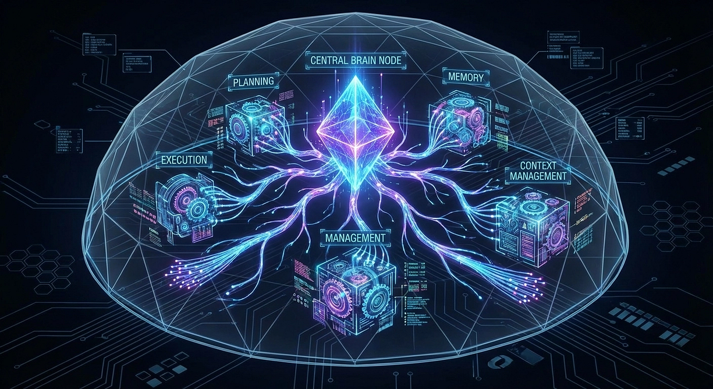

LangChain Deep Agents

Member-only story

[


](https://medium.com/@richardhightower?source=post_page---byline--e6ec3dc45cff---------------------------------------)

15 min read

Mar 15, 2026

How LangChain’s agent harness overcomes the limitations of simple ReAct loops

LangChain’s Deep Agents framework introduces an ‘agent harness’ built on LangGraph that equips LLMs with explicit planning, persistent filesystem memory, sub-agent spawning, and extreme context engineering. This article explores the four architectural pillars that enable agents to handle long-horizon, multi-step tasks that defeat traditional ReAct loops.

> Your AI agent starts strong on a complex task, then quietly drifts off course. Deep Agents fix this with four architectural pillars that give LLMs the organizational tools humans use to tackle complex projects.

You give your AI agent a straightforward task: “Research three databases, compare their strengths and weaknesses, and write a recommendation report.” The agent starts strong. It searches for PostgreSQL documentation, finds useful benchmarks, and summarizes the results. Then it moves to MongoDB. Halfway through, it starts confusing MongoDB features with the PostgreSQL facts it gathered earlier. By the time it reaches Redis, the agent has forgotten the original goal entirely and is writing a tutorial on caching strategies instead of a comparison report.

This is the reality of “Agent 1.0.” If you have built agents with LLMs, you have probably lived through this exact scenario. The simple ReAct loop that powers most AI agents today works brilliantly for short, focused tasks. Ask it to look up the weather, convert a file, or answer a factual question, and it delivers. But hand it a complex, multi-step project that requires sustained focus over dozens of tool calls, and it falls apart.

LangChain’s Deep Agents framework represents a fundamental rethinking of how we build AI agents. Released in late 2025 and now at version 0.4.10, `deepagents` introduces an "agent harness" that equips LLMs with the architectural scaffolding they need to handle long-horizon tasks. This is the shift from Agent 1.0 to Agent 2.0.

Press enter or click to view image in full size

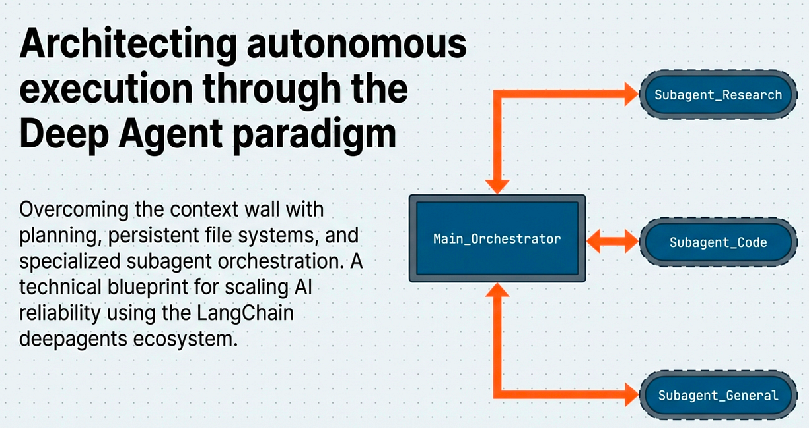

Deep Agent Architecture

In this article, the first in a five-part series, we will explore what makes Deep Agents different, examine the four architectural pillars that power them, and walk through a concrete example of a Deep Agent handling the kind of complex task that would defeat a traditional ReAct agent.

## The Limits of Shallow Agents

To understand why Deep Agents matter, we first need to understand why existing agent architectures fail. The dominant paradigm for LLM-based agents is the ReAct (Reasoning + Acting) loop, introduced by Yao et al. in 2022. The pattern is elegant in its simplicity:

1.  The LLM receives a prompt and **thinks** about what to do
2.  It **acts** by calling a tool (search, code execution, API call)
3.  It **observes** the result
4.  It loops back to step 1 until the task is complete

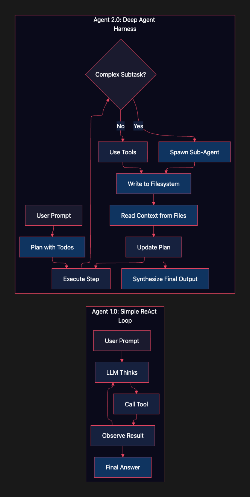

Deep Agent Harness vs. React Loop

This works well for tasks that can be completed in a handful of steps. But four fundamental problems emerge when you push ReAct agents into complex territory.

**Context window overflow.** Every tool call adds its result to the conversation history. After twenty or thirty tool calls, the context window fills with thousands of tokens of intermediate results. The LLM starts losing track of which information matters and which is noise. Critical early instructions get pushed further from the model’s attention window.

Press enter or click to view image in full size

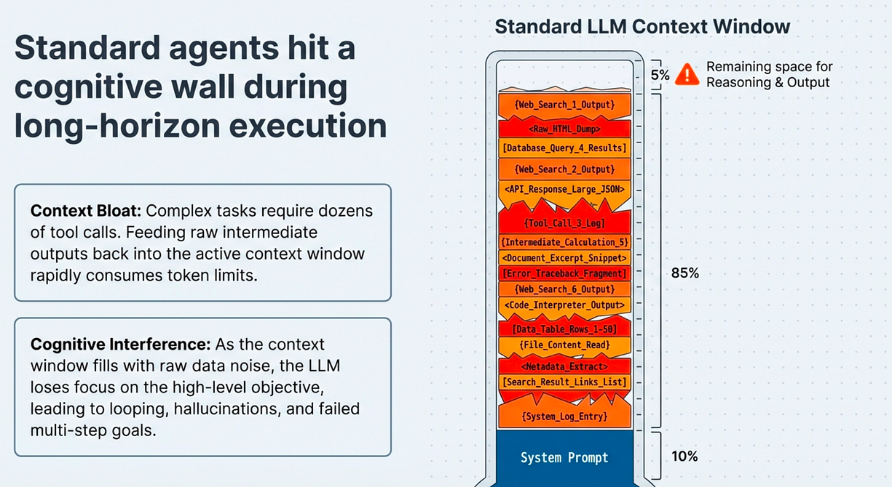

Standard Agents hit a wall

**Hallucination drift.** As the context grows, the model’s grip on the original goal loosens. It begins to hallucinate connections between unrelated tool results, conflate information from different steps, and gradually drift away from what you actually asked it to do. The agent does not crash. It just quietly starts solving the wrong problem.

Press enter or click to view image in full size

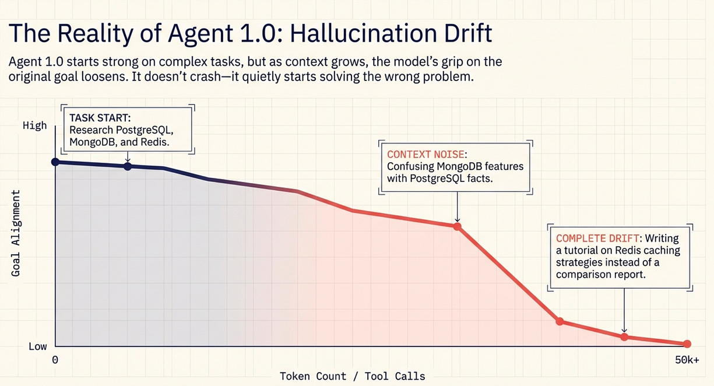

Hallucnination Drift

**No persistent memory.** A ReAct agent’s only memory is its conversation history. There is no way to save intermediate findings, organize research notes, or maintain structured state between steps. Everything lives in a single, linear stream of messages that the model must re-read on every iteration.

Press enter or click to view image in full size

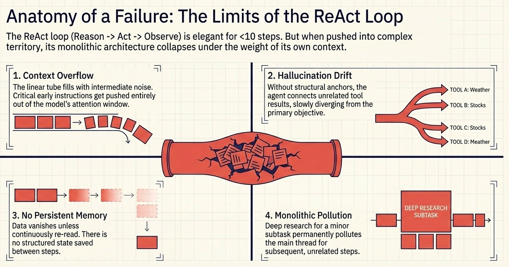

Limitation of legacy ReAct Loop

**Monolithic context pollution.** When a ReAct agent needs to perform a specialized subtask, that subtask’s entire context (tool calls, observations, reasoning) gets mixed into the main conversation. A research subtask pollutes the context for the writing subtask that follows. There is no isolation and no separation of concerns.

Press enter or click to view image in full size

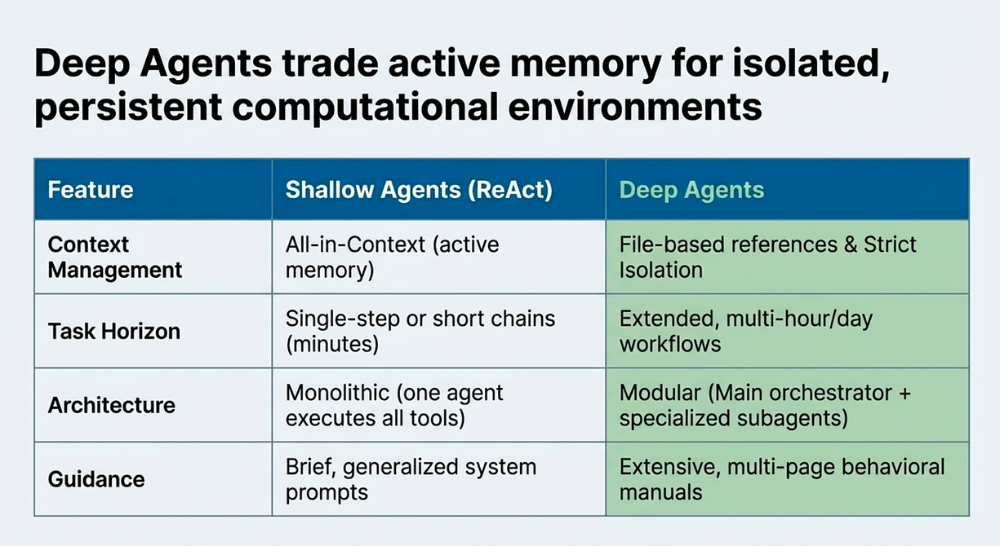

Deep Agents Have Long Horizons and Deep Memory pools that are file based

## Trade-offs: When ReAct Still Wins

ReAct agents are not obsolete. For simple, well-defined tasks requiring fewer than ten tool calls, a ReAct agent is faster, simpler to debug, and uses fewer tokens. The overhead of planning, filesystem management, and sub-agent coordination is unnecessary when the task fits comfortably within a single context window. The key is matching the agent architecture to the complexity of the task.

-   **Setup complexity:** ReAct (Agent 1.0) requires minimal setup, while Deep Agent (Agent 2.0) has moderate complexity
-   **Best for:** ReAct is ideal for short, focused tasks; Deep Agent excels at long-horizon, multi-step projects
-   **Context management:** ReAct relies on conversation history only, whereas Deep Agent uses filesystem + sub-agents
-   **Token efficiency (simple tasks):** ReAct has higher efficiency; Deep Agent has lower efficiency due to planning overhead
-   **Token efficiency (complex tasks):** ReAct has lower efficiency (context overflow); Deep Agent has higher efficiency (context offloading)
-   **Debugging:** ReAct is straightforward to debug; Deep Agent requires tracing across agents
-   **Goal persistence:** ReAct degrades over time; Deep Agent maintains goals via planning tool

## What Is a Deep Agent?

Deep Agents are LangChain’s answer to these limitations. As Harrison Chase (LangChain’s CEO and creator) put it in the original announcement, a Deep Agent is still fundamentally “an LLM running in a loop calling tools.” The underlying mechanism has not changed. What has changed is the architecture surrounding that loop.

Press enter or click to view image in full size

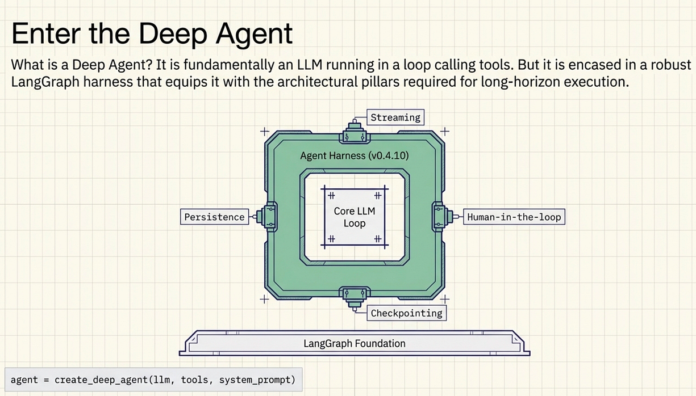

Enter the Deep Agent

The `deepagents` package, first released in September 2025 and now at version 0.4.10 on PyPI, provides an "agent harness" built on LangGraph. This harness equips the agent with built-in capabilities that make it suitable for long-horizon, complex tasks. The project drew direct inspiration from production systems like Claude Code, OpenAI's Deep Research, and Manus, all of which demonstrated that agents could tackle far more ambitious tasks when given proper architectural support.

The API is deliberately simple. Creating a Deep Agent takes just a few lines:

```
from deepagents import create_deep_agent

agent = create_deep_agent(
    tools=[your_custom_tools],
    system_prompt="Your detailed instructions here",
)

result = agent.invoke({
    "messages": [{"role": "user", "content": "Your complex task"}]
})
```

Under the hood, `create_deep_agent` returns a compiled LangGraph graph. This means you get all of LangGraph's production features for free: persistence, streaming, human-in-the-loop interrupts, checkpointing, and compatibility with LangGraph Studio for visual debugging.

But the real power lies not in the API surface. It lies in the four architectural pillars that the harness provides to every Deep Agent.

## The Four Pillars of Deep Architecture

Press enter or click to view image in full size

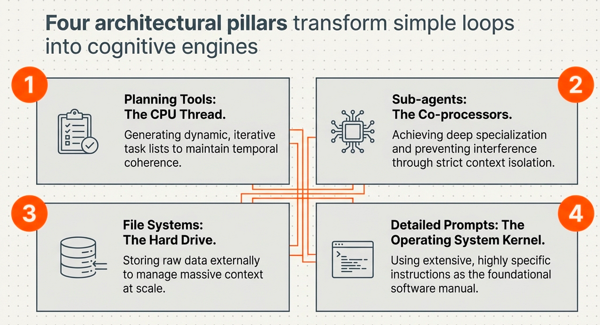

Four Architectural Pillars of Deep Agents

## Pillar 1: Explicit Planning

The most counterintuitive feature of Deep Agents is the `write_todos` tool. It is, in Harrison Chase's own words, essentially "a no-op." The tool does not execute any computation. It does not query a database or call an API. It simply writes a to-do list.

So why is it one of the four pillars?

Because planning is a context engineering strategy, not a computational one. When a Deep Agent writes out a to-do list at the beginning of a complex task, it is not performing project management. It is injecting structured information into its own context window. The to-do list becomes an anchor that the model can reference throughout the task to remember what it has done, what it still needs to do, and what the original goal was.

Press enter or click to view image in full size

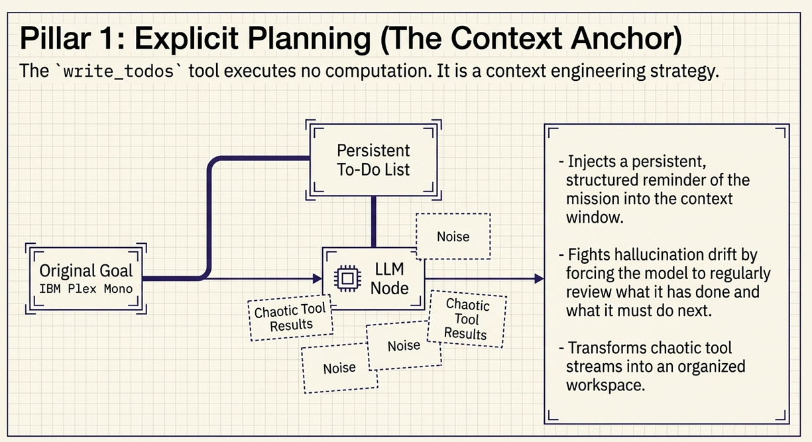

Pillar 1: Explicit Planning

This is the key insight: the planning tool fights hallucination drift by giving the agent a persistent, structured reminder of its mission. Every time the agent updates its to-do list (marking items complete, adding new items), it reinforces its understanding of the overall task. The planning tool transforms the agent’s context from a chaotic stream of tool results into an organized workspace with clear objectives.

Think of it this way: when a software developer tackles a complex feature, they do not just start coding. They write a ticket, break it into subtasks, and check items off as they go. The to-do list is not doing the work. It is keeping the developer focused and organized. The `write_todos` tool does the same thing for an LLM.

```


write_todos([
    {"task": "Research PostgreSQL features and benchmarks", "status": "complete"},
    {"task": "Research MongoDB features and benchmarks", "status": "in_progress"},
    {"task": "Research Redis features and benchmarks", "status": "pending"},
    {"task": "Compare all three databases across key dimensions", "status": "pending"},
    {"task": "Write final recommendation report", "status": "pending"},
])
```

## Pillar 2: Persistent Memory and Filesystem

A ReAct agent’s memory is its conversation history. A Deep Agent’s memory is an entire filesystem.

Deep Agents come equipped with built-in file operations: `ls`, `read_file`, `write_file`, and `edit_file`. These tools give the agent a virtual workspace where it can save intermediate results, organize research notes, store drafts, and maintain structured data across many steps. Instead of stuffing everything into the conversation context, the agent offloads information to files and reads it back only when needed.

Press enter or click to view image in full size

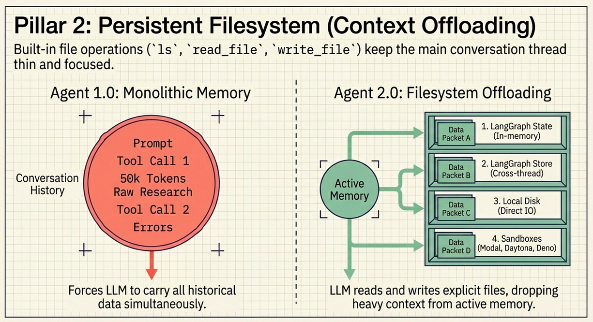

Context Offloading

This is **context offloading**, and it solves the context window overflow problem directly. Instead of accumulating thousands of tokens of intermediate results in the conversation, the agent writes findings to files and keeps its active context focused on the current step. When it needs earlier results, it reads the relevant file rather than scrolling through hundreds of previous messages.

The filesystem is also pluggable. Version 0.2 introduced a backend abstraction that lets you swap implementations depending on your needs:

-   **LangGraph State:** In-memory storage for lightweight, ephemeral tasks
-   **LangGraph Store:** Cross-thread persistence for agents that need to remember across sessions
-   **Local filesystem:** Direct disk access for agents running locally
-   **Sandbox environments:** Modal, Daytona, Deno, and Runloop for isolated execution
-   **Composite backends:** Map different directories to different storage systems (e.g., `/memories/` to S3, `/workspace/` to local disk)

```
from deepagents import create_deep_agent
from deepagents.backends import LocalFilesystemBackend, CompositeBackend, S3Backend

# Simple: local filesystem backend
agent = create_deep_agent(
    tools=[web_search],
    system_prompt="You are a research analyst...",
    backend=LocalFilesystemBackend(root_dir="./agent_workspace"),
)

# Advanced: composite backend for mixed persistence needs
agent = create_deep_agent(
    tools=[web_search],
    system_prompt="You are a research analyst...",
    backend=CompositeBackend({
        "/memories/": S3Backend(bucket="agent-long-term-memory"),
        "/workspace/": LocalFilesystemBackend(root_dir="./workspace"),
    }),
)
```

## Pillar 3: Sub-Agent Spawning

When a Deep Agent encounters a complex subtask, it does not try to handle everything itself. Instead, it uses the built-in `task` tool to spawn a specialized sub-agent.

Press enter or click to view image in full size

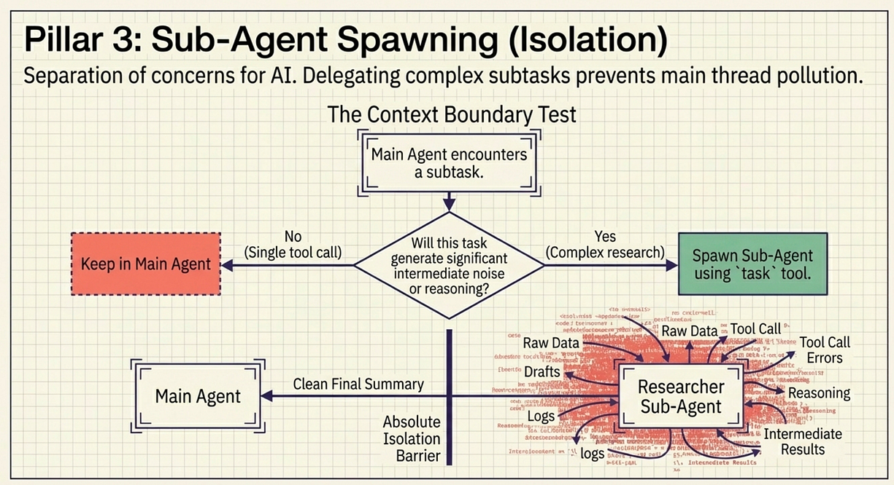

Pillar 3; Sub-Agent Spawning for Isolation

This is the separation of concerns principle applied to AI agents. Each sub-agent gets its own clean context window, its own system prompt, and its own set of tools. It operates in isolation, focused entirely on its specific subtask. When it finishes, it returns results to the parent agent, often by writing them to the shared filesystem.

The benefits are significant:

-   **Context isolation:** Research performed by a “researcher” sub-agent does not pollute the context of a “writer” sub-agent. Each agent stays focused on its role.
-   **Specialization:** You can give each sub-agent a different system prompt optimized for its role. A research agent gets instructions about thorough sourcing. A writing agent gets instructions about clarity and structure.
-   **Scalability:** Complex tasks can be decomposed into many independent subtasks, each handled by a dedicated sub-agent with a fresh context window.

```


task(
    instructions="Research PostgreSQL 17 features, performance benchmarks, "
                 "and common use cases. Write findings to /research/postgres.md",
    tools=["web_search", "read_file", "write_file"],
)


task(
    instructions="Read all files in /research/ and write a comparison report. "
                 "Include a summary table and clear recommendations. "
                 "Write the report to /output/comparison.md",
    tools=["read_file", "write_file"],
)
```

A common question is: when should you spawn a sub-agent versus having the main agent do the work directly? A useful rule of thumb is the **context boundary test**. If the subtask will generate enough context (tool calls, intermediate results, reasoning) to meaningfully degrade the main agent’s focus, delegate it. If the subtask is a single tool call with a concise result, keep it in the main agent.

## Pillar 4: Extreme Context Engineering

The fourth pillar is perhaps the most unglamorous but arguably the most important: system prompts. Deep Agents use detailed, thousands-of-tokens-long system prompts that serve as comprehensive technical specifications for agent behavior.

Press enter or click to view image in full size

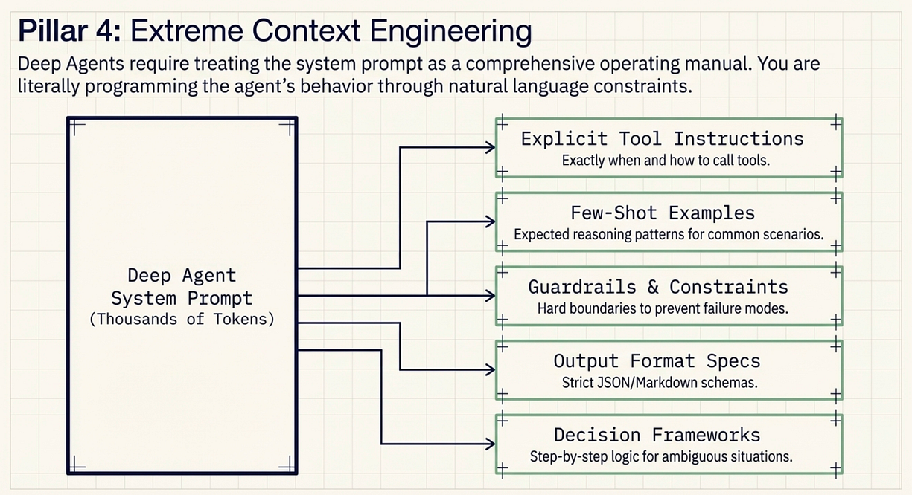

Extreme Context Engineering

This goes well beyond “you are a helpful assistant.” Deep Agent system prompts include:

-   **Explicit tool-usage instructions** that tell the agent exactly when and how to use each tool
-   **Few-shot examples** showing the expected reasoning pattern for common scenarios
-   **Guardrails and constraints** that prevent common failure modes
-   **Output format specifications** that ensure consistent results
-   **Decision frameworks** that guide the agent through ambiguous situations

Claude Code’s system prompt is the gold standard example. It is enormous, detailed, and opinionated. It tells the agent not just what to do, but how to think about problems, when to ask for help, and how to handle edge cases. The result is an agent that behaves consistently and predictably, even on novel tasks, because its “operating manual” is comprehensive.

```

RESEARCH_ANALYST_PROMPT = """You are a senior technical research analyst.

## Planning Protocol
- ALWAYS begin by creating a todo list with write_todos
- Break complex tasks into 3-7 discrete, measurable steps
- Update your todo list after completing each step

## Research Protocol
- For each research topic, spawn a dedicated sub-agent using the task tool
- Instruct sub-agents to write findings to /research/{topic_name}.md
- Each research file MUST include: overview, key features, benchmarks, limitations

## Synthesis Protocol
- After all research is complete, read all files in /research/
- Create a comparison matrix before writing prose
- Write the final report to /output/report.md

## Quality Standards
- Cite specific version numbers (e.g., "PostgreSQL 17", not "PostgreSQL")
- Include quantitative benchmarks where available
- Flag any claims you are uncertain about with [NEEDS VERIFICATION]
"""
```

For Deep Agents, the system prompt you pass to `create_deep_agent` becomes the foundation of the agent's behavior. The more detailed and specific your prompt, the better the agent performs. This is context engineering at its most deliberate: you are literally programming the agent's behavior through natural language.

## How It Works in Practice

Let us walk through a concrete example to see how these four pillars work together. Imagine you ask a Deep Agent to “Research PostgreSQL, MongoDB, and Redis, then write a comparison report with recommendations for a new project.”

**Phase 1: Planning.** The agent’s first action is not to start researching. It is to plan. Using `write_todos`, it breaks the task into five items: research each database, compare findings, and write the report. This to-do list now sits in the agent's context as a persistent anchor.

**Phase 2: Delegated research.** For each database, the agent spawns a researcher sub-agent using the `task` tool. Each sub-agent gets a focused instruction like "Research PostgreSQL 17 features, performance characteristics, and common use cases." The sub-agent conducts its research with a clean context window, free from the noise of other databases. When it finishes, it writes its findings to a file in the shared filesystem: `/research/postgres.md`.

This is where the four pillars reinforce each other. The sub-agent (Pillar 3) writes to the filesystem (Pillar 2), keeping the main agent’s context clean. The main agent checks its to-do list (Pillar 1) to track progress. The system prompt (Pillar 4) ensures each sub-agent knows exactly how to structure its research.

**Phase 3: Synthesis.** After all three research sub-agents complete their work, the main agent reads the research files from the filesystem. It does not need to remember the raw research; it just reads the organized summaries that the sub-agents prepared. It then spawns a writer sub-agent whose job is to read all three research files and produce a coherent comparison report, written to `/output/comparison.md`.

**Phase 4: Delivery.** The main agent reads the final report, marks all to-do items as complete, and delivers the result to the user.

Here is the complete setup in code:

```
from deepagents import create_deep_agent
from langchain_community.tools import TavilySearchResults


search = TavilySearchResults(max_results=5)


agent = create_deep_agent(
    tools=[search],
    system_prompt="""You are a senior technical analyst specializing in database
    technologies. When given a research task:

    1. Always start by creating a detailed todo list using write_todos
    2. Delegate individual research tasks to sub-agents using the task tool
    3. Have sub-agents write their findings to the filesystem
    4. Read and synthesize sub-agent findings before writing your final report
    5. Write your final report to /output/ before presenting it to the user

    Structure research files with clear headers, data points, and citations.
    Comparison reports should include a summary table and clear recommendations.""",
)


result = agent.invoke({
    "messages": [{
        "role": "user",
        "content": "Research PostgreSQL, MongoDB, and Redis. "
                   "Write a comparison report with recommendations "
                   "for a new e-commerce platform."
    }]
})


for event in agent.stream({
    "messages": [{
        "role": "user",
        "content": "Research PostgreSQL, MongoDB, and Redis. "
                   "Write a comparison report with recommendations."
    }]
}):
    print(event)
```

Compare this to the ReAct approach, where all of this research, context management, and writing would happen in a single, increasingly cluttered conversation thread. The Deep Agent’s architecture keeps everything organized, focused, and traceable.

Press enter or click to view image in full size

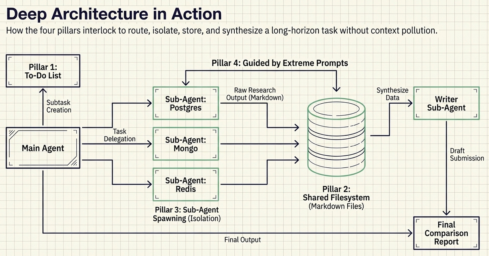

Deep Architecture in Action

## Why This Matters

The shift from Agent 1.0 to Agent 2.0 is not just a technical upgrade. It represents a change in what we can expect AI agents to accomplish.

With simple ReAct agents, we were limited to tasks that could be completed in a few tool calls within a single context window. Useful, but fundamentally constrained. Deep Agents break through that ceiling by giving LLMs the same organizational tools that humans use to tackle complex projects: planning, note-taking, delegation, and clear instructions.

Press enter or click to view image in full size

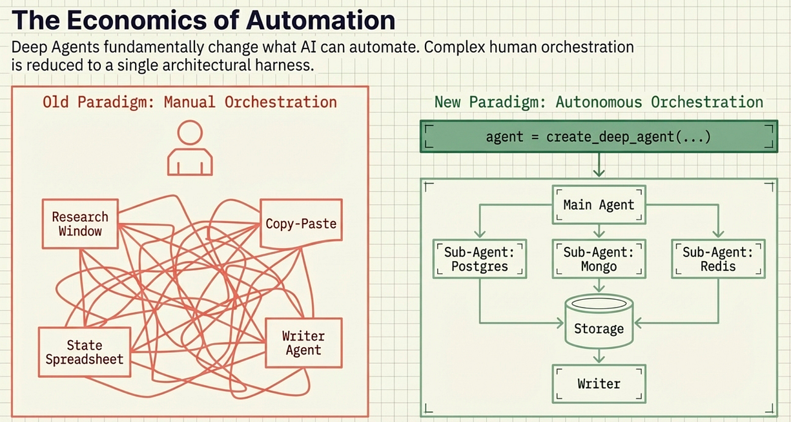

Deep Agents are a fundamental change of what AI can automate

The implications extend beyond individual agent performance. Deep Agents change the economics of AI-powered automation. Tasks that previously required human orchestration, including coordinating multiple research threads, maintaining context across long workflows, and synthesizing information from diverse sources, can now be handled by a single `create_deep_agent` call with a well-crafted system prompt.

The `deepagents` package (MIT-licensed, 1,700+ GitHub stars, actively maintained with 62 contributors) makes this architecture accessible to any developer. Install it with `pip install deepagents`, write a system prompt, and you have an agent capable of handling tasks that would have been impossible just a year ago.

But we have only scratched the surface. Each of the four pillars deserves deep exploration. How do you write effective to-do lists for context engineering? What are the best practices for filesystem organization? When should you spawn sub-agents versus handling tasks directly? How do you craft system prompts that truly guide agent behavior?

In the next article in this series, we will dive deep into the planning and context engineering pillars, exploring advanced strategies for keeping agents focused and productive on long-horizon tasks. We will examine real-world examples, benchmark different approaches, and provide templates you can use in your own projects.

The age of shallow agents is ending. The age of deep agents has begun.

Press enter or click to view image in full size

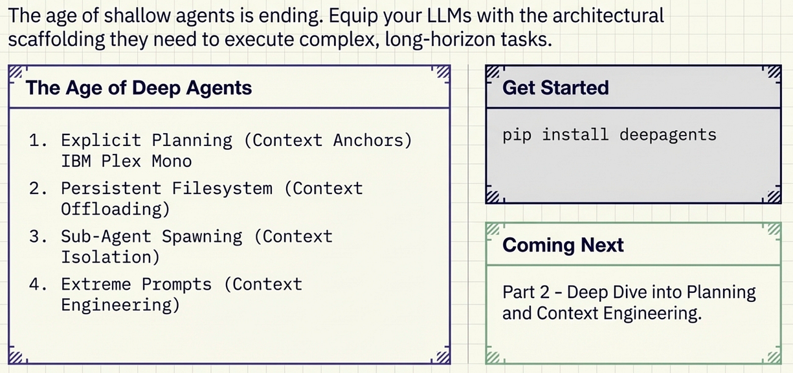

Shallow Agents has ended, enter the age of deep agents

## About the Author

Rick Hightower is a technology executive and data engineer who led ML/AI development at a Fortune 100 financial services company. He created skilz, the [universal agent skill installer](https://skillzwave.ai/docs/), supporting 30+ coding agents including Claude Code, Gemini, Copilot, and Cursor, and co-founded the world’s largest agentic skill marketplace. Connect with Rick Hightower on [LinkedIn](https://www.linkedin.com/in/rickhigh/) or [Medium](https://medium.com/@richardhightower).

Rick has been actively developing generative AI systems, agents, and agentic workflows for years. He is the author of numerous agentic frameworks and developer tools and brings deep practical expertise to teams looking to adopt AI.

Organizations and leaders interested in staying ahead of the curve can work with Rick through executive AI coaching. You can even sign up your boss so your team can start using the latest AI tools at work.

## A message from our Founder

Hey, [Sunil](https://linkedin.com/in/sunilsandhu) here. I wanted to take a moment to thank you for reading until the end and for being a part of this community. Did you know that our team run these publications as a volunteer effort to over 3.5m monthly readers? We don’t receive any funding, we do this to support the community.

If you want to show some love, please take a moment to follow me on [LinkedIn](https://linkedin.com/in/sunilsandhu), [TikTok](https://tiktok.com/@messyfounder), [Instagram](https://instagram.com/sunilsandhu). You can also subscribe to our [weekly newsletter](https://newsletter.plainenglish.io/). And before you go, don’t forget to clap and follow the writer️!