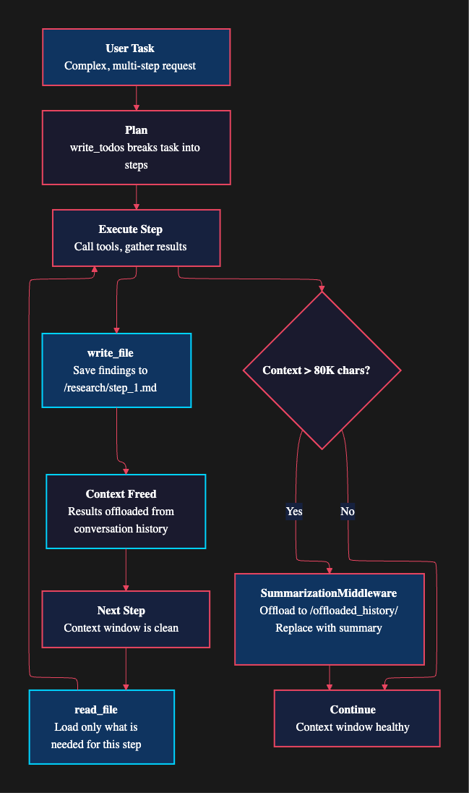
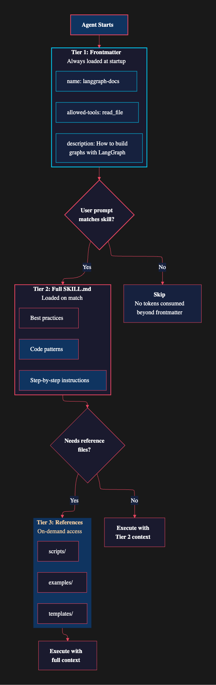
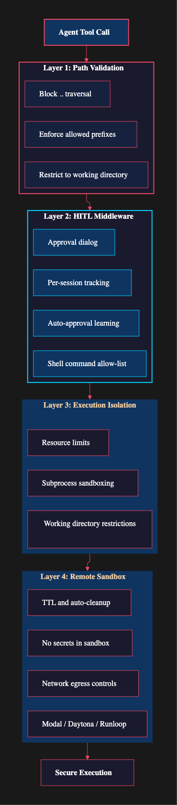
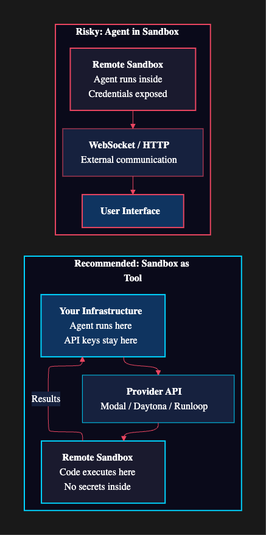
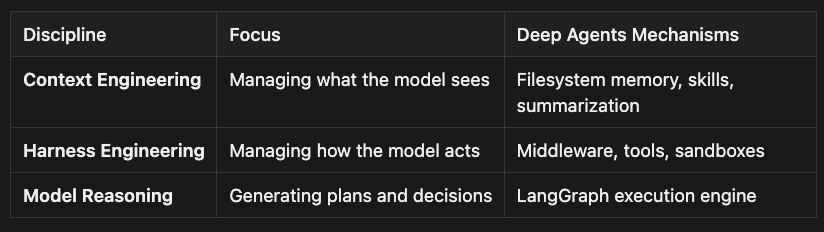

LangChain Deep Agents utilize filesystem-based working memory, progressive skill disclosure, and layered security to enhance agent performance and safety. The filesystem acts as external memory, allowing agents to offload intermediate results and manage context effectively. Skills are loaded progressively to reduce token usage, ensuring agents only access relevant instructions. Security is enforced through multiple layers, including path validation, HITL middleware, and remote sandboxes, to mitigate risks associated with powerful tool access. These strategies collectively enable the deployment of reliable and secure AI agents for complex tasks.

Your agent is reviewing a 200-page codebase. It has been running for thirty minutes, calling tools methodically: reading files, analyzing dependencies, checking test coverage, writing notes. At tool call number forty, something shifts. The agent starts re-analyzing files it already reviewed. It attributes findings from the authentication module to the payment processor. By tool call fifty, it has forgotten the original goal entirely and is refactoring code instead of reviewing it.

The model is not broken. The context window is full. Every tool call adds its result to the conversation history, and after forty calls, the agent is drowning in its own output. Critical early instructions have been pushed so far back in the token sequence that the model can barely attend to them. This is the context management problem, and it affects every long-running agent.

In Articles 1 through 3, we covered the architectural pillars of Deep Agents: planning, sub-agents, middleware, and the LangGraph execution engine. This article tackles the two remaining challenges that separate a demo from a production system: keeping agents effective across long conversations, and keeping them safe when they have access to powerful tools. We will explore three interlocking systems: filesystem-based working memory, progressive skill disclosure, and defense-in-depth security.

## LangChain DeepAgent Context Engineering: Working Memory and the Virtual Filesystem

The most counterintuitive insight in the Deep Agents architecture is this: `read_file` and `write_file` are not primarily file I/O tools. They are working memory.

Think about how you handle a complex research project. You do not try to hold every detail in your head simultaneously. You take notes. You write intermediate findings in a document, close that tab, and open a fresh one for the next subtask. When you need earlier findings, you go back and read your notes. Your desk (or your filesystem) serves as external memory that extends your cognitive capacity.

Deep Agents work the same way. When a research agent investigates PostgreSQL, it writes its findings to `/research/postgres_analysis.md`. Then it moves on to MongoDB with a clean context window. The PostgreSQL details are not lost; they are saved to the virtual filesystem, ready to be read back when the agent needs them for the final comparison.

This pattern mirrors how the human brain handles complex cognition. Neuroscientists call it “extended cognition,” where external tools become part of our cognitive process. A notebook is not just storage; it is a thinking tool. The Deep Agents filesystem serves exactly this role for the LLM.

## The Offloading Pattern

This pattern has a name in cognitive science: cognitive offloading. In Deep Agents, it operates at three levels, each addressing a different scale of the context management problem.

**Deliberate offloading.** The agent explicitly writes intermediate results to files. A well-prompted agent will write research findings, code analysis results, and draft sections to the filesystem as it works. Each write frees context window space for the next step. This is the most powerful level because it is under prompt engineering control. You can instruct the agent to save findings after each step, creating a natural rhythm of gather-save-advance.

```
from deepagents import create_deep_agent
from deepagents.backends.filesystem import FilesystemBackend


agent = create_deep_agent(
    model="anthropic:claude-sonnet-4-6",
    backend=FilesystemBackend(root_dir="/project"),
    system_prompt="""You are a code review agent. For each module:
    1. Read the source files
    2. Write your analysis to /reviews/{module_name}.md
    3. Move to the next module with a clean focus
    4. After all modules, read your reviews and synthesize a final report""",
    checkpointer=checkpointer,
)
```

Notice the system prompt structure. It does not ask the agent to “remember” its analysis. It tells the agent to write it down and read it back later. This is a fundamental shift in how we prompt long-running agents. Instead of hoping the model retains information across dozens of tool calls, we give it an external memory system and instruct it to use that system deliberately.

**Automatic summarization.** The `SummarizationMiddleware` monitors the total conversation size. When it exceeds approximately 80,000 characters, the middleware automatically offloads older messages to `/offloaded_history/` and replaces them with concise summaries. The agent does not need to manage this. It happens transparently. The summarization preserves key decisions and findings while discarding the verbose intermediate steps that led to them.

**Result eviction.** When a single tool result exceeds roughly 80KB (reading a large file, for example), the system evicts it to `/large_tool_results/` and leaves a reference in the conversation. This prevents any single tool call from consuming a disproportionate share of the context window. The agent can still access the full result by reading the evicted file if it needs the details.

There is also a subtler optimization at work. When the agent calls `write_file`, the content argument gets truncated to just 20 characters in the message history. The model already knows what it wrote; storing the full content in the conversation would be pure waste. This small detail saves significant token space across a long session.



LangChain Deep Agent Offloading Pattern

## Why This Matters

The filesystem-as-working-memory pattern transforms the context window from a hard constraint into a soft one. A traditional ReAct agent can handle perhaps 20 to 30 tool calls before context overflow degrades its performance. A Deep Agent using filesystem-backed working memory can sustain hundreds of tool calls because it continuously offloads and retrieves information as needed. The context window becomes a scratchpad, not a warehouse.

## LangChain DeepAgent Context Engineering: Progressive Disclosure with Agent Skills

Working memory solves the problem of too much tool output filling the context window. But there is another source of context bloat: instructions.

A production agent might need to know how to deploy to Kubernetes, write SQL migrations, follow your team’s code style guide, generate API documentation, and run your test suite. If you load all of that into the system prompt, you burn thousands of tokens before the agent even reads the user’s message. Most of those instructions will be irrelevant to any given task.

This is the same problem that well-designed user interfaces solve with progressive disclosure: show users what they need when they need it, not everything all at once. Deep Agents apply this principle to agent instructions through the skills system.

## The Agent Skill [SKILL.md](http://skill.md/) File

A skill is a directory containing a `SKILL.md` file and optional supporting assets (scripts, templates, reference docs). The `SKILL.md` file has two parts: YAML frontmatter with metadata, and a markdown body with detailed instructions.

```
---
name: kubernetes-deploy
description: >
  Procedures for deploying services to Kubernetes clusters.
  Covers kubectl commands, helm chart configuration,
  namespace management, and rollback procedures.
license: MIT
metadata:
  author: Platform Team
  version: 2.1.0
allowed-tools:
  - execute
  - read_file
  - write_file
---


- Ensure kubectl is configured for the target cluster
- Verify helm v3.12+ is installed
- Confirm access to the container registry


1. Run tests: `make test`
2. Build image: `docker build -t registry/service:tag .`
3. Update helm values in `/deploy/values-{env}.yaml`
4. Deploy: `helm upgrade --install service ./deploy/chart -f ./deploy/values-{env}.yaml`
5. Verify: `kubectl rollout status deployment/service -n {namespace}`


If a deployment fails health checks within 5 minutes:
1. `helm rollback service 0 -n {namespace}`
2. Check logs: `kubectl logs -l app=service -n {namespace} --tail=100`
3. Write incident notes to /incidents/{date}-{service}.md
```

The `description` field is the key to the whole system. It is capped at 1,024 characters, forcing skill authors to write concise, specific descriptions that help the agent match skills to tasks accurately. A vague description like "Kubernetes stuff" will produce poor matches. A specific description like the one above gives the agent a clear signal about when this skill applies.

## Agent Skill Three-Tier Loading

The progressive disclosure pattern loads skill information in three tiers, each more detailed than the last.

**Tier 1: Frontmatter only.** When the agent starts, the `SkillsMiddleware` reads the YAML frontmatter from every `SKILL.md` file in the configured skill directories. Only the `name` and `description` fields are injected into the agent's awareness. For twenty skills, this might consume a few hundred tokens. That is the entire cost of making twenty capabilities available.

**Tier 2: Full** [**SKILL.md**](http://skill.md/)**.** When the agent receives a user prompt, it checks whether any skill descriptions match the task at hand. If the user asks about deploying a service, the agent recognizes a match with the `kubernetes-deploy` skill and loads the full markdown body. Only the relevant skill's instructions enter the context window.

**Tier 3: Reference files.** If the skill’s instructions reference supporting files (templates, scripts, example configurations), the agent reads those on demand. A Kubernetes deployment skill might reference a `templates/service.yaml` file that the agent reads only when it actually needs to generate a Kubernetes manifest.



LangChain DeepAgent: Agent Skill Three-Tier Loading

```
from deepagents import create_deep_agent
from deepagents.backends.filesystem import FilesystemBackend

agent = create_deep_agent(
    model="anthropic:claude-sonnet-4-6",
    backend=FilesystemBackend(root_dir="/project"),
    skills=[
        "/project/skills/",          
        "/shared/company-skills/",   
    ],
    checkpointer=checkpointer,
)
```

When multiple skill directories contain a skill with the same name, the last source in the `skills` array takes precedence. This lets teams override organization-wide defaults with project-specific variations. A company-wide `kubernetes-deploy` skill might define standard procedures, while a project-level override adds custom health check endpoints specific to that service.

## Skills vs. Memory

Deep Agents also support persistent memory through `AGENTS.md` files. The distinction is important, and getting it wrong leads to either bloated system prompts or agents that forget critical context.

Memory (loaded via `MemoryMiddleware`) is always present in the system prompt. It holds project conventions, preferences, and facts the agent should always know: "We use pytest, not unittest." "Database connections go through the connection pool, never directly." "The main branch is called `production`, not `main`."

Skills are task-specific and loaded on demand. Use memory for “always remember this.” Use skills for “know how to do this when asked.”

This separation keeps the always-loaded context small while making a large library of capabilities available through progressive disclosure. An agent can have access to fifty skills but only consume tokens for the two or three that match the current task.

The skills system and filesystem-backed working memory are both examples of context engineering: designing how information flows into and out of the agent’s context window. Progressive disclosure through skills is context engineering for instructions — instead of frontloading every procedure, you provide metadata that lets the agent pull in detailed instructions only when needed. Filesystem-backed working memory is context engineering for state — instead of accumulating tool outputs until the context overflows, the agent writes results to files and reads them back selectively. Both patterns treat the context window as a cache rather than permanent storage, which is the difference between agents that break after twenty steps and agents that sustain multi-hour tasks involving hundreds of tool calls.

## LangChain DeepAgent Harness Engineering: Security and the “Trust the LLM” Philosophy

Here is the uncomfortable truth about powerful agents: the same tools that make them useful make them dangerous.

An agent with `execute` access can run any shell command. An agent with `write_file` access can overwrite any file in its working directory. An agent with network access can exfiltrate data to external servers. These are not theoretical risks. In October 2025, Trail of Bits documented a complete prompt-injection-to-remote-code-execution chain in a production AI coding tool. OWASP's 2025 Top 10 for LLM Applications lists prompt injection as the number one vulnerability, found in over 73% of production deployments assessed during security audits.

The attack vectors are creative and varied. Malicious prompts hidden in code comments can hijack an agent reviewing a pull request. A poisoned webpage can redirect an agent that uses web search. Even logging output can contain injection payloads that manipulate an agent analyzing application logs. These are not exotic attacks. They exploit the fundamental way LLMs process text: the model cannot reliably distinguish between instructions from the developer and instructions embedded in data.

The security model here is part of what the Deep Agents documentation calls “harness engineering”: trust the LLM to make decisions, but engineer the tool layer to constrain what’s physically possible. Like a climbing harness that allows freedom of movement within safe boundaries, the framework doesn’t try to make the model perfect — it builds infrastructure that limits the damage when things go wrong.

## Deep Agents’ Security Model

Deep Agents adopt a philosophy they call “trust the LLM, enforce at tool layer.” The framework does not try to make the model police itself. Instead, it builds security boundaries into the infrastructure that surrounds the model. This is a pragmatic approach: you cannot reliably prevent prompt injection at the model level, so you limit the damage an injected prompt can cause.

The security model operates in four layers, each catching threats that the previous layer might miss.



LangChain DeepAgent: security model operates in four layers, each catching threats that the previous layer might miss.

**Layer 1: Path validation.** The `FilesystemBackend` validates every file path before execution. It blocks directory traversal attempts (paths containing `..`) and enforces allowed path prefixes. An agent configured to work in `/project` cannot read `/etc/passwd`, regardless of what a prompt injection tells it to do. This is the simplest layer, but it catches a surprising number of real-world attacks.

**Layer 2: HITL middleware.** The Human-in-the-Loop middleware, available in the CLI package, intercepts tool calls and presents them to the user for approval. It operates through the `wrap_tool_call` hook, running last in the middleware chain so it sees the final, fully-processed tool call before execution.

```
from deepagents_cli.middleware import HumanInTheLoopMiddleware


hitl = HumanInTheLoopMiddleware(
    tools_requiring_approval=[
        "execute",        
        "write_file",     
        "edit_file",      
    ],
    auto_approve_patterns=[
        "read_file",      
        "ls",             
        "glob",           
        "grep",           
    ],
)

agent = create_deep_agent(
    model="anthropic:claude-sonnet-4-20250514",
    middleware=[hitl],
    checkpointer=checkpointer,
)
```

The HITL middleware supports several usability features that prevent it from becoming a bottleneck during development. Per-session allow-lists let users approve a command pattern once (like `npm test`) and have it auto-approved for the rest of the session. Auto-approval learning tracks which commands users consistently approve and suggests adding them to the allow-list. This creates a workflow where the agent starts cautious and becomes more autonomous as it earns trust during a session.

**Layer 3: Execution isolation.** Even without remote sandboxes, the `FilesystemBackend` runs shell commands in subprocesses with working directory restrictions. The agent's `execute` tool operates within a defined boundary, not with the full permissions of the host process.

**Layer 4: Remote sandboxes.** For production deployments, Deep Agents integrate with three sandbox providers: Modal, Daytona, and Runloop. Each creates an isolated execution environment where agent code runs separately from your infrastructure.

```
from daytona import Daytona
from langchain_daytona import DaytonaSandbox
from deepagents import create_deep_agent


sandbox = Daytona().create()
backend = DaytonaSandbox(sandbox=sandbox)

agent = create_deep_agent(
    model="anthropic:claude-sonnet-4-6",
    backend=backend,
    checkpointer=checkpointer,
)


backend.upload_files([
    ("/src/app.py", b"# Application source\n"),
    ("/config.toml", b"[settings]\ndebug = false\n"),
])
```

## Sandbox Provider Comparison

**Modal** is a serverless compute platform designed for running containerized workloads with gVisor-based isolation. It provides a deny-by-default network posture for inbound connections and is well-suited for CPU and GPU-intensive agent tasks. Modal’s strength lies in its security model and ability to scale execution environments on demand.

**Daytona** offers lifecycle-managed development environments with built-in automation for idle resource cleanup. It provides auto-stop, auto-archive, and auto-delete features for sandboxes that haven’t been used recently. Daytona is particularly useful for teams that need persistent development boxes with automatic cost controls and resource management.

**Runloop** focuses on disposable, ephemeral development environments that are created on demand and destroyed after use. Its model is optimized for short-lived agent tasks where you want complete isolation and no state carryover between runs. Runloop is ideal for one-off executions where security through complete environment disposal is the priority.

All three providers solve the core problem of isolating agent code execution from production infrastructure, but they make different trade-offs between persistence, lifecycle management, and security posture. The choice depends on whether your agent tasks are short-lived (Runloop), require persistent state across sessions (Daytona), or need heavy compute with strong isolation (Modal).

## LangChain DeepAgent: Sandbox as Tool vs. Agent in Sandbox

The recommended pattern is “Sandbox as Tool.” The agent runs on your infrastructure and sends execution requests to the sandbox via the provider’s API. Your API keys and credentials never enter the sandbox. Sandbox failures do not affect agent state. You pay only for execution time.



LangChain DeepAgent: Sandbox as Tool vs. Agent in Sandbox

The alternative, running the agent itself inside the sandbox, is riskier. Credentials must live inside the sandbox (creating an exfiltration target), updates require rebuilding container images, and failures can disrupt the agent mid-task. The documentation is explicit: “Never put secrets inside a sandbox. API keys, tokens, database credentials can be read and exfiltrated by a context-injected agent.”

## Network Egress Controls

Sandboxes provide process isolation, but a compromised agent can still exfiltrate data if it has network access. Production deployments should configure network egress controls:

-   Block outbound connections to arbitrary hosts
-   Allow-list only the specific APIs the agent needs (your database, your deployment target, your monitoring service)
-   Monitor for unexpected outbound traffic patterns
-   Log all network requests from sandbox environments

Modal uses gVisor-based isolation with a deny-by-default posture for inbound connections. Daytona provides lifecycle automation with auto-stop, auto-archive, and auto-delete for idle sandboxes. Runloop offers disposable development boxes that are destroyed after use. Each provider makes different trade-offs, but all three solve the fundamental problem of isolating agent operations from your production infrastructure.

## Context Engineering and Harness Engineering in Deep Agents

The patterns we have described: filesystem working memory, progressive skill disclosure, and layered security, map closely to two emerging disciplines in modern AI engineering: **context engineering** and **harness engineering**. These concepts have become increasingly important as agent systems evolve from simple prompt-response loops into long-running autonomous processes.

Understanding this mapping helps explain _why_ Deep Agents look the way they do.

## What Is Context Engineering?

Context engineering is the discipline of **structuring what an LLM sees and when it sees it**.

Traditional prompt engineering focused on crafting a single high-quality prompt. But modern agent systems run for dozens or hundreds of tool calls. The challenge is no longer writing a good prompt — it is **managing the lifecycle of context over time**.

Context engineering answers questions such as:

-   What information should always be visible to the model?
-   What information should be loaded only when needed?
-   What information should be summarized or discarded?
-   What information should be stored externally and retrieved later?

In other words, context engineering treats the context window as a **managed memory hierarchy** rather than a static prompt.

Deep Agents implement several core context engineering strategies.

## Externalized Working Memory

The filesystem working-memory pattern is a direct application of context engineering principles. Instead of forcing the LLM to carry intermediate results inside the conversation history, the agent writes them to external storage.

This creates a **three-tier memory hierarchy and Agent Skills**:

-   **Immediate Context:** Located in the LLM context window for the current reasoning step
-   **Working Memory:** Stored in the virtual filesystem for intermediate notes and research
-   **Archived History:** Kept in offloaded summaries for long-term session trace
-   **Agent Skills:** PDA pre-canned procedures and knowledge of simple to complex workflows, loaded on demand.

This mirrors the architecture of classical computing systems:

-   CPU registers → context window
-   RAM → filesystem working memory
-   Disk → offloaded history

By externalizing memory, Deep Agents dramatically extend the effective reasoning horizon of the model.

## Selective Context Loading

The skills system is another form of context engineering. Instead of injecting every instruction into the system prompt, Deep Agents expose capabilities through a **progressive discovery model**.

The agent begins with only lightweight metadata:

```
Skill: kubernetes-deploy
Description: Procedures for deploying services to Kubernetes clusters
```

When the task requires it, the agent loads deeper instructions.

This mirrors modern software documentation systems such as:

-   IDE code completion
-   command palette discovery
-   plugin ecosystems

The result is an agent that **knows many things but only loads what it needs**.

## Automatic Context Compression

The summarization middleware represents the third major context engineering pattern: **automatic compression**.

As conversations grow, earlier steps are summarized and archived. The system preserves _decisions_ while discarding _process noise_.

This keeps the context window focused on what matters:

-   goals
-   conclusions
-   key facts

rather than verbose reasoning traces.

## What Is Harness Engineering?

If context engineering controls **what the model sees**, harness engineering controls **how the model interacts with the outside world**.

A harness is the **execution environment surrounding the model**. It includes:

-   tool interfaces
-   middleware
-   safety controls
-   sandbox environments
-   state management

In traditional software engineering terms, the harness is the **runtime system for the agent**.

Deep Agents implement several key harness engineering patterns.

## Tool-Gated Execution

Deep Agents follow a strict rule:

> **_The model never executes anything directly. It only requests tools._**

Every external action, reading files, running commands, writing code, must pass through a tool interface.

This gives the harness complete control over:

-   validation
-   logging
-   approval
-   execution boundaries

In practice, this means the harness becomes the **policy enforcement layer**.

## Middleware as the Agent Control Plane

Middleware provides the orchestration layer of the harness.

Each tool call flows through a chain of middleware hooks:

```
Model
  ↓
Tool Request
  ↓
Path Validation
  ↓
HITL Middleware
  ↓
Execution Sandbox
  ↓
Tool Result
  ↓
Summarization Middleware
  ↓
Model
```

This architecture allows developers to inject behavior into the agent lifecycle without modifying the model itself.

Examples include:

-   approval workflows
-   telemetry collection
-   result filtering
-   prompt injection detection
-   cost monitoring

In effect, middleware turns the harness into an **agent control plane**.

## Sandboxes as the Execution Boundary

One of the most important harness engineering decisions is **where execution happens**.

Deep Agents isolate execution in sandbox environments such as:

-   Modal
-   Daytona
-   Runloop

These environments enforce critical safety guarantees:

-   filesystem isolation
-   process isolation
-   resource limits
-   network controls

The model may decide _what_ to execute, but the harness decides _where and how_ it executes.

This separation is essential for production safety.

## Context Engineering vs Harness Engineering

These two disciplines address different layers of the agent architecture.

Press enter or click to view image in full size



Together they form a three-layer system:

```
Reasoning Layer
    (LLM + LangGraph)
Context Layer
    (filesystem memory, skills)
Execution Layer
    (tools, middleware, sandbox)
```

This layered architecture is the real innovation behind modern agent frameworks.

## Why This Distinction Matters

Many early agent systems blurred the boundaries between reasoning, memory, and execution. As a result, they suffered from predictable failure modes:

-   context overflow
-   uncontrolled tool execution
-   prompt injection exploits
-   brittle prompt logic

Deep Agents address these problems by **separating responsibilities across layers**.

Context engineering ensures the model always sees the right information.

Harness engineering ensures the model cannot escape its operational boundaries.

The model itself is responsible only for reasoning.

This separation mirrors classic distributed system design, where we isolate:

-   computation
-   storage
-   orchestration
-   security

Agent frameworks are now converging on the same principles.

## The Emerging Standard

As the AI agent ecosystem matures, we are beginning to see a consistent pattern across frameworks:

-   **Deep Agents:** filesystem memory + skills | middleware + sandbox
-   **Claude Agent SDK:** memory + tools | hooks + policies
-   **OpenAI Agents:** vector memory | tool routing
-   **LangGraph:** structured state | execution graph

The details differ, but the architecture is converging.

Modern agent systems are no longer just prompts wrapped around an LLM. They are **runtime environments for reasoning systems**.

Deep Agents exemplify this shift by treating context and execution as first-class engineering problems rather than incidental implementation details.

And that shift — from prompt engineering to **context and harness engineering** — is what ultimately makes long-running agents viable in production.

## Best Practices for Production Deployment

Building a production-grade agent system requires combining these patterns thoughtfully. Here are the practices that matter most.

**Layer your defenses.** No single security mechanism is sufficient. Use path validation as the baseline, add HITL for development and sensitive operations, and deploy remote sandboxes for production workloads. Each layer catches what the previous one misses.

**Keep credentials on the host.** Use the “Sandbox as Tool” pattern. Define authentication tools that run in your host environment, and let agents call those tools by name without ever seeing the credentials. This separation means a compromised sandbox cannot access your infrastructure.

**Configure sandbox lifecycles.** Set TTL (time-to-live) values for automatic cleanup. Assign one sandbox per conversation thread to maintain isolation between users and sessions. Explicitly shut down sandboxes when conversations end. Idle sandboxes waste resources and expand your attack surface.

**Use skills to manage context.** Do not dump everything into the system prompt. Break domain knowledge into skills with clear, specific descriptions. Let progressive disclosure handle the token budgeting for you. A skill library of fifty capabilities costs only a few hundred tokens at startup.

**Trust the summarization.** Resist the urge to manually manage context. Let `SummarizationMiddleware` handle offloading automatically. If you find the agent losing important context, improve your prompts to encourage deliberate file-based note-taking rather than trying to keep everything in the conversation.

**Monitor and review.** Treat all sandbox-generated content as untrusted. Use middleware to redact sensitive patterns in tool outputs. Review agent outputs before acting on them, especially for operations that affect production systems.

**One sandbox per thread.** For chat applications, map each conversation thread to its own sandbox instance. This prevents cross-contamination between conversations and makes cleanup straightforward. Store thread-to-sandbox mappings so that returning users reconnect to their existing environment.

## Conclusion

Context management and security are the less glamorous cousins of planning and sub-agent delegation, but they are what separate a compelling demo from a production system. The filesystem-as-working-memory pattern transforms the context window from a hard limit into a flexible resource. Progressive skill disclosure keeps agents informed without drowning them in irrelevant instructions. And defense-in-depth security, from path validation through HITL middleware to remote sandboxes, creates the boundaries that make it safe to give agents real tools.

The “trust the LLM, enforce at tool layer” philosophy is worth internalizing. You cannot prevent prompt injection at the model level. But you can ensure that a successful injection cannot escape the sandbox, traverse the filesystem, or exfiltrate credentials. Security is not about making the model trustworthy. It is about making the consequences of untrustworthiness manageable.

Context engineering and harness engineering represent the foundational disciplines that make production agents viable. By carefully controlling what the model sees and how it acts, these complementary approaches transform agents from experimental prototypes into reliable, secure systems capable of handling real-world tasks at scale.

In the final article of this series, we will bring everything together with real-world use cases: the Deep Agents CLI, production deployment patterns, and how the open-source agent ecosystem is democratizing capabilities that were once exclusive to well-funded teams.

_This is Part 4 of the 5-part LangChain Deep Agents series._ [_Read Part 1: Introduction to Deep Agents_](https://medium.com/@richardhightower/introduction-to-langchain-deep-agents-and-the-shift-to-agent-2-0-e6ec3dc45cff)_, Part 2: Middleware and LangGraph, Part 3: Open-Source Trade-offs, and Part 5: Real-World Use Cases._

## About the Author

Rick Hightower is a technology executive and data engineer who led ML/AI development at a Fortune 100 financial services company. He created skilz, the [universal agent skill installer](https://skillzwave.ai/docs/), supporting 30+ coding agents including Claude Code, Gemini, Copilot, and Cursor, and co-founded the world’s largest agentic skill marketplace. Connect with Rick Hightower on [LinkedIn](https://www.linkedin.com/in/rickhigh/) or [Medium](https://medium.com/@richardhightower).

Rick has been actively developing generative AI systems, agents, and agentic workflows for years. He is the author of numerous agentic frameworks and developer tools and brings deep practical expertise to teams looking to adopt AI.