[


](https://medium.com/@Micheal-Lanham?source=post_page---byline--3e0a95171419---------------------------------------)

10 min read

Jan 23, 2026

Press enter or click to view image in full size

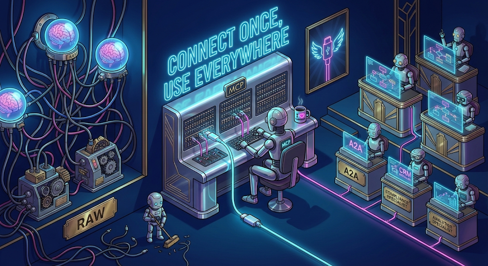

all images generated with nano-banana-pro and agents

**Stop rewriting your AI tool connections every time you switch frameworks. Here’s how to build once and connect everywhere.**

If you’ve built AI agents that interact with real-world tools, you’ve probably hit this wall: every new tool needs a custom connector, every framework switch means rewriting integrations, and scaling feels like stacking a house of cards. This is _integration debt_, and it’s quietly killing AI projects everywhere.

The good news? The industry has finally started solving this. In this article, we’ll explore three ways to connect AI agents to tools, from the quick-and-dirty approach to enterprise-grade solutions. By the end, you’ll know exactly which “universal adapter” fits your architecture.

Let’s dive in.

Press enter or click to view image in full size

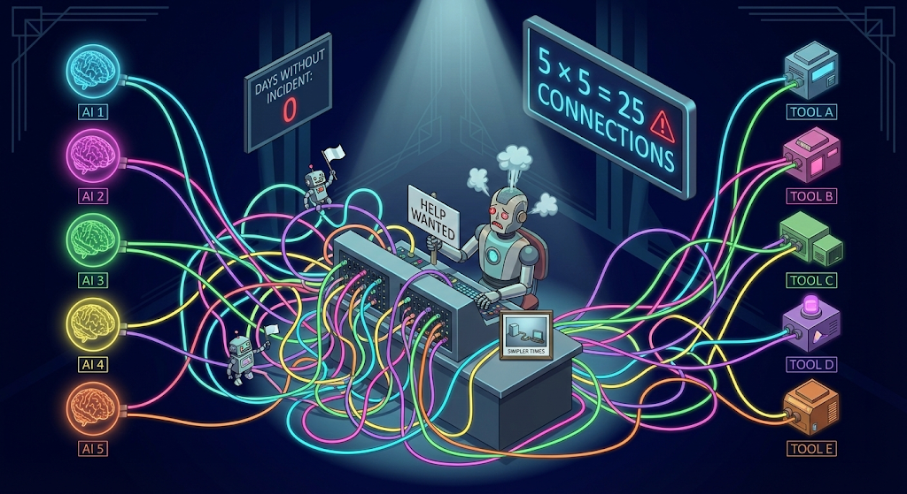

## The Connection Problem: Why This Matters

Picture this: Your AI agent needs to call a CRM, run a compliance check, and write to a database. Simple enough, right?

Now imagine doing that across dev, staging, and production environments. With two different agent frameworks. While your team debates switching from OpenAI to Claude.

This is where most teams spiral into what one industry analysis calls the “N×M integration problem.” Every combination of agent and tool requires its own connector. Many agent platforms blend “tool schemas, identity, state, and policy into one monolithic blob,” creating brittle systems that break when anything changes.

The solution? Treat tool access as a **transport + contract problem**, not an agent-specific feature.

Press enter or click to view image in full size

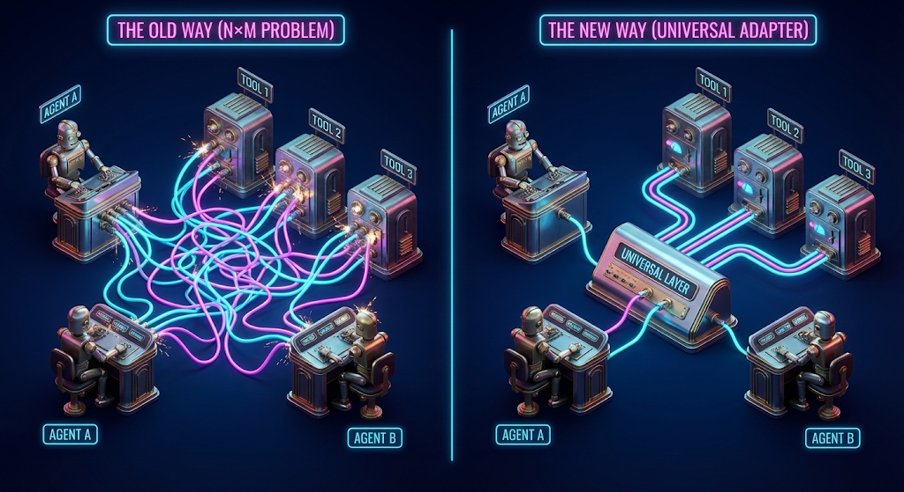

## The Three Connection Methods

Let’s break down the three approaches you can use today.

Press enter or click to view image in full size

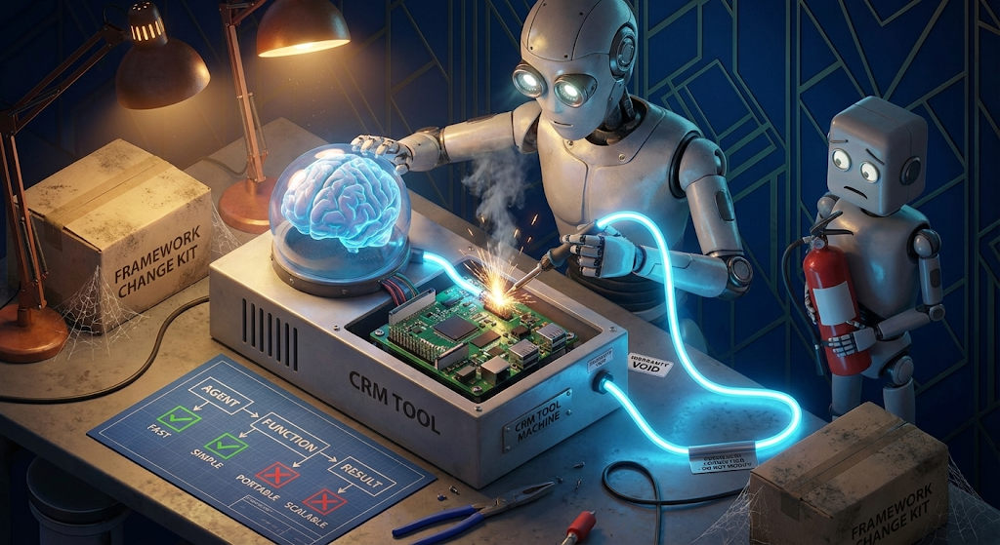

## 1\. Raw Tool Calling: The Direct Wire

The simplest method is hardcoding tool calls directly into your agent. Think of it as soldering a wire from your device to a specific component on a circuit board. It works, but good luck changing anything later.

With OpenAI’s function-calling API or similar frameworks, you define tools as Python functions in your agent’s code. The agent decides to act, calls the function, gets a result. Done.

```
from pydantic import BaseModel
from typing import Optional

class LookupCustomerArgs(BaseModel):
    customer_id: str

def lookup_customer(args: LookupCustomerArgs) -> dict:
    """Directly call CRM API - tightly coupled to this codebase"""
    
    api_url = os.getenv("CRM_API_URL", "https://crm.dev.internal")
    response = requests.get(f"{api_url}/customers/{args.customer_id}")
    return response.json()


@tool()  
def lookup_customer_tool(args: LookupCustomerArgs) -> dict:
    return lookup_customer(args)
```

I’ve seen teams run this pattern successfully for months. Then someone asks “Can we also run this agent with Anthropic’s Claude?” and suddenly you’re staring at weeks of refactoring. The function definitions, the decorators, the environment handling, all framework-specific.

The call flow is beautifully minimal:

Press enter or click to view image in full size

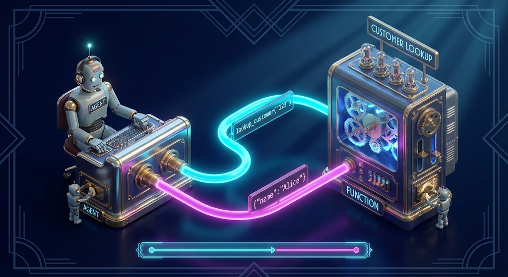

**The Trade-offs:**

Press enter or click to view image in full size

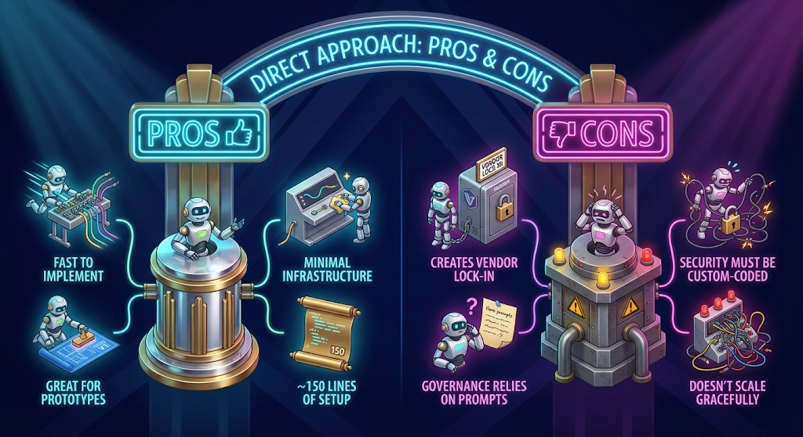

Raw tool calling works great for prototypes. But the moment you need to switch frameworks, add environments, or enforce governance, you’ll feel the pain. Every change means rewriting connectors.

Press enter or click to view image in full size

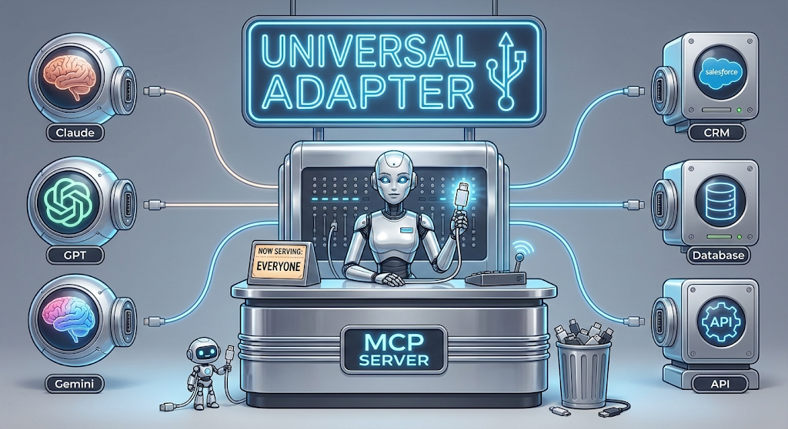

## 2\. MCP Tool Server: The Universal Adapter

The Model Context Protocol (MCP), introduced by Anthropic in November 2024, has become the “USB-C of AI tooling.” It’s now adopted by OpenAI, Google DeepMind, Microsoft, and hundreds of other organizations. In December 2025, Anthropic donated MCP to the Linux Foundation’s Agentic AI Foundation, cementing its role as a vendor-neutral standard.

Instead of hardcoding connections, you run a separate **tool server** that exposes tools in a standardized way. Any agent that speaks MCP can connect to any MCP-compliant tool.

Press enter or click to view image in full size

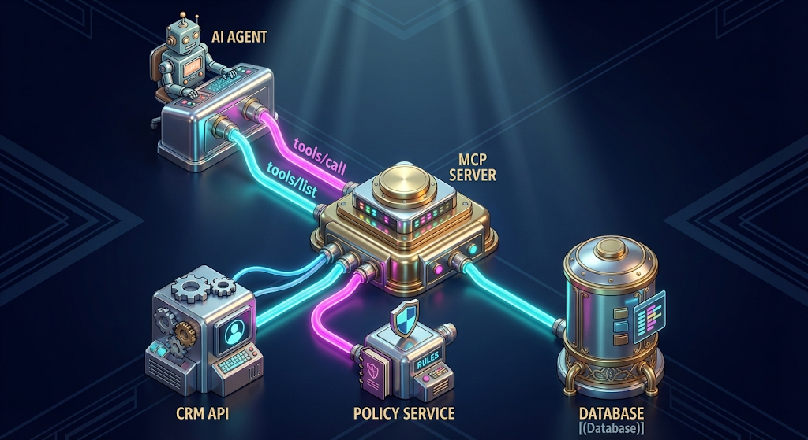

**How It Works:**

1.  **Tool Discovery**: Your agent sends a `tools/list` request to the MCP server
2.  **Schema Validation**: The server returns each tool’s name, description, and JSON schema (often defined with Pydantic)
3.  **Standardized Calls**: The agent uses `tools/call` with the tool name and arguments

The magic? **Switching environments means changing a URL, not rewriting code.** Point to `mcp-tools.stage:8080` for staging, `mcp-tools.prod:8080` for production. Your agent code stays identical.

Even better, you can test your agent against a mock MCP server during development, then connect to production services without touching a single line of agent logic.

Press enter or click to view image in full size

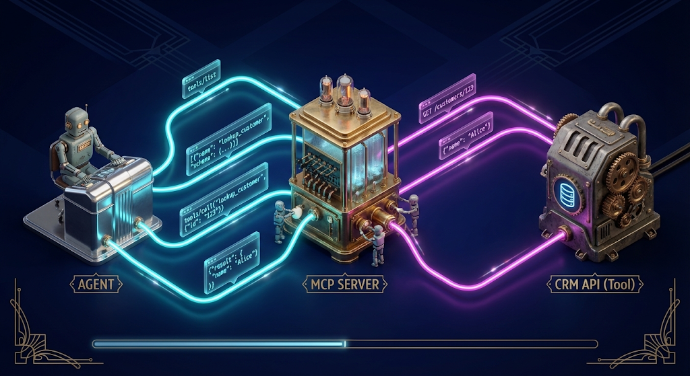

**Why MCP Won the Standards War:**

When Anthropic launched MCP in November 2024, skeptics wondered if anyone would adopt “another protocol.” Then OpenAI integrated it across the Agents SDK and ChatGPT desktop in March 2025. Google DeepMind followed. Microsoft added it to Azure Copilot. Block, Cursor, Replit, Sourcegraph, all joined.

The turning point? Developers realized MCP solved a real problem they hit daily. As GitHub’s Jeimy Ruiz observed: “More projects are exposing their functions via MCP so any LLM can call them.”

By December 2025, Anthropic donated MCP to the Linux Foundation’s Agentic AI Foundation, joined by OpenAI and Block as co-founders. The protocol had gone from internal experiment to industry standard in just over a year.

**The Trade-offs:**

Press enter or click to view image in full size

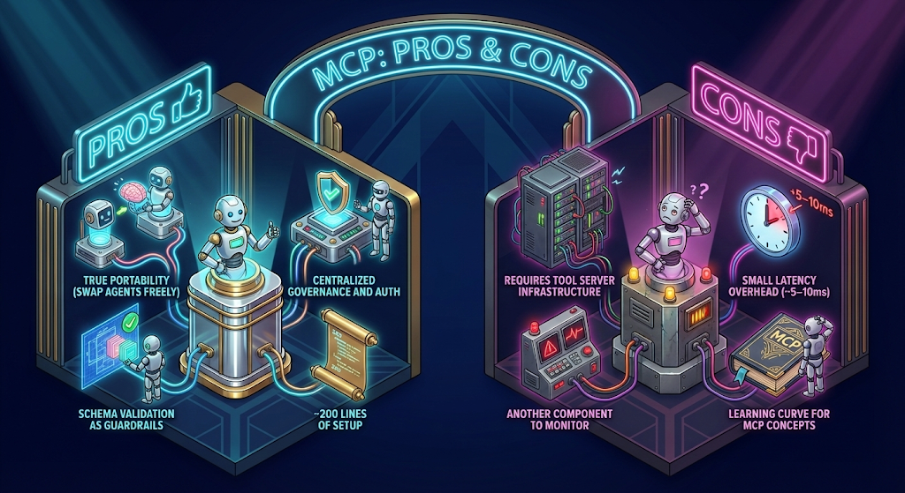

The ecosystem has exploded. The MCP Registry now lists nearly 2,000 servers. Major platforms like Cursor, Replit, and Sourcegraph have integrated MCP for real-time code context. This isn’t experimental anymore; it’s production infrastructure.

Press enter or click to view image in full size

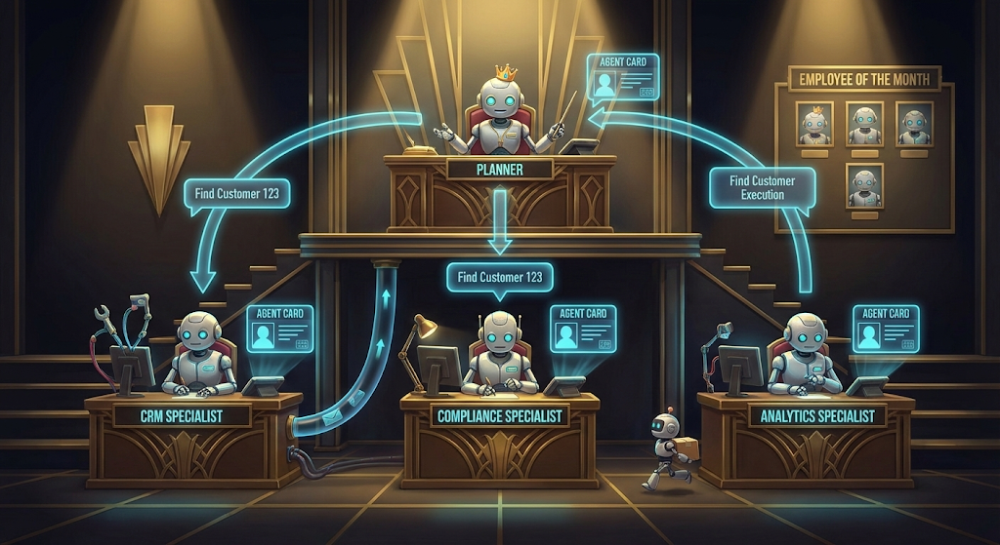

## 3\. ADK/A2A Brokered Calls: The Smart Coordinator

What if your challenge isn’t just connecting to tools, but coordinating multiple specialized agents? Enter Google’s Agent Development Kit (ADK) and the Agent-to-Agent (A2A) protocol.

A2A, announced in April 2025 and now hosted by the Linux Foundation with over 150 supporting organizations, lets agents delegate tasks to other agents. Think of it as a project manager coordinating specialists.

Press enter or click to view image in full size

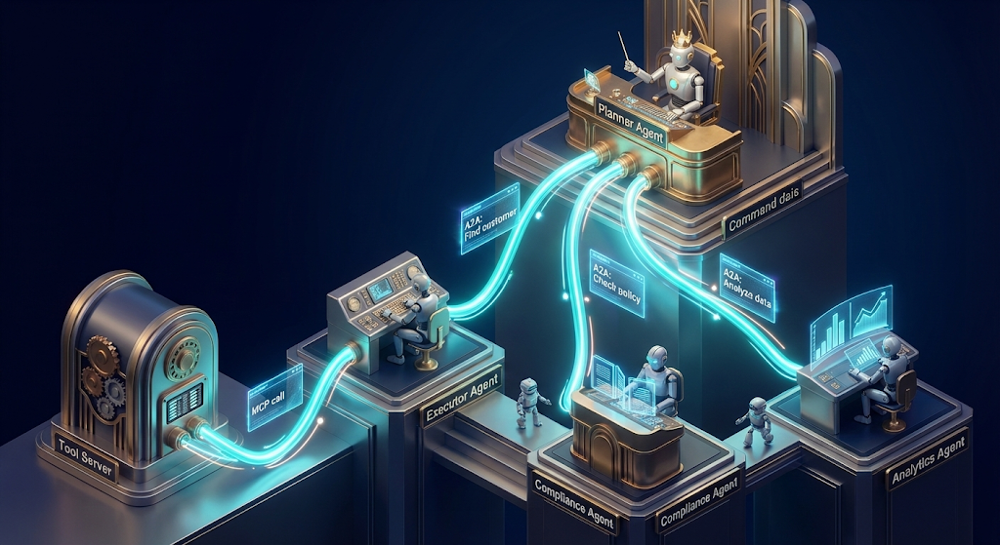

Instead of the Planner calling tools directly, it sends an A2A message: “Hey ExecutorAgent, get customer 123 from CRM.” The Executor handles the actual tool call and returns results.

**Key Concepts:**

-   **Agent Cards**: JSON documents advertising each agent’s capabilities (like a digital business card)
-   **Task Lifecycle**: Defined states for tracking work across agents
-   **Opaque Collaboration**: Agents work together without exposing internal logic or memory

Press enter or click to view image in full size

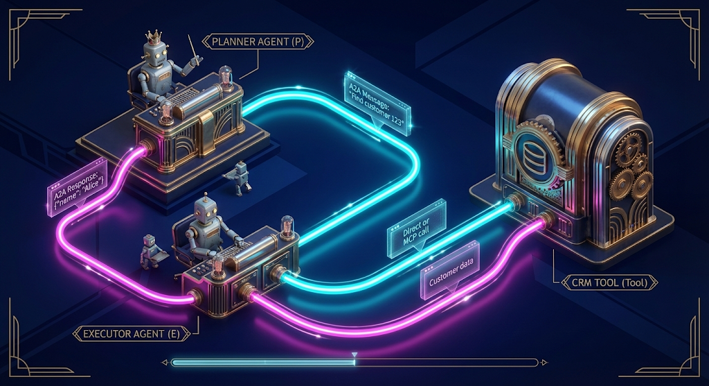

Built on HTTP and JSON-RPC, A2A feels familiar to anyone who’s built web services. Version 0.3 added gRPC support and signed security cards for enterprise deployments.

**The Trade-offs:**

Press enter or click to view image in full size

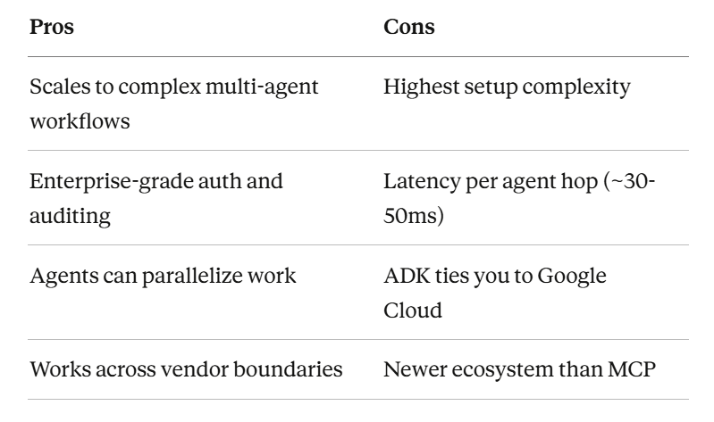

**Critical distinction**: A2A is an open protocol; ADK is Google’s proprietary framework. You can implement A2A without ADK, but using ADK today means a Google Cloud dependency.

**Real-World A2A in Action:**

Consider a hiring workflow. A manager’s agent needs to: source candidates, schedule interviews, run background checks, and generate offer letters. Instead of one massive agent doing everything, A2A lets specialized agents collaborate:

Press enter or click to view image in full size

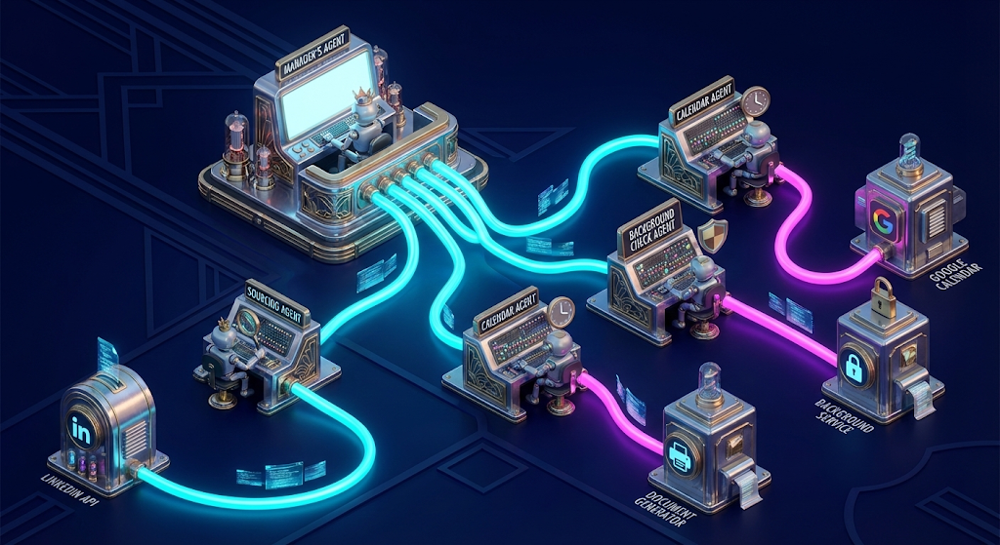

Each agent advertises its capabilities through an Agent Card. The manager’s agent discovers these capabilities, delegates tasks, and receives results without needing to understand how each specialist works. This is the same pattern that made microservices successful, applied to AI agents.

Press enter or click to view image in full size

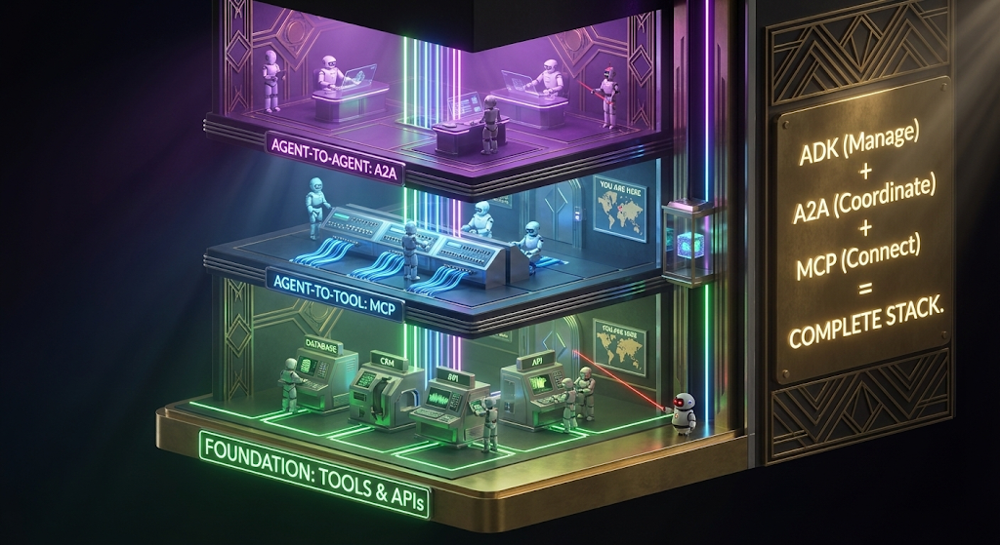

## How They Fit Together

Here’s the insight that transforms your architecture: **these layers are complementary, not competing.**

Press enter or click to view image in full size

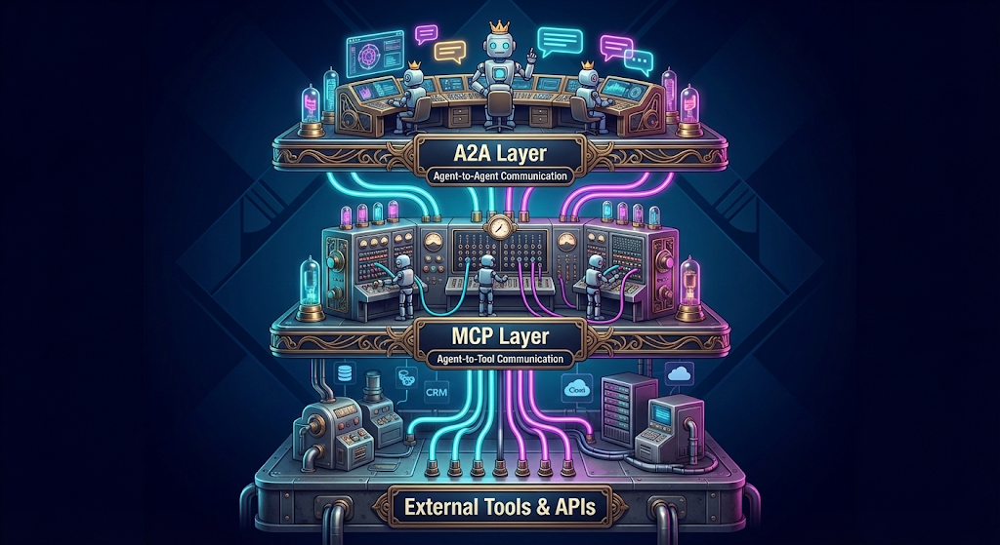

Google’s own stack demonstrates this: ADK manages agents, A2A handles their communication, and MCP connects them to external tools. You can adopt one layer at a time based on your needs.

Press enter or click to view image in full size

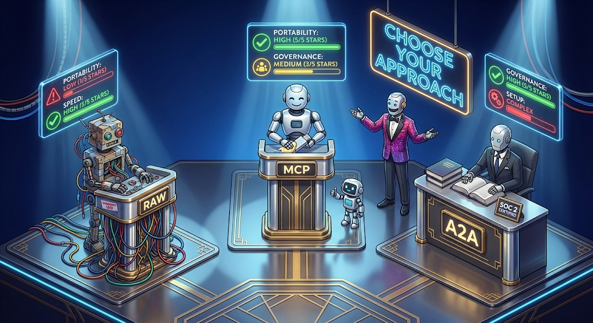

## The Comparison Matrix

Here’s the decision framework for senior engineers:

Press enter or click to view image in full size

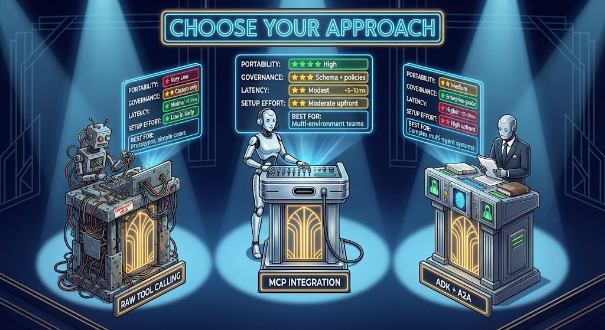

## Migration Playbook: Getting to Universal Tooling

Ready to standardize? Here’s your step-by-step path, based on patterns I’ve seen work across teams ranging from startups to Fortune 500 deployments.

Press enter or click to view image in full size

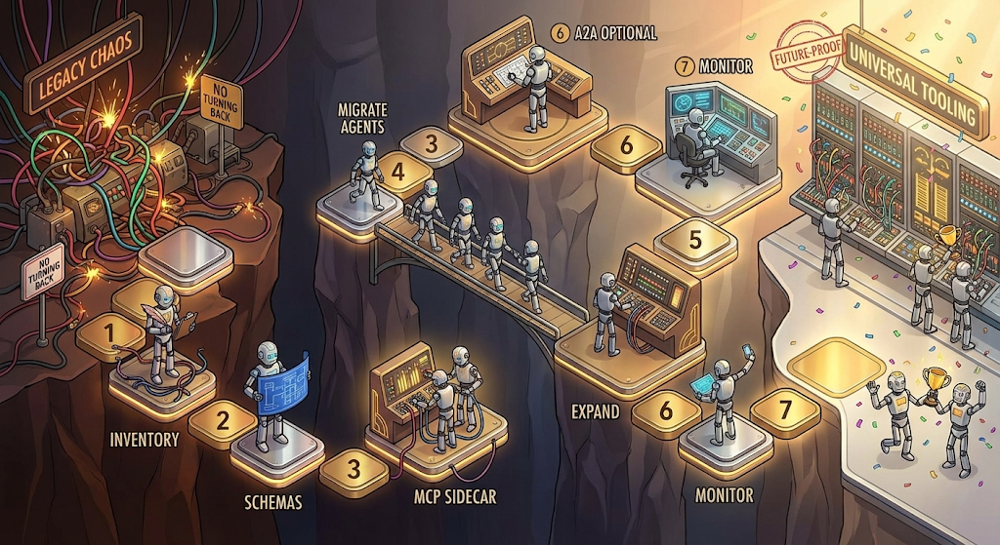

**Step 1: Inventory Your Tools**

List every API your agents call. Identify which change frequently or span multiple agents. These are your first candidates. Don’t boil the ocean; pick two or three critical tools to start.

**Step 2: Define Schemas**

Even before MCP, create clear interfaces for each tool using Pydantic or JSON Schema. Document inputs, outputs, and side effects. This discipline pays off immediately and makes MCP adoption trivial later.

```
class LookupCustomerArgs(BaseModel):
    """Arguments for customer lookup tool"""
    customer_id: str
    include_history: bool = False

class CustomerResult(BaseModel):
    """Structured response from customer lookup"""
    name: str
    status: str
    history: list[dict] | None = None
```

**Step 3: Deploy an MCP Sidecar**

Start with one or two tools. Run an MCP server that wraps your existing APIs. You don’t need to change your backend services at all; the MCP server acts as a translation layer. Many teams use open-source servers in Python or Go, while others leverage hosted options from cloud providers.

```
# Example MCP server setup (simplified)
from mcp_server import MCPServer, Tool

server = MCPServer()

@server.tool(schema=LookupCustomerArgs)
async def lookup_customer(args: LookupCustomerArgs) -> CustomerResult:
    # Your existing API call logic here
    result = await crm_client.get_customer(args.customer_id)
    return CustomerResult(**result)

server.run(port=8080)
```

**Step 4: Migrate Agents**

Replace direct function calls with MCP tool references. Most modern frameworks (LangChain, OpenAI Agents SDK, CrewAI) have MCP adapters or client libraries. Test thoroughly; behavior should be identical.

**Step 5: Expand Coverage**

Over sprints, wrap remaining tools. Retire direct integrations. Your agents now call nothing directly; everything flows through MCP. This is when the investment pays off: adding a new agent takes minutes, not days.

**Step 6: Consider A2A (Optional)**

If you’re running multiple specialized agents, add A2A for coordination. Your MCP foundation makes this straightforward since each agent already speaks a standard language to its tools. A2A adds the coordination layer on top.

**Step 7: Monitor and Optimize**

Once in production, watch the MCP server’s performance. Look for redundant calls (agents reasoning step-by-step might call the same tool repeatedly). Add caching at the MCP layer or optimize agent prompts to reduce unnecessary roundtrips.

Press enter or click to view image in full size

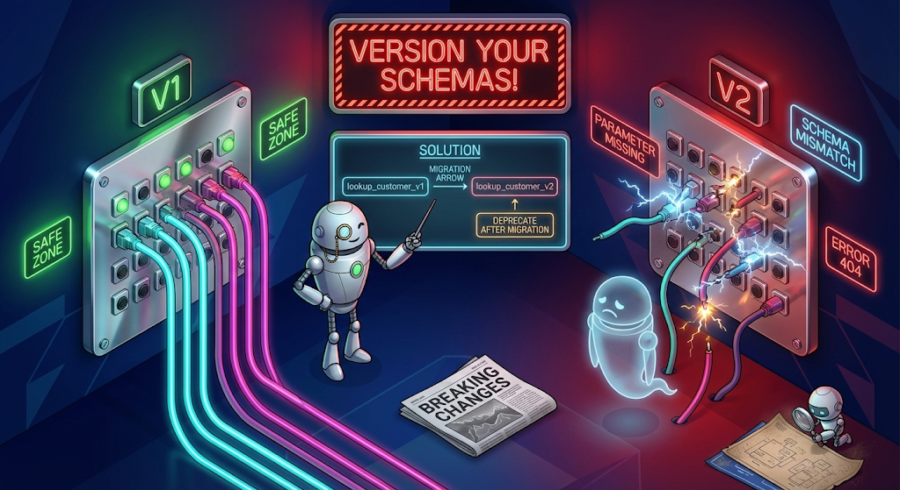

## Watch Out: Tool Schema Drift

One hard-won lesson: **tool schema drift will silently break your system.**

If you change `lookup_customer` to accept an optional `include_history` flag, agents with cached tool descriptions might fail. The fix? Treat tool schemas like API versioning.

```
lookup_customer_v1  → original schema
lookup_customer_v2  → adds include_history parameter
```

Deprecate v1 only after all agents migrate to v2. This prevents the subtle failures that turn debugging into archeology.

Press enter or click to view image in full size

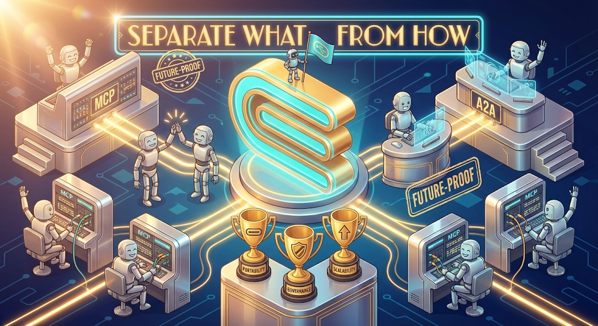

## The Bottom Line

Choosing how your AI connects to tools is now a critical architectural decision. The landscape has matured rapidly:

-   **MCP** has become the de facto standard for agent-to-tool communication, backed by the Linux Foundation and adopted by every major AI provider
-   **A2A** provides the agent-to-agent layer for complex workflows, with 150+ organizations supporting it
-   **Raw tool calling** still works for prototypes but creates debt you’ll pay later

Press enter or click to view image in full size

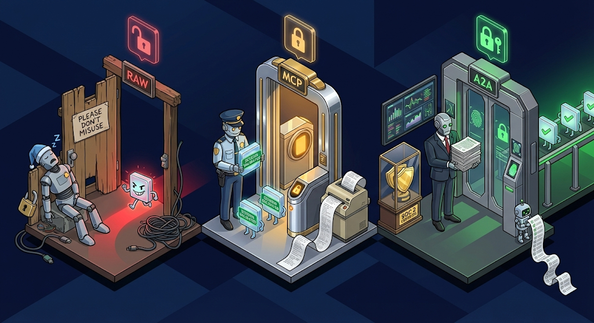

## Governance: The Hidden Differentiator

Beyond portability and performance, **governance** is where these approaches diverge dramatically, and it’s often the deciding factor for enterprise teams.

**Raw Tool Calling:** Security is entirely custom. You must code authentication, authorization, rate limiting, and audit logging around each tool call. There’s no uniform enforcement; you’re relying on the agent’s prompt not to misuse tools. One prompt injection, and your CRM data walks out the door.

**MCP:** The tool server becomes your governance checkpoint. You can implement token-based authentication, restrict which records each agent can access, and log every call centrally. The schema itself acts as a guardrail; agents can’t call tools with missing or invalid parameters. Some MCP servers support fine-grained permissions, such as “this agent can read customer names but not credit card numbers.”

**A2A:** Designed “secure by default” for enterprise environments. A2A supports OpenAPI-like authentication schemes for agent communication. When your Planner asks an Executor to perform a task, the request includes authentication, and the Executor can enforce that the Planner is authorized for that action. ADK (on Google Cloud) adds centralized logging and policy enforcement.

Press enter or click to view image in full size

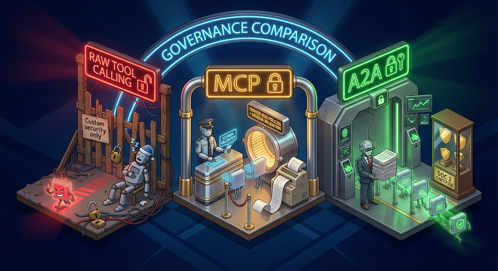

If your organization requires SOC 2 compliance, HIPAA, or similar frameworks, the governance story alone might push you toward MCP or A2A. The overhead pays for itself in audit readiness.

The goal of both MCP and A2A is identical: **separate what an agent does from how it does it.** This modularity means your AI systems can evolve without constant rewrites.

Start with MCP. It’s the lowest-regret choice that immediately unlocks portability. Add A2A when your agent count justifies coordination overhead. And skip raw tool calling for anything beyond a weekend project.

The “USB-C of AI tooling” isn’t just a metaphor anymore. It’s infrastructure you can build on today.

_What’s your experience with agent tool integration? Are you already using MCP or evaluating A2A? Drop a comment below._