## EXECUTIVE ABSTRACT

The enterprise that builds a semantic operating system in 2025 will have a 3-year structural advantage that is difficult and expensive to replicate. Ontology engineering — the formal discipline of defining what business terms mean, how entities relate, what constraints are valid, and which inferences are permitted — is becoming the substrate on which trustworthy AI architectures are built. This article makes three arguments: first, that semantic fragmentation is already costing most enterprises 15–25% of data engineering time and is the primary reason AI programs plateau; second, that the agentic AI inflection point of 2024–2025 makes formal semantic grounding non-optional — agents cannot reconcile ambiguity the way human analysts can; and third, that the Semantic Ontology Engineering Framework (SOEF) provides a prescriptive, seven-stage path from current-state semantic debt to production semantic runtime — with defined inputs, outputs, acceptance gates, and measurable ROI at every stage. For Google Cloud Premier Partners and enterprises building on the GCP stack, the path runs through Enterprise Knowledge Graph, Vertex AI RAG Engine, Spanner Graph, and Agent Builder — and it starts with a decision, not a technology.

## 1\. Why Now: The Agentic Inflection Point

Ontology engineering is not a new discipline. It has been practised in academia since the 1980s, in enterprise knowledge management since the early 2000s, and in linked data programs since 2010. If it was valuable then, why is it urgent now?

> _The answer is the agentic AI inflection point of 2024–2025._

For the first five years of enterprise AI, the primary failure mode was retrieval error: the system returned the wrong document, the wrong data point, the wrong answer. Humans caught the errors. The organizational cost was real but survivable — analysts reviewed outputs, engineers wrote defensive prompt templates, product teams added guardrails. Semantic ambiguity was a quality problem.

In 2025, the primary modality is shifting from retrieval to action. Agents don’t return an answer for a human to evaluate. They execute: they make the offer, initiate the order, modify the configuration, send the communication, update the record. The error window is milliseconds, not hours. There is no analyst in the loop to catch the moment a commerce agent recommends an offer that violates eligibility rules the LLM hallucinated as valid.

> When the enterprise moves from human in the loop to machine in the loop, semantic ambiguity stops being a quality problem and becomes a trust-architecture failure. An agent that acts on an approximate definition of ‘customer’ is not making a small error. It is making a systematically wrong class of decisions at machine speed

This is the precise moment at which ontology engineering becomes non-negotiable infrastructure. Not as a best practice. Not as a governance aspiration. As the precondition for safe autonomous action at enterprise scale.

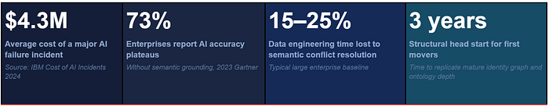

Three structural forces make 2025 the inflection year. First, production agent deployments are scaling beyond pilot: every major cloud provider has released agent runtime infrastructure (Google Agent Builder, AWS Bedrock Agents, Azure AI Foundry) that is designed for enterprise-scale autonomous action. Second, the regulatory environment for AI systems is tightening: the EU AI Act’s requirements for traceable, auditable AI decision-making are structurally aligned with what a semantic control plane provides. Third, the competitive differentiation window is open but closing: the enterprises that build their semantic operating systems in 2025–2026 will have identity graphs, SHACL conformance histories, and domain ontology depth that are expensive and slow to replicate from zero.

## 2\. The Semantic Fragmentation Crisis

The next enterprise bottleneck is not compute. It is not storage. It is not even model quality. It is meaning.

Most enterprises now have enough cloud, enough data, and enough AI experimentation to prove that scale alone does not create coherence. The real fracture line is semantic fragmentation: the same business word means different things in different systems, teams, and agent workflows.

-   Is a customer the same as an account?
-   Is a product the same as an offer?
-   Is a subscriber the same as a payer?
-   Is a diagnosis term equivalent to a billing code?
-   Is a service outage a network event, a customer-impact event, or both?

Without a semantic layer, every pipeline, dashboard, search result, and agent workflow answers those questions differently. In a human-mediated enterprise, that drift created friction and meeting time. In an AI-mediated enterprise, it creates compounding failures at machine speed.

> Enterprises have been quietly accumulating semantic debt: years of schema divergence, conflicting master data domains, overlapping glossary entries, and ad hoc data contracts that were never formally reconciled. Like technical debt, semantic debt compounds. Unlike technical debt, it cannot be paid down with a refactoring sprint. It must be addressed architecturally — and it gets more expensive to address with every system that joins the estate.

## 3\. Conceptual Landscape: From ERD to Ontology

Before an architect can make a defensible technology choice, they must separate six representations that are routinely conflated. Each captures a different slice of reality and cannot substitute for the others.

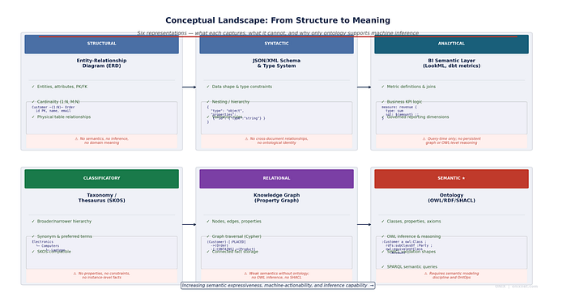

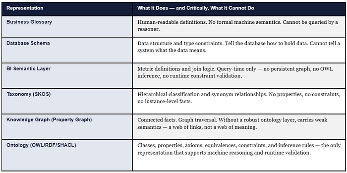

## THE ARCHITECT’S DIAGNOSTIC

If your enterprise cannot answer ‘is customer X the same entity as account Y?’ in a machine-executable way — as a formally stated owl:equivalentClass or owl:sameAs relationship, not as a SQL join and not as a glossary entry — then you do not yet have an ontology. You have a schema with aspirations. The distinction matters because an agent that must answer this question probabilistically at inference time will occasionally get it wrong. An agent that reads the answer from a formal identity declaration never gets it wrong.

## 4\. How an Ontology Is Formally Defined: OWL · SHACL · SPARQL

Most enterprise architects have read about OWL and SHACL. Far fewer have seen what formal ontology definition looks like in practice. This section shows the real constructs — the ones that distinguish an ontology from a data model, a taxonomy, or a well-labelled graph.

## 4.1 RDF Triple — The Atomic Unit of Meaning

Every fact in a semantic graph is expressed as a triple: subject, predicate, object. This is not a metaphor — it is the literal data model. Three triples below assert class membership, hierarchy, and a relationship between instances.

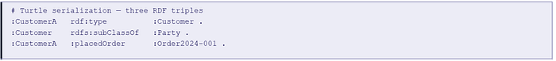

## 4.2 OWL Class Definition with Axioms

An OWL class definition specifies not just that a class exists but what it means: its position in the hierarchy, its equivalences, its disjointness from related classes, and any necessary conditions for class membership.

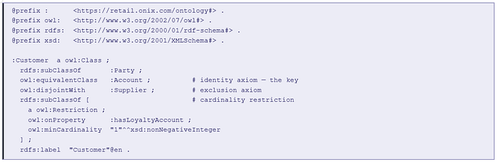

_The owl:equivalentClass axiom between :Customer and :Account is not a data mapping — it is a semantic identity declaration. Any reasoner can now infer that any query over :Account returns :Customer instances and vice versa. This is what ontology does that a schema or catalog cannot._

## 4.3 SHACL Shapes — Runtime Validation

SHACL (Shapes Constraint Language) validates whether graph instances conform to declared shapes at runtime — making it the enforcement mechanism for data quality, business rule compliance, and agent-safe state validation.

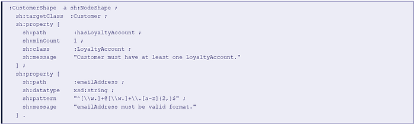

## 4.4 SPARQL — Querying the Semantic Graph

SPARQL traverses graph relationships using triple patterns — enabling queries that follow semantic connections across the graph, filtering by class membership, property values, and graph structure simultaneously.

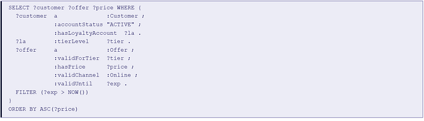

## 4.5 OWL Class Hierarchy in Practice

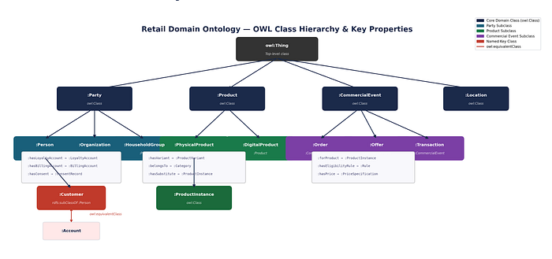

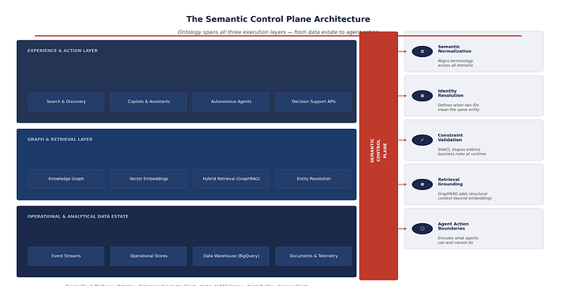

_Figure 3: The Semantic Control Plane — spanning data estate, retrieval, and agent execution layers_

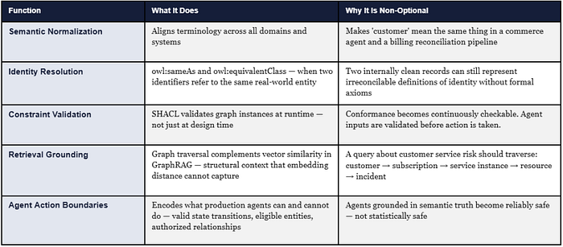

## 6\. The SOEF: Seven-Stage Prescriptive Framework

The Semantic Ontology Engineering Framework (SOEF) is a decision-first, domain-first, runtime-oriented development path. Each stage has defined inputs, outputs, tooling, roles, and acceptance gates. Skipping a stage does not accelerate the program — it defers the failure to a more expensive moment.

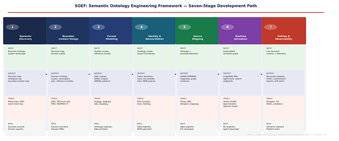

_Figure 4: SOEF — Seven-Stage Semantic Ontology Engineering Framework_

## Stage 1 — Semantic Discovery

Start with decisions, not data models. Produce a decision inventory table (≥20 named decisions requiring consistent semantic grounding), an ambiguity log (≥15 contested terms with domain-specific interpretations documented), and bounded-context candidates (≥3). Run a DDD event storming session to surface domain event boundaries. Acceptance gate: stakeholder sign-off on the semantic risk register.

> _Output: Decision Inventory Table · Ambiguity Log · Domain Event Map · Bounded-Context Candidates · Semantic Risk Register_

## Stage 2 — Bounded-Context Design

Apply Domain-Driven Design discipline. Define a Bounded Context Canvas for each priority context. Match each context to its reference anchor: FIBO for banking, TM Forum SID for telecom, SNOMED CT for clinical, GS1 for retail product. Define a URI namespace architecture with versioning conventions. Acceptance gate: Context Map with all cross-domain integration contracts declared.

> _Output: Namespace Architecture Plan · Reference Model Selection · Context Map · Cross-Domain Integration Contracts_

## Stage 3 — Formal Semantic Modeling

Define every class with rdfs:subClassOf (hierarchy), owl:equivalentClass (identity), owl:disjointWith (exclusion), and cardinality restrictions. Declare all properties with rdfs:domain and rdfs:range. Select OWL 2 profile based on reasoning requirements: EL for healthcare, RL for retail, DL for banking risk. Introduce SHACL shapes alongside every class from day one. Acceptance gate: OWL files passing syntax validation; SHACL shapes covering all priority classes.

> _Output: OWL Ontology Files (Turtle) · SHACL Shape Library · SPARQL Query Patterns · OWL Profile Declaration_

## Stage 4 — Identity & Reconciliation

Enumerate the top entity types requiring resolution. Define blocking rules, scoring rules, and threshold rules for each. Materialize resolved identity as owl:sameAs triples with confidence scores persisted as graph properties (:identityConfidenceScore xsd:decimal). Extend MDM policies with formal semantic constraints. Acceptance gate: entity resolution precision >95%, recall >90% on the top three entity types.

> _Output: Entity Resolution Rule Specifications · owl:sameAs Links · Confidence Score Properties · MDM Policy Extensions_

## Stage 5 — Source Mapping & Instantiation

Author formal R2RML or YARRRML mapping specifications for each priority source system. After first graph instantiation, run full SHACL validation immediately — target >95% conformance. For each violation: diagnose root cause (source quality vs mapping error vs shape definition). Design incremental refresh pipeline with CDC and freshness SLA per entity type. Acceptance gate: >80% source system coverage; >95% SHACL conformance.

> _Output: R2RML/YARRRML Mapping Files · First SHACL Validation Report · Incremental Refresh Pipeline · Freshness SLA_

## Stage 6 — Runtime Activation

Configure Vertex AI RAG Engine with semantic graph. Design hybrid retrieval: SPARQL for structured traversal + vector for unstructured content. Define semantic-grounded agent tools — each tool declares which OWL classes it operates over and which SHACL shapes must pass before it executes. Establish retrieval quality benchmark (precision@10 GraphRAG vs vector-only baseline). Acceptance gate: >15% GraphRAG improvement over baseline.

> _Output: GraphRAG Retrieval Endpoints · Agent Tool Definitions · Retrieval Quality Benchmark Report_

## Stage 7 — OntOps & Observability

Implement semver for ontology releases. Run semantic diff (OntoDiff or ROBOT) before every release. Run continuous SHACL validation — not just batch. Establish Semantic Council: bi-weekly meeting of domain stewards + central council with decision log. Track all eight observability KPIs with named owners. Acceptance gate: first versioned release with semantic diff documented; all eight KPIs live.

> _Output: Versioned Release Pipeline · Semantic Diff Reports · SHACL Conformance Dashboard · Semantic Council Charter · Eight Observability KPIs_

## 7\. The Compounding Advantage: Why First Movers Win Structurally

The most strategically important argument in this article is also the least commonly made. Ontology engineering is not just a capability investment — it is a compounding infrastructure moat.

_The enterprise that builds a semantic operating system in 2025 will have a structural advantage in 2028 that is difficult and expensive to replicate from zero. Not because the technology is proprietary. Because the value is in the data — in the identity links, the SHACL conformance history, the domain ontology depth — and data of this kind accumulates slowly and degrades immediately when governance lapses._

The compounding mechanism works in three reinforcing loops.

## Loop 1: Identity Resolution Compounds

Every owl:sameAs link added to the identity graph makes all future entity-centric queries more accurate. The 10,000th identity link added in year three is more valuable than the first link added in year one — because it connects to an already-rich graph that amplifies its contribution. An enterprise starting from zero in 2028 cannot shortcut this; identity resolution requires historical evidence of entity co-occurrence across source systems, and that evidence takes time to accumulate.

## Loop 2: SHACL Conformance History Compounds

Every SHACL validation run produces a conformance history — a time-series record of which entity types, source systems, and graph patterns were conformant and when they diverged. This history is the empirical foundation of a data quality SLA. It also becomes training signal for detecting semantic drift before it propagates to downstream consumers. An enterprise with two years of SHACL conformance history has a semantic quality baseline that cannot be instantiated from scratch.

## Loop 3: OWL Inference Depth Compounds

As the ontology grows — more classes, more property chains, more equivalence axioms — the inferential reach of each new fact added to the graph increases. A new product instance added to a mature retail ontology automatically inherits the substitution equivalence, margin characteristics, and eligibility rules of its category — because those are declared as class axioms, not per-instance assignments. The 100th product added to the graph benefits from the full axiom structure built around the first 99.

## THE COMPETITIVE IMPLICATION

An enterprise with three years of mature ontology depth does not simply have better data quality than a competitor starting from zero. It has a different class of AI capability. Its agents can answer questions that a semantically naive agent cannot even formulate. The speed of the first-mover advantage is determined by the complexity of the enterprise’s entity landscape — and in telecom, banking, and healthcare, that landscape is complex enough that the structural gap takes three to five years to close.

## 8\. The Cost of Not Acting: Quantifying Semantic Debt

The case for ontology engineering is often made as a positive argument — what becomes possible. It is equally important to make the negative argument: what is the current cost of semantic fragmentation, and what does it cost when AI programs operate without formal semantic grounding?

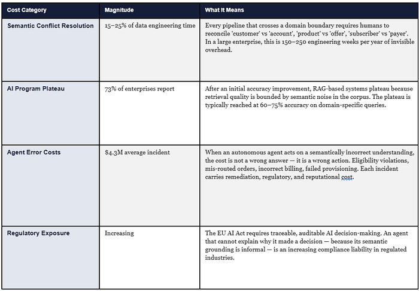

_The cost of not acting is not just these direct costs. It is the opportunity cost of the first-mover window. The enterprises that build their semantic operating systems in 2025–2026 are not just avoiding current-state costs. They are capturing the structural advantage that makes their AI programs increasingly more capable and increasingly harder to match. The window is open. It will not remain open indefinitely._

## 9\. Five Best Practices That Scale

## Practice 1: Build a thin core, rich domain extensions

Anchor to FIBO, TM Forum SID, or SNOMED CT. Extend where the business requires genuine differentiation. Organizations that replace reference models from scratch spend 2–3 years producing something structurally equivalent — without the community, the tooling support, or the regulatory recognition that the reference model carries.

## Practice 2: Make identity a first-class semantic concern from Stage 1

owl:sameAs is not a data mapping workaround. It is a formal identity declaration that enables inference across equivalent class representations without any application-layer translation. Deferring identity to Stage 5 means rebuilding the entire relational structure of the graph.

## Practice 3: Design for retrieval and action, not documentation

An ontology that is not improving GraphRAG precision or agent semantic error rate is not yet architecture. The measure of ontology maturity is operational: how much does it improve what the enterprise does. Set a retrieval quality benchmark on day one of Stage 6 and hold the ontology accountable to it.

## Practice 4: Federated ownership with a central Semantic Council

Domain teams own their semantic models and are accountable for their quality. A central Semantic Council owns the core ontology, naming standards, core abstractions, namespace governance, interoperability contracts, and SHACL validation gates. Centralising governance while decentralising authorship is the only pattern that has proven to scale.

## Practice 5: Place rules in the correct layer and document that placement explicitly

SHACL for structural and conformance rules. OWL for class semantics where inference is genuinely warranted. Highly dynamic transaction policy rules — promotional eligibility, credit limit logic, real-time consent, pricing tier — belong in a decisioning layer or application runtime, not in the ontology. The architectures that declare this placement explicitly are significantly easier to maintain and audit.

## 10\. Six Anti-Patterns That Kill Ontology Programs

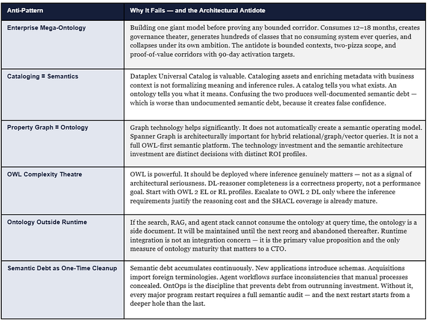

## 11\. The Ontology ISV Landscape: A Buyer’s Decision Framework

The market for ontology and semantic graph platforms divides into four natural quadrants based on two primary buying dimensions: ontology authoring depth and runtime integration strength.

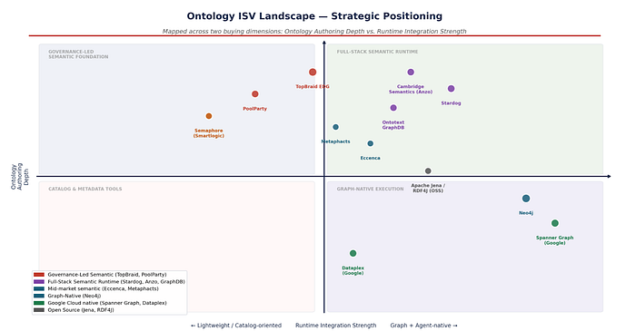

_Figure 5: Ontology ISV strategic positioning — authoring depth vs. runtime integration strength_

## ISV Capability Matrix

Ratings: ●●●●● = Best-in-class ●●●○○ = Production-grade ●●○○○ = Partial ●○○○○ = Limited

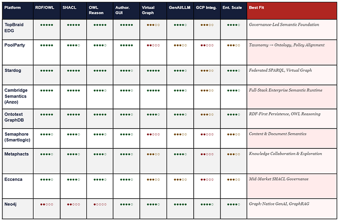

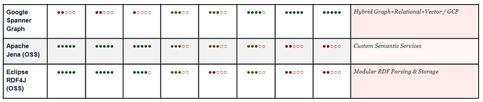

## 12\. Google Cloud: Three Architecture Patterns

## Pattern 1 — Google-Native Semantic Acceleration

Uses BigQuery (analytical persistence), Dataplex Universal Catalog (governance), Enterprise Knowledge Graph (reconciliation), Vertex AI RAG Engine (context augmentation), Spanner Graph (graph-aware retrieval), and Vertex AI Agent Builder + Agent Engine (agent lifecycle). This is the fastest path when the enterprise needs governed search, entity-centric retrieval, GraphRAG, and agent grounding without deploying and operating a heavy external semantic platform.

## Pattern 2 — Hybrid Semantic Runtime

Keeps Google Cloud as the execution plane and adds a specialized semantic layer. Neo4j on GCP Marketplace for graph-native applications and GenAI grounding. Stardog for semantic federation and live virtual-graph access into BigQuery with query-time inference. Ontotext GraphDB for RDF-first persistence, SPARQL, and OWL reasoning. Use this pattern when use cases require OWL inference or SPARQL query patterns that property-graph implementations do not natively support.

## Pattern 3 — Governance-Led Semantic Foundation

The right starting point when the bottleneck is semantic governance before graph scale. TopBraid EDG as the AI-ready data foundation on semantic web standards. PoolParty for taxonomy-to-ontology progression. This pattern is the correct first investment when the enterprise must align vocabulary, stewardship accountability, and policy before it industrializes retrieval or agent workflows. It does not preclude Patterns 1 or 2 — it precedes them.

## 13\. Open Ontologies and Reference Models by Industry

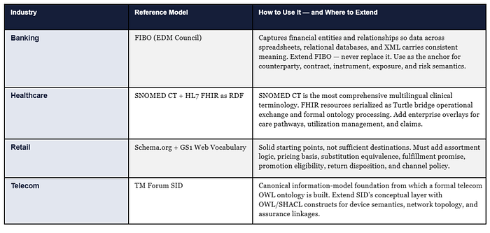

## 14\. Top 20 Use Cases: What the Semantic Operating System Powers

The following use cases represent the definitive set of enterprise AI capabilities that are either impossible or structurally unreliable without a formal semantic control plane. For each, the OWL/ontology requirement specifies the minimum formal modeling needed to enable the capability.

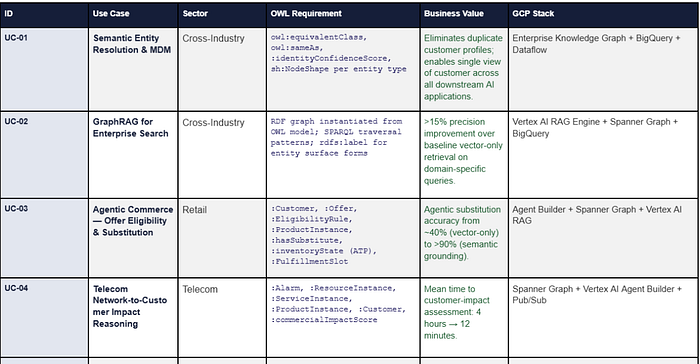

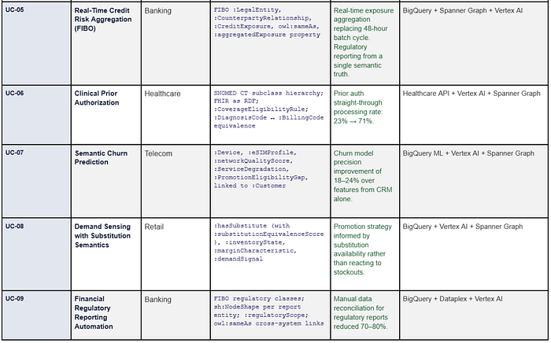

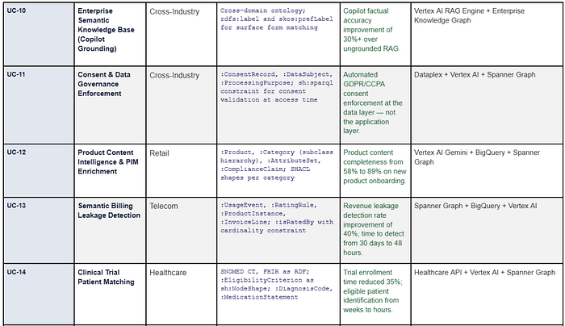

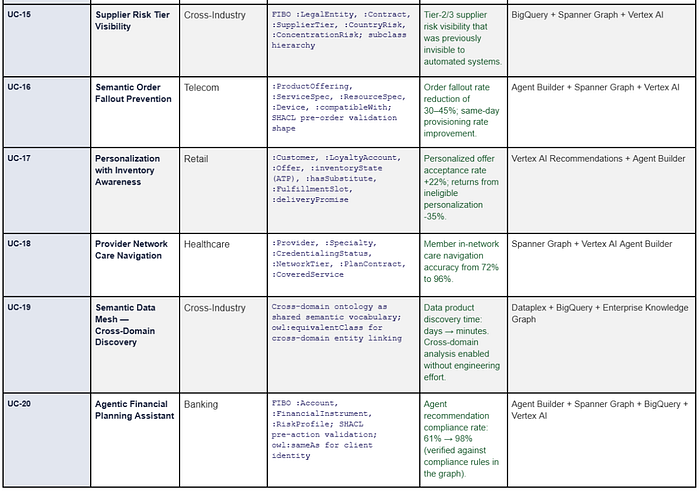

## 15\. Art of the Possible: Before and After

The following four scenarios illustrate the magnitude of change that a production semantic operating system enables across the industries where Onix operates. These are representative outcomes derived from delivery experience and published practitioner results — not theoretical projections.

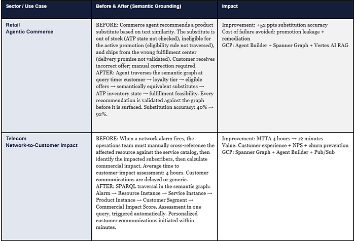

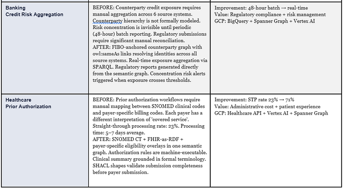

## 16\. Semantic Observability: Eight Production KPIs

Ontology becomes operationally credible to an executive when it is measurable, trending, and tied to a business outcome with a named owner and a quarterly review cadence. These eight metrics constitute the semantic observability dashboard for a production OntOps program.

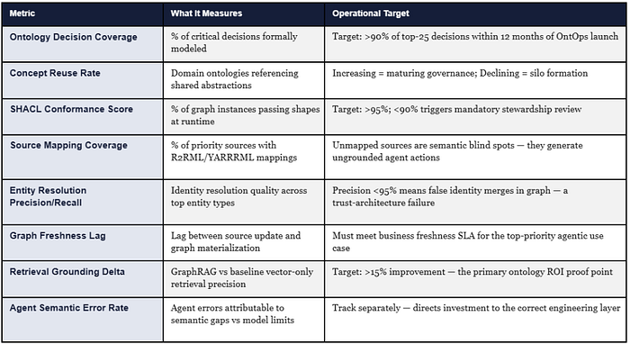

## 17\. CTO Decision Framework: Where to Start and What to Do Monday

Every strategic article should end not just with a vision but with a decision tree. Based on your current state, here is the prescriptive starting point.

## THREE QUESTIONS THAT DETERMINE YOUR STARTING PATTERN

Ask your architecture team three questions. First: How many contested business terms do we have across our top five source systems? If the answer is more than 50, you have a Pattern 3 problem — start with governance. Second: Do we have at least one production agentic use case in flight or in planning for the next 12 months? If yes, you need a SOEF Stage 6 target in your roadmap from day one. Third: Is our primary bottleneck ontology authoring or graph instantiation at scale? If authoring, start with TopBraid EDG or PoolParty. If scale, start with Stardog or Spanner Graph + SOEF Stage 5 focus.

## The 90-Day First Move

Regardless of pattern, the correct first 90-day move is the same: execute SOEF Stages 1 and 2. This means running the Semantic Discovery workshop (Stage 1) and producing the bounded-context architecture (Stage 2) before any tooling decision is made. No technology selection is defensible without the decision map, ambiguity log, and bounded-context candidates that Stages 1 and 2 produce. The workshop takes 2–3 weeks. The architecture takes 2–3 weeks. At the end of 45 days you have: a named list of decisions requiring consistent semantic grounding, a bounded-context map, a reference model selection justified to your domain, and a scoped ontology development roadmap with 90-day proof-of-value corridor defined.

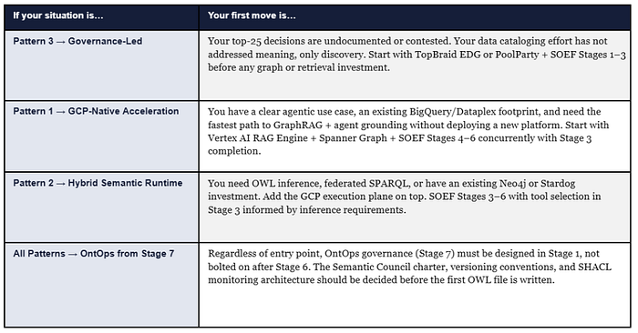

## 18\. The Strategic Conclusion

Data platforms answer what happened.

LLMs estimate what might be relevant.

Agents attempt to act.

ONTOLOGY defines what things are, how they relate, what constraints are valid, how identity is resolved — and therefore what actions should even be possible. It is not a semantic sidecar to AI architecture. It is becoming the substrate upon which trustworthy AI architecture is built.

The enterprises that have spent the last five years accumulating data lakes, model endpoints, and agent pilots without resolving semantic fragmentation are now encountering the same bottleneck from multiple directions simultaneously: retrieval quality plateaus, agent reliability fails to scale, governance exceptions multiply faster than they close. The problem is not the technology stack. The problem is the absence of a semantic operating system beneath it.

_The compounding advantage argument is the most important strategic signal in this article. The enterprises building their semantic operating systems in 2025 are not just solving a current-state quality problem. They are building a structural capability that becomes more accurate, more complete, and harder to match with every month of operation. The window for capturing that advantage is open. The agentic AI inflection point means it will not be open indefinitely._

_The gap between what an enterprise says and what it means is where AI programs currently fail. Closing it — through the SOEF, the semantic control plane, and production OntOps — is the defining infrastructure investment of the AI-first decade. The enterprises that close it first will not just have better AI. They will have AI that gets better faster. And that is the compounding advantage that redefines the competitive landscape._

Gaurav Agarwaal | SVP — Global Head, Solution Engineering at Onix

> Gaurav Agarwaal advises enterprise CXOs on AI strategy, semantic architecture, and large-scale data modernization. He operates as a Field CDAIO, helping enterprises translate AI strategy into production-grade semantic infrastructure. Onix is a Google Cloud Premier Partner specializing in AI, data, and cloud transformation at enterprise scale. [onixnet.com](http://onixnet.com/)