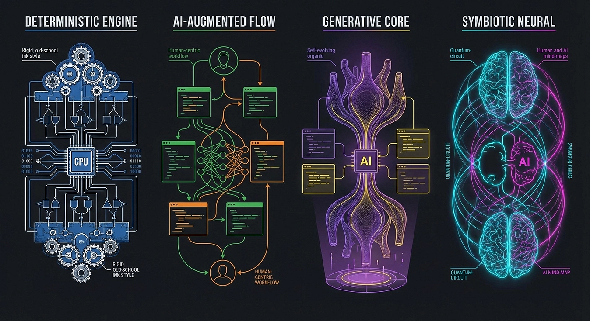
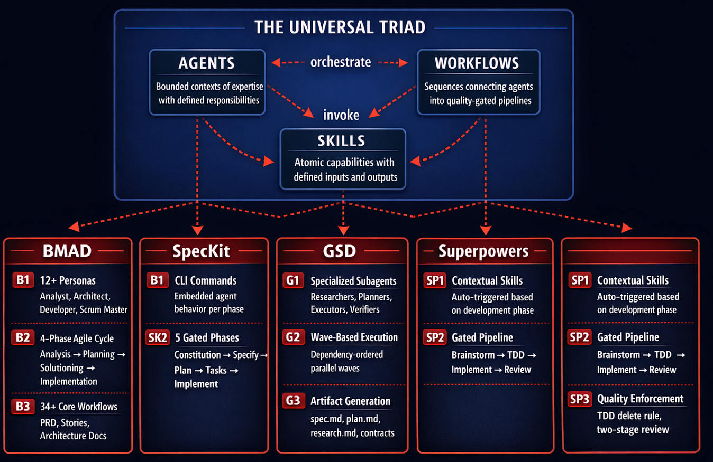
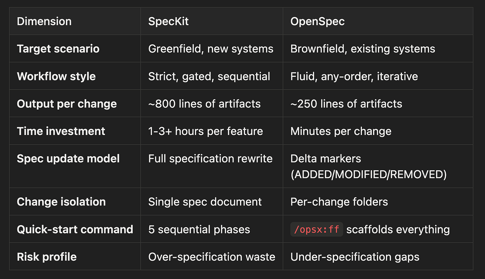
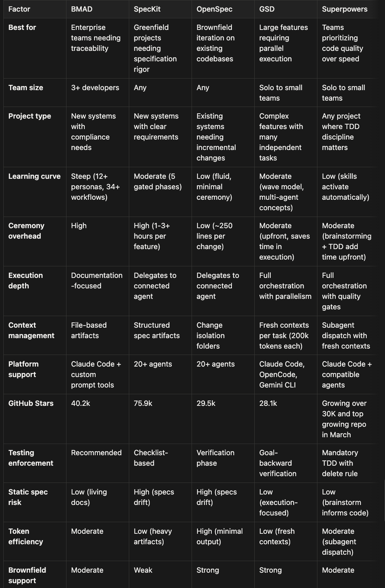
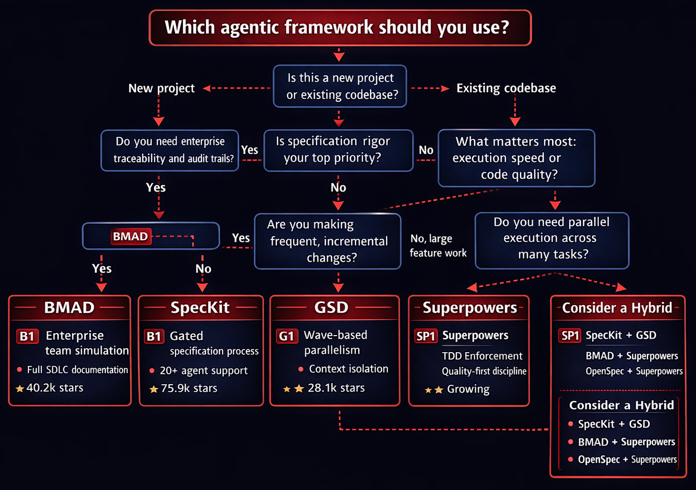

Press enter or click to view image in full size

Superpowers vs. BMAD vs. SpecKit vs. GSD

Member-only story

## A practitioner’s comparison of the leading agentic coding frameworks

16 min read

3 days ago

Five agentic coding frameworks now hold over 170,000 combined GitHub stars, each promising to replace vibe coding with disciplined AI-assisted development. This practitioner’s comparison dissects BMAD’s enterprise team simulation, SpecKit’s gated specification process, OpenSpec’s brownfield-first delta specs, GSD’s context-isolating wave parallelism, and Superpowers’ TDD-enforced discipline system. A decision matrix and hybrid combination strategies help teams choose the right tool for their situation.

> The vibe coding era is over. Five frameworks with 170,000+ combined GitHub stars are competing to define what replaces it. Each one makes a different bet on how much structure AI agents need. Picking the wrong one wastes weeks before you write a single line of production code.

In the first article of this series, I examined how [Superpowers](https://github.com/jessed/superpowers) transforms AI coding agents from reactive code generators into disciplined engineering partners. Previously, I covered GSD in another series and SpecKit in several other articles. The response surprised me. Readers did not argue about whether structured AI workflows were necessary; that debate is over. Instead, the most common question was: “How does Superpowers compare to BMAD, SpecKit, GSD, and OpenSpec?”

> We have done comparisons in the past but wanted to put Superpowers into the mix. Realize that this is subjective and by nature highly opinionated. I am very interested in your opinions on these agentic tools for engineering automation. I lean towards GSD and Superpowers.

Fair question. The agentic coding ecosystem has exploded. As of March 2026, these five frameworks collectively hold over 170,000 GitHub stars. Each one promises to replace vibe coding with something more disciplined, but they approach the problem from fundamentally different angles. Picking the wrong one for your situation wastes weeks of setup time before you write a single line of production code.

This article is that comparison: not a feature-checklist marketing exercise, but a practitioner’s assessment of when each framework shines and where each one breaks down.

## The Shared Triad: Agent, Workflow, Skill

Before diving into differences, it helps to see what these frameworks have in common. Despite their philosophical disagreements, every framework in this comparison structures its intelligence around the same three primitives.

**Agents** are the personas or roles the system adopts. BMAD calls them personas (Analyst, Architect, Developer). GSD calls them subagents (researchers, planners, executors). Superpowers calls them skills that trigger contextually (sometimes referred to as gates). SpecKit embeds agent behavior in its CLI commands. The terminology varies, but the concept is identical: a bounded context of expertise with defined responsibilities.

**Workflows** are the sequences that connect agents into pipelines. BMAD uses a four-phase agile cycle. SpecKit enforces gated phases with explicit checkpoints. GSD organizes execution into dependency-ordered waves. Superpowers chains skills into an automatic pipeline from brainstorming through code review. Every framework agrees that unstructured prompting produces garbage; the disagreement is over how much structure is enough.

**Skills** are the atomic capabilities agents perform. Writing a PRD. Running tests. Generating a diagram. Reviewing code. Parsing dependencies. Each framework bundles different skills, but the abstraction is the same: a reusable unit of work with defined inputs and outputs.

The following diagram illustrates how each framework implements this shared triad differently:

Press enter or click to view image in full size

This triad matters because it means the frameworks are not as different as their marketing suggests. They are all solving the same structural problem: how to decompose complex software development into manageable, quality-gated steps that AI agents can execute reliably. The differences lie in which steps they emphasize, how strictly they enforce gates, and what trade-offs they accept.

## The Heavyweight Enterprise Simulator: BMAD Method

**GitHub Stars:** 40.2k | **License:** MIT | **Latest:** v6.0.4 (March 2026) [GitHub](https://github.com/bmad-code-org/BMAD-METHOD) | [Docs](https://docs.bmad-method.org/)

BMAD stands for Breakthrough Method for Agile AI-Driven Development. If the other frameworks in this comparison are power tools, BMAD is the full machine shop.

## What It Does

BMAD simulates an entire agile development team using 12+ specialized AI personas. Each persona is defined as an “Agent-as-Code” Markdown file that specifies expertise, responsibilities, constraints, and expected outputs. You do not just ask the AI to write code. You ask the Product Manager persona to write a PRD, the Architect persona to design the system, the Developer persona to implement it, and the Scrum Master persona to prioritize the backlog.

The methodology follows a four-phase cycle: Analysis produces a one-page PRD capturing the problem and constraints. Planning breaks the PRD into user stories with acceptance criteria. Solutioning has the Architect create a minimal design while the Developer proposes implementation steps. Implementation proceeds iteratively through small stories with updated artifacts at each step.

What makes BMAD distinctive is its documentation-centric philosophy. In BMAD, source code is not the sole source of truth. The PRD, architecture sketches, and user stories are first-class artifacts that persist alongside the code. Every AI pass is incremental and verifiable because it works from these durable documents rather than ephemeral chat history.

## Party Mode and Scale-Adaptive Intelligence

BMAD’s “Party Mode” enables multiple personas to collaborate within a single session. Instead of switching between separate agent configurations, you can invoke the Architect to review a design mid-conversation with the Developer, or have the Scrum Master reprioritize stories while the Product Manager refines acceptance criteria.

The framework also features scale-adaptive intelligence that adjusts documentation rigor based on project complexity. A bug fix gets a lightweight analysis. A new microservice gets the full treatment with architecture diagrams, API contracts, and deployment specifications. This prevents the framework from applying enterprise-grade ceremony to tasks that do not warrant it.

## Strengths

BMAD excels at traceability. Every decision has a paper trail. Every requirement maps to a user story, which maps to an implementation task, which maps to a test. For organizations that need audit trails, compliance documentation, or handoff between teams, BMAD produces artifacts that satisfy those requirements naturally.

The 34+ core workflows cover the full software development lifecycle, from brainstorming through deployment. The 1,468 commits and 123 contributors indicate a mature, actively developed ecosystem.

## Deltas

The learning curve is steep. BMAD’s persona system, workflow library, and artifact conventions take time to internalize. For a solo developer building a side project, the overhead of running a simulated six-person agile team is comical. You do not need a Scrum Master persona to prioritize a three-item backlog.

The file-based coordination model can slow iteration when you need rapid design changes. Updating a PRD, then the architecture sketch, then the user stories, then the implementation tasks creates a cascade of document updates that adds friction to the feedback loop.

BMAD also has known compatibility issues with some AI coding environments. While it works with Claude Code and other tools that support custom system prompts, the experience is not always seamless.

## The Trade-Off in Practice

BMAD’s core trade-off is **comprehensiveness vs. agility**. You get the most thorough documentation and the clearest audit trail, but you pay for it with setup time and cascade updates. Teams that genuinely need compliance artifacts (healthcare, finance, government contracting) will find the overhead justified. Teams that need to ship a feature by Friday will find it suffocating. The scale-adaptive intelligence helps, but only if you trust the framework to correctly assess when a task is “simple enough” for lightweight treatment.

## The Specification Specialists: SpecKit and OpenSpec

Two frameworks focus specifically on the specification layer, but they approach it from opposite directions.

## SpecKit: GitHub’s Gated Process

**GitHub Stars:** 75.9k | **License:** MIT | **Latest:** v0.1.4 (Feb 2026) [GitHub](https://github.com/github/spec-kit) | [Blog](https://github.blog/ai-and-ml/generative-ai/spec-driven-development-with-ai-get-started-with-a-new-open-source-toolkit/)

SpecKit is GitHub’s official entry into the spec-driven development space, and its star count (the highest of any framework in this comparison) reflects GitHub’s enormous platform reach.

The core philosophy is stated without ambiguity: “Specifications don’t serve code; code serves specifications.” SpecKit treats the specification not as a guide that informs implementation, but as the authoritative source from which implementation is derived.

**The Gated Process.** SpecKit enforces a strict, sequential workflow with explicit checkpoints. You cannot advance to the next phase until the current phase is validated.

1.  **Constitution** (`/speckit.constitution`): Establish governing principles for the project.
2.  **Specify** (`/speckit.specify`): Define what to build, producing structured requirements and user journeys.
3.  **Plan** (`/speckit.plan`): Create technical implementation strategies, producing [plan.md](http://plan.md/), [research.md](http://research.md/), and related artifacts.
4.  **Tasks** (`/speckit.tasks`): Generate actionable, testable task lists from the plan.
5.  **Implement** (`/speckit.implement`): Execute tasks through the connected AI agent.

Optional phases include Clarify (for underspecified areas) and Analyze (for cross-artifact consistency checks via `/speckit.analyze`).

**Strengths.** The gated process prevents the most common failure mode in AI coding: rushing to implementation before requirements are clear. The framework produces a rich artifact set ([spec.md](http://spec.md/), [plan.md](http://plan.md/), [research.md](http://research.md/), [data-model.md](http://data-model.md/), contracts, quickstart guides) that serves as living documentation. With support for 20+ AI coding agents including Copilot, Claude Code, Cursor, Gemini CLI, and Windsurf, SpecKit is the most platform-agnostic option available.

**Deltas.** The ceremony is substantial. Independent evaluations report 1–3+ hours per feature for artifact generation and review. For small changes, such as adding a config flag or fixing a validation bug, running through the full specify-plan-task-implement cycle is like using a sledgehammer on a thumbtack. The specs are static; they do not update automatically during implementation, so documentation drift is a real risk on longer projects. SpecKit also lacks multi-agent orchestration. The `/speckit.implement` command delegates to whatever single AI agent is connected, but it does not manage parallelism or agent isolation.

**The Trade-Off.** SpecKit bets that the cost of over-specifying is always less than the cost of under-specifying. For greenfield projects with unclear requirements, this bet usually pays off. For well-understood changes to mature codebases, the specification overhead becomes pure friction. The 1–3 hour investment per feature is insurance against rework; whether that insurance is worth it depends on the cost of getting implementation wrong on the first pass.

## OpenSpec: The Brownfield-First Alternative

**GitHub Stars:** 29.5k | **License:** MIT | **Latest:** v1.2.0 (Feb 2026) [GitHub](https://github.com/Fission-AI/OpenSpec) | [Site](https://openspec.dev/)

If SpecKit is designed for building new systems from scratch, OpenSpec is designed for the messier reality of working on existing codebases.

OpenSpec’s philosophy is captured in four contrasts: “fluid not rigid, iterative not waterfall, easy not complex, built for brownfield not just greenfield.” Where SpecKit enforces strict phase gates, OpenSpec lets you update any artifact at any time without following a prescribed sequence.

**Delta Specs.** The key innovation is change isolation through delta markers. Instead of restating an entire specification when you modify existing functionality, OpenSpec uses ADDED, MODIFIED, and REMOVED markers to describe what changes relative to the current state. Each change gets its own folder (`openspec/changes/<name>/`) containing a proposal, specs, design docs, and tasks. This prevents one change from interfering with another.

**Strengths.** OpenSpec produces roughly 250 lines of output per change, compared to roughly 800 for SpecKit. That reduction in overhead matters when you are making five changes a day to a production system. The fast-forward command (`/opsx:ff`) scaffolds all planning artifacts at once, reducing multi-step ceremony. Support for 20+ AI tools makes it as portable as SpecKit. For teams doing iterative maintenance, refactoring, and incremental feature development on legacy codebases, OpenSpec is the most pragmatic choice.

**Deltas.** Like SpecKit, OpenSpec’s specs are static. They do not synchronize with the implementation automatically. There is no multi-agent orchestration, no parallel execution, and no context isolation strategy. For large greenfield projects requiring comprehensive architecture documentation, OpenSpec’s lightweight approach may produce insufficient specification depth.

**The Trade-Off.** OpenSpec trades specification depth for velocity. You get changes out the door faster, but you accept the risk that your delta specs may not capture the full architectural impact of accumulated changes. Over months of incremental modifications, the gap between what the specs describe and what the system actually does can widen silently.

## SpecKit vs. OpenSpec: Head-to-Head

The following table highlights the critical differences between these two specification-focused frameworks:

Press enter or click to view image in full size

## The Context Engineering Powerhouse: GSD (Get “Stuff” Done)

**GitHub Stars:** 28.1k | **License:** MIT | **Latest:** Active development (March 2026) [GitHub](https://github.com/gsd-build/get-shit-done) | [Site](https://gsd.build/)

GSD attacks a problem that the specification-focused frameworks largely ignore: what happens when your AI agent’s context window fills up and output quality collapses.

## The Context Rot Problem

Context rot is the quality degradation that occurs as an AI model processes more tokens within a single session. Research and practitioner experience suggest a predictable decline curve: at 0–30% context utilization, the model performs at peak quality. At 50%+, it starts rushing, skipping details, and making shortcuts. At 70%+, hallucinations increase. By 80%+, the model may forget requirements established earlier in the conversation.

This is not a theoretical concern. Any developer who has worked through a complex feature in a single Claude Code session has experienced the model’s output quality visibly degrading after extended conversation. The twentieth file edit is measurably worse than the second.

## How GSD Solves It

GSD’s core architectural decision is to spawn fresh subagent contexts for each execution unit. Instead of accumulating all task context in a single, increasingly bloated conversation, GSD gives each task its own clean 200,000-token context window. Task 50 gets the same context quality as Task 1 because it starts from a fresh window loaded only with relevant project artifacts.

The execution model organizes tasks into dependency-ordered “waves”:

-   **Wave 1**: Independent tasks execute in parallel, each in its own fresh context.
-   **Wave 2**: Tasks that depend on Wave 1 results execute in parallel.
-   **Wave 3**: Tasks requiring all previous waves complete sequentially.

This wave-based parallelism favors “vertical slices” (end-to-end features) over “horizontal layers” (all models first, then all APIs, then all UI). Vertical slices minimize inter-task dependencies, maximizing the number of tasks that can run in parallel.

## The Multi-Agent Orchestra

GSD deploys a fleet of specialized agents:

-   **Four parallel researchers** that investigate the codebase and gather context simultaneously.
-   **A planner** that converts research into structured execution plans.
-   **A plan checker** that validates plans before execution begins.
-   **Wave-based parallel executors** that implement tasks in fresh contexts.
-   **Verifiers** that validate completed work against specifications.
-   **Debugger agents** that use scientific-method hypothesis testing when something breaks.

The debugger agent deserves special mention. Instead of asking “what tasks did we do?”, GSD verification asks “what must be TRUE for this to work?” This goal-backward approach tests observable behaviors rather than implementation details, catching bugs that task-focused verification misses.

## Strengths

GSD is the most execution-focused framework in this comparison. While SpecKit and OpenSpec produce specifications, and BMAD produces comprehensive documentation, GSD ships code. Its context isolation architecture directly addresses the single biggest practical problem in AI-assisted development: quality degradation during long sessions. The atomic git commits (one per task) enable clean `git bisect` debugging and individual task reversion. Engineers at Amazon, Google, and Shopify use it in production.

## Deltas

GSD is token-hungry. Spawning fresh contexts for every task means re-transmitting project context repeatedly, which burns through API credits faster than single-session approaches. The framework is also less conversational during the planning phase; it optimizes for execution speed over collaborative specification refinement. Platform support is narrower than SpecKit or OpenSpec, currently covering Claude Code, OpenCode, and Gemini CLI, but the integration is more seamless. For simple tasks, the framework’s intensity can be overkill but there are tools to do out of band todos, debugging sessions and one offs and still integrate them into the planning mix.

## The Trade-Off in Practice

GSD’s core trade-off is **token cost vs. output quality**. Fresh contexts guarantee consistent quality across dozens of tasks, but they multiply your API spend. A 50-task feature that would cost $5 in a single session might cost $25–40 with GSD’s context isolation. For teams on generous API budgets building complex features, the quality improvement justifies the cost. For budget-constrained teams doing simpler work, the overhead is hard to justify.

The second trade-off is **execution speed vs. specification depth**. GSD gets code written faster than any other framework, but its planning phase is less collaborative than BMAD’s or SpecKit’s. If your requirements are wrong, GSD will execute the wrong plan very efficiently.

The reality the preciseness of working with clean contexts which is important for reasoning and the validation steps at multiple levels (planning and execution), make this extremely accurate at following the specifications and requirements, and well worth the cost.

## Superpowers Revisited: The Discipline Enforcer

**GitHub Stars:** Growing | **License:** MIT

In the [first article of this series](https://medium.com/agentic-engineering-superpowers/work/final/article_publication_ready.md), I covered Superpowers in depth. Here, I will position it relative to the frameworks above.

Superpowers occupies a unique niche. It is not primarily a specification framework (like SpecKit or OpenSpec), not an enterprise team simulator (like BMAD), and not a context orchestration engine (like GSD). It is a discipline enforcement system. I find it closest to GSD, but much more rigid for TDD.

## What Sets It Apart

**Interactive brainstorming as a hard gate.** Before any code is written, Superpowers forces a structured dialogue between the developer and the AI agent. This is not optional. The agent is explicitly prohibited from writing code, scaffolding projects, or taking any implementation action until a design has been presented and approved. BMAD has a similar analysis phase, but Superpowers’ gate is harder: there is no workaround, no “this is too simple to need a design” escape hatch. GSD has milestone discussions and planning discussions but they can be skipped.

**TDD as an iron law.** Other frameworks recommend testing. Superpowers enforces it with a delete-and-rewrite rule: if the agent writes production code before a failing test exists, the code gets deleted. Not saved for reference. Not adapted. Deleted. This is the most aggressive testing enforcement of any framework in this comparison.

**Persuasion-based guardrails.** Superpowers explicitly addresses the psychology of AI agents. It names the rationalizations models use to skip steps (“this is too simple to test,” “I will write the tests after,” “let me just fix this quickly”) and preemptively blocks them. The skills are stress-tested against social engineering: the creator deliberately tries to talk the agent into cutting corners by simulating urgency and watching for compliance.

**Subagent dispatch with two-stage review.** Like GSD, Superpowers uses fresh subagent contexts to avoid context pollution. But where GSD focuses on parallel execution speed, Superpowers focuses on quality gates. Each subagent’s output goes through spec compliance review and code quality review before the workflow advances. It likely has the same token usage constraints as GSD. It does more. You use more. They both attempt to avoid context rot which has a cost, but the accuracy is likely worth the cost.

## The Trade-Off in Practice

Superpowers’ core trade-off is **reliability vs. velocity**. The mandatory brainstorming, TDD enforcement, and two-stage review produce the most consistently high-quality output of any framework in this comparison with GSD as a close second. But every quality gate adds time. A task that takes 10 minutes with a raw Claude Code session might take 30 minutes through Superpowers’ full pipeline. The question is whether the time saved by avoiding bugs, rework, and architectural mistakes exceeds the time spent on upfront discipline. For production systems where bugs are expensive, the answer is almost always yes. For prototypes and throwaway code, the answer is almost always no.

## How It Compares

Superpowers is the most opinionated framework in this comparison. It trades flexibility for reliability. You cannot skip the brainstorming phase. You cannot write code before tests. You cannot bypass code review. These constraints make it slower for experienced developers who want to move fast on well-understood tasks, but they make it the safest choice for teams where code quality matters more than velocity.

## Choosing Your Weapon: A Decision Matrix

No framework is universally best. The right choice depends on your team size, project type, quality requirements, and tolerance for ceremony.

Press enter or click to view image in full size

Press enter or click to view image in full size

Highly subjective which framework should you choose

## Quick Decision Guide

**Choose BMAD if** you are building enterprise software with multiple stakeholders, need audit trails, and have a team large enough to benefit from role-based organization. The overhead pays for itself when compliance and handoff documentation are genuine requirements.

**Choose SpecKit if** you are starting a new project from scratch and want the most rigorous specification process available. The gated phases prevent premature implementation, and the 20+ agent support means you are not locked into any single AI tool. Accept the time investment in artifact generation as insurance against rework.

**Choose OpenSpec if** you are working on an existing codebase and need lightweight, iterative specification for ongoing changes. The delta marker system and low ceremony make it practical for daily use. Skip it if you need comprehensive architecture documentation for a new system.

**Choose GSD if** you are building complex features with many independent components that benefit from parallel execution. The context isolation architecture is genuinely superior for long-running development sessions. Accept the higher token cost as the price of consistent quality across dozens of tasks. Also GSD has excellent support for existing codebases and an expert at supporting brownfield projects.

> In many categories, if another tools is the best at something GSD is always the second best. If you have to pick one quickly, GSD is the one you should start with.

**Choose Superpowers if** code quality is your primary concern and you are willing to accept slower velocity in exchange for tested, reviewed, and disciplined output. The mandatory brainstorming and TDD enforcement produce the most reliable code of any framework in this comparison, but they add time to every task.

## The Hybrid Approach

These frameworks are not mutually exclusive. Some practitioners combine them:

-   **SpecKit + GSD**: Use SpecKit’s specification process to define requirements, then hand off to GSD’s execution engine for parallel implementation. This combination pairs the strongest specification layer with the strongest execution layer, but doubles the tooling complexity. I have done this. Mostly when migrating SDD projects to GSD.
-   **BMAD + Superpowers**: Use BMAD’s persona-based planning for architecture, then Superpowers’ TDD enforcement for implementation. This works well for enterprise teams that want BMAD’s traceability with Superpowers’ code quality guarantees.
-   **OpenSpec + Superpowers**: Use OpenSpec’s delta specs for change management on brownfield projects, then Superpowers’ quality gates for execution. The lowest-ceremony combination that still enforces testing discipline.

The triad pattern (Agent, Workflow, Skill) that all these frameworks share makes composition possible. They are building blocks, not monoliths.

## What Comes Next

This comparison reveals that the agentic coding ecosystem is maturing rapidly. Frameworks are specializing, finding niches, and developing genuine architectural innovations rather than just wrapping prompts in pretty CLIs.

In the next article in this series, we will move from framework comparison to framework construction: how to build your own agentic workflow by combining the best ideas from each of these tools into a custom pipeline tailored to your team’s needs.

The vibe coding era is over. The question is no longer whether to add structure to AI-assisted development; the question is how much structure, and of what kind. These five frameworks represent five different answers to that question. Your job is to pick the answer that matches your situation.

All of these frameworks rely on context engineering and harness engineering.

_This is Article 2 of 5 in the Agentic Software Engineering series. Article 1, “From ‘Vibe Coding’ to Viable Coding: How Superpowers Turns AI Chatbots into Engineering Partners,” covers the Superpowers framework in depth._

## About the Author

Rick Hightower is a technology executive and data engineer who led ML/AI development at a Fortune 100 financial services company. He created skilz, the [universal agent skill installer](https://skillzwave.ai/docs/), supporting 30+ coding agents including Claude Code, Gemini, Copilot, and Cursor, and co-founded the world’s largest agentic skill marketplace. Connect with Rick Hightower on [LinkedIn](https://www.linkedin.com/in/rickhigh/) or [Medium](https://medium.com/@richardhightower).

Rick has been actively developing generative AI systems, agents, and agentic workflows for years. He is the author of numerous agentic frameworks and developer tools and brings deep practical expertise to teams looking to adopt AI.