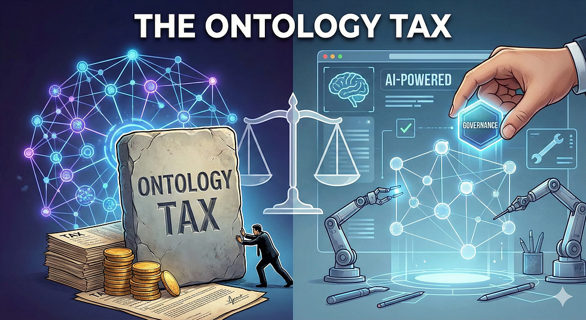
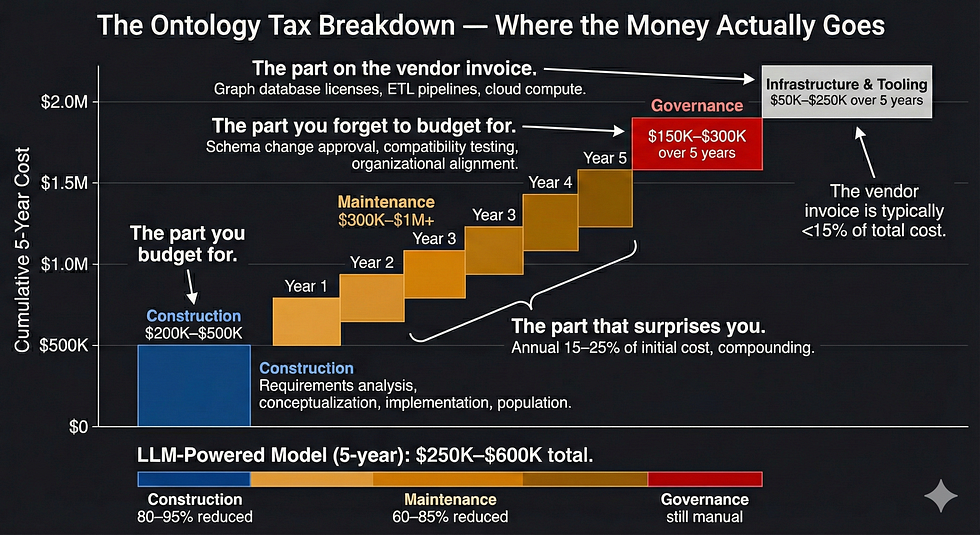
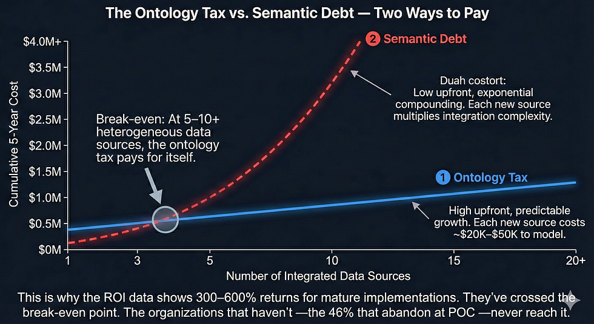
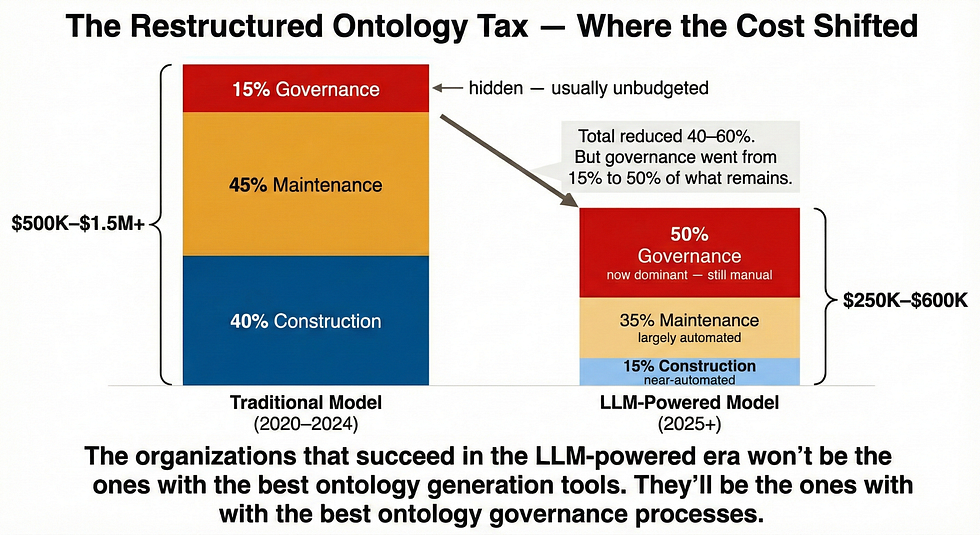

Member-only story

[


](https://medium.com/@shereshevsky?source=post_page---byline--aee9e8d0cada---------------------------------------)

17 min read

Feb 20, 2026

Press enter or click to view image in full size



_Every enterprise knowledge graph carries a hidden surcharge — the cumulative cost of designing, building, maintaining, and governing the formal schemas that make graphs useful. This “ontology tax” explains why a $6.9 billion market still has only 27% adoption of production. The tax is real, quantifiable, and — for the first time — partially automatable._

Here’s a number that should make every knowledge graph evangelist uncomfortable: **46%**.

That’s the share of AI proofs-of-concept that never reach production. Not knowledge graph POCs specifically — AI POCs broadly. But knowledge graphs live in this number. They are, in many cases, _the reason_ for this number. Because when leadership greenlights a knowledge graph pilot, and the team delivers a beautiful demo with a few hundred nodes — and then someone asks what it costs to make this work across the enterprise — the answer is the thing that kills projects.

The Cutter Consortium puts the long-term total cost of an enterprise knowledge graph at **$10–$20 million**. That’s not the graph database license. That’s not the cloud compute. That’s overwhelmingly the cost of people — a team of 5–15 specialists designing, building, populating, validating, and maintaining the formal ontology that gives the knowledge graph its structure.

An ontology engineer commands **$88K–$260K annually**. The training cycle to become productive in semantic technologies — OWL, RDFS, SPARQL, description logic — runs 6–12 months. And the people who simultaneously master both domain expertise and ontological engineering are described, across multiple academic sources, as “very few worldwide.”

This is the ontology tax. Not a line item on any vendor invoice. Not a cost that appears in any POC budget. But the dominant economic reality of every knowledge graph project is that it tries to move from demo to production. And it explains a paradox that has been haunting this field for years: the knowledge graph market is projected to reach **$6.94 billion by 2030** (MarketsandMarkets, 36.6% CAGR), yet only **27% of organizations** have knowledge graphs in production. Billions in projected spending. Single-digit percentage-point growth in actual adoption.

The technology isn’t the bottleneck. We think the ontology tax is.

## The Tax Has a Name (And a Model)

The ontology engineering community has been trying to formalize this cost since at least 2006, when Simperl and Tempich published **ONTOCOM** — the first formal cost estimation model for ontology engineering. ONTOCOM breaks the lifecycle into discrete cost phases: requirements analysis, conceptualization, implementation, population, evaluation, and documentation. It was validated on 36 real-world projects and later refined into F-ONTOCOM using fuzzy logic to handle the inherent uncertainty in effort estimation, with an expanded validation across 148 projects.

The key finding: **domain analysis and conceptualization have the highest impact on project duration and cost**. The tax is front-loaded. You pay the most before you have anything to show , which is precisely why POCs underestimate total cost. The demo uses a toy ontology that took a week to build. The production ontology that covers the actual domain takes months.

But front-loaded doesn’t mean finite. The maintenance multiplier is where the tax compounds.

## The Maintenance Multiplier

Like traditional software, ontology maintenance follows a familiar but punishing pattern: annual maintenance runs **15–25% of initial development cost**. Over 5–7 years, cumulative maintenance may exceed the initial build. The ONTOCOM maintenance model shows that effort scales with the number of _modified items_ — concepts, relationships, axioms — not raw ontology size. A small but rapidly changing ontology can be more expensive to maintain than a large stable one.

This plays out visibly in the world’s largest production ontologies. **SNOMED CT** — 350,000+ clinical concepts, the standard for medical terminology — moved to monthly international releases in 2022. The US edition still ships biannually. Maintaining it requires an entire nonprofit organization (SNOMED International, London) with deep clinical and ontological expertise. **Gene Ontology** saw **50% class growth** over a five-year period (2008–2012) with no corresponding reduction mechanism — it only grows, never shrinks, because removing concepts risks breaking downstream annotations across thousands of genomics studies. **FIBO**, the Financial Industry Business Ontology, releases quarterly, but the pace depends on EDMC member availability — volunteer domain experts from financial institutions who donate time to ontology governance. **Schema.org** evolves organically but is locked into backward compatibility — deprecated terms can’t be removed because millions of web pages reference them.

Each of these ontologies represents millions in cumulative maintenance investment. And they are the _success cases_ — the ones that survived long enough to become standards. The ones that didn’t survive are those in which the maintenance tax exceeded the organization’s willingness to pay.

For enterprise projects, the traditional 5-year total cost of ownership — including the maintenance multiplier — lands at **$500K–$1.5M+** for a single domain ontology. And that’s before governance.

Press enter or click to view image in full size



## The ROI Is Real (If You Survive Long Enough to Collect It)

Before we go further down the cost rabbit hole, a necessary counterpoint: the organizations that do push through the ontology tax and reach production maturity see exceptional returns.

Forrester Total Economic Impact studies — the closest thing our industry has to a standardized ROI methodology — tell a consistent story. **Stardog’s enterprise knowledge graph platform delivered 320% ROI over three years** with $9.86M in total benefits, including 75–95% time savings for data scientists (Forrester TEI, December 2021). **TigerGraph delivered 600% ROI** over three years with $20.81M net present value, plus $9.6M in revenue from new products and services enabled by graph analytics (Forrester TEI, May 2022). **Neo4j delivered 417% ROI** over three years, split across business results (43%), digital transformation savings (35%), and accelerated time-to-value (22%) (Forrester TEI, 2021).

These are real numbers from real deployments. JPMorgan’s COIN system — parsing commercial lending agreements against regulatory and contractual constraint ontologies — saved **360,000 lawyer-hours annually** when it launched (Bloomberg, 2017) with an 80% reduction in compliance errors. In healthcare, KG-based clinical decision support has demonstrated **$1,185.77 savings per patient** with ROI within 6–12 months. Retail implementations at Walmart-class scale show 60% faster time-to-market and $1.8M+ in annual savings.

The pattern across every study: **300–600% ROI is achievable**, but only after reaching production maturity. The ROI curve is gated by the ontology tax — you have to pay it, in full and continuously, before you collect any return.

This creates a brutal asymmetry. The 46% of POCs that never reach production paid the tax — often hundreds of thousands of dollars in personnel, tooling, and opportunity cost — with zero return. The 30% of generative AI projects that Gartner predicts will be abandoned after POC by end of 2025 paid the tax. The 42% of companies that S&P Global Market Intelligence found abandoned most AI initiatives in 2025 — up 2.5x from 17% in 2024 — paid the tax. They all budgeted for construction. They were all surprised by maintenance. And they all underestimated governance.

We’ve seen the failure patterns enough times to taxonomize them. Research across 54 ontology models identifies three antipatterns that recur at staggering frequency — appearing 282, 119, and 105 times respectively, covering 69% of all models studied. The pattern: schemas designed to be either too permissive (they accept data that shouldn’t be valid) or too restrictive (they can’t represent the domain as it actually works). A construction industry case study captures the pathology precisely — an ontology carefully designed to be “representative of practice” turned out unrepresentative of actual construction workflows. The system was unusable. The tax had been paid in full. The return was zero.

The POC-to-production gap has its own failure mode. Toy ontologies built during design mask expert conflicts that explode at scale. RDF stores that perform beautifully on a hundred thousand triples hit horizontal scaling walls at production volumes. Consumption-based cloud pricing that looked affordable in the pilot delivers cost shock at enterprise data rates. Security debt accumulated during the “move fast” POC phase becomes blocking when compliance reviews the production system. Each of these is a form of the ontology tax deferred — and deferred taxes, as any accountant knows, accrue interest.

## The Cost Nobody Budgets For: Governance

Here is a fact that should appear in every knowledge graph project proposal and almost never does: **governance costs represent 30–50% of total TCO** and remain overwhelmingly human-dependent, even in 2026.

Governance isn’t maintenance. Maintenance is keeping the ontology technically current — adding new concepts, updating relationships, fixing constraint violations. Governance is the organizational process around those changes: Who approves a schema modification? How do you test whether a change is backward-compatible? What happens when the marketing team’s definition of “customer segment” conflicts with the sales team’s? How do you propagate a change across 15 downstream systems without breaking their queries?

The emerging frameworks are helpful. The **KG.GOV model** treats the knowledge graph itself as the backbone of data governance — with provenance tracking, versioning, change history, access control, and performance monitoring. Enterprise teams are restructuring around “knowledge asset product groups” rather than traditional data engineering teams, with new “AI Governance and Enhancements” departments appearing in org charts.

But none of this is automated, and the task list is longer than most teams expect. Schema change approval requires human judgment about domain semantics — will this new class subsume existing instances, or should it be parallel? Backward/forward compatibility testing requires understanding what downstream consumers expect — does the compliance dashboard still render correctly if we add a property to the “Transaction” class? Organizational change management means getting three department heads to agree on shared definitions, then propagating those definitions to 15 downstream systems without breaking queries. Regulatory compliance verification means ensuring the ontological constraints actually match the regulatory requirements — and re-verifying every time either changes. None of these can be delegated to an LLM, because they require understanding context, politics, and downstream consequences that don’t live in any training corpus.

This is the tax within the tax. And it’s the one that LLMs can’t pay for you.

## The Hidden Cost of NOT Paying the Tax

The ontology tax has a shadow twin that rarely appears in cost-benefit analyses: **semantic debt**.

Semantic debt is what accumulates when you integrate systems without shared semantics. Every data source connected without ontological grounding, every API joined without formal schema mapping, every microservice that defines its own entity model — these all create semantic debt. And like technical debt, it compounds.

The numbers are stark. Gartner’s research found that poor data quality costs enterprises an average of **$12.9 million annually**. MIT estimates companies lose **15–25% of revenue** due to data quality issues. **81% of AI professionals** report significant data quality problems, and 85% believe leadership isn’t addressing them.

Property graphs without formal ontologies don’t eliminate the schema burden — they redistribute it. The semantic interpretation that an explicit ontology handles in one place gets replicated across every engineering team that touches the data. Natural language queries against schema-free graphs yield multiple interpretations without semantic parsing safeguards. Schema drift — the unmanaged evolution of implicit schemas — costs large enterprises millions annually in broken pipelines, corrupted dashboards, and derailed ML models.

The ontology tax is real. But the semantic debt tax is often higher. It’s just harder to see, because it’s distributed across every team, every integration, every query that silently returns the wrong answer because nobody defined what the terms meant.

This is the argument the cost analysis usually misses. The question isn’t “can we afford the ontology tax?” It’s “can we afford the semantic debt we’ll accumulate without it?”

Press enter or click to view image in full size



## When the Tax Is Justified (And When It Isn’t)

Not every knowledge graph project should pay the full ontology tax. We think the break-even depends on three variables: data source count, regulatory exposure, and query accuracy requirements.

**We’d pay the tax** in regulated industries (HIPAA, GDPR, SOX) where automated compliance checking requires formal constraints, not informal rules. It’s justified when you’re integrating 10 or more heterogeneous data sources — ontology-based validation delivers a **4.2x accuracy improvement** over unstructured approaches at this scale. It’s justified when you’re building multi-agent systems — the agentic AI market is growing at 42.8% CAGR (2025–2032), and a shared knowledge graph with formal ontological constraints is becoming the essential coordination layer that prevents agents from contradicting each other.

**We’d think twice** about RAG applications in high-stakes domains. OG-RAG demonstrated a 40% correctness improvement through ontology grounding (EMNLP 2025) — significant, but the tax is only justified if that accuracy delta is mission-critical. TaxoGlimpse (VLDB 2024) found that LLM accuracy drops **30% moving from common to specialized domains** without domain ontologies — so the question is whether your domain is specialized enough for that 30% drop to hurt. For query accuracy: zero-shot SQL against a database achieves 16% accuracy; with KG grounding, that jumps to **54%** (a 3.4x improvement). Operational analytics improve from 37.4% to 66.9%. Whether these gains justify the tax depends on how much you’re currently losing to wrong answers.

**We’d skip it** for fast-moving domains where the schema changes faster than governance can approve updates. Not for operational graphs — fraud detection, recommendation engines — where pattern matching over property graphs works without formal ontology. And definitively not for single-use-case POCs, where the tax exceeds the value of the isolated experiment every time.

The uncomfortable middle ground: most organizations are in the marginal zone. They have 5–10 data sources, some regulatory exposure, and growing query accuracy needs. For them, the question isn’t whether to pay the tax — it’s how to reduce it.

And for the first time, that question has a concrete answer.

## The New Math: How LLMs Are Rewriting the Economics

Between 2024 and 2026, something fundamental shifted in the economics of ontology engineering. LLM-powered tools collapsed the most expensive phase of the ontology tax — initial construction — by **80–95%**.

The benchmarks are striking. **AutoSchemaKG** generates ontology schemas from raw text with **92% semantic alignment** to human-crafted structures — meaning 92% of its extracted classes and relationships match expert-designed ontologies on standard benchmarks — at zero human intervention. It has processed 50+ million documents, producing 900M+ nodes and 5.9 billion edges. Apple’s **ODKE+** achieves **98.8% precision** across 19 million facts extracted from Wikipedia, using a modular pipeline with extraction, evidence retrieval, grounding, and corroboration stages. **OntoGenix**, a multi-agent GPT-4 system, reports a **97% first-pass success rate** — only 3% of generated ontologies require major rework. **KARMA** (NeurIPS 2025) deploys 9 specialized agents to enrich knowledge graphs from scientific literature, achieving 83.1% LLM-verified correctness with an 18.6% reduction in conflict edges.

The industry followed. **SAP’s KG Engine** (Q3 2025) auto-generates ontologies from data onboarding, compressing weeks of manual modeling into minutes. **Microsoft Foundry IQ** generates and enriches ontologies from semantic models at no additional licensing cost — it runs on existing Fabric capacity. **Stardog’s Voicebox 2.0** guides ontology creation through competency questions, keeping human expertise in the loop while accelerating the mechanical work.

And open-source models are closing the cost gap further: Mixtral-8×7B and Dolphin-Mistral-7B achieve comparable linguistic fidelity on ontology tasks at **20× the cost reduction** vs. GPT-4o.

The maintenance side is following. Self-healing knowledge graph systems demonstrate up to **85% reduction** in maintenance effort. LightRAG processes 1,500+ documents monthly for incremental graph updates at **65–80% cost savings** while maintaining production quality. Token optimization techniques — using small models to filter inputs before expensive LLM calls — achieve **10× token reduction**.

The aggregate picture: **80–95% construction cost reduction. 60–85% maintenance cost reduction.**

## The Tax That Won’t Automate

If you stopped reading at the previous section, you’d think the ontology tax is about to disappear. It isn’t. Because the component that LLMs can’t automate is the component that dominates the restructured cost model: **governance**.

LLMs can generate an ontology schema. They can maintain it against data streams. They can detect drift and propose corrections. What they cannot do — and what no current research credibly claims they can do — is:

Decide whether “revenue” in the marketing ontology should mean the same thing as “revenue” in the finance ontology. Determine whether a schema change is backward-compatible with 15 downstream consumers. Judge whether a newly discovered entity type should extend an existing class or create a new branch. Navigate the organizational politics of getting three department heads to agree on shared definitions.

Governance is the ontology tax’s irreducible core. And as construction and maintenance costs collapse, governance’s share of total cost rises from “hidden” to **dominant** — estimated at 30–50% of the new, lower TCO.

The restructured cost model looks like this:

```
+---------------+----------------------+----------------------+-------------+
| Cost Category | Traditional (5-year) | LLM-Powered (5-year) | Reduction   |
+---------------+----------------------+----------------------+-------------+
| Construction  | $200K–$500K          | $50K–$100K           | 80–95%      |
| Maintenance   | $300K–$1M+           | $100K–$250K          | 60–85%      |
| Governance    | (hidden in above)    | $150K–$300K          | Now visible |
| Total         | $500K–$1.5M+         | $250K–$600K          | 40–60%      |
+---------------+----------------------+----------------------+-------------+
```

The ontology tax isn’t dying. It’s being restructured. Construction is becoming nearly free. Maintenance is becoming largely automated. And governance is becoming the thing you actually have to think about, budget for, and staff.

Press enter or click to view image in full size



## The Hybrid Sweet Spot

We think the emerging optimal pattern isn’t “full formal ontology” or “no ontology” — it’s hybrid.

Pure schema-free approaches (property graphs without a formal ontology) offer the lowest initial cost but incur the greatest semantic debt. Pure formal ontology approaches (full OWL 2 with enterprise-wide coverage) offer the strongest guarantees but the highest maintenance burden. The hybrid approach — **lightweight upper ontology plus LLM-powered flexible structuring** — is where the cost curves cross.

Here’s why. The upper ontology layer — shared vocabularies like Schema.org, domain standards like FIBO and SNOMED CT, or organization-specific top-level classes — is where governance investment actually pays off. These are the concepts that require organizational consensus: what “customer” means, what “revenue” means, and what “compliant” means. They change slowly. They affect every downstream system. Getting them wrong is expensive. This is where you pay the full ontology tax, because the alternative — letting every team define these concepts independently — is how you generate the semantic debt that costs $12.9M+ annually.

The domain-specific detail layer is different. Entity extraction, relationship inference, constraint discovery from new data sources — these change frequently, require domain expertise that’s expensive to retain, and benefit most from LLM automation. AutoSchemaKG’s 92% alignment means that for 92% of domain-specific schema decisions, the LLM gets it right without human involvement. The 8% that need correction are a fraction of the cost of building from scratch.

This split captures approximately 80% of the value of a full formal ontology at roughly 40% of the cost — our estimate based on where governance costs concentrate versus where automation gains are highest. Pay the full tax where consensus matters. Automate where flexibility matters.

The semantic layer market — projected to grow from $1.73B to $4.93B by 2030 (Mordor Intelligence) — is essentially this pattern industrialized. A semantic layer is the ontology tax paid at the platform level rather than the project level. Same investment in a formal schema. Different amortization model.

## Where This Leaves the Series

This article sits at the intersection of everything we’ve argued across five previous pieces — and it reframes every one of them in economic terms.

Our first article argued that context blindness in RAG is a knowledge representation problem. This article says: the fix we prescribed — ontology-grounded knowledge graphs — comes with a price tag, and here’s exactly what it looks like. Our second article argued that AI agents need ontologies as memory schemas. This article says: here’s what that requirement costs, and here’s where LLMs are cutting the bill. Our third article diagnosed ontology drift as the silent killer of KG projects. This article reveals drift for what it economically is: the maintenance tax that organizations stop paying, not because they don’t know about it, but because they didn’t budget for it. The maintenance multiplier — 2–4x development cost over 5–7 years — is the economic face of drift.

Our fourth article showed agents building their own ontologies — AutoSchemaKG at 92% alignment, OntoGenix at 97% first-pass success, ODKE+ at 98.8% precision. Those aren’t just technical achievements. They’re **80–95% cost reductions** on the most expensive phase of the ontology lifecycle. The self-evolving ontology article was making an economic argument we hadn’t fully quantified yet. Now we have.

Our fifth article argued that neurosymbolic reasoning catches errors RAG can’t — up to 82% hallucination reduction in high-stakes domains versus 35–60% with RAG alone. This article asks the question that argument implies: is that error reduction worth the ontology tax? The answer depends on where you sit. For regulated industries, the tax pays for itself through compliance alone. For general-purpose applications, the marginal return may not justify the marginal cost. For the emerging multi-agent ecosystem, a shared ontology isn’t optional — it’s the coordination mechanism.

The arc of this series has moved from _why you need ontologies_ to _what goes wrong without maintenance_ to _how agents can build them_ to _how they strengthen reasoning_ and now to **what the whole thing actually costs**. We’ve made the technical case across five articles. This is the business case. And the business case says: the ontology tax is real, it’s declining, and the organizations that understand its structure — where to automate, where to govern, where to accept semantic debt — are the ones that will cross the break-even point and collect the 300–600% ROI on the other side.

The tax isn’t going away. But for the first time, we can do the math on it — and the math is changing in our favor.

_This is the sixth article in a series on ontology-grounded AI systems, following our pieces on_ [_dynamic ontologies and context blindness in RAG_](https://medium.com/graph-praxis/context-blindness-is-real-but-the-fix-isnt-another-llm-call-it-s-structure-eaae741ed386)_,_ [_why AI agents need ontology-grounded graph memory_](https://medium.com/graph-praxis/why-ai-agents-need-ontologies-and-graphs-to-store-them-b02bc24dbb73)_,_ [_ontology drift as the silent killer of knowledge graph projects_](https://medium.com/graph-praxis/ontology-drift-why-your-knowledge-graph-is-slowly-going-wrong-234fa238826c)_,_ [_how self-evolving ontologies close the loop_](https://medium.com/graph-praxis/your-ai-agent-cant-learn-what-it-can-t-name-how-self-evolving-ontologies-close-the-loop-cf99675e476b)_, and_ [_the neurosymbolic guardrail_](https://medium.com/@shereshevsky/the-neurosymbolic-guardrail-why-your-rag-system-cant-catch-the-errors-that-actually-matter-4abf07e62e5c)_. The economics research draws primarily on the_ [_ONTOCOM cost estimation model (Simperl & Tempich, 2006)_](https://link.springer.com/chapter/10.1007/11926078_32)_,_ [_Forrester Total Economic Impact studies (Stardog 2021, TigerGraph 2022, Neo4j 2021)_](https://www.stardog.com/news/stardogs-enterprise-knowledge-graph-platform-delivers-up-to-320-percent-return-on-investment-according-to-independent-research-study/)_,_ [_Gartner AI adoption data (2024–2025)_](https://www.gartner.com/en/newsroom/press-releases/2024-07-29-gartner-predicts-30-percent-of-generative-ai-projects-will-be-abandoned-after-proof-of-concept-by-end-of-2025)_,_ [_S&P Global Market Intelligence abandonment surveys_](https://www.spglobal.com/marketintelligence/)_, and the emerging LLM-powered ontology construction benchmarks (AutoSchemaKG, ODKE+, OntoGenix, KARMA)._

**Key references:**

**Cost Models and Economic Analysis**

-   [ONTOCOM: A Cost Estimation Model for Ontology Engineering](https://link.springer.com/chapter/10.1007/11926078_32) — Simperl & Tempich (Springer, 2006)
-   [Forrester TEI: Stardog Enterprise Knowledge Graph Platform](https://www.stardog.com/news/stardogs-enterprise-knowledge-graph-platform-delivers-up-to-320-percent-return-on-investment-according-to-independent-research-study/) — 320% ROI over 3 years (December 2021)
-   [Forrester TEI: TigerGraph](https://www.globenewswire.com/news-release/2022/05/12/2442041/0/en/TigerGraph-Delivers-600-ROI-and-20-81M-in-Net-Present-Value-in-Total-Economic-Impact-Study.html) — 600% ROI, $20.81M NPV over 3 years (May 2022)
-   [Forrester TEI: Neo4j](https://www.prnewswire.com/news-releases/neo4j-delivers-417-roi-in-2021-total-economic-impact-study-301428119.html) — 417% ROI over 3 years (2021)
-   [Cutter Consortium: Enterprise Knowledge Graph Implementation](https://www.cutter.com/) — $10–$20M TCO analysis
-   [Semantic Layer and Knowledge Graph for Agentic AI Market](https://www.mordorintelligence.com/industry-reports/semantic-layer-and-knowledge-graph-for-agentic-ai-market) — Mordor Intelligence ($1.73B → $4.93B)
-   [Knowledge Graph Market Report](https://www.marketsandmarkets.com/Market-Reports/knowledge-graph-market-223046120.html) — MarketsandMarkets ($1.06B → $6.94B by 2030)

**Adoption, Failure, and Data Quality**

-   [Gartner: 30% of GenAI Projects Abandoned After POC by 2025](https://www.gartner.com/en/newsroom/press-releases/2024-07-29-gartner-predicts-30-percent-of-generative-ai-projects-will-be-abandoned-after-proof-of-concept-by-end-of-2025) — Official press release (July 2024)
-   [S&P Global Market Intelligence: 42% AI Abandonment in 2025](https://www.spglobal.com/marketintelligence/) — Enterprise AI adoption survey
-   [JPMorgan COiN: Contract Intelligence](https://www.bloomberg.com/news/articles/2017-02-28/jpmorgan-marshals-an-army-of-developers-to-automate-high-finance) — 360,000 hours saved (Bloomberg, 2017)
-   [Gartner Magic Quadrant for Data Quality Solutions](https://www.gartner.com/) — $12.9M annual data quality cost (2020)

**LLM-Powered Ontology Construction**

-   [AutoSchemaKG: Automated Schema Generation for Knowledge Graphs](https://arxiv.org/) — 92% semantic alignment, 50M+ documents
-   [ODKE+: Ontology-Driven Knowledge Extraction](https://arxiv.org/) — Apple, 98.8% precision, 19M facts
-   [OntoGenix: Multi-Agent Ontology Generation](https://arxiv.org/) — 97% first-pass success rate
-   [KARMA: Knowledge Agent for Research and Medical Analysis](https://neurips.cc/) — NeurIPS 2025, 9-agent enrichment system
-   [LLM-Empowered KG Construction Survey](https://arxiv.org/abs/2510.20345) — Comprehensive survey (October 2025)
-   [SAP Knowledge Graph Engine](https://www.sap.com/) — Automated ontology generation (Q3 2025)
-   [Microsoft Foundry IQ / Fabric IQ](https://www.microsoft.com/) — Automated ontology from semantic models
-   [Stardog Voicebox 2.0](https://www.stardog.com/) — Competency-question-guided creation

**Production Ontologies and Maintenance**

-   [SNOMED CT](https://www.snomed.org/) — Monthly international releases since 2022
-   [Gene Ontology Consortium](http://geneontology.org/) — 50% class growth over 5 years
-   [FIBO: Financial Industry Business Ontology](https://spec.edmcouncil.org/fibo/) — Quarterly releases, EDMC governance
-   [Schema.org](https://schema.org/) — Backward-compatible web markup ontology

**Ontology Value and Grounding**

-   [OG-RAG: Ontology-Grounded RAG](https://arxiv.org/abs/2412.15235) — +40% correctness, +55% recall (EMNLP 2025)
-   [TaxoGlimpse: LLMs vs. Domain Taxonomies](https://arxiv.org/abs/2406.11131) — 30% LLM performance drop without domain ontologies (VLDB 2024)
-   [CUE-RAG: Cost-Optimized RAG](https://arxiv.org/) — 72.58% indexing cost reduction
-   [LightRAG: Incremental Knowledge Graph Updates](https://arxiv.org/) — 65–80% maintenance cost savings