###### Graph connections
[[]]

###### Links
- [Source](https://huryn.medium.com/claude-cowork-the-complete-guide-for-pms-e45e7cf0f52d)

# Claude Cowork: The Complete Guide for PMs

## Cowork just dropped for Windows and Intel-based macOS with full feature parity. Here's everything you need — skills, plugins, MCPs, and why you may not need the terminal.

10 min read · 2026-02-26

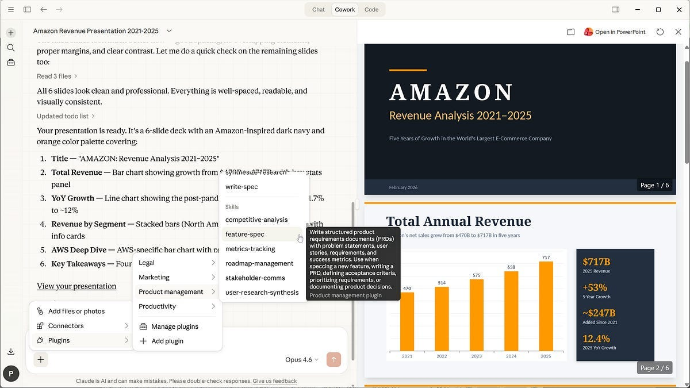

Anthropic just shipped **Claude Cowork for Windows and Intel-based macOS** with full feature parity to the version released in January. It's now **available on all platforms** for Pro, Max, Team, and Enterprise plans.

> _Everyone's hyping Claude Code. But if you're not a developer, Cowork might be a better default option for everyday tasks — and almost nobody's talking about it enough._

I'm a former engineer. I can use the terminal just fine. But prototyping aside, I choose Cowork for day-to-day work: analyzing and drafting emails, reorganizing files, preparing contracts, managing invoices, and even configuring my OS.

Same model as Claude Code. Same skill format, same connector types.

Technically, Code can do everything Cowork does. The difference is how you get there. Code needs git worktrees, tmux, and CLI flags. Cowork gives you a simple visual interface.

This guide covers everything you need to know:

1.  What Cowork Actually Is
2.  Cowork vs. Chat: Why it's a Different Beast
3.  Plugins, Commands, and Skills in Claude Cowork
4.  MCPs: Connecting Cowork to Your World
5.  Scheduled Tasks
6.  A 1-Minute Hack That Makes Claude Desktop 2x More Powerful
7.  How to Give Claude Cowork Cross-Session Memory

## 1\. What Cowork Actually Is

Cowork is not a chat interface with a new skin. It's an autonomous desktop agent built into the Claude Desktop app.

When you open the Cowork tab, you're giving Claude access to a sandboxed Linux VM running on your machine. Inside that sandbox, Claude can write code, execute scripts, create files (Word docs, slide decks, spreadsheets, PDFs), and connect to services like Gmail, GitHub, and Slack (you don't set this up — Anthropic manages it).

You describe what you need. Cowork plans the work, breaks it into sub-agents that run in parallel, and delivers output as clickable files you can open directly.

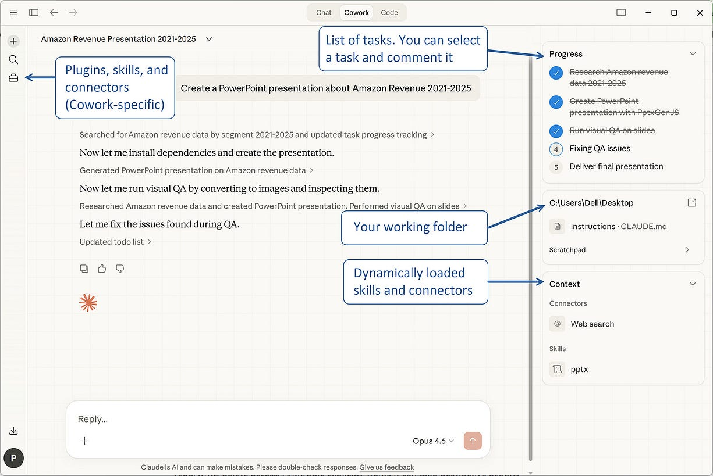

*Example: Cowork working on a PowerPoint presentation about Amazon*

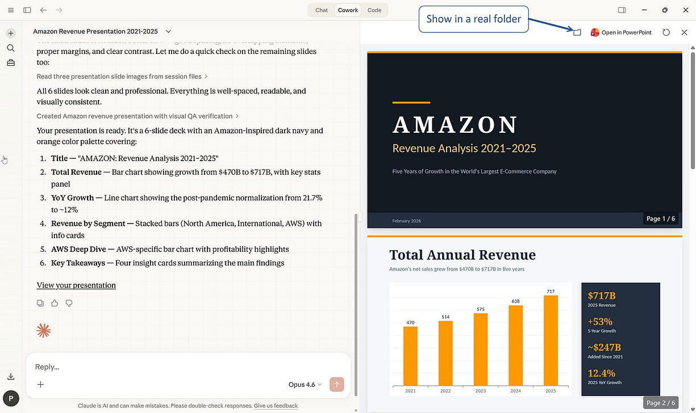

*Example: A professional PowerPoint presentation you can edit (unlike in NotebookLM, Cowork slides are not static images or read-only PDFs)*

A few things that set it apart from Chat:

-   **It plans and tracks work.** Give Cowork a complex task and it decomposes it into subtasks, shows you the plan, and works through it step by step. You can watch progress in real time and steer mid-task. Chat doesn't do this.
-   **It coordinates parallel work.** Cowork can spawn sub-agents — independent Claude instances that each get their own context — to work on different parts of a task simultaneously.
-   **It creates real files.** Not an artifact. Actual .docx, .pptx, .xlsx, and .pdf files delivered to the folder you granted access to.
-   **It's sandboxed — but not entirely.** Cowork runs in a VM, so it can't touch your OS or files outside the folder you shared. But inside that folder, it has full read/write/delete access.
-   **It connects to your tools.** Gmail, GitHub, Slack, Google Drive, and more via built-in connectors. Plus any custom tool via MCP servers.

## 2\. Cowork vs. Chat: Why it's a Different Beast

Many of you already use Claude Chat in the Desktop app. You might be wondering: what does Cowork add? Here's my comparison:

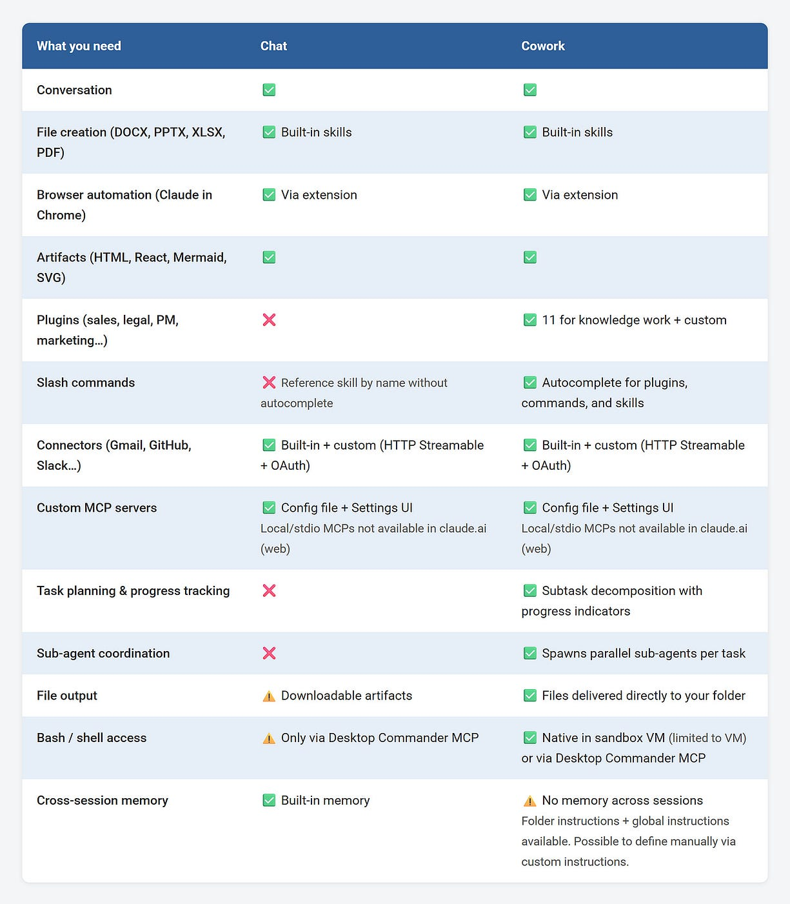

*Chat vs. Cowork comparison in Claude Desktop*

In short, Cowork adds what matters for getting real work done: sub-agent coordination that handles parallel work, task decomposition, and files delivered directly to your folder instead of chat artifacts.

**Chat is for conversations. Cowork is for workflows.**

## 3\. Plugins, Commands, and Skills in Claude Cowork

When Anthropic unveiled AI tools automating legal and financial research in early 2026, legacy [software stocks dropped $285 billion](https://finance.yahoo.com/news/anthropic-slams-wall-street-285-195732491.html) in a single day. Investors saw AI agents moving into the application layer — legal, sales, marketing, finance — and repriced the entire software sector.

The plugins sitting in your Cowork sidebar are part of what triggered that reaction. Here's how they work.

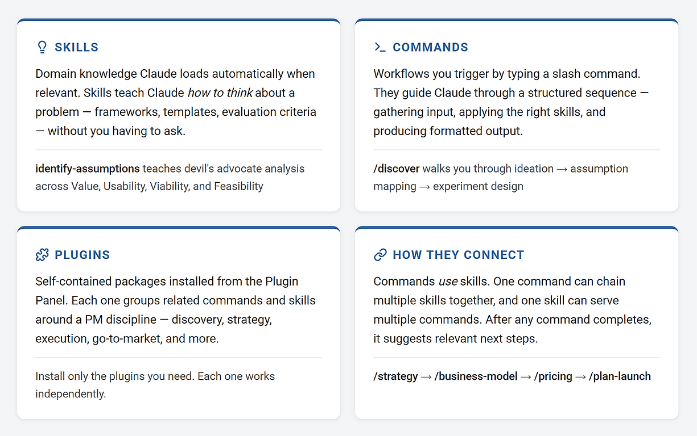

*Plugins, Commands, and Skills in Claude Cowork — with my custom examples*

### What are skills?

Let's start with skills. They are reusable instruction manuals that teach Claude how to approach specific, repeatable tasks. Say "create a Word doc" and the docx skill loads.

The format works across Claude ecosystem and third-party tools like Cursor, Windsurf, and Codex CLI.

Built-in skills include pdf, docx, pptx, xlsx, canvas-design, algorithmic-art, and skill-creator.

Skills don't all load at once. Claude reads only a short description of each skill (~100 tokens) to decide which ones are relevant, then loads full instructions only when needed. This keeps your context window clean.

### What are commands?

Commands are structured workflows you trigger by typing a slash command. Type /strategy and Claude walks you through a full product strategy canvas — gathering context, applying the right frameworks, and producing formatted output.

Commands can chain together skills: /strategy → /business-model → /pricing → /plan-launch follows the natural PM workflow from vision to execution.

### The Cowork plugin panel

Cowork has a dedicated Plugins panel. You can browse, install, upload, and create plugins from a visual UI:

Each plugin bundles skills with slash commands, for example "Product Management:"

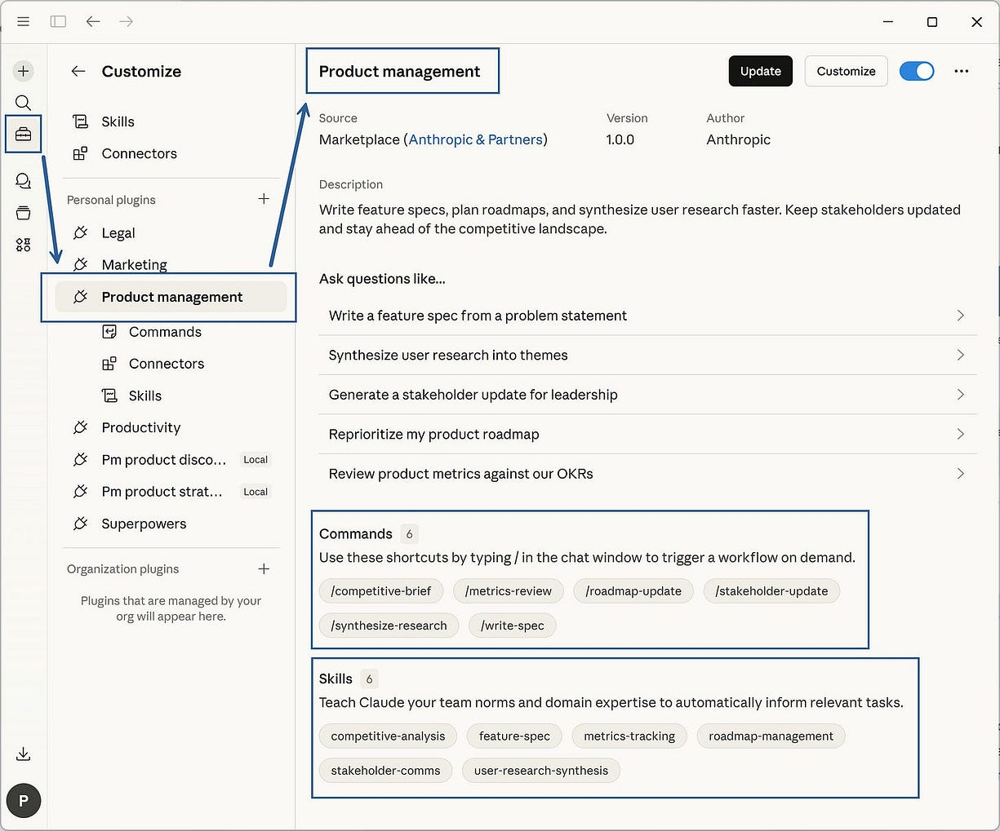

*Customize > Plugins in Claude Cowork*

Skills are auto-discovered, but you can also plugins and commands with slash commands:

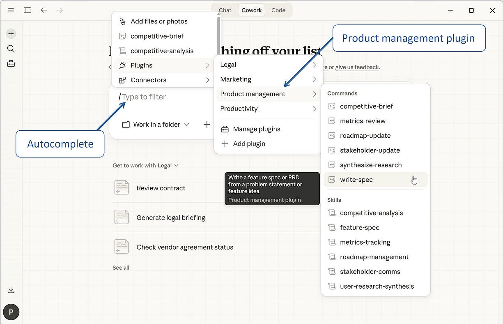

*Using Skills and Commands in Claude Cowork*

### Skill and plugin access across tools

Here's the high-level picture. In this article we focus on Cowork:

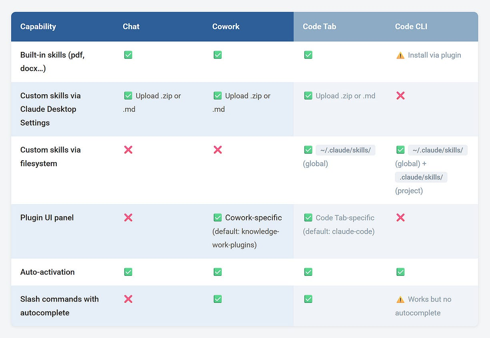

*Skill and plugin access across tools*

**Default plugins:**

-   Cowork ships with 11 plugins from [anthropics/knowledge-work-plugins](https://github.com/anthropics/knowledge-work-plugins) (productivity, product-management, legal, finance, marketing, data, etc.)
-   Code's marketplace defaults to [anthropics/claude-code](https://github.com/anthropics/claude-code/tree/main/plugins) (developer workflows: agent-sdk-dev, frontend-desing, feature-dev, code-review, etc.).

> _But you can add_ **_any marketplace repo to either tool_** _— load Code's developer plugins into Cowork, or Cowork's business plugins into Code. Same skill format, fully cross-compatible._

**Note:** Cowork and Code Tab have separate, isolated plugin panels. Installing a plugin in one doesn't make it available in the other. Skills uploaded via Claude Desktop settings are shared across Chat, Cowork, and Code Tab.

### Where to find more skills and plugins

Beyond built-in skills and Anthropic's plugins, there's a growing ecosystem worth exploring. All essential sources:

1.  [**github.com/anthropics/skills**](https://github.com/anthropics/skills): Anthropic's official repo — document skills (docx, xlsx, pptx, pdf) plus creative, technical, and enterprise examples
2.  [**github.com/anthropics/knowledge-work-plugins**](https://github.com/anthropics/knowledge-work-plugins): Cowork's default plugin registry — the 11 business-role plugins
3.  [**github.com/anthropics/claude-code**](https://github.com/anthropics/claude-code): Developer-focused workflows — Code's default marketplace source, open "Plugins"
4.  [**claudemarketplaces.com**](https://claudemarketplaces.com/): Browse and discover plugin marketplaces you can add to Cowork or Code
5.  [**github.com/travisvn/awesome-claude-skills**](https://github.com/travisvn/awesome-claude-skills): Community-curated collection with battle-tested skills for TDD, debugging, collaboration
6.  [**github.com/sickn33/antigravity-awesome-skills**](https://github.com/sickn33/antigravity-awesome-skills): 868+ universal agentic skills — covers security, DevOps, full-stack, AI/ML, and more
7.  [**skills.sh**](https://skills.sh/): Vercel's open skills ecosystem — directory and leaderboard, CLI installer (npx skills add)
8.  [**skillsmp.com**](https://skillsmp.com/): Community marketplace — 200K+ skills indexed from GitHub, searchable by category
9.  [**skillhub.club**](https://skillhub.club/): 7,000+ AI-evaluated skills with quality scores, one-click install via desktop app
10.  [**agentskills.io**](https://agentskills.io/): The open format specification — if you want to build your own

## 4\. MCPs: Connecting Cowork to Your World

MCP stands for Model Context Protocol — the open standard by Anthropic. Each MCP server exposes tools Claude can call.

A [custom Gmail MCP](https://github.com/GongRzhe/Gmail-MCP-Server) gives Claude search\_emails, send\_email, read\_email. The [official GitHub MCP](https://github.com/github/github-mcp-server) gives it create\_pull\_request, list\_issues. You get the idea.

There are three ways to connect MCP servers to Claude, and understanding the difference matters. When I say "Claude Desktop" below, I mean all three tabs in the Desktop app: Chat, Cowork, and Code.

### Three types of MCP connections

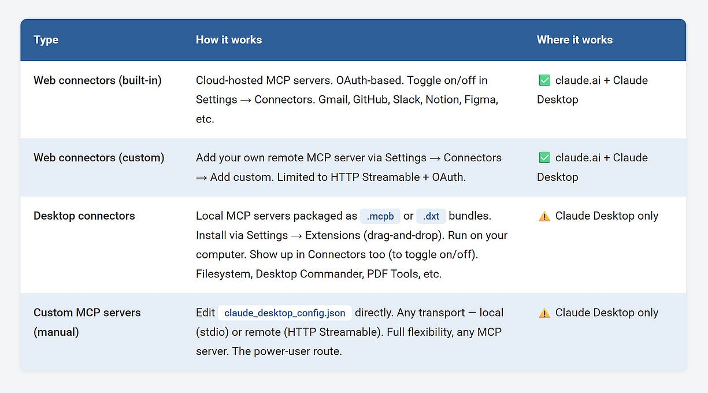

*Claude Desktop (incl. Cowork) connector types comparison*

**Web connectors** work everywhere — including claude.ai in your browser. Those can be built-in (delivered by Anthropic) or custom (HTTP Streamable + OAuth) MCPs. You manage them in _"Customize > Connectors"_:

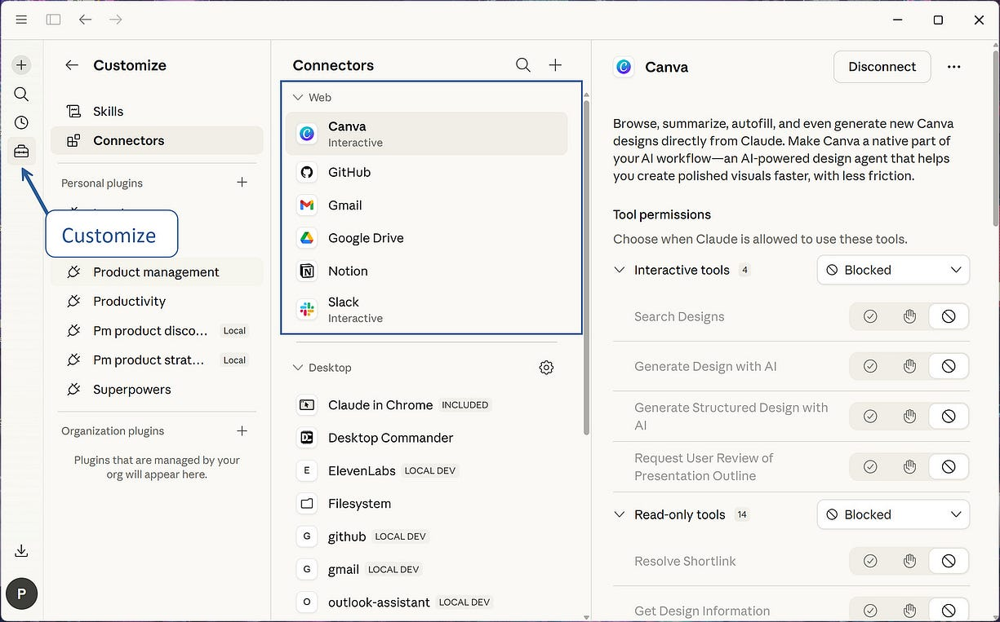

*Web connectors in Claude Desktop (incl. Cowork)*

**Desktop connectors** are how Anthropic packages local MCP servers for one-click install — they show up in both the Extensions panel (to install/remove) and the Connectors panel (to toggle on/off). You manage them in _"Settings > Extensions"_:

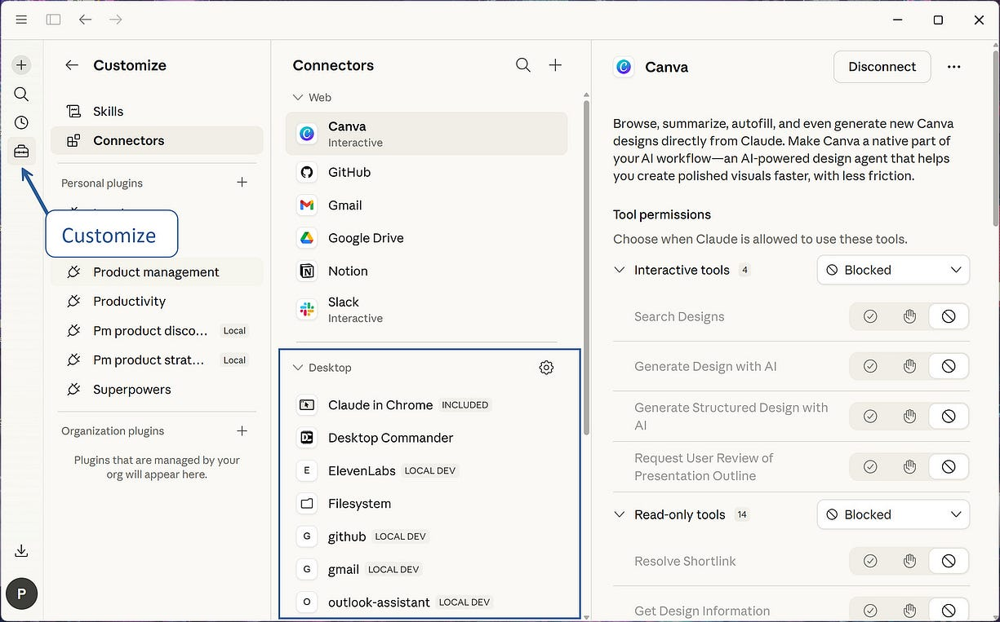

*Desktop connectors in Claude Desktop (incl. Cowork)*

**Custom MCP servers** are managed by editing a JSON config. Click _"Menu > Developer > App Config File…"_ An example content with a custom Gmail and Outlook MCPs:

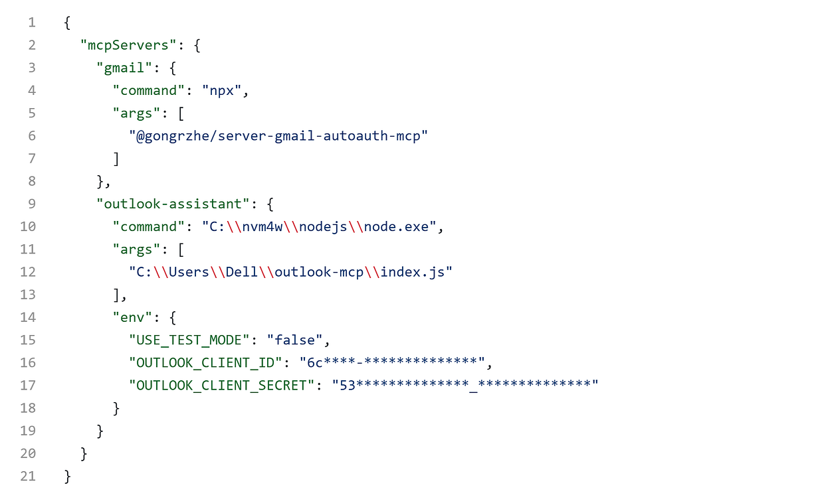

What might be a bit confusing is that Claude Desktop presents them all in a single "Connectors" interface with on/off toggles:

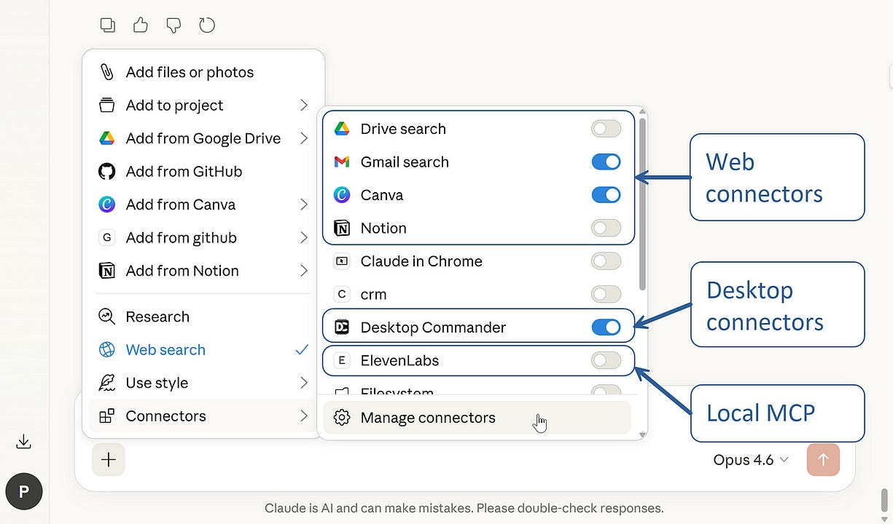

*Here, Claude Desktop presents everything as "Connectors"*

### Per-tool permissions

For every connector, you can set individual tools to Allow (runs automatically), Ask (confirms before running), or Block (never runs). You could allow Claude to search your emails but block it from sending them. Click: _"Customize → Connectors → Tool permissions"_:

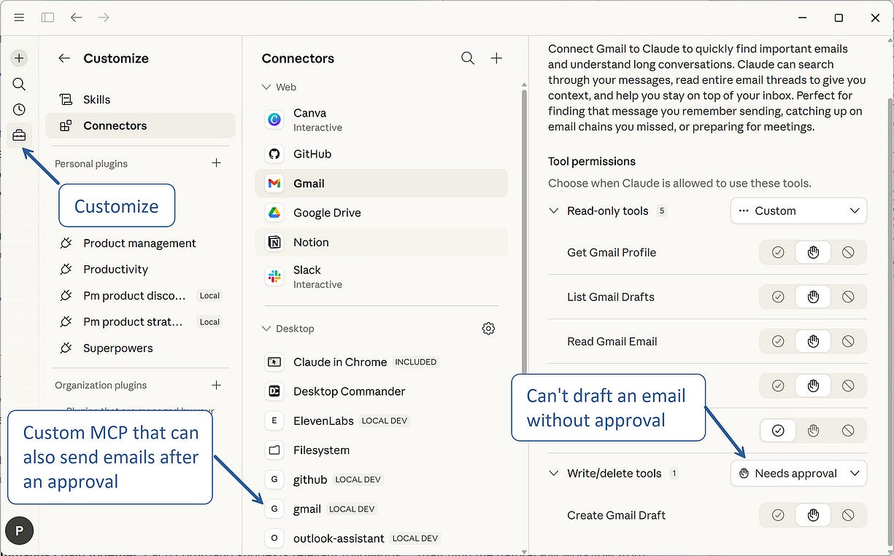

*Tool permissions in Claude Cowork*

> **_Windows gotcha:_** _If you installed Claude Desktop via the Microsoft Store (MSIX), the "Edit Config" button may open the wrong file. The app reads from the MSIX virtualized path, not_ `_%APPDATA%\Claude\_`_. Check GitHub issue #26073 if MCP servers silently fail to load._

### Where to find MCP servers

1.  [**github.com/modelcontextprotocol/servers**](https://github.com/modelcontextprotocol/servers): Official MCP server repo — filesystem, GitHub, Google Drive, Slack, and more
2.  [**modelcontextprotocol.io/examples**](https://modelcontextprotocol.io/examples): Official MCP directory — reference implementations for many services
3.  [**github.com/punkpeye/awesome-mcp-servers**](https://github.com/punkpeye/awesome-mcp-servers): Community-curated list — hundreds of MCP servers by category
4.  [**mcp.so**](https://mcp.so/): MCP server registry with search and install instructions

## 5\. Scheduled Tasks

Two approaches:

### Scheduled Tasks in Claude for Chrome extension

You'll see this feature mentioned often alongside Cowork — it gets bundled into broader Claude Desktop coverage. Worth knowing it exists, but in my tests it's unreliable.

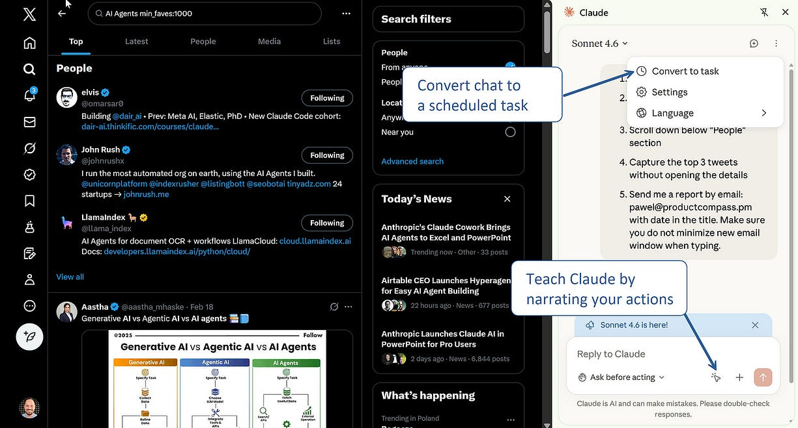

*Scheduled tasks in Claude for Chrome plugin*

For scheduled, managed automation, [n8n](https://www.productcompass.pm/p/the-ultimate-guide-to-n8n-for-pms) will serve you better.

### Scheduled Tasks in Cowork

Introduced two days after publishing this post in my newsletter. The entire workflow:

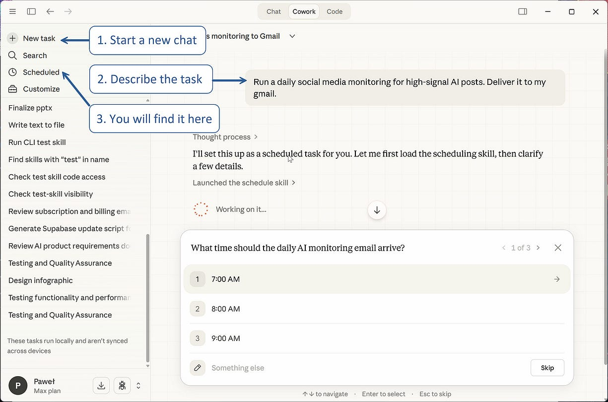

## 6\. A 1-Minute Hack That Makes Claude Desktop 2x More Powerful

I can't believe some people working with AI don't know about Desktop Commander. That's one of the highest-ROI moves. And it takes < 1 minute:

1.  Open Claude Desktop
2.  In a chat window click: _"+ > Connectors > Manage connectors"_
3.  Click: _"Browse connectors > All > Desktop Commander"_
4.  Select tools that do not require your approval

> **_The result:_** _Chat, Cowork, and Code Tab can do_ **_virtually anything on your laptop_** _including installing MCP servers or accessing any file._

### Example 1: Claude Desktop installed and configured an MCP server based on the URL

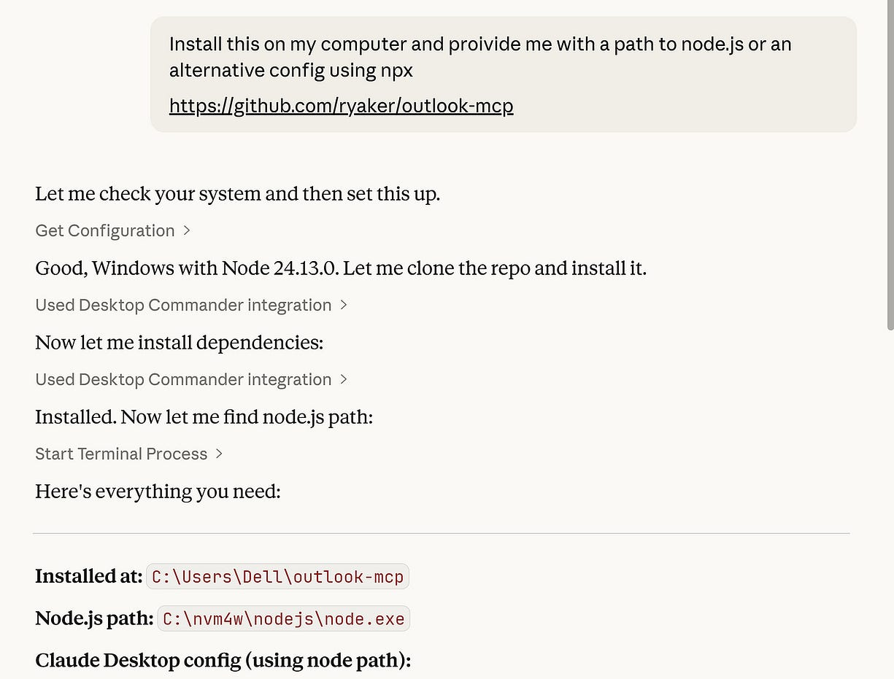

### Example 2: Claude Desktop reorganized files on my desktop

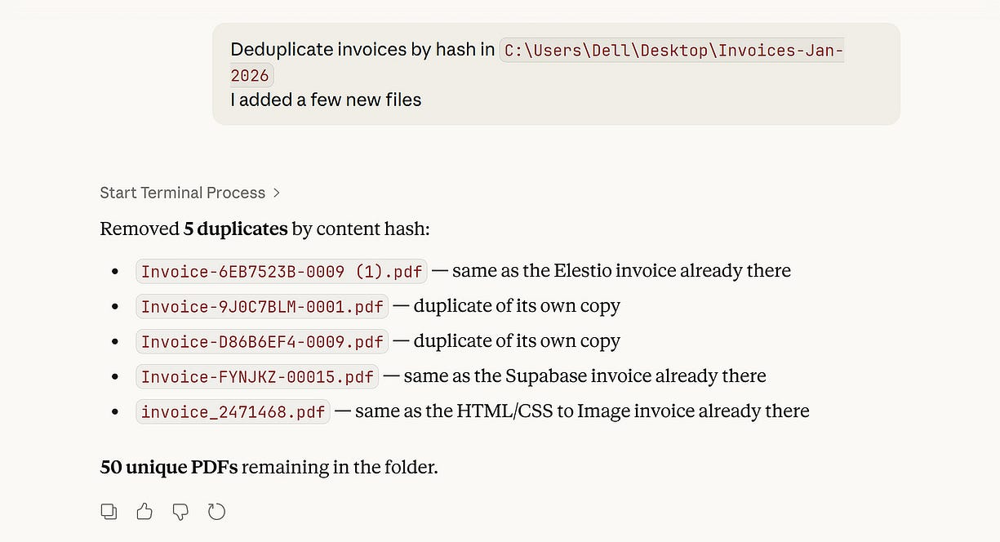

### Tips

-   Disable the Claude in Chrome extension when not needed, so Claude doesn't default to web-based actions.
-   Consider which actions require your approval. Unlike OpenClaw, none of those tools can take actions on their own. You can observe what they are doing or disable the connector when not in use.

## 7\. How to Give Claude Cowork Cross-Session Memory

Two simple steps:

1.  Enable Desktop Commander extensions in _"Settings → Connectors"_
2.  Copy this to _"Settings → Cowork → Global instructions"_

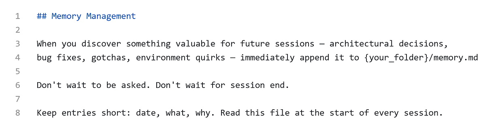

> _This costs almost zero tokens and survives crashes, compaction, and new sessions._

### Advanced: structured memory

Split into multiple files so Claude loads only what's relevant:

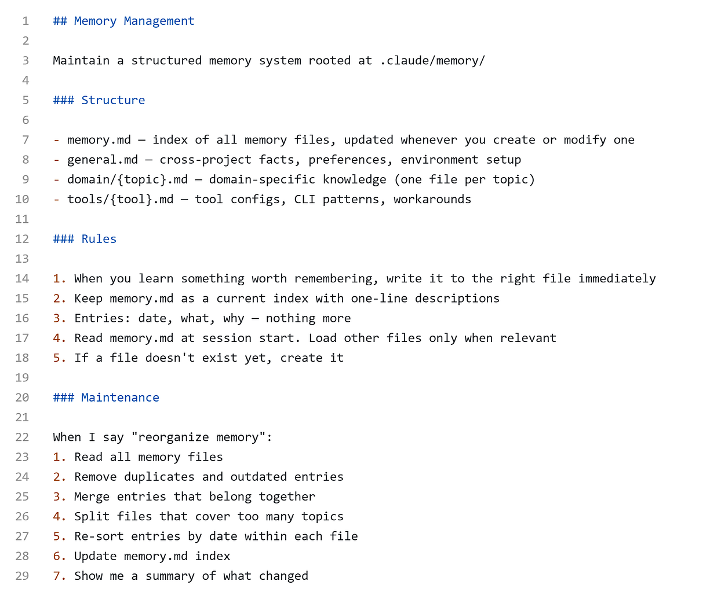

### Bonus: How to Give Claude Code (Tab/CLI) Memory

_For short term memory "Claude forgot what we discussed yesterday":_ Paste the same prompt into your Claude Code instructions but replace your custom path with ".claude/memory.md"

_An alternative only for Claude Code (.md format is often more than you need):_ [https://github.com/thedotmack/claude-mem](https://github.com/thedotmack/claude-mem)

## \[Bonus\] Visual Assets

### What is Claude Cowork

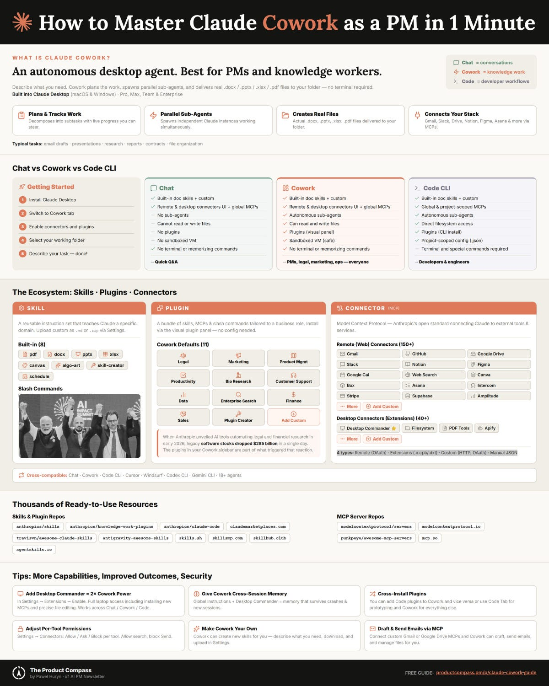

[Download as a PDF](https://www.productcompass.pm/i/188624548/bonus-visual-assets)

### Claude Chat vs. Cowork vs. Code

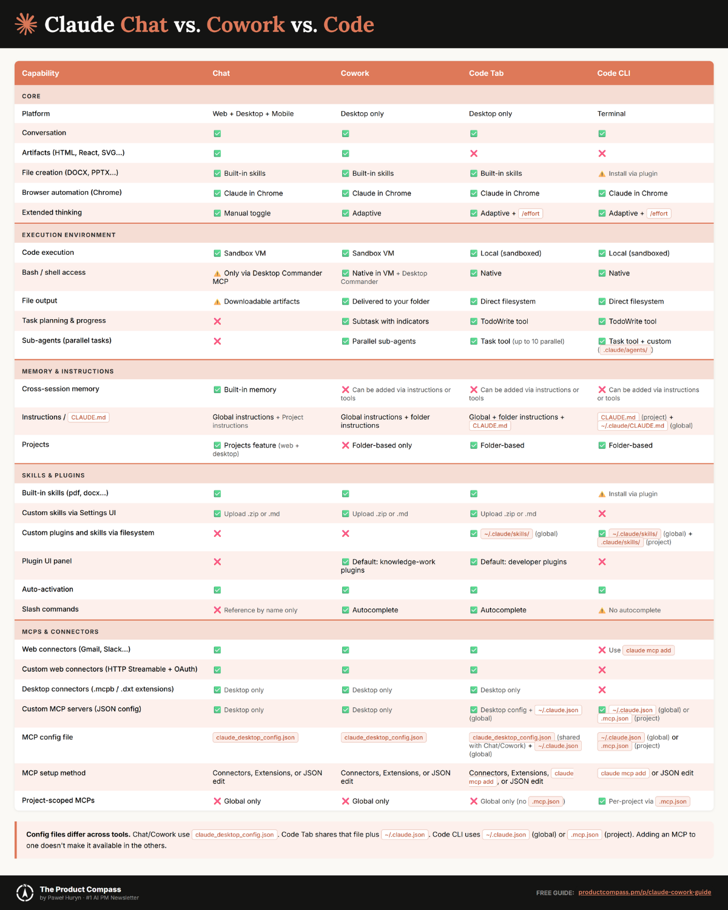

---

###### File Attachments
