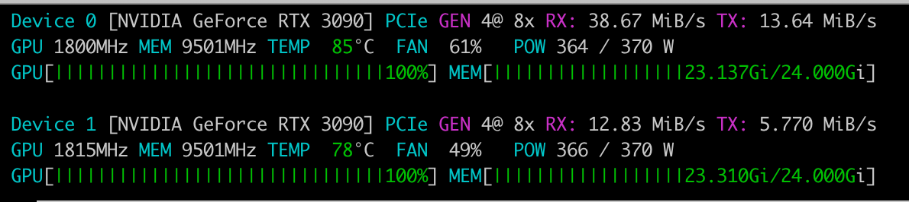

I’ve been running a Graph RAG system for a while now. The idea behind it is compelling: instead of stuffing chunks of text into a vector store and hoping semantic similarity finds the right context, you build a knowledge graph — a structured network of entities and their relationships — and retrieve over that graph at query time. The system doesn’t just know _what_ words appear near each other. It knows that Marie Curie _worked at_ the University of Paris, that she _discovered_ radium, and that radium _is an_ element. That kind of structured understanding makes a real difference for complex questions that require connecting dots across multiple documents.

But here’s what we don’t talk about enough: before you can query a knowledge graph, you have to build one.

That means taking raw text — articles, legal filings, medical records, technical documentation — and extracting structured entity-relation triples from it. Things like `(CRISPR-Cas9, developed_by, Jennifer Doudna)` or `(Tesla, headquartered_in, Austin)`. Most Graph RAG tutorials wave this away with a call to GPT-4. But we work with data that can't leave our infrastructure, which means we need local models. And local models have a much harder time with structured extraction than you might expect.

We needed to understand exactly how hard this extraction problem is for our pipeline, and whether we could improve it. So we built a comprehensive internal benchmark, tested the leading open-weight models, and then fine-tuned one. This is what we learned.

## Part 1: The Benchmark

## What We Tested

We wanted to answer a practical question: if we hand a passage of text to a 7–9 billion parameter model running on our GPU infrastructure, how reliably can it extract a knowledge graph from it?

Internally, we built a large benchmark suite covering the domains our pipeline actually processes — hundreds of passages with hand-labeled gold-standard entities and triples across multiple complexity levels and document types. For this article, we’re sharing results from a representative 50-sample subset focused on the legal domain — contracts, case law, regulatory compliance, corporate governance, employment law, and international law — so that the findings are reproducible on public data. Each passage comes with gold-standard labels at four complexity levels: simple (a few clear entities), moderate (multiple interconnected relationships), complex (dense passages with nested relations), and edge cases (aliases, abbreviations, empty passages). This subset contains about 150 gold entities and 139 gold triples, and the patterns we observed here are consistent with those we see across the full internal benchmark.

We tested four models, all running on a single NVIDIA RTX 3090 (24GB) via vLLM:

```
  Model                      Parameters   Family          
 -------------------------- ------------ ---------------- 
  Qwen 2.5 7B Instruct       7B           Qwen (Alibaba)  
  Llama 3.1 8B Instruct      8B           Llama (Meta)    
  Mistral 7B Instruct v0.3   7B           Mistral         
  Gemma 2 9B IT              9B           Gemma (Google)
```

Each model was tested with three prompting strategies: a naive instruction (“extract entities and relations as JSON”), a schema-in-prompt approach (same instruction plus the full JSON schema), and few-shot prompting (two worked examples showing the expected input-output format).

## How We Measured Quality

Evaluating extraction quality turns out to be almost as hard as doing the extraction itself. A model that outputs `was_born_in` instead of `born_in` is semantically correct — those mean the same thing in a knowledge graph. Penalizing that difference would make every model look worse than it actually is.

We built an evaluation pipeline with three layers of fuzzy matching. First, entity matching uses token-sort ratio with a threshold of 75, so “Jennifer Doudna” matches “Dr. Jennifer Doudna” and partial overlaps are tolerated. Second, predicate matching goes through a synonym canonicalization layer — about 75 groups of semantically equivalent relationship names like {`born_in`, `was_born_in`, `birthplace`, `place_of_birth`} that all map to the same meaning. Third, substring matching handles cases in which a model produces verbose entity names within triples.

These matching improvements increased the measured Triple F1 by 15–34% without altering any model outputs. The lesson: if you’re building a Graph RAG evaluation pipeline, invest as much in your matching logic as in your extraction prompts.

## What We Found

**Entity detection is mostly solved. Relation extraction is not.** All four models achieve Entity F1 between 0.78 and 0.91 — they’re quite good at finding things in text. But Triple F1 tells a different story. The best result across all 12 model-strategy combinations was 0.732 (Llama 3.1 with few-shot), and most configurations land between 0.52 and 0.60. Models can spot “Marie Curie” and “Warsaw” in a sentence, but reliably producing the structured triple `(Marie Curie, born_in, Warsaw)` is significantly harder.

**There’s no best model — there’s a tradeoff.** This was the most practically important finding for our pipeline, and it held across the full internal benchmark. When we plotted schema conformance (does the model produce valid, parseable output?) against Triple F1 (when it works, how good is it?), the top-right corner was empty. No model was both highly reliable and highly accurate.

```
  Model          Strategy           Schema Conformance   Triple F1  
 -------------- ------------------ -------------------- ----------- 
  Llama 3.1 8B   few-shot           20%                  0.732      
  Gemma 2 9B     few-shot           65%                  0.653      
  Qwen 2.5 7B    few-shot           80%                  0.579      
  Mistral 7B     few-shot           100%                 0.564      
  Mistral 7B     schema-in-prompt   100%                 0.549      
  Gemma 2 9B     schema-in-prompt   95%                  0.571      
  Qwen 2.5 7B    schema-in-prompt   100%                 0.563      
  Llama 3.1 8B   schema-in-prompt   95%                  0.522
```

Llama 3.1 with few-shot produces the best extractions when it works — but it only produces valid output 20% of the time. In a production pipeline, that means 80% of your documents either get dropped or need expensive retries. Mistral with schema-in-prompt never fails to produce valid JSON, but its extraction quality is mediocre. Gemma 2 sits in the middle, offering the best balance at 9B parameters.

**Few-shot helps quality but hurts reliability.** Across all four models, few-shot prompting consistently achieves the highest Triple F1. The worked examples help models understand the expected output structure and the granularity of predicates. But the cost is real: few-shot prompts are 3–5x longer, increasing latency and reducing output reliability. Longer contexts seem to confuse smaller models, leading them to produce malformed JSON or partial extractions. Mistral was the only model where few-shot was strictly better than the alternatives — it maintained 100% schema conformance even with the longer prompt.

**Complexity degrades triples more than entities.** When passages get harder — more entities, nested relationships, temporal qualifiers — entity detection stays relatively stable, but triple extraction drops sharply. The models struggle to decompose dense text into atomic triples, often producing compound objects instead of separate triples for each relationship. For our pipeline, which processes dense legal and technical text, this matters: extraction quality degrades more on our actual documents than simple benchmarks would suggest.

## Part 2: Closing the Gap with Fine-Tuning

The benchmark results made the reliability-quality tradeoff painfully clear. In a production pipeline, you can’t tolerate 80% failure rates, but you also can’t accept mediocre extraction from models that happen to be structurally reliable. We needed to close this gap.

The idea is straightforward. Instead of asking a general-purpose instruction-following model to perform structured extraction from a prompt alone, we teach it the pattern using supervised examples. After fine-tuning, the model should reliably produce valid JSON with entities and triples from a single short system prompt — no few-shot examples needed, freeing up the entire context window for longer passages.

## The Training Data

For fine-tuning data, we turned to REBEL (Relation Extraction By End-to-end Language generation), a silver-labeled dataset from Babelscape built from Wikipedia text aligned with Wikidata triples. REBEL contains millions of text passages paired with their extracted entity-relation triples — exactly the task we need.

The raw REBEL format uses a linearized token scheme: `<triplet> Subject <subj> Object <obj> Relation`. We wrote a conversion pipeline that parses these into our target JSON format (entities with inferred types, plus subject-predicate-object triples), filters for quality (passages between 100-1500 characters, 2-15 triples each, deduplicated), and outputs chat-format JSONL ready for training.

On top of that, we created 100 hand-crafted training samples spanning 30+ domains — physics, medicine, archaeology, computer science, ecology, telecommunications, and more — each with carefully labeled entities and triples. Blending high-quality curated examples with the larger silver dataset gives the model both precision and coverage.

The final training set: 3,000 samples from REBEL plus 100 hand-crafted samples, with 500 held out for validation.

## The Training Setup

Press enter or click to view image in full size



The training runs on two RTX 3090 GPUs using QLoRA — 4-bit quantized base weights with LoRA adapters on the attention and feed-forward projections. This keeps the memory footprint under 20GB per GPU while still enabling effective fine-tuning of an 8B-parameter model.

Key configuration choices, informed by the frontier training playbook:

**Base model: Qwen3–8B.** It was among the top performers in our benchmark and uses the standard dense transformer architecture that fine-tunes predictably.

**QLoRA with r=64, alpha=128.** Higher rank than the typical r=16 default — structured extraction is a complex task and benefits from more adapter capacity. An alpha-to-rank ratio of 2 keeps the learning-rate scaling reasonable.

**Learning rate: 3e-5 with cosine schedule.** An order of magnitude below pretraining LR, following the playbook’s recommendation for SFT. Three epochs over the full dataset, with warmup over the first 3% of steps.

**User-turn masking.** The training loss is computed only on the assistant’s output (the JSON extraction), not on the system prompt or the input passage. This focuses the model’s learning entirely on the extraction task.

**Sequence packing.** Multiple short training examples are packed into a single sequence to maximize GPU utilization, since most extraction examples are well under the 2048-token limit.

## The Results

Training completed in 33 minutes on 2x RTX 3090 GPUs. Final training loss: 1.0, validation loss: 0.67. The model converged smoothly — no training instability or loss spikes.

We evaluated the fine-tuned model against the same 50-sample legal subset used for the base models. Here’s how the fine-tuned Qwen3–8B compares to the best base model configurations:

```
  Model                 Strategy                  Schema Conf.   Entity F1   Triple F1  
 --------------------- ------------------------- -------------- ----------- ----------- 
  Qwen3-8B fine-tuned   finetune (naive prompt)   100%           0.847       0.211      
  Llama 3.1 8B          few-shot                  20%            0.907       0.732      
  Gemma 2 9B            few-shot                  65%            0.868       0.653      
  Qwen 2.5 7B           schema-in-prompt          100%           0.814       0.563      
  Mistral 7B            schema-in-prompt          100%           0.782       0.549
```

The results tell two very different stories depending on which metric you look at.

**The structural problem is completely solved.** The fine-tuned model achieves 100% JSON validity and 100% schema conformance across all 50 samples. Every single response is a well-formed JSON object with the correct entity and triple structure. No parsing failures, no malformed output, no retries needed. For our pipeline, this is the single most important improvement — every parsing failure means lost data or expensive retry logic, and fine-tuning eliminates that entirely.

**Entity extraction holds up well.** At 0.847, Entity F1 is competitive with the base models — slightly below Llama’s 0.907 with few-shot but above Qwen 2.5’s 0.814 with schema-in-prompt. The model finds the right things in text.

**But Triple F1 is disappointing — and the reason is illuminating.**

The fine-tuned model scores 0.211 on Triple F1, well below every base model configuration. Looking at the raw outputs reveals exactly why. Here’s a sample extraction from the fine-tuned model on a legal passage about patent litigation:

```
{
  "entities": [
    {"name": "TechCorp Industries", "type": "Organization"},
    {"name": "DataFlow Systems", "type": "Organization"},
    {"name": "U.S. Patent No. 10,234,567", "type": "Patent"}
  ],
  "triples": [
    {"subject": "TechCorp Industries",
     "predicate": "filed a patent infringement lawsuit against",
     "object": "DataFlow Systems"},
    {"subject": "TechCorp Industries",
     "predicate": "holds",
     "object": "U.S. Patent No. 10,234,567"}
  ]
}
```

The entities are correct. The triples are semantically correct — they accurately describe the relationships in the source text. But the predicate `"filed a patent infringement lawsuit against"` doesn't match the benchmark's gold predicate `"filed_lawsuit_against"`. The model produces verbose, natural-language predicates instead of the concise snake\_case identifiers the benchmark expects.

This is a **domain transfer problem**, not an extraction quality problem. The REBEL dataset — sourced from Wikipedia and Wikidata — uses encyclopedic, descriptive relation names. The model learned to extract relations in that style. Our legal benchmark uses terse, normalized predicates. The fuzzy evaluation pipeline’s 75 synonym groups help bridge some of this gap, but they can’t cover the full vocabulary mismatch between encyclopedic and domain-specific predicate styles.

## But Wait — What About In-Domain Evaluation?

The obvious next question: if the legal subset is unfair because of domain mismatch, what happens when we evaluate on held-out REBEL data — the same domain the model was trained on?

We ran exactly this experiment, generating 195 fresh REBEL samples (skipping the first 20,000 rows to avoid overlap with the training data) and evaluating the fine-tuned model on them.

```
  Metric               Legal Subset   REBEL Held-Out  
 -------------------- -------------- ---------------- 
  Samples              50             195             
  JSON validity        100%           100%            
  Schema conformance   100%           100%            
  Entity F1            0.847          0.661           
  Triple F1            0.211          0.067
```

Triple F1 on REBEL held-out data is _worse_ than on the legal benchmark — 0.067 vs 0.211. That was genuinely surprising. The model was trained on REBEL data. How can it perform worse on more of the same?

Looking at the raw outputs reveals something deeper than a vocabulary problem. Here’s sample 35, a passage about figure skating competitions in Oberstdorf, Germany:

The REBEL gold triples are `(Deutsche Eislauf-Union, country, Germany)` and `(Oberstdorf, country, Germany)` — Wikidata-style facts linking entities to their country attribute. The model instead produces `(Deutsche Eislauf-Union, organizes, competition)` and `(competition, location, Oberstdorf)` — a natural reading of what the sentence actually says.

Both extractions are correct. But they’re extracting _different facts_ from the same text.

REBEL’s silver labels are derived by aligning Wikidata triples with Wikipedia sentences. When a sentence mentions Germany and Deutsche Eislauf-Union, REBEL looks up Wikidata and finds `(Deutsche Eislauf-Union, country, Germany)` — a knowledge base fact that happens to be _supported by_ the sentence, even though the sentence isn't really _about_ that fact. The model, meanwhile, learned to extract what the text actually describes: who organizes what, and where.

This is the difference between **knowledge base completion** (what facts do we know about these entities?) and **text-grounded relation extraction** (what relationships does this passage express?). REBEL trains on the former; the model internalized the latter. For Graph RAG — where the whole point is to build a knowledge graph that reflects what your documents actually say — the model’s behavior is arguably more useful than REBEL’s gold labels.

## What This Actually Means

The fine-tuning result is both a success and a deeper lesson than expected.

**What worked:** Teaching a model to reliably produce structured JSON output through supervised fine-tuning is extremely effective. 100% schema conformance from a simple system prompt — no few-shot examples, no schema-in-prompt — is a significant practical win. In our pipeline, this eliminates the retry logic and failure handling that added latency and complexity to every extraction step.

**What we learned about evaluation:** Neither benchmark fairly measures this model. The legal subset penalizes predicate-vocabulary mismatches. The REBEL benchmark penalizes the model for extracting text-grounded relationships instead of knowledge-base-style facts. This highlights a fundamental challenge in relation extraction evaluation: there is no single “correct” set of triples for a given passage. The right extraction depends on what you’re building the knowledge graph for.

**What we’re doing next:** The path forward for our pipeline is domain-specific fine-tuning data. Even 50–100 examples with our target predicate vocabulary and extraction philosophy — showing the model exactly what relationships matter for our use case — blended with the general REBEL base should close the gap. The model already knows _how_ to extract; it just needs to learn _what_ to extract for our domain.

## Part 3: Practical Takeaways

Whether you’re running a Graph RAG pipeline today or evaluating whether to build one, here’s what this work suggests.

**Start with schema-in-prompt.** Across every model we tested, providing the JSON schema in the prompt is the safest default. It offers the best reliability-to-quality ratio and incurs almost no cost in terms of prompt length. Save a few shots for cases where you’ve validated it actually helps with your specific model and domain.

**Budget for extraction failures.** Even the most reliable base model configurations (Mistral + schema-in-prompt at 100% conformance) sacrifice extraction quality for reliability. Build your pipeline to handle failures gracefully — retry with a different strategy, fall back to a simpler extraction, or flag for human review.

**Invest in evaluation.** Overly strict string matching will make your models look 15–30% worse than they actually are. Build synonym-aware predicate matching and fuzzy entity comparison into your evaluation from day one.

**Fine-tuning solves the reliability problem completely.** If your pipeline suffers from parsing failures and malformed output, fine-tuning on a few thousand examples can eliminate these entirely. QLoRA on consumer GPUs, training in under an hour — the cost is minimal compared to the engineering time spent on retry logic and failure handling.

**But mind the domain gap — it’s deeper than vocabulary.** Fine-tuning on general-purpose extraction data like REBEL teaches the model the structural pattern, but it may learn a different _extraction philosophy_ than you need. REBEL’s Wikidata-aligned labels favor knowledge-base completion; a production Graph RAG pipeline likely needs text-grounded extraction. Even a small set of domain-specific examples (50–100 samples) that show the model exactly which relationships matter for your use case will likely close this gap.

**Evaluation is harder than extraction.** Our REBEL experiment revealed that there’s no single “correct” set of triples for a given passage. A model that produces different but equally valid triples will score zero on any benchmark that expects specific gold labels. If you’re evaluating extraction quality, consider human evaluation of precision (are the extracted triples actually stated in the text?) alongside automated recall metrics.

**Local models are already production-viable.** A Triple F1 of 0.55–0.65 from base models means more than half of the knowledge graph triples that a local model produces are correct and grounded in the source text. With confidence-based filtering and periodic human review, that’s enough to run a production knowledge graph without sending your data to external APIs.

The gap between entity recognition and relation extraction is the real bottleneck in local Graph RAG. Closing it is a solvable engineering problem — not a fundamental limitation of the model size. The tools exist: open datasets like REBEL, efficient training with QLoRA, and a clear evaluation methodology to measure progress. The fine-tuning results show that structural reliability is already solved; the remaining challenge is teaching the model your domain’s extraction philosophy, which requires far less data than teaching extraction from scratch.

_All experiments were run on NVIDIA RTX 3090 GPUs, using vLLM for inference and TRL/PEFT for fine-tuning. Sharing the adaptor training pipeline and REBEL conversion scripts on_ [_GitHub_](https://github.com/shereshevsky/finetune_triplet_extractors)_._