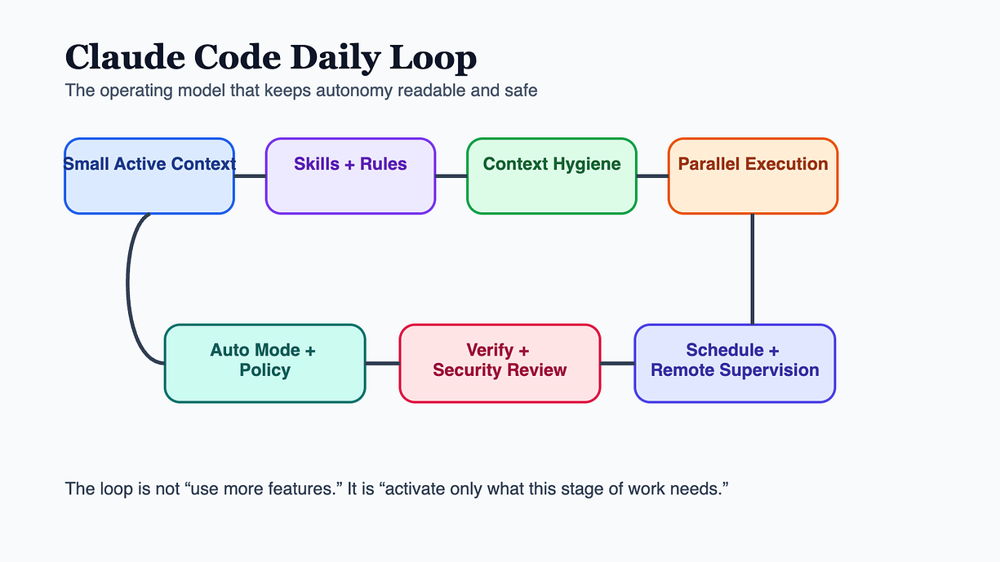
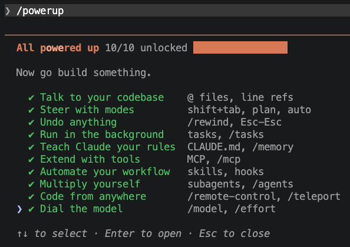
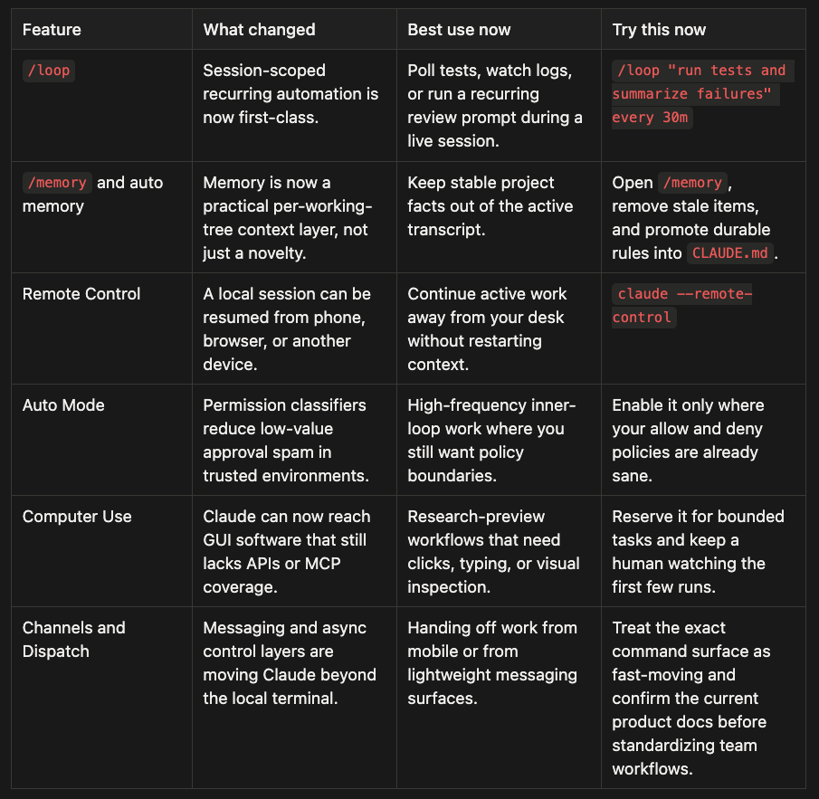
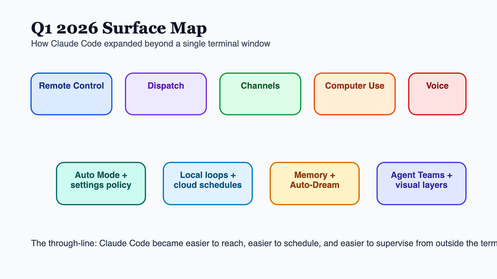
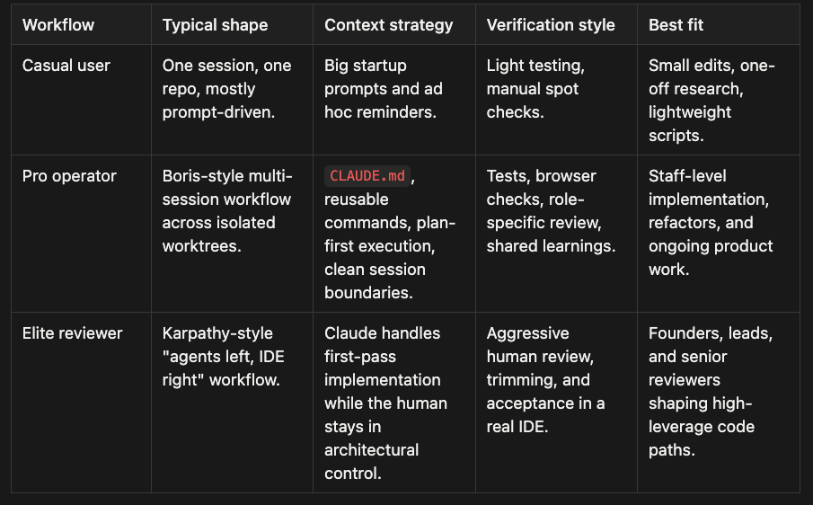
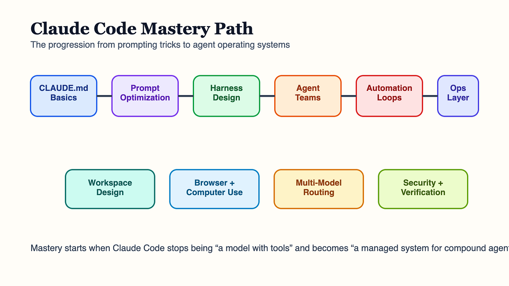
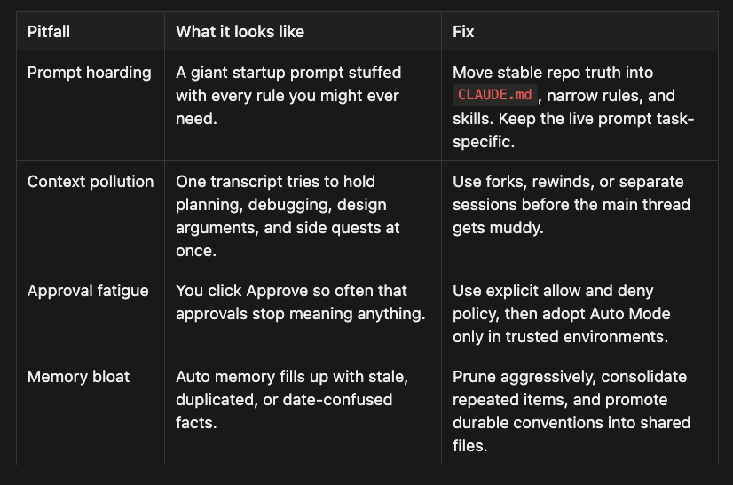

The real story across late 2025 and Q1 2026 is not a single slash command or model release. It is the emergence of a repeatable operating model for AI-assisted development. That model has five parts:

1.  Keep always-on context small.
2.  Turn repeated procedures into skills or commands.
3.  Protect active sessions from context pollution.
4.  Parallelize work only with clear supervision and isolation.
5.  Let guardrails remove noise without removing judgment.

## Table of Contents

-   Your 10-Minute Daily Claude Code Routine
-   Latest Features You Need Today (/powerup, /insights, /loop, Channels)
-   Casual vs. Pro vs. Elite Workflows
-   How Top Users Actually Work (Boris, Karpathy, Anthropic)
-   The Big Four: Bundled Skill-Like Commands
-   Context Hygiene Is the Hidden Multiplier
-   Approval Fatigue and Auto Mode
-   Common Pitfalls and How to Fix Them
-   Reliability Is the Real Feature
-   From Daily Use to Mastery
-   References

Press enter or click to view image in full size



Claude Code Daily Guide: Daily workflow architecture

## Your 10-Minute Daily Claude Code Routine

If you want Claude Code to feel useful every day instead of impressive every once in a while, start with a routine that is short enough to survive a real workweek.

### Morning setup

1.  Re-anchor the repo. Open the branch, scan `CLAUDE.md`, and confirm the project's test and review commands before you ask Claude to edit anything.
2.  Make Claude plan before it writes. Ask for the stages, the likely files, the risks, and the acceptance criteria.
3.  Decide whether this task deserves one session or several isolated worktrees before you start.

```
/memory
/loop "run tests and summarize failures" every 30m
```

### During the day

1.  Keep the main thread clean. Use side channels, forks, or fresh sessions for detours instead of dumping everything into one transcript.
2.  Turn anything you repeat twice into a skill, slash command, or reusable repo convention. Use subagents to keep your context tight and focused.
3.  Verify as you go. Tests, browser checks, screenshots, and second-pass review are part of the work, not a cleanup step.

### End-of-day ritual

1.  Run a cleanup pass for loose ends, duplicated code, and unfinished notes.
2.  Update `CLAUDE.md` or memory with anything the next session should know by default.
3.  Kill stale loops, close noisy sessions, and leave one clear handoff for tomorrow.

**Do this today**

-   Add one repo-specific rule to `CLAUDE.md` instead of repeating it in chat.
-   Start one recurring loop for a real nuisance task like tests, screenshots, or PR summaries.

## Latest Features You Need to Use Today (Q1 2026)

These two commands are easy to miss, but they are now two of the highest-leverage “meta” features in Claude Code: one teaches you what you’re not using, and the other tells you what’s slowing you down.

### /powerup: in-terminal interactive lessons

`/powerup` is Claude Code’s built-in onboarding/tutorial system. It runs interactive lessons (often with animated terminal demos) that teach you features most people never discover.

Use it when you:

-   just updated Claude Code and want to see what’s new
-   sense you’re only using 20% of the product (hooks, subagents, rewind, worktrees, skills, MCP, etc.)
-   want a self-contained learning loop without leaving the terminal

The key value isn’t the command list; it’s that it _demonstrates_ workflows end-to-end so you can copy them immediately.



### /insights: HTML report on your last ~30 days of sessions

`/insights` analyzes your local Claude Code session history and generates an interactive HTML report (typically saved to `~/.claude/usage-data/report.html`).

What it tends to show:

-   projects and sessions overview
-   tool usage patterns and where time/tokens go
-   recurring friction points (where you get stuck, restart, or abandon threads)
-   personalized “what’s working / what’s hindering / quick wins / ambitious workflows” suggestions

Practical way to use it: run `/insights`, take the top 1–3 friction points, then fix them by promoting rules into `CLAUDE.md`, creating a skill, or adding a hook that removes repeat manual work.

The fastest way to fall behind is to keep using Claude Code like it is still a 2025 terminal-only assistant. These are the surfaces that changed the daily workflow most in Q1 2026.

Press enter or click to view image in full size



Claude Code Daily Guide: Q1 2026 surface map

Two details matter more than the headline features.

First, `/loop` is powerful because it is small. It is not a cloud scheduler. It is a lightweight recurring prompt inside a live session, which makes it ideal for test polling, review reminders, and recurring checks while you are actively working.

Second, Remote Control and channles changes the shape of a workday. Once the same session can be resumed from your phone, browser, or another machine, Claude stops feeling like a single terminal tab and starts feeling like a persistent work surface.

**Do this today**

-   Add one `/loop` task that saves you a manual check every day.
-   Test Remote Control on a safe repo before you need it during real work.
-   Setup Channels

### Channels: iMessage, Telegram, Discord (research preview)

“Channels” is a research-preview capability that lets you send messages from chat apps into a _running_ Claude Code session — useful when you want to kick off a task, ask for a status check, or drop a quick instruction without switching back to your terminal.

The important mental model: **Channels is message transport**, not a separate agent. You’re still talking to the same local session on your Mac, with the same repo checkout and the same tool access. If the session stops, the channel stops.

### Why teams care (and where Slack/Telegram fit)

-   **Slack/Telegram/Discord** are the practical options for _team_ workflows: shared channels, cross-platform access, and a familiar chat surface for lightweight “dispatch” (e.g., “run the test suite”, “summarize failures”, “draft PR notes”).
-   **iMessage** is the fastest personal setup for Apple-heavy workflows: no bot token, no external webhook service, and a very low-friction way to ping your running session from iPhone/iPad/Mac.

### iMessage setup (quick guide)

1.  **Prereqs**: Claude Code v2.1.80+ and **Bun** installed.
2.  **Grant Full Disk Access** to your terminal app (required to read `~/Library/Messages/chat.db`). I am not going to lie, this felt wrong.
3.  Install the plugin inside a Claude Code session:

-   `plugin install imessage@claude-plugins-official`

4\. Relaunch with channels enabled:

-   `claude --channels plugin:imessage@claude-plugins-official`

5\. **Smoke test**: message yourself (self-chat) from any Apple device.

6\. First reply triggers a one-time macOS prompt (“Terminal wants to control Messages”) — approve it.

### Operational limits to call out

-   **Session must stay running** (close the terminal and the channel goes offline; messages sent while it’s down are typically lost).
-   **Permission prompts still block**: if the session needs approval, it will pause until you confirm locally.
-   **macOS-only for iMessage** (Telegram/Discord-style channels are cross-platform).

Press enter or click to view image in full size



Claude Code Daily Developer’s Guide: Q1 2026 surface map

## Casual vs. Pro vs. Elite Claude Code Workflows

Not every strong workflow looks the same, but the operating model is becoming easier to classify.

Press enter or click to view image in full size



Claude Code Daily Guide: Workflows

The point is not to imitate one personality. It is to adopt the discipline each model shares: narrow context, explicit planning, isolated execution, and real verification.

## How Top Users Actually Work: Boris, Karpathy, and Anthropic Patterns

Anthropic’s public harness philosophy is clear: plan before editing, keep context narrow and task-shaped, verify with an evaluator rather than trusting the generator, use subagents with separate contexts, and treat permissions as policy. As of April 2026, the majority of code at the company is written by Claude Code, but engineers act as architects, reviewers, and orchestrators rather than line-by-line typists.

Boris Cherny’s workflow: five or more parallel Claude sessions on separate git worktrees so each agent has a safe write surface. Every complex task starts with a structured plan before execution begins. CLAUDE.md is treated as a living contract, continuously updated so future sessions start smarter. Subagents are used adversarially (“make subagents fight”) so multiple agents with different review roles challenge each other before a human accepts. The result is three layers of protection: parallel implementation across isolated checkouts, explicit planning before edits, and adversarial review before merge.

Karpathy’s workflow: agents on the left, IDE on the right. Claude handles first-pass implementation while the human stays in the reviewer, spec-writer, and editor role, keeping architectural control and catching wrong turns. Both patterns converge on the same lesson: the human role moves from typing code to directing, validating, and shaping agent work.

Worktree isolation is the key primitive: use **_claude — worktree_** feature-auth (or -w) to create isolated checkouts. Progressive disclosure beats prompt hoarding: CLAUDE.md holds always-true context, rules handle narrow file constraints, skills package repeatable procedures, and memory stores learned facts. Each layer is smaller and more situational than one giant wall of instructions.

## The Big Four: bundled skill-like commands

Claude Code now ships with four built-in “skill-like” commands that demonstrate the full power of the system. Each solves a problem that previously required manual orchestration (or giving up).

`**/simplify**`

After implementing a feature or fixing a bug, run `/simplify` to spawn parallel review agents:

1.  **Code reuse**: reduces duplication
2.  **Code quality**: finds bugs, unclear logic, maintainability issues
3.  **Efficiency**: identifies performance improvements

The agents run concurrently, aggregate findings, and apply fixes. You can focus the review, e.g. `/simplify focus on memory efficiency`.

`**/batch**`

The most ambitious bundled command. Give `/batch` _a change description_ and it:

1.  researches the codebase to understand scope
2.  decomposes work into 5–30 independent units
3.  presents a plan for approval
4.  spawns one agent per unit, **_each in an isolated git worktree_**
5.  has each agent implement, test, and open a PR

Example: `/batch migrate src/ from Solid to React`.

This is where worktree isolation becomes a first-class primitive: each agent works on its own branch to avoid merge collisions. The tradeoff is decomposition quality — review the plan before approving.

`**/debug**`

When Claude Code itself is misbehaving, `/debug` reads the session debug log and diagnoses the issue. You can pass a focus hint, e.g. `/debug why is the Bash tool failing?`. **_This is very important. If you are having a problem with Claude, start by calling /debug to start debug logging. Then explain your problem. It knows about Claude and how to debug issues with hooks, memory, context, subagents, skills, etc._**

`**/claude-api**`

When your project imports `anthropic`, `@anthropic-ai/sdk`, or `claude_agent_sdk`, this activates automatically. It loads language-appropriate API reference material (tool use, streaming, batches, structured output, and common pitfalls) so Claude is “API-smart” without you having to ask.

Learn more: [Claude Code Agent Skills 2.0: From Custom Instructions to Programmable Agents](https://medium.com/towards-artificial-intelligence/claude-code-agent-skills-2-0-from-custom-instructions-to-programmable-agents-ab6e4563c176)

This logic extends beyond the officially documented pieces.

The broader Claude Code ecosystem now includes front-end design plugins that push the model away from generic AI-generated layouts, simplify-style workflows that use multiple evaluators instead of one blunt cleanup pass, tech-debt routines that consolidate duplication into shared libraries, and automation for commits, issue hygiene, and even motion-graphics generation. Some of those tools are public, some are marketplace packages, and some are described as internal team habits. The common pattern is what matters: repeated work gets turned into explicit software.

That is the point where Claude Code stops feeling like prompting and starts feeling like environment design.

## Context Hygiene Is the Hidden Productivity Multiplier

The next problem is not capability. It is contamination.

Long-running sessions degrade when too much irrelevant discussion sticks to the main transcript. A side question here, a correction chain there, a detour into a design alternative, and soon the model is carrying a messy whiteboard full of stale or secondary material while trying to keep the main task coherent.

That is why context-hygiene workflows matter so much.

Commands such as `/btw`, `/fork`, and `/rewind`, as described in community workflows, solve different parts of the same problem. `/btw` is the cheap side channel for quick understanding. `/fork` is the real branch for deeper exploration. `/rewind` is the surgical reset when the model has gone down the wrong path and you would rather remove the damage than debate it in place.

These are not convenience features. They are how advanced users preserve session quality over time.

### The Context Hygiene Toolkit: /btw, /fork, /rewind

**/btw: cheap, fast, and deliberately constrained**

The `/btw` agent leverages the main session’s prompt cache — it piggybacks on already-processed tokens instead of re-sending the entire context. In practice, that means you can do frequent “status check” or “quick clarification” turns with minimal cost and _without_ polluting the main thread.

Constraints by design:

-   **Single-turn only** (one question, one answer)
-   **Read-only** (no edits, no commands, no artifacts)
-   **No new tool/file access** (it can’t read anything the main session hasn’t already seen)

When you need more than a single answer — or you need Claude to actually _do_ something — reach for `/fork`.

**/fork: deep exploration without contaminating the main session**

Forking creates a new session that inherits the conversation history up to the fork point, while the original session stays untouched.

-   **In-session:** `/fork`
-   **From the CLI** (e.g., to open in another terminal):
-   `claude -r "session-name" --fork-session`

A fork is effectively a running-process duplicate: you keep the file-reading history, decisions, and discovered patterns, so you can immediately explore alternatives (e.g., SSE vs WebSockets) without spending turns re-explaining context.

**/rewind: surgical state restoration when you went the wrong way**

`/rewind` is what you use when pollution is already in the thread; it removes bad context instead of just isolating it.

-   Run it via `/rewind`, or press **Esc** twice.

Useful variants:

-   `**/compact**`: compresses the current context window in place (keeps working, drops raw history)
-   `**/rewind summarization**`: rolls back to a prior checkpoint (best when recent context is wrong/polluted)

**Quick selection guide**

-   **Quick question / non-disruptive check:** `/btw`
-   **Need file/tool access or a parallel alternative:** `/fork`
-   **Wrong direction / bad context:** `/rewind` (or **Esc**, **Esc** for the last change)
-   **Context too big (but not wrong):** `/compact`

Learn more: [Mastering Claude Code’s /btw, /fork, and /rewind: The Context Hygiene Toolkit](https://medium.com/towards-artificial-intelligence/mastering-claude-codes-btw-fork-and-rewind-the-context-hygiene-toolkit-5ceefa59623d).

The same logic appears again in multi-agent work.

Once a task gets large enough, one transcript becomes the wrong container. Large migrations, broad refactors, multi-part documentation, and repository-wide cleanups all benefit from decomposition. A lead agent builds the plan, breaks work into units, and defines acceptance criteria. Subagents or parallel sessions execute bounded pieces. Isolated work trees or isolated environments prevent those pieces from clobbering each other before the lead agent merges them back into the main line.

That is the important point about batch-style workflows and agent teams. They are not valuable simply because they are parallel. They are valuable because they keep parallel work from degenerating into context sprawl and file collisions.

Learn more: [Claude Code Agent Teams: Multiple Claudes Working Together](https://medium.com/spillwave-solutions/claude-code-agent-teams-multiple-claudes-working-together-a75ff370eccb) _Spin up independent Claude instances that coordinate through a shared task list and message each other directly._

## Approval Fatigue Is Real, and Auto Mode Is a Partial Fix

Anthropic’s March 25, 2026 engineering post on Auto Mode is one of the most useful Claude Code documents because it starts from an uncomfortable truth: most people approve most prompts anyway.

When that happens, the permission system still creates friction, but it no longer creates meaningful oversight. Auto Mode exists to reduce that failure mode. It uses model-based classifiers to screen actions, allowing routine operations to proceed while escalating the actions that look risky.

That is the right direction, but the mature reading is not “problem solved.”

Anthropic is careful about the limits. The system includes prompt-injection defenses and transcript-based action review, but it is not omniscient. It cannot turn an untrusted environment into a trusted one. It cannot eliminate poisoned instructions or every multi-step attack path. It is a better tradeoff inside trusted developer environments, not a universal answer for regulated or high-blast-radius work.

That is why the daily workflow still needs explicit policy and verification.

Settings files, allow and deny rules, and enterprise policy exist because different projects need different risk envelopes. A reusable skill may be safe at the markdown level while still needing shell execution to be explicitly approved. A fast coding flow may still need a dedicated verification stack that runs linters, tests, browser checks, screenshots, and domain-specific validation before anyone should trust the result. Security scans belong in the same category.

In other words, autonomy is only useful when it is harnessed.

## Automated permissions (Auto Mode) quick reference

### Enabling in the CLI

Launch Claude Code with the auto mode flag:

```
claude --enable-auto-mode
```

Once inside a session, press `Shift+Tab` to cycle through permission modes. The `auto` option appears only after you have launched with `--enable-auto-mode`.

For single-run headless execution:

```
claude -p "refactor the auth module" --permission-mode auto
```

### Setting Auto Mode as the default

Add this to your `settings.json`:

```
{
  "permissions": {
    "defaultMode": "auto"
  }
}
```

You can still cycle back to other modes with `Shift+Tab` during any session.

### Viewing default classifier rules

To see what the classifier allows and blocks by default:

```
claude auto-mode defaults
```

### Disabling Auto Mode

-   **As a user:** press `Shift+Tab` to cycle back to `default`, `acceptEdits`, or `plan`.
-   **As an admin (disable for all users):** add this to your managed settings:

```
{
  "disableAutoMode": "disable"
}
```

On macOS, you can also set this via defaults:

```
defaults write com.anthropic.claudecode disableAutoMode -string "disable"
```

For more detail, see: [Claude Code Auto Mode: Escape Permission Fatigue (Guide to Automated Permissions)](https://medium.com/@richardhightower/claude-code-auto-mode-escape-permission-fatigue-guide-to-automated-permissions-a122568e1ed6)

## From Daily Use to Mastery

The beginner mistake is treating Claude Code as “better autocomplete.” The intermediate mistake is treating it as “a giant prompt with tools.” Mastery starts when you realize the real unit of skill is the operating model: context files, harness design, subagents, parallel execution, memory hygiene, and evaluation loops.If you were building a serious training path around Claude Code today, the modules would write themselves.

Start with `CLAUDE.md` and prompt structure. Developers should learn how to build both global rules and local project contracts, then measure how much better the model behaves once those files are tuned. Move from there into prompt optimization: run an eval set, inspect failure patterns, and rewrite the system context until it gets meaningfully better. Then teach harnesses and security together, because giving an agent more tools without teaching boundaries is just a faster way to make mistakes.

From there, the advanced modules are obvious:

-   parallel agent teams and fan-out/fan-in workflows
-   scoped context hierarchies with skills and subagents
-   auto-research loops with explicit success metrics
-   browser and computer automation with clear isolation boundaries
-   multi-model routing to avoid monoculture
-   workspace design so projects, skills, and active artifacts stay legible
-   security review, dependency sanity checking, and secret discipline

That curriculum matters because it matches where the tool is headed.

Claude Code is increasingly less about “how do I prompt better right now?” and more about “how do I design a repeatable environment where good agent behavior compounds over time?” That is the real mastery layer.

Press enter or click to view image in full size



Claude Code Daily Guide: Claude Code mastery path

## Common Pitfalls and How to Fix Them

Most wasted Claude Code time comes from a handful of predictable mistakes.

Press enter or click to view image in full size



Claude Code Daily Guide: Common Pitfalls and how to fix them

This is the real reason elite workflows look calmer than casual ones. They are not using more magic. They are eliminating more drag.

**Do this today**

-   Delete one stale instruction from your default prompt and move it into the right layer.
-   Close one noisy session instead of dragging its baggage into tomorrow.

## Reliability Is the Real Feature

The deeper story is reliability. Recent releases have fixed memory leaks, large-payload handling, structured-output stability, resume continuity, and text correctness for CJK, emoji, and Devanagari. Anthropic is not just widening the surface area of the product; it is hardening the harness around it.

Key recent additions: disableSkillShellExecution for enterprise safety, **_\_meta\[“anthropic/maxResultSizeChars”\]_** for larger MCP tool results (up to 500K), and — resume fixes for multi-session workflows. Anthropic’s March 2026 Code Review launch describes a multi-agent review system they run on nearly every PR internally.

Claude Code’s real competitive advantage is not that it can do more. It is that it is starting to support a disciplined way of doing more without collapsing under its own complexity.

Save this as your daily Claude Code reference.

## Continue the Series

-   [Save Hours: Stop Repeating Yourself to Claude: Skills, Rules, Memory, and When to Use Each](https://medium.com/@richardhightower/save-hours-stop-repeating-yourself-to-claude-skills-rules-memory-and-when-to-use-each-93ce3cf83aa8) _Mastering Claude Code: Streamline Your Developer Workflow and Boost Productivity with Skills and Customization Tools_
-   [Stop Clicking “Approve”: How I Killed Approval Fatigue with Claude Code 2.1](https://medium.com/spillwave-solutions/stop-clicking-approve-how-i-killed-approval-fatigue-with-claude-code-2-1-60962946d101)
-   [Claude Code Agent Teams: Multiple Claudes Working Together](https://medium.com/@richardhightower/claude-code-agent-teams-multiple-claudes-working-together-a75ff370eccb)
-   [Put Claude on Autopilot: Scheduled Tasks with /loop and /schedule built-in Skills](https://ai.plainenglish.io/put-claude-on-autopilot-scheduled-tasks-with-loop-and-schedule-built-in-skills-43f3be5ac1ec)
-   [The Claude Code Daily Handbook: Strategic AI Collaboration for Modern Developers](https://medium.com/spillwave-solutions/the-claude-code-daily-handbook-strategic-ai-collaboration-for-modern-developers-fcb4419cafa8)

### Claude Code Core

-   [Claude Code Skills Deep Dive Part 1](https://medium.com/@richardhightower/claude-code-skills-deep-dive-part-1-82b572ad9450) : Basics of writing agent skills, and the agent skill architecture, which is important for encoding workflows
-   [Claude Code Skills Deep Dive Part 2](https://medium.com/@richardhightower/claude-code-skills-deep-dive-part-2-8cc7a34511a2) : Continue writing skills
-   [Claude Code Agent Skills 2.0: From Custom Instructions to Programmable Agents](https://medium.com/@richardhightower/claude-code-agent-skills-2-0-from-custom-instructions-to-programmable-agents-ab6e4563c176) : Advances in skills and new built-in skills. How to combine skills with permissions and hooks.
-   [Claude Code Agent Teams: Multiple Claudes Working Together](https://medium.com/@richardhightower/claude-code-agent-teams-multiple-claudes-working-together-a75ff370eccb) : Introduction to Agent Teams
-   [Claude Code Hooks: Making AI Gen Deterministic](https://medium.com/@richardhightower/claude-code-hooks-making-ai-gen-deterministic-ad4779c3a801) : Introductions to Hooks
-   [Claude Code Hooks Implementation Guide: Audit System](https://medium.com/@richardhightower/claude-code-hooks-implementation-guide-audit-system-03763748700f) : An example of using Hooks
-   [Claude Code Rules: Stop Stuffing Everything into One](https://medium.com/@richardhightower/claude-code-rules-stop-stuffing-everything-into-one-claude-md-0b3732bca433) `[CLAUDE.md](https://medium.com/@richardhightower/claude-code-rules-stop-stuffing-everything-into-one-claude-md-0b3732bca433)` : Organizing your rules and coding standards
-   [Claude Code Remote Control: Code From Your Phone](https://medium.com/@richardhightower/claude-code-remote-control-code-from-your-phone-3c7059c3b5de) : Using Remote feature with Claude Code
-   [Claude Code Auto Mode: Escape Permission Fatigue — Guide to Automated Permissions](https://medium.com/@richardhightower/claude-code-auto-mode-escape-permission-fatigue-guide-to-automated-permissions-a122568e1ed6) : Introduction to Auto Mode to escape permission fatigue
-   [Claude Code’s Automatic Memory: No More Re-Explaining Your Project](https://medium.com/spillwave-solutions/claude-codes-automatic-memory-no-more-re-explaining-your-project-6584813900eb) : Introduction to Claude Code Automatic Memory and how to use it
-   [Mastering Claude Code’s /btw, /fork, and /rewind: The Context Hygiene Toolkit](https://medium.com/@richardhightower/mastering-claude-codes-btw-fork-and-rewind-the-context-hygiene-toolkit-5ceefa59623d) : Tools to keep your Context clean and focused.
-   [Put Claude on Autopilot: Scheduled Tasks with /loop and /schedule built-in Skills](https://medium.com/@richardhightower/put-claude-on-autopilot-scheduled-tasks-with-loop-and-schedule-built-in-skills-43f3be5ac1ec) : Introduction to new cron features
-   [Stop Clicking “Approve”: How I Killed Approval Fatigue with Claude Code 2.1](https://medium.com/@richardhightower/stop-clicking-approve-how-i-killed-approval-fatigue-with-claude-code-2-1-60962946d101) : How to avoid approval fatigue with Claude Code
-   [The Claude Code Daily Handbook: Strategic AI Collaboration for Modern Developers](https://medium.com/@richardhightower/the-claude-code-daily-handbook-strategic-ai-collaboration-for-modern-developers-fcb4419cafa8) : Original Claude Code Daily Handbook

### Agent Skills & Building Skills — Codify Workflows into Agent Ski

-   [Build Your First Claude Code Agent Skill: A Simple Project Memory System That Saves Hours](https://medium.com/@richardhightower/build-your-first-claude-code-skill-a-simple-project-memory-system-that-saves-hours-1d13f21aff9e) : Basic getting started guide for writing your first agent skill.
-   [Build Agent Skills Faster with Claude Code 2.1 Release](https://medium.com/@richardhightower/build-agent-skills-faster-with-claude-code-2-1-release-6d821d5b8179)
-   [Build Your First Agent Skill in 10 Minutes Using the Context7 Wizard, and Save Hours](https://medium.com/@richardhightower/build-your-first-agent-skill-in-10-minutes-using-the-context7-wizard-and-save-hours-2e5ab0319297)
-   [Claude Code: How to Build, Evaluate, and Tune AI Agent Skills](https://medium.com/@richardhightower/claude-code-how-to-build-evaluate-and-tune-ai-agent-skills-102c3a393a34) : Guide on how to use Claude Code to improve the skills that you write
-   [Mastering Agentic Skills: The Complete Guide to Building Effective Agent Skills](https://medium.com/@richardhightower/mastering-agentic-skills-the-complete-guide-to-building-effective-agent-skills-d3fe57a058f1)
-   [Mastering Agent Development: The Architect Agent Workflow for Creating Robust AI Agent Skills](https://medium.com/@richardhightower/mastering-agent-development-the-architect-agent-workflow-for-creating-robust-ai-agent-skills-abd345e26696)
-   [Save Hours: Stop Repeating Yourself to Claude: Skills, Rules, Memory, and When to Use Each](https://medium.com/@richardhightower/save-hours-stop-repeating-yourself-to-claude-skills-rules-memory-and-when-to-use-each-93ce3cf83aa8)

I wrote a [Claude Certified Architect](https://medium.com/@richardhightower/claude-certified-architect-the-complete-guide-to-passing-the-cca-foundations-exam-9665ce7342a8) (CCA) series of articles that have a lot of useful information on getting the most out of Claude Code. The same concepts apply and quite a few of articles are Claude Code specific.

### CCA Exam Prep

-   [Claude Certified Architect: The Complete Guide to Passing the CCA Foundations Exam](https://medium.com/@richardhightower/claude-certified-architect-the-complete-guide-to-passing-the-cca-foundations-exam-9665ce7342a8)
-   [CCA Exam Prep: Mastering the Code Generation with Claude Code Scenario](https://medium.com/@richardhightower/cca-exam-prep-mastering-the-code-generation-with-claude-code-scenario-95f2d8d06742)
-   [CCA Exam Prep: Mastering the Multi-Agent Research System Scenario](https://medium.com/@richardhightower/cca-exam-prep-mastering-the-multi-agent-research-system-scenario-aa0c446a5e7d)
-   [CCA Exam Prep: Structured Data Extraction](https://medium.com/@richardhightower/cca-exam-prep-structured-data-extraction-86ad3c7541a3)
-   [CCA: Master the Developer Productivity Scenario](https://medium.com/@richardhightower/cca-master-the-developer-productivity-scenario-for-the-claude-certified-architect-exam-from-e402d9bb277d)
-   [Claude Certified Architect: Master the CI/CD Scenario](https://medium.com/@richardhightower/claude-certified-architect-master-the-ci-cd-scenario-for-the-cca-foundations-exam-the-flags-de2478a346da)
-   [CCA Exam Prep: Mastering the Customer Support Resolution Agent Scenario](https://medium.com/@richardhightower/claude-code-certification-exam-prep-mastering-the-customer-support-resolution-agent-scenario-5b82a086eaf8)

Save this as your daily Claude Code reference.

Which feature changed your workflow most: `/loop`, Remote Control, memory, or Auto Mode?

Drop your favorite skill or recurring loop in the comments. Follow for the next update if you want the Q2 2026 follow-up.

**#ClaudeCode #ClaudeAI #AICoding #DeveloperProductivity #Anthropic #AIWorkflow #RemoteControl #ClaudeCodeTutorial2026 #AIAgentCoding**

### About the Author

_Rick Hightower is a hands-on developer and technical writer who builds with LangGraph, Claude Agent SDK, CrewAI, and now Google ADK._

He created skilz, the [universal agent skill installer](https://skillzwave.ai/docs/), supporting 30+ coding agents including Claude Code, Gemini, Copilot, and Cursor, and co-founded the world’s largest agentic skill marketplace. Connect with Rick Hightower on [LinkedIn](https://www.linkedin.com/in/rickhigh/) or [Medium](https://medium.com/@richardhightower). Check out [SpillWave](https://spillwave.com/), your source for AI expertise.

Rick has been actively developing generative AI systems, agents, and agentic workflows for years. He is the author of numerous agentic frameworks and developer tools and brings deep practical expertise to teams looking to adopt AI. He enjoys writing about himself in the 3rd person.

## References

### Anthropic Official Docs and Engineering

-   Anthropic, _How Anthropic teams use Claude Code_: [https://claude.com/blog/how-anthropic-teams-use-claude-code](https://claude.com/blog/how-anthropic-teams-use-claude-code)
-   Anthropic PDF, _How Anthropic teams use Claude Code_: [https://www-cdn.anthropic.com/58284b19e702b49db9302d5b6f135ad8871e7658.pdf](https://www-cdn.anthropic.com/58284b19e702b49db9302d5b6f135ad8871e7658.pdf)
-   Anthropic, _Claude Code auto mode: a safer way to skip permissions_: [https://www.anthropic.com/engineering/claude-code-auto-mode](https://www.anthropic.com/engineering/claude-code-auto-mode)
-   Anthropic, _Code execution with MCP: Building more efficient agents_: [https://www.anthropic.com/engineering/code-execution-with-mcp](https://www.anthropic.com/engineering/code-execution-with-mcp)
-   Anthropic, _Harness design for long-running application development_: [https://www.anthropic.com/engineering/harness-design-long-running-apps](https://www.anthropic.com/engineering/harness-design-long-running-apps)
-   Anthropic, _Effective harnesses for long-running agents_: [https://www.anthropic.com/engineering/effective-harnesses-for-long-running-agents](https://www.anthropic.com/engineering/effective-harnesses-for-long-running-agents)
-   Anthropic, _Effective context engineering for AI agents_: [https://www.anthropic.com/engineering/effective-context-engineering-for-ai-agents](https://www.anthropic.com/engineering/effective-context-engineering-for-ai-agents)
-   Anthropic, _Equipping agents for the real world with Agent Skills_: [https://www.anthropic.com/engineering/equipping-agents-for-the-real-world-with-agent-skills](https://www.anthropic.com/engineering/equipping-agents-for-the-real-world-with-agent-skills)
-   Anthropic, _Building a C compiler with a team of parallel Claudes_: [https://www.anthropic.com/engineering/building-c-compiler](https://www.anthropic.com/engineering/building-c-compiler)
-   Claude Code docs, _Changelog_: [https://code.claude.com/docs/en/changelog](https://code.claude.com/docs/en/changelog)
-   Claude Code docs, _Scheduled tasks_: [https://code.claude.com/docs/en/scheduled-tasks](https://code.claude.com/docs/en/scheduled-tasks)
-   Claude Code docs, _Remote Control_: [https://code.claude.com/docs/en/remote-control](https://code.claude.com/docs/en/remote-control)
-   Anthropic docs, _Claude Code memory_: [https://docs.anthropic.com/en/docs/claude-code/memory](https://docs.anthropic.com/en/docs/claude-code/memory)
-   Claude Code docs, _Slash commands_: [https://code.claude.com/docs/en/slash-commands](https://code.claude.com/docs/en/slash-commands)
-   Claude Code docs, _Subagents_: [https://code.claude.com/docs/en/sub-agents](https://code.claude.com/docs/en/sub-agents)
-   Anthropic support, _Using voice mode_: [https://support.claude.com/en/articles/11101966-using-voice-mode](https://support.claude.com/en/articles/11101966-using-voice-mode)
-   Anthropic support, _Automated security reviews in Claude Code_: [https://support.anthropic.com/en/articles/11932705-automated-security-reviews-in-claude-code/](https://support.anthropic.com/en/articles/11932705-automated-security-reviews-in-claude-code/)
-   Anthropic docs, _Prompt engineering overview_: [https://platform.claude.com/docs/en/build-with-claude/prompt-engineering/overview](https://platform.claude.com/docs/en/build-with-claude/prompt-engineering/overview)
-   Anthropic docs, _Claude prompting best practices_: [https://platform.claude.com/docs/en/build-with-claude/prompt-engineering/claude-prompting-best-practices](https://platform.claude.com/docs/en/build-with-claude/prompt-engineering/claude-prompting-best-practices)

### Boris Cherny Workflow Sources

-   Boris Cherny on X, _How I use Claude Code_: [https://x.com/bcherny/status/2007179832300581177](https://x.com/bcherny/status/2007179832300581177)
-   _How Boris Uses Claude Code_: [https://howborisusesclaudecode.com](https://howborisusesclaudecode.com/)
-   Reddit mirror, _bcherny, creator of Claude Code, shares how I use Claude Code_: [https://www.reddit.com/r/AI\_Agents/comments/1q3xw15/bcherny\_creator\_of\_claude\_code\_shares\_how\_i\_use/](https://www.reddit.com/r/AI_Agents/comments/1q3xw15/bcherny_creator_of_claude_code_shares_how_i_use/)
-   InfoQ, _Claude Code creator workflow_: [https://www.infoq.com/news/2026/01/claude-code-creator-workflow/](https://www.infoq.com/news/2026/01/claude-code-creator-workflow/)
-   Slashdot, _Creator of Claude Code reveals his workflow_: [https://developers.slashdot.org/story/26/01/06/2239243/creator-of-claude-code-reveals-his-workflow](https://developers.slashdot.org/story/26/01/06/2239243/creator-of-claude-code-reveals-his-workflow)
-   FreeCodeCamp, _Claude Code Handbook_: [https://www.freecodecamp.org/news/claude-code-handbook/](https://www.freecodecamp.org/news/claude-code-handbook/)
-   Every, _How to Use Claude Code Like the People Who Built It_: [https://every.to/podcast/how-to-use-claude-code-like-the-people-who-built-it](https://every.to/podcast/how-to-use-claude-code-like-the-people-who-built-it)
-   Paddo, _10 Tips from Inside the Claude Code Team_: [https://paddo.dev/blog/claude-code-team-tips/](https://paddo.dev/blog/claude-code-team-tips/)
-   Jitendra Zaa, _10 Claude Code Tips from the Creator Boris Cherny_: [https://www.jitendrazaa.com/blog/others/tips/10-claude-code-tips-from-the-creator-boris-cherny-february/](https://www.jitendrazaa.com/blog/others/tips/10-claude-code-tips-from-the-creator-boris-cherny-february/)
-   YouTube, _Building Claude Code with Boris Cherny_: [https://www.youtube.com/watch?v=julbw1JuAz0](https://www.youtube.com/watch?v=julbw1JuAz0)
-   YouTube, _His Claude Code Workflow Is Insane_: [https://www.youtube.com/watch?v=WpQZlKiy3zo](https://www.youtube.com/watch?v=WpQZlKiy3zo)
-   YouTube, _How to Use Claude Code the Boris Way_: [https://www.youtube.com/watch?v=1aCp9OT8rvw](https://www.youtube.com/watch?v=1aCp9OT8rvw)
-   Get Push to Prod, _How the creator of Claude Code actually uses Claude Code_: [https://getpushtoprod.substack.com/p/how-the-creator-of-claude-code-actually](https://getpushtoprod.substack.com/p/how-the-creator-of-claude-code-actually)
-   Lenny’s Newsletter, _Head of Claude Code: what happens_: [https://www.lennysnewsletter.com/p/head-of-claude-code-what-happens](https://www.lennysnewsletter.com/p/head-of-claude-code-what-happens)
-   Pragmatic Engineer, _How Claude Code is built_: [https://newsletter.pragmaticengineer.com/p/how-claude-code-is-built](https://newsletter.pragmaticengineer.com/p/how-claude-code-is-built)

### Karpathy Workflow and Auto-Research

-   Andrej Karpathy on X, _Claude agents on the left, IDE on the right_: [https://x.com/karpathy/status/2015883857489522876](https://x.com/karpathy/status/2015883857489522876)
-   Business Insider, _Andrej Karpathy says Claude Code is shifting his workflow_: [https://www.businessinsider.com/andrej-karpathy-claude-code-manual-skills-atrophy-software-engineering-tesla-2026-1](https://www.businessinsider.com/andrej-karpathy-claude-code-manual-skills-atrophy-software-engineering-tesla-2026-1)
-   [Dev.to](http://dev.to/), _Karpathy’s Claude Code field notes_: [https://dev.to/jasonguo/karpathys-claude-code-field-notes-real-experience-and-deep-reflections-on-the-ai-programming-era-4e2f](https://dev.to/jasonguo/karpathys-claude-code-field-notes-real-experience-and-deep-reflections-on-the-ai-programming-era-4e2f)
-   The AI Corner, _Andrej Karpathy AI workflow shift_: [https://www.the-ai-corner.com/p/andrej-karpathy-ai-workflow-shift-agentic-era-2026](https://www.the-ai-corner.com/p/andrej-karpathy-ai-workflow-shift-agentic-era-2026)
-   Fortune, _Andrej Karpathy’s autoresearch_: [https://fortune.com/2026/03/17/andrej-karpathy-loop-autonomous-ai-agents-future/](https://fortune.com/2026/03/17/andrej-karpathy-loop-autonomous-ai-agents-future/)
-   Reddit, _Andrej Karpathy’s autoresearch breakdown_: [https://www.reddit.com/r/singularity/comments/1roo6v0/andrew\_karpathys\_autoresearch\_an\_autonomous\_loop/](https://www.reddit.com/r/singularity/comments/1roo6v0/andrew_karpathys_autoresearch_an_autonomous_loop/)
-   YouTube, _Autoresearch, Agent Loops and the Future of Work_: [https://www.youtube.com/watch?v=nt9j1k2IhUY](https://www.youtube.com/watch?v=nt9j1k2IhUY)
-   YouTube, _Karpathy on code agents and AutoResearch_: [https://www.youtube.com/watch?v=kwSVtQ7dziU](https://www.youtube.com/watch?v=kwSVtQ7dziU)

### Internal Tools, Skills, and Workflow Reporting

-   YouTube, _Copy These Claude Skills From The Claude Code’s Creators_: [https://www.youtube.com/watch?v=AhXfI1rSUPc](https://www.youtube.com/watch?v=AhXfI1rSUPc)
-   Reddit, _Claude Code creator: introducing /simplify and /batch_: [https://www.reddit.com/r/ClaudeAI/comments/1rgthpn/claude\_code\_creator\_in\_the\_next\_version/](https://www.reddit.com/r/ClaudeAI/comments/1rgthpn/claude_code_creator_in_the_next_version/)
-   LinkedIn, _Introducing /simplify and /batch Skills for Claude_: [https://www.linkedin.com/posts/douglasfinke\_claude-code-is-prepping-to-introduce-two-activity-7433531966244958208-Vb8Q](https://www.linkedin.com/posts/douglasfinke_claude-code-is-prepping-to-introduce-two-activity-7433531966244958208-Vb8Q)
-   MindStudio, _What Is Claude Code /simplify and /batch?_: [https://www.mindstudio.ai/blog/claude-code-simplify-batch-commands/](https://www.mindstudio.ai/blog/claude-code-simplify-batch-commands/)
-   Mejba, _Inside the Claude Code Team’s Actual Workflow Tools_: [https://www.mejba.me/locale/en?next=%2Fblog%2Fclaude-code-team-workflow-tools](https://www.mejba.me/locale/en?next=%2Fblog%2Fclaude-code-team-workflow-tools)
-   [Dev.to](http://dev.to/), _How the creator of Claude Code uses Claude Code_: [https://dev.to/sivarampg/how-the-creator-of-claude-code-uses-claude-code-a-complete-breakdown-4f07](https://dev.to/sivarampg/how-the-creator-of-claude-code-uses-claude-code-a-complete-breakdown-4f07)
-   CodingScape, _How Anthropic engineering teams use Claude Code every day_: [https://codingscape.com/blog/how-anthropic-engineering-teams-use-claude-code-every-day](https://codingscape.com/blog/how-anthropic-engineering-teams-use-claude-code-every-day)

### Q1 2026 Platform Shift and Always-On Features

-   MindStudio, _Claude Code Q1 2026 Update Roundup_: [https://www.mindstudio.ai/blog/claude-code-q1-2026-update-roundup/](https://www.mindstudio.ai/blog/claude-code-q1-2026-update-roundup/)
-   MindStudio, _Claude Code Q1 2026 Update Roundup 2_: [https://www.mindstudio.ai/blog/claude-code-q1-2026-update-roundup-2/](https://www.mindstudio.ai/blog/claude-code-q1-2026-update-roundup-2/)
-   CNBC, _Anthropic Claude AI agent can use your computer_: [https://www.cnbc.com/2026/03/24/anthropic-claude-ai-agent-use-computer-finish-tasks.html](https://www.cnbc.com/2026/03/24/anthropic-claude-ai-agent-use-computer-finish-tasks.html)
-   9to5Google, _Claude can now remotely control your computer_: [https://9to5google.com/2026/03/24/claude-can-now-remotely-control-your-computer-and-it-looks-absolutely-wild-video/](https://9to5google.com/2026/03/24/claude-can-now-remotely-control-your-computer-and-it-looks-absolutely-wild-video/)
-   PCMag, _Anthropic’s Claude can now use your computer_: [https://www.pcmag.com/news/anthropics-claude-can-now-use-your-computer-to-complete-tasks-for-you](https://www.pcmag.com/news/anthropics-claude-can-now-use-your-computer-to-complete-tasks-for-you)
-   Nicholas Rhodes, _Claude Computer Use: Mac Setup Guide_: [https://nicholasrhodes.substack.com/p/claude-computer-use-mac-setup-guide](https://nicholasrhodes.substack.com/p/claude-computer-use-mac-setup-guide)
-   LinkedIn, _Claude Computer Use Now Available_: [https://www.linkedin.com/posts/a-banks\_this-is-wild-claude-can-now-use-your-entire-activity-7442178633621893121-DAuV](https://www.linkedin.com/posts/a-banks_this-is-wild-claude-can-now-use-your-entire-activity-7442178633621893121-DAuV)
-   LinkedIn, _Claude Code Introduces Auto Mode for Permission Handling_: [https://www.linkedin.com/posts/claude\_new-in-claude-code-auto-mode-activity-7442269445970046976-GxwB](https://www.linkedin.com/posts/claude_new-in-claude-code-auto-mode-activity-7442269445970046976-GxwB)
-   Reddit, _Claude Code now has auto mode_: [https://www.reddit.com/r/ClaudeAI/comments/1s2ok85/claude\_code\_now\_has\_auto\_mode/](https://www.reddit.com/r/ClaudeAI/comments/1s2ok85/claude_code_now_has_auto_mode/)
-   LinkedIn, Nate Herkelman, _Anthropic quietly dropped auto dream_: [https://www.linkedin.com/posts/nateherkelman\_claude-code-just-dropped-memory-20-anthropic-activity-7442225812269068288-GWZ\_](https://www.linkedin.com/posts/nateherkelman_claude-code-just-dropped-memory-20-anthropic-activity-7442225812269068288-GWZ_)
-   Facebook, _Claude Code auto-dream for memory consolidation_: [https://www.facebook.com/groups/aimlmalaysia/posts/2637089366691281/](https://www.facebook.com/groups/aimlmalaysia/posts/2637089366691281/)
-   Zeabur, _Paperclip: Run a Zero-Human Company with AI Agent Teams_: [https://zeabur.com/blogs/deploy-paperclip-ai-agent-orchestration](https://zeabur.com/blogs/deploy-paperclip-ai-agent-orchestration)
-   LinkedIn, Nate Herkelman, _Mission Control style dashboard for Claude Code_: [https://www.linkedin.com/posts/nateherkelman\_this-one-tool-turns-claude-code-into-an-entire-activity-7443717127821303808-eprC](https://www.linkedin.com/posts/nateherkelman_this-one-tool-turns-claude-code-into-an-entire-activity-7443717127821303808-eprC)
-   Paddo, _From Ralph Wiggum to /loop: The Absorption Continues_: [https://paddo.dev/blog/claude-code-loop-ralph-wiggum-evolution/](https://paddo.dev/blog/claude-code-loop-ralph-wiggum-evolution/)
-   Reddit, _Anthropic just made Claude Code run without you_: [https://www.reddit.com/r/ClaudeAI/comments/1rna5mb/anthropic\_just\_made\_claude\_code\_run\_without\_you/](https://www.reddit.com/r/ClaudeAI/comments/1rna5mb/anthropic_just_made_claude_code_run_without_you/)
-   LinkedIn, _Introducing /loop_: [https://www.linkedin.com/posts/julianalvarado\_anthropic-quietly-released-an-openclaw-killer-activity-7436787507276656640-blm5](https://www.linkedin.com/posts/julianalvarado_anthropic-quietly-released-an-openclaw-killer-activity-7436787507276656640-blm5)
-   Reddit, _Anthropic shipped Remote Control for Claude Code_: [https://www.reddit.com/r/ClaudeAI/comments/1rfvv06/anthropic\_shipped\_remote\_control\_for\_claude\_code/](https://www.reddit.com/r/ClaudeAI/comments/1rfvv06/anthropic_shipped_remote_control_for_claude_code/)
-   YouTube, _How to Use Claude Dispatch_: [https://www.youtube.com/watch?v=sP4GFZmR6wU](https://www.youtube.com/watch?v=sP4GFZmR6wU)
-   YouTube, _Claude Code Memory 2.0 With Unlimited Memory_: [https://www.youtube.com/watch?v=6pjETAf2XhU](https://www.youtube.com/watch?v=6pjETAf2XhU)

### Voice Mode and Related Reporting

-   Deeper Insights, _Anthropic Adds Voice Mode to Claude Code_: [https://deeperinsights.com/ai-blog/voice-mode-to-claude-code/](https://deeperinsights.com/ai-blog/voice-mode-to-claude-code/)
-   TechCrunch, _Claude Code rolls out a voice mode capability_: [https://techcrunch.com/2026/03/03/claude-code-rolls-out-a-voice-mode-capability/](https://techcrunch.com/2026/03/03/claude-code-rolls-out-a-voice-mode-capability/)
-   TechBuzz, _Anthropic’s Claude Code adds voice mode to challenge Copilot_: [https://www.techbuzz.ai/articles/anthropic-s-claude-code-adds-voice-mode-to-challenge-copilot](https://www.techbuzz.ai/articles/anthropic-s-claude-code-adds-voice-mode-to-challenge-copilot)
-   YouTube, _Voice + code workflow demo_: [https://www.youtube.com/watch?v=XvmEVMdFqOA](https://www.youtube.com/watch?v=XvmEVMdFqOA)

### Release Notes and 2.1.91+ Community Coverage

-   GitHub issue, _disableSkillShellExecution docs gap_: [https://github.com/anthropics/claude-code/issues/42870](https://github.com/anthropics/claude-code/issues/42870)
-   GitHub issue, _MCP docs missing anthropic/maxResultSizeChars_: [https://github.com/anthropics/claude-code/issues/42869](https://github.com/anthropics/claude-code/issues/42869)
-   GitHub issue, _Exa MCP server result size discussion_: [https://github.com/exa-labs/exa-mcp-server/issues/133](https://github.com/exa-labs/exa-mcp-server/issues/133)
-   X, ClaudeCodeLog, _Claude Code 2.1.91 released_: [https://x.com/ClaudeCodeLog/status/2039856633119969769](https://x.com/ClaudeCodeLog/status/2039856633119969769)
-   X, Julian Goldie, _Claude Code 2.1.91 update thread_: [https://x.com/JulianGoldieSEO/status/2040640574441553942](https://x.com/JulianGoldieSEO/status/2040640574441553942)
-   Reddit, _Claude Code 2.1.91 Is INSANE!_: [https://www.reddit.com/r/AISEOInsider/comments/1sbkswv/claude\_code\_2191\_is\_insane/](https://www.reddit.com/r/AISEOInsider/comments/1sbkswv/claude_code_2191_is_insane/)

### Prompt Engineering, [CLAUDE.md](http://claude.md/), Harnesses, and Mastery

-   Arize, [_CLAUDE.md_](http://claude.md/) _best practices learned from prompt learning_: [https://arize.com/blog/claude-md-best-practices-learned-from-optimizing-claude-code-with-prompt-learning/](https://arize.com/blog/claude-md-best-practices-learned-from-optimizing-claude-code-with-prompt-learning/)
-   Walturn, _Mastering prompt engineering for Claude_: [https://www.walturn.com/insights/mastering-prompt-engineering-for-claude](https://www.walturn.com/insights/mastering-prompt-engineering-for-claude)
-   MintMCP, _Claude Code security_: [https://www.mintmcp.com/blog/claude-code-security](https://www.mintmcp.com/blog/claude-code-security)
-   Augment Code, _Google Antigravity vs Claude Code_: [https://www.augmentcode.com/tools/google-antigravity-vs-claude-code](https://www.augmentcode.com/tools/google-antigravity-vs-claude-code)
-   GitHub, _Awesome Claude Code subagents_: [https://github.com/VoltAgent/awesome-claude-code-subagents/blob/main/categories/05-data-ai/prompt-engineer.md](https://github.com/VoltAgent/awesome-claude-code-subagents/blob/main/categories/05-data-ai/prompt-engineer.md)
-   MCP Market, _Advanced Prompt Engineer_: [https://mcpmarket.com/tools/skills/advanced-prompt-engineer](https://mcpmarket.com/tools/skills/advanced-prompt-engineer)
-   GitHub, _Claude Code playbook security best practices_: [https://github.com/RiyaParikh0112/claude-code-playbook/blob/main/docs/fundamentals/security-best-practices.md](https://github.com/RiyaParikh0112/claude-code-playbook/blob/main/docs/fundamentals/security-best-practices.md)
-   Julian Goldie, _Claude Skills_: [https://juliangoldie.com/claude-skills/](https://juliangoldie.com/claude-skills/)