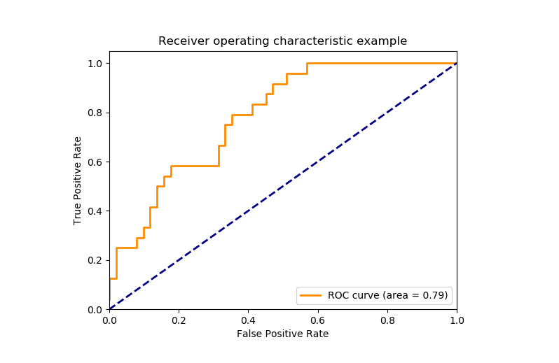

Evaluation metrics are used to measure how well a machine learning model performs. They help assess whether the model is making accurate predictions and meeting the desired goals. This is important because:

-   ****Model Performance**** : Measures how well the model works
-   ****Different Tasks**** : Used for classification, regression and clustering
-   ****Right Metric Choice**** : Helps select the best way to evaluate a model
-   ****Better Decisions**** : Ensures the model meets its objectives

## Classification Metrics

Classification problems aim to predict discrete categories. To evaluate the performance of classification models, we use the following metrics:

### 1\. Accuracy

[Accuracy](https://www.geeksforgeeks.org/physics/accuracy-and-precision/) is a fundamental metric used for evaluating the performance of a classification model. It tells us the proportion of correct predictions made by the model out of all predictions.

> $\rm{Accuracy} = \frac{\rm{Number\; of\; Correct \;Predictions}}{\rm{Total\; Number \;of \;Predictions}}$

While accuracy provides a quick snapshot, it can be misleading in cases of imbalanced datasets. For example, in a dataset with 90% class A and 10% class B, a model predicting only class A will still achieve 90% accuracy but it will fail to identify any class B instances.

Accuracy is good but it gives a False Positive sense of achieving high accuracy. The problem arises due to the possibility of misclassification of minor class samples being very high.

### ****2\. Precision****

It measures how many of the positive predictions made by the model are actually correct. It's useful when the cost of false positives is high such as in medical diagnoses where predicting a disease when it’s not present can have serious consequences.

> $\rm{Precision} = \frac{TP}{TP\; +\; FP}$

Where:

-   TP = True Positives
-   FP = False Positives

[Precision](https://www.geeksforgeeks.org/physics/accuracy-and-precision/) helps ensure that when the model predicts a positive outcome, it’s likely to be correct.

### ****3\. Recall****

[Recall](https://www.geeksforgeeks.org/machine-learning/precision-recall-curve-ml/) or Sensitivity measures how many of the actual positive cases were correctly identified by the model. It is important when missing a positive case (false negative) is more costly than false positives.

> $\rm{Recall} = \frac{TP}{TP\;+\;FN}$

Where:

-   FN = False Negatives

In scenarios where catching all positive cases is important (like disease detection), recall is a key metric.

### 4\. F1 Score

The [F1 Score](https://www.geeksforgeeks.org/machine-learning/f1-score-in-machine-learning/) is the harmonic mean of precision and recall. It is useful when we need a balance between precision and recall as it combines both into a single number. A high F1 score means the model performs well on both metrics. Its range is \[0,1\].

Lower recall and higher precision gives us great accuracy but then it misses a large number of instances. More the F1 score better will be performance. It can be expressed mathematically in this way:

> $\text{F1 Score} = 2 \times \frac{\text{Precision} \times \text{Recall}}{\text{Precision} + \text{Recall}}$

### 5\. Logarithmic Loss (Log Loss)

[Log loss](https://www.geeksforgeeks.org/machine-learning/ml-log-loss-and-mean-squared-error/) measures the uncertainty of the model’s predictions. It is calculated by penalizing the model for assigning low probabilities to the correct classes. This metric is used in multi-class classification and is helpful when we want to assess a model’s confidence in its predictions. If there are N  samples belonging to the M class, then we calculate the Log loss in this way:

> $\text{Logarithmic Loss} = -\frac{1}{N} \sum_{i=1}^{N} \sum_{j=1}^{M} y_{ij} \cdot \log(p_{ij})$ 

Where:

-   $y_{ij}$ \=Actual class (0 or 1) for sample $i$ and class $j$
-   $p_{ij}$ =Predicted probability for sample $i$ and class $j$

The goal is to minimize Log Loss, as a lower Log Loss shows higher prediction accuracy.

### 6\. Area Under Curve (AUC) and ROC Curve

It is useful for binary classification tasks. The [AUC](https://www.geeksforgeeks.org/machine-learning/auc-roc-curve/) value represents the probability that the model will rank a randomly chosen positive example higher than a randomly chosen negative example. AUC ranges from 0 to 1 with higher values showing better model performance.

****1\. True Positive Rate(TPR)****

Also known as sensitivity or recall, the True Positive Rate measures how many actual positive instances were correctly identified by the model. It answers the question: "Out of all the actual positive cases, how many did the model correctly identify?"

Formula:

> $\rm{TPR} = \frac{TP}{TP + FN}$     

Where:

-   TP = True Positives (correctly predicted positive cases)
-   FN = False Negatives (actual positive cases incorrectly predicted as negative)

****2\. True Negative Rate(TNR)****

Also called specificity, the True Negative Rate measures how many actual negative instances were correctly identified by the model. It answers the question: "Out of all the actual negative cases, how many did the model correctly identify as negative?"

Formula:

> $\rm{TNR} = \frac{TN}{TN \;+\; FP}$  

Where:

-   TN = True Negatives (correctly predicted negative cases)
-   FP = False Positives (actual negative cases incorrectly predicted as positive)

****3\. False Positive Rate(FPR)****

It measures how many actual negative instances were incorrectly classified as positive. It’s a key metric when the cost of false positives is high such as in fraud detection.

Formula:

> $\rm{FPR} = \frac{\rm{FP}}{\rm{FP \;+ \;TN}}$

Where:

-   FP = False Positives (incorrectly predicted positive cases)
-   TN = True Negatives (correctly predicted negative cases)

****4\. False Negative Rate(FNR)****

It measures how many actual positive instances were incorrectly classified as negative. It answers: "Out of all the actual positive cases, how many were misclassified as negative?"

Formula:

> $\rm{FNR} = \frac{\rm{FN}}{\rm{FN \;+ \;TP}}$

Where:

-   FN = False Negatives (incorrectly predicted negative cases)
-   TP = True Positives (correctly predicted positive cases)

****ROC Curve****

It is a graphical representation of the True Positive Rate (TPR) vs the False Positive Rate (FPR) at different classification thresholds. The curve helps us visualize the trade-offs between sensitivity (TPR) and specificity (1 - FPR) across various thresholds. Area Under Curve (AUC) quantifies the overall ability of the model to distinguish between positive and negative classes.

-   AUC = 1: Perfect model (always correctly classifies positives and negatives).
-   AUC = 0.5: Model performs no better than random guessing.
-   AUC < 0.5: Model performs worse than random guessing (showing that the model is inverted).

ROC Curve for Evaluation of Classification Models

### 7\. Confusion Matrix

[Confusion matrix](https://www.geeksforgeeks.org/machine-learning/confusion-matrix-machine-learning/) creates a N X N matrix, where N is the number of classes or categories that are to be predicted. Here we have N = 2, so we get a 2 X 2 matrix. Suppose there is a problem with our practice which is a [binary classification](https://www.geeksforgeeks.org/deep-learning/binary-cross-entropy-log-loss-for-binary-classification/). Samples of that classification belong to either Yes or No. So, we build our classifier which will predict the class for the new input sample. After that, we tested our model with 165 samples and we get the following result.

|n=165|Predicted No|Predicted Yes|
|---|---|---|
|Actual No|50|10|
|Actual Yes|5|100|

There are 4 terms we should keep in mind: 

1.  ****True Positives:**** It is the case where we predicted Yes and the real output was also Yes.
2.  ****True Negatives:**** It is the case where we predicted No and the real output was also No.
3.  ****False Positives:**** It is the case where we predicted Yes but it was actually No.
4.  ****False Negatives:**** It is the case where we predicted No but it was actually Yes. 

## Regression Metrics

In the regression task, we are supposed to predict the target variable which is in the form of continuous values. To evaluate the performance of such a model below metrics are used:

### 1\. Mean Absolute Error (MAE)

[MAE](https://www.geeksforgeeks.org/python/how-to-calculate-mean-absolute-error-in-python/) calculates the average of the absolute differences between the predicted and actual values. It gives a clear view of the model’s prediction accuracy but it doesn't shows whether the errors are due to over- or under-prediction. It is simple to calculate and interpret helps in making it a good starting point for model evaluation.

> $\rm{MAE}=\frac{1}{N} \sum_{j=1}^{N}\left|y_{j}-\hat{y}_{j}\right|$

Where:

-   $y_j$ = Actual value
-   $\hat{y}_j$ = Predicted value

### 2\. Mean Squared Error (MSE)

[MSE](https://www.geeksforgeeks.org/python/python-mean-squared-error/) calculates the average of the squared differences between the predicted and actual values. Squaring the differences ensures that larger errors are penalized more heavily helps in making it sensitive to outliers. This is useful when large errors are undesirable but it can be problematic when outliers are not relevant to the model’s purpose.

Formula:

> $\rm{MSE}=\frac{1}{N} \sum_{j=1}^{N}\left(y_{j}-\hat{y}_{j}\right)^{2}$

Where:

-   $y_j$ = Actual value
-   $\hat{y}_j$ = Predicted value

### 3\. Root Mean Squared Error (RMSE)

[RMSE](https://www.geeksforgeeks.org/r-language/root-mean-square-error-in-r-programming/) is the square root of MSE, bringing the metric back to the original scale of the data. Like MSE, it heavily penalizes larger errors but is easier to interpret as it’s in the same units as the target variable. It’s useful when we want to know how much our predictions deviate from the actual values in terms of the same scale.

Formula:

> $\rm{RMSE}=\sqrt{\frac{\sum_{j=1}^{N}\left(y_{j}-\hat{y}_{j}\right)^{2}}{N}}$

Where:

-   $y_j$ = Actual value
-   $\hat{y}_j$ = Predicted value

### 4\. Root Mean Squared Logarithmic Error (RMSLE)

RMSLE is useful when the target variable spans a wide range of values. Unlike RMSE, it penalizes underestimations more than overestimations helps in making it ideal for situations where the model is predicting quantities that vary greatly in scale like predicting prices or population.

Formula:

> $\rm{RMSLE}=\sqrt{\frac{\sum_{j=1}^{N}\left(\log(y_{j}+1) - \log (\hat{y}_{j}+1)\right)^{2}}{N}}$

Where:

-   $y_j$ = Actual value
-   $\hat{y}_j$ = Predicted value

### 5\. R² (R-squared)

[R2 score](https://www.geeksforgeeks.org/machine-learning/python-coefficient-of-determination-r2-score/) represents the proportion of the variance in the dependent variable that is predictable from the independent variables. An R² value close to 1 shows a model that explains most of the variance while a value close to 0 shows that the model does not explain much of the variability in the data. R² is used to assess the goodness-of-fit of regression models.

Formula:

> $R^2 = 1 - \frac{\sum_{j=1}^{n} (y_j - \hat{y}_j)^2}{\sum_{j=1}^{n} (y_j - \bar{y})^2}$

Where:

-   $y_j$ = Actual value
-   $\hat{y}_j$ = Predicted value
-   $\bar{y}$ \= Mean of the actual values

## Clustering Metrics

In unsupervised learning tasks such as clustering, the goal is to group similar data points together. Evaluating clustering performance is often more challenging than supervised learning since there is no explicit ground truth. However, clustering metrics provide a way to measure how well the model is grouping similar data points.

### 1\. Silhouette Score

[Silhouette Score](https://www.geeksforgeeks.org/machine-learning/what-is-silhouette-score/) evaluates how well a data point fits within its assigned cluster considering how close it is to points in its own cluster (cohesion) and how far it is from points in other clusters (separation). A higher silhouette score (close to +1) shows well-clustered data while a score near -1 suggests that the data point is in the wrong cluster.

Formula:

> $\text{Silhouette Score} = \frac{b - a}{\max(a, b)}$

Where:

-   a = Average distance between a sample and all other points in the same cluster
-   b = Average distance between a sample and all points in the nearest cluster

### 2\. Davies-Bouldin Index

[Davies-Bouldin Index](https://www.geeksforgeeks.org/machine-learning/davies-bouldin-index/) measures the average similarity between each cluster and its most similar cluster. A lower Davies-Bouldin index shows better clustering as it suggests the clusters are well-separated and compact. The goal is to minimize the Davies-Bouldin index to achieve optimal clustering.

Formula:

> $\text{Davies-Bouldin Index} = \frac{1}{N} \sum_{i=1}^{N} \max_{i \neq j} \left( \frac{\sigma_i + \sigma_j}{d(c_i, c_j)} \right)$

Where:

-   $\sigma _ i$ = Average distance of points in cluster i from the cluster centroid
-   $d(c_i, c_j)$ = Distance between centroids of clusters i and j

By mastering the appropriate evaluation metrics, we upgrade ourselves to fine-tune machine learning models which helps in ensuring they meet the needs of diverse applications and deliver optimal performance.