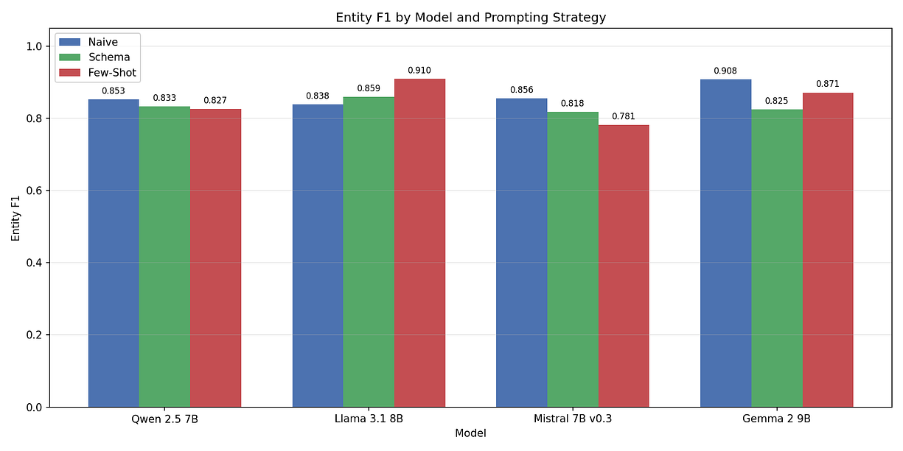
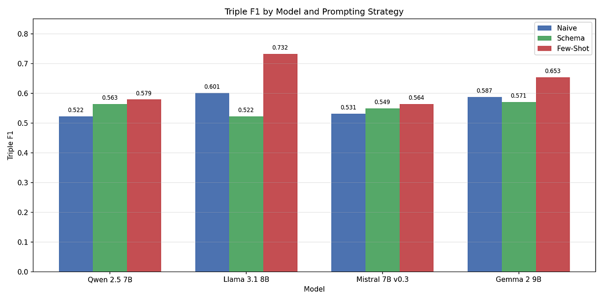
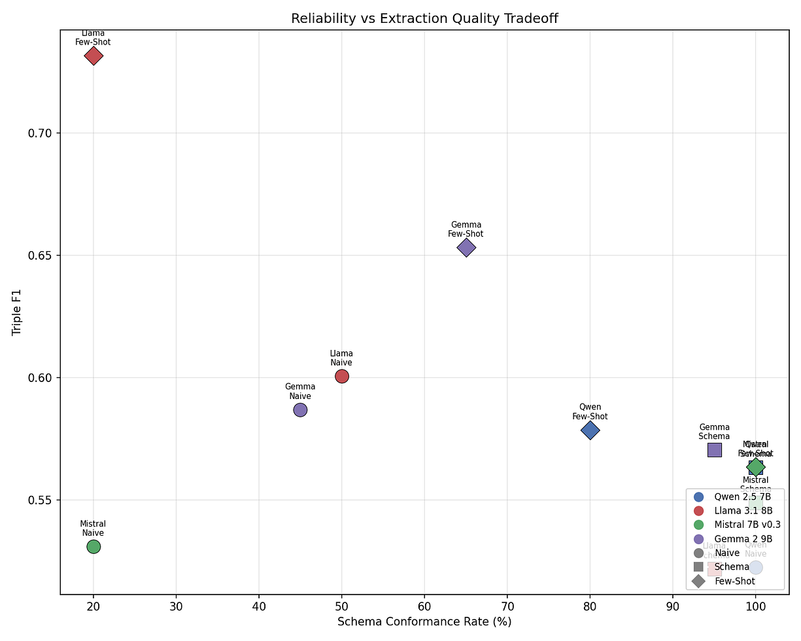
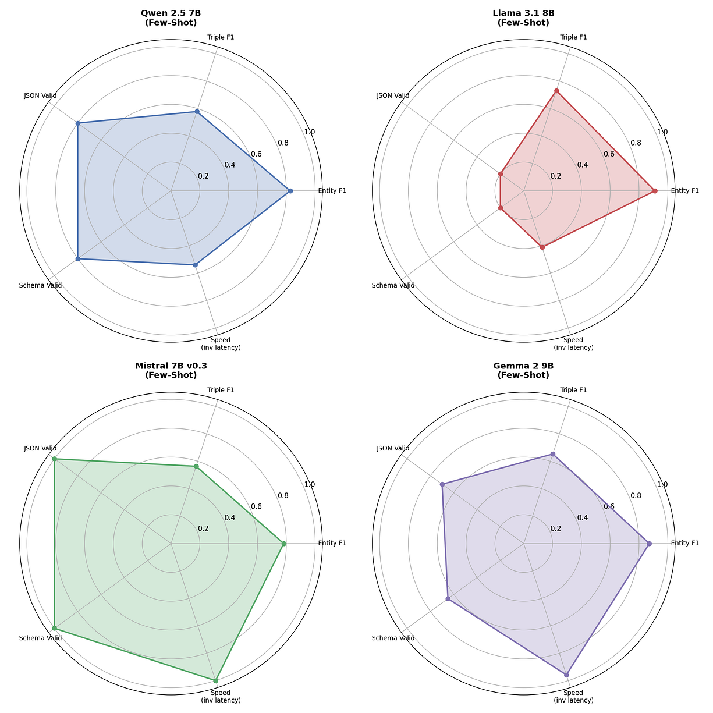

Graph RAG has emerged as one of the most promising approaches for building knowledge-grounded AI systems. By structuring documents into knowledge graphs — networks of entities connected by typed relationships — it enables retrieval that understands _how_ things relate, not just _what_ words co-occur.

But there’s a problem nobody talks about enough: the extraction step.

Before you can query a knowledge graph, you need to build one. That means taking raw text and extracting structured entity-relation triples — things like `(Marie Curie, born_in, Warsaw)` or `(CRISPR-Cas9, developed_by, Jennifer Doudna)`. Most Graph RAG papers assume you'll throw GPT-4 at this and move on. But if you're building production systems, especially in regulated environments where data can't leave your infrastructure, you need local models. And local models have a much harder time with structured extraction than you might expect.

I built a benchmark to find out exactly how hard it is.

## Why Local Models for Graph RAG?

The case for local extraction models is straightforward. In enterprise settings — healthcare, legal, finance — sending documents to external APIs isn’t always an option. Compliance requirements, latency constraints, and cost at scale all push toward running extraction locally.

The question isn’t _whether_ to use local models. It’s _which ones_, and _how to prompt them_.

Graph RAG extraction is a particularly demanding task for small models. You’re asking a 7–9B parameter model to simultaneously: identify all entities in a passage, classify their types, determine the relationships between them, express those relationships as structured triples, and output everything as valid JSON. That’s a lot of cognitive load for a model that runs on a single GPU.

## The Experiment

I designed a benchmark specifically for Graph RAG extraction quality. Unlike general-purpose NLP benchmarks, this one focuses on the exact task a Graph RAG pipeline needs: given a text passage, produce structured `(subject, predicate, object)` triples with typed entities.

**The dataset:** 20 passages spanning four complexity levels — simple (clear entities, few relations), moderate (multiple entities with interconnected relations), complex (dense passages with nested relationships), and edge cases (aliases, abbreviations, empty passages). The dataset covers domains like biography, science, business, technology, and geopolitics, with 150 gold-standard entities and 139 gold-standard triples.

**The models:**

```
+--------------------------+------------+----------------+
| Model                    | Parameters | Family         |
+--------------------------+------------+----------------+
| Qwen 2.5 7B Instruct     | 7B         | Qwen (Alibaba) |
| Llama 3.1 8B Instruct    | 8B         | Llama (Meta)   |
| Mistral 7B Instruct v0.3 | 7B         | Mistral        |
| Gemma 2 9B IT            | 9B         | Gemma (Google) |
+--------------------------+------------+----------------+
```

All models ran on a single NVIDIA RTX 3090 (24GB) via vLLM with identical settings: 4096 max context length, prefix caching enabled, 8 concurrent requests.

**The prompting strategies:**

1.  **Naive** — a simple instruction to extract entities and triples as JSON
2.  **Schema-in-prompt** — the same instruction plus the exact JSON schema the output should follow
3.  **Few-shot** — two worked examples showing input text and expected extraction output

**Evaluation:** fuzzy matching with synonym-aware predicate comparison. Models shouldn’t be penalized for producing `was_born_in` instead of `born_in` — those mean the same thing for a knowledge graph. Entity matching uses token-sort ratio with a threshold of 75, and predicates go through a synonym canonicalization layer with ~45 synonym groups before falling back to fuzzy string matching.

## The Results

### Finding 1: Entity Recognition Is Solved. Relation Extraction Is Not.

Press enter or click to view image in full size



All four models achieve Entity F1 scores between 0.78 and 0.91 — respectable performance that would be usable in production. The models are good at _finding_ things in text.

But look at Triple F1:

Press enter or click to view image in full size



The picture changes dramatically. The best result across all model-strategy combinations is 0.732 (Llama 3.1 + few-shot), and most configurations land between 0.52 and 0.60. The gap between entity recognition and relation extraction is the central challenge: models can identify `Marie Curie` and `Warsaw` in a sentence, but reliably extracting `(Marie Curie, born_in, Warsaw)` as a structured triple is significantly harder.

Why? Relation extraction requires understanding not just _what_ entities exist, but _how_ they connect. It demands both semantic comprehension and structural discipline — the model needs to decompose compound statements into atomic triples, choose consistent predicate names, and maintain valid JSON throughout.

### Finding 2: There’s No Best Model. There’s a Tradeoff.

Press enter or click to view image in full size



This scatter plot tells the real story. The x-axis shows schema conformance rate (does the model produce valid, parseable output?) and the y-axis shows Triple F1 (when it does produce output, how good is it?). The top-right corner — high quality _and_ high reliability — is empty.

**Llama 3.1 8B** achieves the highest extraction quality (0.732 Triple F1 with few-shot prompting) but is the least reliable — only 20% of its few-shot outputs conform to the expected schema. When it works, it’s excellent. 80% of the time, it doesn’t work.

**Mistral 7B v0.3** is the opposite: 100% JSON validity and 100% schema conformance with schema-in-prompt, but the extraction quality tops out at 0.564 Triple F1. It’s the workhorse — predictable, fast (7–14s average latency, roughly 3x faster than others), and never crashes. But it leaves accuracy on the table.

**Qwen 2.5 7B** occupies a similar space to Mistral — reliable (100% schema conformance with naive and schema prompting) with moderate extraction quality (0.52–0.58 Triple F1).

**Gemma 2 9B** offers the best all-around balance. With few-shot prompting, it hits 0.653 Triple F1 at 65% schema conformance. With schema-in-prompt, it gets 95% reliability at 0.571 Triple F1. Its larger parameter count (9B vs 7–8B) seems to help, particularly on complex passages.

### Finding 3: Few-Shot Helps Quality but Hurts Reliability

Across all four models, few-shot prompting consistently achieves the highest Triple F1. The worked examples help models understand the expected output structure, the granularity of predicates, and the decomposition of compound relations.

But the cost is real. Few-shot prompts are 3–5x longer, which increases latency (Qwen goes from 10.9s to 37.0s) and — more critically — reduces output reliability. The longer context seems to confuse smaller models into producing malformed JSON, rambling explanations instead of structured output, or partial extractions.

```
+-----------------+---------------+--------------------------+------------------+
| Model           | Naive Schema% | Schema-in-Prompt Schema% | Few-Shot Schema% |
+-----------------+---------------+--------------------------+------------------+
| Qwen 2.5 7B     | 100%          | 100%                     | 80%              |
| Llama 3.1 8B    | 50%           | 95%                      | 20%              |
| Mistral 7B v0.3 | 20%           | 100%                     | 100%             |
| Gemma 2 9B      | 45%           | 95%                      | 65%              |
+-----------------+---------------+--------------------------+------------------+
```

Mistral is the notable exception — it _improves_ with few-shot while maintaining 100% schema conformance. This makes it the only model where few-shot is strictly better than the alternatives.

### Finding 4: Complexity Degrades Triples More Than Entities

When passages get harder — more entities, nested relationships, temporal qualifiers — entity detection stays relatively stable, but triple extraction falls off sharply. For Qwen with the naive strategy, simple passages get 0.643 Triple F1, but moderate passages drop to 0.365 and complex passages to 0.438. The models struggle to decompose dense text into atomic triples, often producing compound objects such as `"Jennifer Doudna at UC Berkeley and Emmanuelle Charpentier at the Max Planck Institute"` rather than separate triples for each researcher and their affiliation.

Press enter or click to view image in full size



This has practical implications for Graph RAG: if your documents are dense technical or legal text, expect extraction quality to degrade more than simple benchmarks would suggest.

## The Evaluation Problem

Building this benchmark revealed something important: _evaluation is nearly as hard as extraction_.

My initial results showed Triple F1 scores around 0.36–0.48, which seemed alarmingly low. But digging into the raw outputs revealed that the models were actually producing semantically correct extractions — they were just using different words. A model that outputs `stands_at` instead of `height`, or `is_also_known_as` instead of `also_known_as`, shouldn't be penalized. These mean the same thing in a knowledge graph.

I went through three iterations of evaluation improvements:

1.  **Predicate synonym groups** — mapping ~45 groups of semantically equivalent predicates (e.g., `born_in`, `was_born_in`, `birthplace`, `place_of_birth` all map to the same canonical form)
2.  **Auxiliary verb stripping** — automatically removing prefixes like `is_`, `was_`, `has_been_` before matching, so `is_part_of` matches `part_of`
3.  **Substring entity matching** — accepting verbose model outputs like `"Jennifer Doudna at UC Berkeley"` as a match for the gold entity `"Jennifer Doudna"` in triple evaluation

These three changes improved the measured Triple F1 by 15–34% without changing any model outputs. The lesson: if you’re building a Graph RAG evaluation pipeline, invest as much effort in your matching logic as in your extraction prompts. Overly strict evaluation will make your models look worse than they actually are.

## Practical Recommendations

Based on 2000 extraction runs across 4 models and 3 strategies, here’s what I’d recommend for production Graph RAG systems:

**If reliability is your top priority** (e.g., automated pipelines with no human review): Use **Mistral 7B v0.3 + few-shot**. It’s the only configuration that achieves 100% schema conformance while still getting reasonable extraction quality (0.564 Triple F1). It’s also the fastest model, averaging 14s per extraction.

**If extraction quality matters most** (e.g., building a curated knowledge base with human validation): Use **Gemma 2 9B + few-shot**. At 0.653 Triple F1 with 65% schema conformance, you’ll need to handle failures, but the successful extractions are meaningfully better. The 9B parameter count gives it an edge on complex passages.

**If you need both and can afford retries**: Use **Llama 3.1 8B + few-shot with a fallback strategy**. Try a few-shot first (0.732 Triple F1 when it works), and if the output fails schema validation, retry with schema-in-prompt (95% conformance). This gives you the best of both worlds at the cost of ~2x latency on failures.

**For all models**: Schema-in-prompt is the safe default. It provides the best reliability-to-quality ratio across every model tested.

## What This Means for Graph RAG

The structured extraction gap — high entity recognition but mediocre relation extraction — is the real bottleneck for local Graph RAG. Closing it likely requires a combination of better prompting (perhaps chain-of-thought extraction where the model reasons about relationships before outputting JSON), constrained decoding (forcing valid JSON output at the token level), and possibly specialized fine-tuning on extraction tasks.

The good news is that these models are already useful. A Triple F1 of 0.55–0.65 means that more than half of the knowledge graph triples that a local model produces are correct and grounded. Combined with human review or confidence-based filtering, that’s enough to build production knowledge graphs without sending your data to external APIs.

The full benchmark code, dataset, and results are available on [GitHub](https://github.com/shereshevsky/graphrag-legal-extraction-benchmark). Run it on your own hardware, add your own models, and help the community understand what works for local Graph RAG extraction.

_Benchmarked on a single NVIDIA RTX 3090 using vLLM v0.7.3 with prefix caching. All models are open-weight and available on HuggingFace._