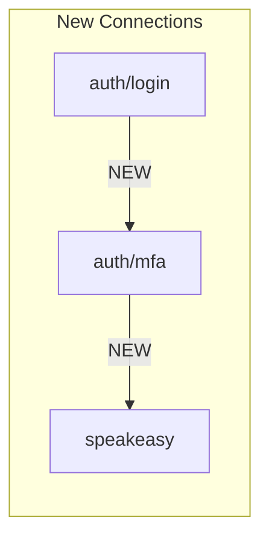
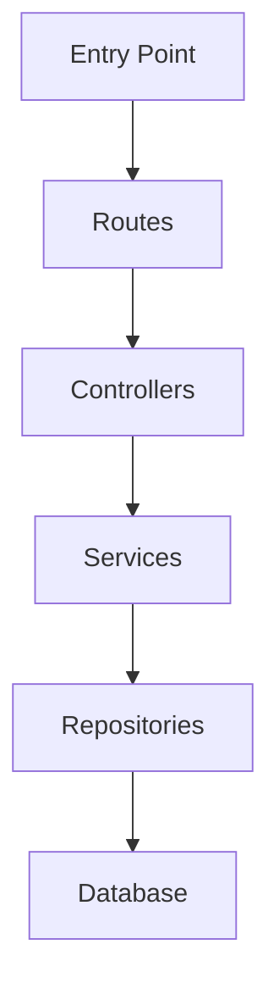

<objective>
Create a Claude Code skill called "codebase-cartographer" that performs exhaustive repository analysis and generates comprehensive documentation files (.md and .json) serving as the authoritative first point of reference for all future development work.

This skill should be the definitive onboarding tool - providing developers with complete knowledge of file locations, content summaries, architecture patterns, dependencies, and relationships before any development begins.

**KEY FEATURE: Change Data Capture (CDC)**
The skill must support incremental/differential analysis, tracking repository evolution over time. Each index is versioned and stored, enabling comparison between snapshots to identify what changed since the last cartography run.
</objective>

<context>
This skill will be used when:
- Onboarding to a new or unfamiliar codebase
- Creating documentation for handoff or team scaling
- Establishing a "single source of truth" reference before development
- Auditing a repository's structure and organization
- **Tracking daily/weekly codebase evolution (CDC mode)**
- **Identifying what changed since last index for code review or audit**

The output must be thorough enough that a developer can understand the entire codebase WITHOUT reading individual files - the index should provide sufficient context for informed decision-making.

**Tech Stack Detection**: Auto-detect based on manifest files (package.json, Cargo.toml, requirements.txt, go.mod, pom.xml, etc.)

**Platform Compatibility**: Must work on Windows (PowerShell/Git Bash), macOS, and Linux.
</context>

<skill_metadata>
```yaml
---
name: codebase-cartographer
description: Exhaustively indexes repository files, content, and architecture to generate comprehensive .md and .json documentation as the definitive first reference for future development. Supports CDC (Change Data Capture) for tracking repository evolution over time. Use when onboarding, creating documentation, establishing baseline knowledge, or tracking daily codebase changes.
version: 1.0.0
priority: HIGH
triggers:
  # Full index triggers
  - index repository
  - map codebase
  - cartograph
  - create codebase index
  - document repository structure
  - generate codebase reference
  - onboarding documentation
  - codebase cartography
  - full repository analysis
  - /cartograph
  # CDC/Differential triggers
  - what changed
  - codebase diff
  - repository changes
  - cartograph diff
  - show changes since last index
  - differential analysis
  - /cartograph-diff
  - compare codebase
  - evolution report
use_when:
  - User wants COMPLETE file-by-file documentation
  - User is ONBOARDING to unfamiliar codebase
  - User needs AUTHORITATIVE reference before development
  - User wants to CREATE baseline documentation
  - User says "index", "map", "cartograph", "document structure"
  - User wants to know WHAT CHANGED since last index
  - User needs DIFFERENTIAL analysis for code review
  - User says "diff", "changes", "evolution", "compare"
avoid_when:
  - User wants QUICK overview only (use repository-analyzer instead)
  - User wants to FIND specific code (use Explore agent)
  - User wants SEARCH for patterns (use Grep)
conflicts_with: []
tools_required:
  - Glob
  - Grep
  - Read
  - Write
  - Bash (for git operations and cloc if available)
output_format:
  primary: Markdown (.md)
  secondary: JSON (.json)
output_location:
  current_index:
    - ./CODEBASE_INDEX.md
    - ./CODEBASE_INDEX.json
  history_folder:
    - ./.claude/codebase-cartography/history/
  diff_output:
    - ./CODEBASE_CHANGELOG.md
    - ./CODEBASE_CHANGELOG.json
---
```
</skill_metadata>

<cdc_system>
## Change Data Capture (CDC) System

### Overview

The CDC system enables tracking of repository evolution by:
1. **Versioning each index** with unique snapshot IDs
2. **Storing historical snapshots** in `.claude/codebase-cartography/history/`
3. **Computing differentials** between any two snapshots
4. **Generating change reports** showing what evolved

### Snapshot Storage Structure

```
.claude/codebase-cartography/
├── current/
│   ├── CODEBASE_INDEX.md          # Latest full index
│   └── CODEBASE_INDEX.json        # Latest full index (JSON)
├── history/
│   ├── 2024-01-15T10-30-00_abc123/
│   │   ├── snapshot.json          # Complete snapshot
│   │   └── meta.json              # Snapshot metadata
│   ├── 2024-01-16T14-45-00_def456/
│   │   ├── snapshot.json
│   │   └── meta.json
│   └── ...
├── diffs/
│   ├── diff_abc123_to_def456.md   # Differential reports
│   └── diff_abc123_to_def456.json
└── manifest.json                   # Index of all snapshots
```

### Snapshot Metadata (meta.json)

```json
{
  "snapshotId": "2024-01-15T10-30-00_abc123",
  "createdAt": "2024-01-15T10:30:00Z",
  "gitCommit": "abc123def456...",
  "gitBranch": "main",
  "totalFiles": 342,
  "totalLines": 45678,
  "checksum": "sha256:...",
  "triggerType": "manual | scheduled | hook",
  "previousSnapshotId": "2024-01-14T09-00-00_xyz789"
}
```

### Manifest File (manifest.json)

```json
{
  "projectName": "my-project",
  "latestSnapshotId": "2024-01-16T14-45-00_def456",
  "snapshotCount": 15,
  "oldestSnapshot": "2024-01-01T08-00-00_first01",
  "snapshots": [
    {
      "id": "2024-01-16T14-45-00_def456",
      "createdAt": "2024-01-16T14:45:00Z",
      "gitCommit": "def456...",
      "totalFiles": 350,
      "totalLines": 46200
    }
  ],
  "retentionPolicy": {
    "maxSnapshots": 30,
    "maxAgeDays": 90
  }
}
```

### CDC Commands

#### `/cartograph` (Full Index)
- Creates new snapshot with unique ID
- Stores in history folder
- Updates `current/` with latest
- Updates manifest.json
- **If previous snapshot exists**: Automatically generates diff summary

#### `/cartograph-diff` (Differential Analysis)
- Compares current state to last snapshot (default)
- Or compares two specific snapshots: `/cartograph-diff abc123 def456`
- Generates CODEBASE_CHANGELOG.md and .json
- Shows categorized changes (see below)

#### `/cartograph-diff --since=7d` (Time-based)
- Finds snapshot from ~7 days ago
- Compares to current state
- Supports: `1d`, `7d`, `30d`, `commit:abc123`

### Change Categories

The CDC system tracks these change types:

#### 1. File Changes
| Category | Description | Detection Method |
|----------|-------------|------------------|
| `ADDED` | New file created | Path exists in current, not in previous |
| `DELETED` | File removed | Path exists in previous, not in current |
| `MODIFIED` | Content changed | Same path, different checksum/size/lines |
| `RENAMED` | File moved/renamed | High content similarity, different path |
| `PERMISSIONS` | Mode changed | Same content, different git mode |

#### 2. Dependency Changes
| Category | Description |
|----------|-------------|
| `DEP_ADDED` | New dependency added |
| `DEP_REMOVED` | Dependency removed |
| `DEP_UPGRADED` | Version increased |
| `DEP_DOWNGRADED` | Version decreased |
| `DEP_MAJOR_BUMP` | Major version change (breaking) |

#### 3. Architecture Changes
| Category | Description |
|----------|-------------|
| `DIR_ADDED` | New directory created |
| `DIR_REMOVED` | Directory deleted |
| `PATTERN_SHIFT` | Architecture pattern changed |
| `ENTRY_POINT_ADDED` | New entry point detected |
| `ENTRY_POINT_REMOVED` | Entry point removed |

#### 4. Code Quality Changes
| Category | Description |
|----------|-------------|
| `DEBT_ADDED` | New TODO/FIXME/HACK added |
| `DEBT_RESOLVED` | Technical debt marker removed |
| `LARGE_FILE_ADDED` | File grew beyond 500 lines |
| `COMPLEXITY_INCREASED` | File complexity score increased |

#### 5. API Changes
| Category | Description |
|----------|-------------|
| `ENDPOINT_ADDED` | New API endpoint |
| `ENDPOINT_REMOVED` | API endpoint deleted |
| `ENDPOINT_MODIFIED` | Endpoint signature changed |
| `EXPORT_ADDED` | New public export |
| `EXPORT_REMOVED` | Public export removed |

### Differential Report Format (CODEBASE_CHANGELOG.md)

```markdown
# [Project Name] - Codebase Changelog

**Comparing**: `2024-01-15T10-30-00` → `2024-01-16T14-45-00`
**Time Span**: 1 day, 4 hours
**Git Range**: `abc123...def456` (12 commits)

---

## Summary

| Metric | Previous | Current | Change |
|--------|----------|---------|--------|
| Total Files | 342 | 350 | +8 |
| Lines of Code | 45,678 | 46,200 | +522 |
| Dependencies | 45 | 47 | +2 |
| Technical Debt | 23 | 21 | -2 ✅ |

### Impact Score: **MEDIUM**

Changes affect: `src/api/`, `src/services/auth/`, `package.json`

---

## File Changes

### Added Files (8)
| File | Purpose | Lines | Tags |
|------|---------|-------|------|
| `src/api/v2/users.ts` | New v2 user endpoints | 156 | api, users, v2 |
| `src/services/auth/mfa.ts` | Multi-factor auth | 234 | auth, security |
| ... | ... | ... | ... |

### Deleted Files (2)
| File | Was Purpose | Lines Lost | Impact |
|------|-------------|------------|--------|
| `src/api/legacy/compat.ts` | Legacy compatibility | 89 | Low - deprecated |
| ... | ... | ... | ... |

### Modified Files (15)
| File | Change Summary | Lines | Complexity |
|------|----------------|-------|------------|
| `src/services/auth/login.ts` | Added MFA support | +45, -12 | Moderate → Complex |
| `src/api/routes.ts` | Added v2 routes | +23, -0 | Simple → Simple |
| ... | ... | ... | ... |

<details>
<summary>Show all 15 modified files</summary>

[Full list...]

</details>

---

## Dependency Changes

### Added Dependencies (2)
| Package | Version | Type | Purpose |
|---------|---------|------|---------|
| `speakeasy` | 2.0.0 | prod | TOTP/MFA generation |
| `qrcode` | 1.5.3 | prod | QR code for MFA setup |

### Updated Dependencies (3)
| Package | Previous | Current | Type | Breaking? |
|---------|----------|---------|------|-----------|
| `express` | 4.18.2 | 4.19.0 | prod | No |
| `typescript` | 5.2.0 | 5.3.0 | dev | No |
| `jest` | 29.5.0 | 29.7.0 | dev | No |

### Removed Dependencies (0)
None

---

## Architecture Changes

### New Directories
- `src/api/v2/` - API version 2 endpoints
- `src/services/auth/mfa/` - MFA-related services

### New Entry Points
| Type | File | Description |
|------|------|-------------|
| API Route | `src/api/v2/index.ts` | V2 API router |

### Module Relationship Changes


---

## API Surface Changes

### New Endpoints (3)
| Method | Path | Handler | File |
|--------|------|---------|------|
| POST | `/api/v2/users` | `createUserV2` | `src/api/v2/users.ts:23` |
| GET | `/api/auth/mfa/setup` | `setupMFA` | `src/api/auth/mfa.ts:45` |
| POST | `/api/auth/mfa/verify` | `verifyMFA` | `src/api/auth/mfa.ts:78` |

### Removed Endpoints (1)
| Method | Path | Was Handler | Was File |
|--------|------|-------------|----------|
| GET | `/api/legacy/status` | `legacyStatus` | `src/api/legacy/compat.ts` |

---

## Code Quality Changes

### Technical Debt Resolved (2) ✅
| Type | File | Line | Was |
|------|------|------|-----|
| TODO | `src/auth/login.ts` | 42 | "Add MFA support" |
| FIXME | `src/api/routes.ts` | 156 | "Version API properly" |

### New Technical Debt (0)
None added - great job!

### Complexity Changes
| File | Previous | Current | Direction |
|------|----------|---------|-----------|
| `src/services/auth/login.ts` | Moderate | Complex | ⚠️ Increased |

---

## Git Context

### Commits in Range (12)
```
def456 - feat: Add MFA support for user authentication
ghi789 - feat: Create v2 API structure
jkl012 - refactor: Remove legacy compatibility layer
...
```

### Contributors
| Author | Commits | Lines Changed |
|--------|---------|---------------|
| alice@example.com | 7 | +456, -123 |
| bob@example.com | 5 | +189, -45 |

---

## Recommended Actions

Based on this changelog:

1. **Review** `src/services/auth/login.ts` - complexity increased, consider refactoring
2. **Test** new MFA endpoints thoroughly before release
3. **Update** API documentation for v2 endpoints
4. **Verify** removal of legacy endpoints doesn't break clients

---

**Changelog generated by codebase-cartographer CDC** | Compare another range: `/cartograph-diff <old> <new>`
```

### Differential JSON Format (CODEBASE_CHANGELOG.json)

```json
{
  "meta": {
    "generatedAt": "ISO-8601",
    "compareFrom": {
      "snapshotId": "2024-01-15T10-30-00_abc123",
      "gitCommit": "abc123",
      "createdAt": "ISO-8601"
    },
    "compareTo": {
      "snapshotId": "2024-01-16T14-45-00_def456",
      "gitCommit": "def456",
      "createdAt": "ISO-8601"
    },
    "timeSpan": "1d4h",
    "commitCount": 12
  },
  "summary": {
    "impactScore": "low | medium | high | critical",
    "affectedAreas": ["src/api/", "src/services/auth/"],
    "metrics": {
      "filesPrevious": 342,
      "filesCurrent": 350,
      "filesAdded": 8,
      "filesDeleted": 2,
      "filesModified": 15,
      "linesAdded": 622,
      "linesDeleted": 100,
      "dependenciesAdded": 2,
      "dependenciesRemoved": 0,
      "debtAdded": 0,
      "debtResolved": 2
    }
  },
  "changes": {
    "files": {
      "added": [
        {
          "path": "src/api/v2/users.ts",
          "purpose": "New v2 user endpoints",
          "lines": 156,
          "tags": ["api", "users", "v2"],
          "exports": ["createUserV2", "getUserV2"],
          "imports": ["express", "userService"]
        }
      ],
      "deleted": [
        {
          "path": "src/api/legacy/compat.ts",
          "wasPurpose": "Legacy compatibility",
          "linesLost": 89,
          "impact": "low"
        }
      ],
      "modified": [
        {
          "path": "src/services/auth/login.ts",
          "changeSummary": "Added MFA support",
          "linesAdded": 45,
          "linesDeleted": 12,
          "previousComplexity": "moderate",
          "currentComplexity": "complex",
          "exportsAdded": ["verifyWithMFA"],
          "exportsRemoved": [],
          "importsAdded": ["mfaService"]
        }
      ],
      "renamed": []
    },
    "dependencies": {
      "added": [
        {
          "name": "speakeasy",
          "version": "2.0.0",
          "type": "production",
          "purpose": "TOTP/MFA generation"
        }
      ],
      "removed": [],
      "updated": [
        {
          "name": "express",
          "previousVersion": "4.18.2",
          "currentVersion": "4.19.0",
          "type": "production",
          "isBreaking": false
        }
      ]
    },
    "architecture": {
      "directoriesAdded": ["src/api/v2/", "src/services/auth/mfa/"],
      "directoriesRemoved": ["src/api/legacy/"],
      "entryPointsAdded": [
        {
          "type": "api",
          "file": "src/api/v2/index.ts",
          "description": "V2 API router"
        }
      ],
      "entryPointsRemoved": [],
      "patternShift": null
    },
    "api": {
      "endpointsAdded": [
        {
          "method": "POST",
          "path": "/api/v2/users",
          "handler": "createUserV2",
          "file": "src/api/v2/users.ts",
          "line": 23
        }
      ],
      "endpointsRemoved": [
        {
          "method": "GET",
          "path": "/api/legacy/status",
          "wasHandler": "legacyStatus",
          "wasFile": "src/api/legacy/compat.ts"
        }
      ],
      "endpointsModified": []
    },
    "codeQuality": {
      "debtResolved": [
        {
          "type": "TODO",
          "file": "src/auth/login.ts",
          "line": 42,
          "was": "Add MFA support"
        }
      ],
      "debtAdded": [],
      "complexityChanges": [
        {
          "file": "src/services/auth/login.ts",
          "previous": "moderate",
          "current": "complex",
          "direction": "increased"
        }
      ]
    }
  },
  "git": {
    "commits": [
      {
        "hash": "def456",
        "message": "feat: Add MFA support for user authentication",
        "author": "alice@example.com",
        "date": "ISO-8601"
      }
    ],
    "contributors": [
      {
        "email": "alice@example.com",
        "commits": 7,
        "linesAdded": 456,
        "linesDeleted": 123
      }
    ]
  },
  "recommendations": [
    {
      "priority": "high",
      "type": "review",
      "target": "src/services/auth/login.ts",
      "reason": "Complexity increased from moderate to complex"
    },
    {
      "priority": "medium",
      "type": "test",
      "target": "MFA endpoints",
      "reason": "New security-critical functionality"
    }
  ]
}
```
</cdc_system>

<requirements>
## Core Requirements

### 1. Complete File Enumeration
- Recursively scan ALL files in the repository (respecting .gitignore)
- Capture: filename, relative path, file extension, file size, last modified date
- **Compute file checksum** (for CDC comparison)
- Group files by: directory, file type, functional area
- Count: total files, lines of code per language, file type distribution

### 2. Content Indexing (Per File)
For each significant file, extract and document:
- **Purpose**: One-line description of what the file does
- **Key Exports**: Functions, classes, types, constants exported
- **Key Imports/Dependencies**: What this file depends on
- **Notable Patterns**: Design patterns, architectural choices visible
- **Complexity Indicator**: Simple/Moderate/Complex based on LOC and structure
- **Tags**: Searchable keywords (e.g., "api", "database", "auth", "config")
- **Content Hash**: For CDC change detection

### 3. Architecture Mapping
- Identify and document directory structure with PURPOSE of each folder
- Detect architectural patterns (MVC, Layered, Feature-based, Domain-driven, etc.)
- Map module/component relationships and dependencies
- Identify entry points (main files, routers, handlers)
- Document data flow paths (if detectable)

### 4. Dependency Analysis
- Parse all manifest files (package.json, Cargo.toml, requirements.txt, go.mod, etc.)
- List production vs development dependencies with versions
- Identify internal dependencies (which files import which)
- Create dependency graph representation
- Flag outdated or deprecated dependencies (if detectable)
- **Track version changes for CDC**

### 5. Technology Detection
- Auto-detect: languages, frameworks, libraries, build tools, test frameworks
- Document: database types, API styles (REST, GraphQL, gRPC), auth methods
- Identify: CI/CD configurations, containerization, deployment patterns

### 6. Code Quality Indicators
- Count: TODOs, FIXMEs, HACKs, deprecations
- Identify: test coverage indicators, linting configuration
- Flag: large files (>500 lines), deeply nested directories (>5 levels)
- Note: documentation coverage (files with/without docstrings)
- **Track debt location for CDC resolution detection**

### 7. Git Context (if available)
- Most recently modified files (top 20)
- Most frequently changed files (hotspots)
- Contributors summary
- Branch information
- **Current commit hash (for CDC snapshot ID)**

### 8. CDC Snapshot Management
- Generate unique snapshot ID: `{ISO-timestamp}_{short-git-hash}`
- Store snapshot in `.claude/codebase-cartography/history/`
- Update manifest.json with snapshot metadata
- Apply retention policy (default: 30 snapshots, 90 days)
- Link to previous snapshot for chain integrity
</requirements>

<output_specifications>
## Markdown Output (CODEBASE_INDEX.md)

Generate a comprehensive, well-structured markdown document with:

```markdown
# [Project Name] - Codebase Cartography Index

**Generated**: [Timestamp]
**Snapshot ID**: [2024-01-15T10-30-00_abc123]
**Repository**: [Path or URL]
**Git Commit**: [Full hash]
**Git Branch**: [Branch name]
**Indexer Version**: codebase-cartographer v1.0.0

---

## Quick Reference

| Metric | Value |
|--------|-------|
| Total Files | [N] |
| Lines of Code | [N] |
| Primary Language | [Language] |
| Framework | [Framework] |
| Architecture | [Pattern] |
| Test Coverage | [%] or [Unknown] |
| Last Commit | [Date] |
| **Previous Snapshot** | [ID] or [First snapshot] |
| **Changes Since Last** | [+N files, -N files, ~N modified] |

---

## Table of Contents

1. [Executive Summary](#executive-summary)
2. [Changes Since Last Index](#changes-since-last-index) *(CDC)*
3. [Directory Structure](#directory-structure)
4. [File Index by Directory](#file-index-by-directory)
5. [Architecture Overview](#architecture-overview)
6. [Technology Stack](#technology-stack)
7. [Dependencies](#dependencies)
8. [Entry Points](#entry-points)
9. [Key Files Reference](#key-files-reference)
10. [Code Quality Notes](#code-quality-notes)
11. [Development Quick Start](#development-quick-start)
12. [Snapshot History](#snapshot-history) *(CDC)*

---

## Executive Summary

[2-3 paragraph overview of what this codebase does, its architecture, and key characteristics]

---

## Changes Since Last Index

> **Comparing to**: [Previous Snapshot ID] ([Date])
> **Time elapsed**: [Duration]

### Quick Diff Summary

| Category | Count | Details |
|----------|-------|---------|
| Files Added | +8 | `src/api/v2/`, `src/services/mfa/` |
| Files Deleted | -2 | Legacy compat removed |
| Files Modified | ~15 | Auth, routes, config |
| Dependencies Added | +2 | speakeasy, qrcode |
| Dependencies Updated | 3 | Minor version bumps |
| Tech Debt Resolved | -2 | ✅ MFA TODO completed |

**For detailed changelog**: Run `/cartograph-diff` or see `CODEBASE_CHANGELOG.md`

---

## Directory Structure

```
project-root/
├── src/                    # [Purpose: Source code]
│   ├── components/         # [Purpose: UI components]
│   ├── services/           # [Purpose: Business logic]
│   └── utils/              # [Purpose: Helper functions]
├── tests/                  # [Purpose: Test suites]
├── docs/                   # [Purpose: Documentation]
└── config/                 # [Purpose: Configuration files]
```

---

## File Index by Directory

### `/src/`

| File | Purpose | Exports | Imports | Complexity | Tags | Status |
|------|---------|---------|---------|------------|------|--------|
| `index.ts` | Application entry point | `main()` | express, routes | Moderate | entry, server | unchanged |
| `app.ts` | Express app configuration | `app` | middleware, routes | Simple | config, express | modified |
| ... | ... | ... | ... | ... | ... | ... |

*Status: `new` | `modified` | `unchanged` | `deleted`*

[Repeat for each directory]

---

## Architecture Overview

### Pattern Detected: [Pattern Name]

[Explanation of the architecture pattern with diagram if applicable]

### Module Relationships



### Data Flow

[Description of how data flows through the application]

---

## Technology Stack

### Languages
- [Language 1]: [% of codebase]
- [Language 2]: [% of codebase]

### Frameworks & Libraries
- **Web Framework**: [Name] v[Version]
- **Database**: [Type] via [ORM/Driver]
- **Authentication**: [Method]
- **Testing**: [Framework]

### Build & DevOps
- **Build Tool**: [Tool]
- **CI/CD**: [Platform]
- **Containerization**: [Docker/etc.]

---

## Dependencies

### Production Dependencies ([Count])

| Package | Version | Purpose | Status |
|---------|---------|---------|--------|
| express | 4.18.2 | Web server framework | unchanged |
| speakeasy | 2.0.0 | TOTP generation | **new** |
| ... | ... | ... | ... |

### Development Dependencies ([Count])

| Package | Version | Purpose | Status |
|---------|---------|---------|--------|
| jest | 29.7.0 | Testing framework | updated (29.5.0 → 29.7.0) |
| ... | ... | ... | ... |

### Internal Dependencies Graph

[ASCII or Mermaid diagram showing which modules depend on which]

---

## Entry Points

### Application Entry
- **Main**: `src/index.ts` - Server startup
- **CLI**: `src/cli/index.ts` - Command-line interface (if applicable)

### API Endpoints
| Method | Path | Handler | Purpose | Status |
|--------|------|---------|---------|--------|
| GET | /api/users | `users.list` | List all users | unchanged |
| POST | /api/v2/users | `users.createV2` | Create user (v2) | **new** |
| ... | ... | ... | ... | ... |

### Event Handlers / Listeners
[List any event-driven entry points]

---

## Key Files Reference

### Configuration Files
| File | Purpose | Key Settings |
|------|---------|--------------|
| `tsconfig.json` | TypeScript config | strict mode, ES2022 target |
| `.env.example` | Environment template | DATABASE_URL, API_KEY |
| ... | ... | ... |

### Critical Business Logic
| File | Purpose | Key Functions |
|------|---------|---------------|
| `src/services/auth.ts` | Authentication | `login()`, `verify()`, `refresh()` |
| ... | ... | ... |

### Database/Models
| File | Entity | Fields |
|------|--------|--------|
| `src/models/user.ts` | User | id, email, passwordHash, createdAt |
| ... | ... | ... |

---

## Code Quality Notes

### Technical Debt Markers
| Type | Count | Top Locations | Trend |
|------|-------|---------------|-------|
| TODO | [N] | `src/auth.ts:42`, `src/api.ts:156` | ↓ -2 resolved |
| FIXME | [N] | `src/cache.ts:89` | → unchanged |
| HACK | [N] | `src/legacy/compat.ts:23` | ↓ -1 removed |

### Large Files (>500 lines)
- `src/legacy/oldModule.ts` (892 lines) - Consider refactoring

### Missing Documentation
- `src/utils/` - 5 files without docstrings
- `src/helpers/` - 3 files without docstrings

---

## Development Quick Start

### Prerequisites
- [Runtime]: v[Version]
- [Package Manager]: v[Version]

### Setup Commands
```bash
# Install dependencies
[command]

# Setup environment
[command]

# Run development server
[command]

# Run tests
[command]
```

### Common Development Tasks
| Task | Command | Notes |
|------|---------|-------|
| Add new feature | [workflow] | [notes] |
| Run linting | [command] | [notes] |
| Build production | [command] | [notes] |

---

## Snapshot History

| Snapshot ID | Date | Files | LOC | Git Commit | Changes |
|-------------|------|-------|-----|------------|---------|
| **current** | 2024-01-16 | 350 | 46,200 | def456 | +8, -2, ~15 |
| 2024-01-15T10-30-00 | 2024-01-15 | 342 | 45,678 | abc123 | baseline |
| 2024-01-14T09-00-00 | 2024-01-14 | 340 | 45,234 | xyz789 | +3, -0, ~8 |

**View full history**: `.claude/codebase-cartography/manifest.json`

**Compare snapshots**: `/cartograph-diff <old-id> <new-id>`

---

## Appendix: Full File Listing

<details>
<summary>Click to expand complete file list ([N] files)</summary>

| # | Path | Size | Type | Modified | Hash | Status |
|---|------|------|------|----------|------|--------|
| 1 | src/index.ts | 2.4KB | TypeScript | 2024-01-15 | a1b2c3 | unchanged |
| 2 | src/app.ts | 1.8KB | TypeScript | 2024-01-16 | d4e5f6 | modified |
| 3 | src/api/v2/users.ts | 3.2KB | TypeScript | 2024-01-16 | g7h8i9 | **new** |
| ... | ... | ... | ... | ... | ... | ... |

</details>

---

**Index generated by codebase-cartographer v1.0.0**

| Command | Description |
|---------|-------------|
| `/cartograph` | Generate new full index |
| `/cartograph-diff` | Compare to last snapshot |
| `/cartograph-diff <id1> <id2>` | Compare specific snapshots |
| `/cartograph-diff --since=7d` | Compare to snapshot from 7 days ago |
```

## JSON Output (CODEBASE_INDEX.json)

Generate a machine-parseable JSON file with identical information:

```json
{
  "meta": {
    "projectName": "string",
    "generatedAt": "ISO-8601 timestamp",
    "snapshotId": "2024-01-16T14-45-00_def456",
    "repositoryPath": "string",
    "indexerVersion": "1.0.0",
    "gitBranch": "string",
    "gitCommit": "string",
    "previousSnapshotId": "string | null",
    "checksumAlgorithm": "sha256"
  },
  "summary": {
    "totalFiles": "number",
    "totalLinesOfCode": "number",
    "primaryLanguage": "string",
    "framework": "string",
    "architecturePattern": "string",
    "testCoverage": "number | null"
  },
  "cdcSummary": {
    "comparedTo": "string (previous snapshot ID)",
    "filesAdded": "number",
    "filesDeleted": "number",
    "filesModified": "number",
    "dependenciesChanged": "number",
    "debtResolved": "number",
    "debtAdded": "number"
  },
  "structure": {
    "directories": [
      {
        "path": "string",
        "purpose": "string",
        "fileCount": "number",
        "subdirectories": ["string"],
        "status": "new | unchanged | modified"
      }
    ]
  },
  "files": [
    {
      "path": "string",
      "name": "string",
      "extension": "string",
      "size": "number",
      "lines": "number",
      "modified": "ISO-8601",
      "checksum": "string",
      "purpose": "string",
      "exports": ["string"],
      "imports": ["string"],
      "complexity": "simple | moderate | complex",
      "tags": ["string"],
      "hasDocumentation": "boolean",
      "cdcStatus": "new | modified | unchanged | deleted"
    }
  ],
  "architecture": {
    "pattern": "string",
    "layers": ["string"],
    "entryPoints": [
      {
        "type": "string",
        "file": "string",
        "description": "string",
        "cdcStatus": "new | unchanged"
      }
    ],
    "moduleRelationships": {
      "edges": [
        {
          "from": "string",
          "to": "string",
          "type": "imports | uses | extends"
        }
      ]
    }
  },
  "technologies": {
    "languages": [
      {
        "name": "string",
        "percentage": "number",
        "files": "number",
        "lines": "number"
      }
    ],
    "frameworks": ["string"],
    "libraries": [
      {
        "name": "string",
        "version": "string",
        "type": "production | development",
        "cdcStatus": "new | updated | unchanged | removed",
        "previousVersion": "string | null"
      }
    ],
    "buildTools": ["string"],
    "testFrameworks": ["string"],
    "cicd": ["string"]
  },
  "dependencies": {
    "production": [
      {
        "name": "string",
        "version": "string",
        "purpose": "string",
        "cdcStatus": "new | updated | unchanged | removed",
        "previousVersion": "string | null"
      }
    ],
    "development": [
      {
        "name": "string",
        "version": "string",
        "purpose": "string",
        "cdcStatus": "new | updated | unchanged | removed"
      }
    ],
    "internal": [
      {
        "from": "string",
        "to": "string"
      }
    ]
  },
  "codeQuality": {
    "technicalDebt": {
      "todos": [
        {
          "location": "string (file:line)",
          "text": "string",
          "cdcStatus": "new | unchanged | resolved"
        }
      ],
      "fixmes": ["..."],
      "hacks": ["..."]
    },
    "largeFiles": ["string"],
    "missingDocumentation": ["string"],
    "testCoverage": "number | null"
  },
  "gitContext": {
    "recentlyModified": ["string"],
    "hotspots": ["string"],
    "contributors": ["string"],
    "currentBranch": "string",
    "currentCommit": "string"
  },
  "apiEndpoints": [
    {
      "method": "string",
      "path": "string",
      "handler": "string",
      "file": "string",
      "line": "number",
      "cdcStatus": "new | modified | unchanged | removed"
    }
  ],
  "configFiles": [
    {
      "path": "string",
      "type": "string",
      "keySettings": ["string"]
    }
  ],
  "snapshotChain": {
    "previousSnapshotId": "string | null",
    "nextSnapshotId": "string | null"
  }
}
```
</output_specifications>

<implementation_workflow>
## Step-by-Step Execution

### Phase 0: CDC Initialization
1. Check if `.claude/codebase-cartography/` exists
2. If exists, load `manifest.json` to get previous snapshot ID
3. Load previous snapshot for comparison
4. Generate new snapshot ID: `{ISO-timestamp}_{short-git-hash}`

### Phase 1: Discovery (Scan)
1. Identify repository root and .gitignore patterns
2. Glob all files recursively: `**/*`
3. Exclude: node_modules, .git, dist, build, target, __pycache__, .venv, etc.
4. Collect file metadata: path, name, extension, size
5. **Compute content checksum for each file** (for CDC)

### Phase 2: Technology Detection
1. Look for manifest files:
   - package.json → Node.js/JavaScript/TypeScript
   - Cargo.toml → Rust
   - requirements.txt / pyproject.toml → Python
   - go.mod → Go
   - pom.xml / build.gradle → Java
   - Gemfile → Ruby
2. Detect frameworks from dependencies
3. Identify build tools, test frameworks, CI/CD configs

### Phase 3: File Analysis (Thorough)
For each file (prioritize by importance):
1. Read file content
2. Extract: imports, exports, class/function definitions
3. Determine purpose from: filename, location, content patterns
4. Assign complexity score based on: LOC, nesting depth, cyclomatic complexity hints
5. Generate searchable tags
6. **Compare to previous snapshot: determine cdcStatus**

### Phase 4: Architecture Mapping
1. Analyze directory structure for patterns (MVC, layered, feature-based)
2. Build internal dependency graph from import statements
3. Identify entry points (main files, routers, handlers)
4. Map data flow if detectable (request → handler → service → database)
5. **Detect architecture changes from previous snapshot**

### Phase 5: Code Quality Analysis
1. Search for: TODO, FIXME, HACK, deprecated markers
2. Identify large files (>500 LOC)
3. Check for documentation presence (docstrings, comments)
4. Parse linting/testing configs if available
5. **Track resolved vs new technical debt**

### Phase 6: Git Context (if available)
1. Run: `git log --pretty=format: --name-only | sort | uniq -c | sort -rg | head -20`
2. Run: `git log --oneline -20`
3. Run: `git shortlog -sn | head -10`
4. Get current branch: `git branch --show-current`
5. Get current commit: `git rev-parse HEAD`

### Phase 7: CDC Comparison
1. Compare current file list to previous snapshot
2. Categorize each file: new | modified | unchanged | deleted
3. Compare dependencies: added | removed | updated
4. Compare technical debt: resolved | new | unchanged
5. Compare API endpoints: added | removed | modified
6. Generate impact score: low | medium | high | critical

### Phase 8: Output Generation
1. Generate CODEBASE_INDEX.md following the template above
2. Generate CODEBASE_INDEX.json with equivalent structured data
3. **Save snapshot to history folder**
4. **Update manifest.json**
5. Copy to `current/` folder
6. **If changes detected: generate CODEBASE_CHANGELOG summary**
7. Report completion with summary statistics

### Phase 9: Cleanup (Retention Policy)
1. Check snapshot count against maxSnapshots (default: 30)
2. Check oldest snapshot against maxAgeDays (default: 90)
3. Delete snapshots exceeding retention policy
4. Update manifest.json
</implementation_workflow>

<differential_workflow>
## Differential Analysis Workflow (/cartograph-diff)

### Trigger Detection
Activate when user says:
- "what changed"
- "show changes"
- "codebase diff"
- "compare to last index"
- "/cartograph-diff"
- "/cartograph-diff abc123 def456"
- "/cartograph-diff --since=7d"

### Execution Steps

1. **Parse Arguments**
   - No args: Compare current state to latest snapshot
   - Two IDs: Compare specific snapshots
   - `--since=Xd`: Find snapshot from X days ago

2. **Load Snapshots**
   - Load "from" snapshot from history
   - Generate or load "to" snapshot (current state)

3. **Compute Differences**
   - File-level: added, deleted, modified, renamed
   - Dependency-level: added, removed, version changes
   - Architecture-level: new dirs, removed dirs, pattern shifts
   - API-level: new endpoints, removed endpoints
   - Quality-level: debt added, debt resolved

4. **Calculate Impact Score**
   ```
   CRITICAL: Breaking changes, security fixes, major refactors
   HIGH: New features, API changes, dependency major bumps
   MEDIUM: Bug fixes, minor features, dependency minor bumps
   LOW: Documentation, config, minor tweaks
   ```

5. **Generate Report**
   - Create CODEBASE_CHANGELOG.md
   - Create CODEBASE_CHANGELOG.json
   - Save to `.claude/codebase-cartography/diffs/`

6. **Present Summary**
   - Show quick diff stats
   - Highlight critical changes
   - Provide recommendations
</differential_workflow>

<constraints>
## Constraints and Guidelines

### Performance
- For large repositories (>1000 files), provide progress updates every 100 files
- Use parallel file reading where possible
- Cache parsed import/export data to avoid re-reading
- **Compute checksums incrementally for CDC efficiency**

### Accuracy
- Verify file existence before reading
- Handle encoding errors gracefully (skip binary files)
- Validate JSON output structure before saving
- **Verify snapshot integrity with checksums**

### Completeness
- MUST index every non-ignored file
- MUST detect at least one architectural pattern
- MUST list all dependencies from manifest files
- MUST identify at least one entry point
- **MUST create snapshot in history folder**
- **MUST update manifest.json**

### Output Quality
- Markdown must be valid and render correctly in GitHub/GitLab
- JSON must be valid and parseable
- All file paths must be relative to repository root
- All timestamps must be ISO-8601 format
- **CDC status must be included for every item**

### What NOT to Do
- Do NOT include file contents in output (only summaries/metadata)
- Do NOT expose secrets or credentials found in files
- Do NOT guess at purposes - use "Unknown" if unclear
- Do NOT include node_modules, .git, or build artifacts in index
- **Do NOT delete snapshots manually (use retention policy)**

### Retention Policy Defaults
- Maximum snapshots: 30
- Maximum age: 90 days
- Minimum snapshots to keep: 5 (regardless of age)
</constraints>

<success_criteria>
## Verification Checklist

Before declaring complete, verify:

### Coverage
- [ ] Every non-ignored file is listed in the appendix
- [ ] Every directory has a documented purpose
- [ ] All manifest files (package.json, etc.) are fully parsed

### Accuracy
- [ ] Technology detection matches actual codebase
- [ ] Architecture pattern is correctly identified
- [ ] Dependency counts match manifest files

### Usability
- [ ] Markdown renders correctly (test headings, tables, code blocks)
- [ ] JSON is valid (can be parsed)
- [ ] Quick Reference section provides accurate metrics
- [ ] Development Quick Start has working commands

### Completeness
- [ ] All 12 sections of the markdown template are filled
- [ ] JSON contains all specified fields
- [ ] Git context is included (if git repository)
- [ ] Technical debt markers are enumerated

### CDC Specific
- [ ] Snapshot saved to `.claude/codebase-cartography/history/`
- [ ] manifest.json updated with new snapshot
- [ ] Previous snapshot comparison completed (if not first run)
- [ ] CDC status fields populated for all items
- [ ] "Changes Since Last Index" section filled
- [ ] Retention policy applied
</success_criteria>

<user_notification>
## Completion Message (Full Index)

Upon successful completion, notify user:

```
Codebase Cartography Complete!

Snapshot ID: 2024-01-16T14-45-00_def456
Previous Snapshot: 2024-01-15T10-30-00_abc123

Summary:
- [N] files indexed across [N] directories
- Primary stack: [Language] + [Framework]
- Architecture: [Pattern]
- [N] production dependencies, [N] dev dependencies
- [N] technical debt markers found

Changes Since Last Index:
- +8 files added
- -2 files deleted
- ~15 files modified
- 2 dependencies added (speakeasy, qrcode)
- 2 TODOs resolved ✅

Output files created:
- ./CODEBASE_INDEX.md (human-readable)
- ./CODEBASE_INDEX.json (machine-parseable)
- ./.claude/codebase-cartography/history/[snapshot-id]/ (archived)

Quick Stats:
| Lines of Code | [N] |
| Languages | [List] |
| Test Coverage | [%] or Unknown |
| Last Commit | [Date] |

Key Insights:
1. [Notable finding 1]
2. [Notable finding 2]
3. [Notable finding 3]

Recommended Next Steps:
- Review CODEBASE_INDEX.md for onboarding
- Address [N] high-priority TODOs in technical debt section
- Update [outdated dependencies] if applicable

Commands:
- Regenerate index: /cartograph
- View changes: /cartograph-diff
- Compare specific snapshots: /cartograph-diff <old-id> <new-id>
```

## Completion Message (Differential)

```
Codebase Changelog Generated!

Comparing: 2024-01-15T10-30-00 → 2024-01-16T14-45-00
Time Span: 1 day, 4 hours
Commits: 12

Impact Score: MEDIUM

Changes Summary:
| Category | Count |
|----------|-------|
| Files Added | +8 |
| Files Deleted | -2 |
| Files Modified | ~15 |
| Dependencies Changed | 5 |
| Tech Debt Resolved | -2 ✅ |
| Tech Debt Added | 0 |

Affected Areas:
- src/api/ (new v2 endpoints)
- src/services/auth/ (MFA support)
- package.json (new dependencies)

Output files:
- ./CODEBASE_CHANGELOG.md
- ./CODEBASE_CHANGELOG.json

Top Recommendations:
1. Review src/services/auth/login.ts (complexity increased)
2. Test new MFA endpoints before release
3. Update API documentation for v2

View full index: /cartograph
Compare different range: /cartograph-diff <old> <new>
```
</user_notification>

<integration_with_tresor>
## Tresor Ecosystem Integration

When generating the skill file, include these recommendations:

### Recommended Companion Agents
- **@systems-architect**: For architecture pattern validation and recommendations
- **@docs-writer**: For expanding documentation based on index
- **@refactor-expert**: For addressing technical debt identified
- **@security-auditor**: For reviewing exposed config files and dependencies

### Tresor Standards Compliance
- Output files respect 300-line limit guidance (use collapsible sections for long content)
- Prefer editing existing documentation over creating new files
- Include methodology notes for reproducibility
</integration_with_tresor>
