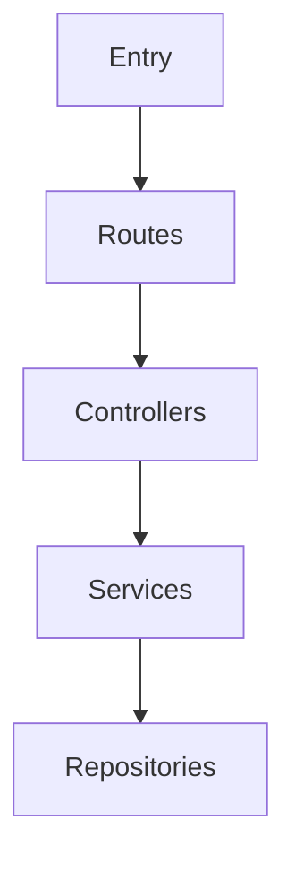

# Codebase Cartographer

## Purpose

Exhaustively index and document repositories to create the **definitive first reference** for all future development work. This skill generates comprehensive documentation that allows developers to understand an entire codebase without reading individual files.

### Key Capabilities

1. **Complete File Indexing**: Every file catalogued with purpose, exports, imports, complexity, and searchable tags
2. **Architecture Mapping**: Detect patterns (MVC, Layered, DDD), map dependencies, identify entry points
3. **Technology Detection**: Auto-detect languages, frameworks, libraries, build tools
4. **CDC (Change Data Capture)**: Track repository evolution with versioned snapshots and differential analysis

### Target Users

- **Onboarding developers**: Understand new codebases in minutes
- **Team leads**: Create handoff documentation
- **Auditors**: Track codebase evolution over time
- **Code reviewers**: See what changed between versions

### Differentiation from repository-analyzer

| Feature | repository-analyzer | codebase-cartographer |
|---------|---------------------|------------------------|
| File indexing | Structure only | Every file with content summary |
| Output format | .md only | .md AND .json |
| Searchable tags | No | Yes (per file) |
| CDC/Snapshots | No | Full version history |
| Differential analysis | No | Yes, with impact scoring |
| Internal dependencies | No | Full import/export graph |

---

## Commands

### `/cartograph` - Full Repository Index

Creates a complete codebase index with snapshot for CDC tracking.

**Triggers:**
- "index repository", "map codebase", "cartograph"
- "create codebase index", "document repository structure"
- "generate codebase reference", "onboarding documentation"

### `/cartograph-diff` - Differential Analysis

Compares current state to previous snapshots and generates change report.

**Triggers:**
- "what changed", "codebase diff", "repository changes"
- "show changes since last index", "differential analysis"
- "compare codebase", "evolution report"

**Variants:**
```
/cartograph-diff                     # Compare to last snapshot
/cartograph-diff <id1> <id2>         # Compare specific snapshots
/cartograph-diff --since=7d          # Compare to snapshot from 7 days ago
/cartograph-diff --since=commit:abc  # Compare to specific commit
```

---

## CDC (Change Data Capture) System

### Snapshot Storage Structure

```
.claude/codebase-cartography/
├── current/
│   ├── CODEBASE_INDEX.md          # Latest full index
│   └── CODEBASE_INDEX.json        # Latest full index (JSON)
├── history/
│   ├── 2024-01-15T10-30-00_abc123/
│   │   ├── snapshot.json          # Complete snapshot data
│   │   └── meta.json              # Snapshot metadata
│   ├── 2024-01-16T14-45-00_def456/
│   │   ├── snapshot.json
│   │   └── meta.json
│   └── ...
├── diffs/
│   ├── diff_abc123_to_def456.md   # Differential reports
│   └── diff_abc123_to_def456.json
└── manifest.json                   # Index of all snapshots
```

### Snapshot ID Format

`{ISO-timestamp}_{short-git-hash}`

Example: `2024-01-15T10-30-00_abc123`

### Manifest File (manifest.json)

```json
{
  "projectName": "my-project",
  "latestSnapshotId": "2024-01-16T14-45-00_def456",
  "snapshotCount": 15,
  "oldestSnapshot": "2024-01-01T08-00-00_first01",
  "snapshots": [
    {
      "id": "2024-01-16T14-45-00_def456",
      "createdAt": "2024-01-16T14:45:00Z",
      "gitCommit": "def456...",
      "gitBranch": "main",
      "totalFiles": 350,
      "totalLines": 46200
    }
  ],
  "retentionPolicy": {
    "maxSnapshots": 30,
    "maxAgeDays": 90,
    "minSnapshots": 5
  }
}
```

### Change Categories

#### 1. File Changes
| Category | Description | Detection |
|----------|-------------|-----------|
| `ADDED` | New file created | Path in current, not in previous |
| `DELETED` | File removed | Path in previous, not in current |
| `MODIFIED` | Content changed | Same path, different checksum |
| `RENAMED` | File moved | High content similarity, different path |

#### 2. Dependency Changes
| Category | Description |
|----------|-------------|
| `DEP_ADDED` | New dependency added |
| `DEP_REMOVED` | Dependency removed |
| `DEP_UPGRADED` | Version increased |
| `DEP_DOWNGRADED` | Version decreased |
| `DEP_MAJOR_BUMP` | Major version change (breaking) |

#### 3. Architecture Changes
| Category | Description |
|----------|-------------|
| `DIR_ADDED` | New directory created |
| `DIR_REMOVED` | Directory deleted |
| `PATTERN_SHIFT` | Architecture pattern changed |
| `ENTRY_POINT_ADDED` | New entry point detected |
| `ENTRY_POINT_REMOVED` | Entry point removed |

#### 4. Code Quality Changes
| Category | Description |
|----------|-------------|
| `DEBT_ADDED` | New TODO/FIXME/HACK added |
| `DEBT_RESOLVED` | Technical debt marker removed |
| `LARGE_FILE_ADDED` | File grew beyond 500 lines |
| `COMPLEXITY_INCREASED` | File complexity score increased |

#### 5. API Changes
| Category | Description |
|----------|-------------|
| `ENDPOINT_ADDED` | New API endpoint |
| `ENDPOINT_REMOVED` | API endpoint deleted |
| `ENDPOINT_MODIFIED` | Endpoint signature changed |
| `EXPORT_ADDED` | New public export |
| `EXPORT_REMOVED` | Public export removed |

### Impact Scoring

| Score | Criteria |
|-------|----------|
| **CRITICAL** | Breaking changes, security fixes, major refactors |
| **HIGH** | New features, API changes, dependency major bumps |
| **MEDIUM** | Bug fixes, minor features, dependency minor bumps |
| **LOW** | Documentation, config, minor tweaks |

### Retention Policy

| Setting | Default | Description |
|---------|---------|-------------|
| `maxSnapshots` | 30 | Maximum snapshots to keep |
| `maxAgeDays` | 90 | Delete snapshots older than this |
| `minSnapshots` | 5 | Always keep at least this many |

---

## Core Workflow: `/cartograph`

### Phase 0: CDC Initialization
```bash
# Check for existing CDC history
if [ -d ".claude/codebase-cartography" ]; then
  # Load manifest.json
  # Get previous snapshot ID for comparison
fi

# Generate new snapshot ID
SNAPSHOT_ID="$(date -u +%Y-%m-%dT%H-%M-%S)_$(git rev-parse --short HEAD 2>/dev/null || echo 'nogit')"
```

### Phase 1: Discovery (Scan)

1. Identify repository root and .gitignore patterns
2. Glob all files recursively using Glob tool: `**/*`
3. Exclude standard directories:
   - `node_modules`, `.git`, `dist`, `build`, `target`
   - `__pycache__`, `.venv`, `venv`, `.env`
   - `coverage`, `.nyc_output`, `.cache`
4. Collect file metadata:
   - Path, name, extension, size
   - Line count, last modified date
   - Content checksum (for CDC)

### Phase 2: Technology Detection

**Manifest files to check:**

| File | Technology |
|------|------------|
| `package.json` | Node.js / JavaScript / TypeScript |
| `Cargo.toml` | Rust |
| `requirements.txt` / `pyproject.toml` | Python |
| `go.mod` | Go |
| `pom.xml` / `build.gradle` | Java |
| `Gemfile` | Ruby |
| `composer.json` | PHP |
| `*.csproj` | .NET / C# |

**Framework detection from dependencies:**
- React, Vue, Angular, Svelte (frontend)
- Express, FastAPI, Django, Rails, Actix (backend)
- Jest, Pytest, Cargo test (testing)

### Phase 3: File Analysis

For each file, extract:

```
{
  "path": "src/services/auth.ts",
  "purpose": "Authentication service with JWT handling",
  "exports": ["login", "verify", "refresh", "logout"],
  "imports": ["jsonwebtoken", "bcrypt", "./user-repository"],
  "complexity": "moderate",
  "tags": ["auth", "security", "jwt", "service"],
  "lines": 156,
  "hasDocumentation": true,
  "checksum": "sha256:a1b2c3..."
}
```

**Complexity scoring:**
- **Simple**: < 50 lines, few imports, straightforward logic
- **Moderate**: 50-200 lines, multiple functions, some branching
- **Complex**: > 200 lines, many imports, nested logic, multiple classes

### Phase 4: Architecture Mapping

**Pattern detection:**

| Pattern | Indicators |
|---------|------------|
| MVC | `models/`, `views/`, `controllers/` |
| Layered | `api/`, `services/`, `repositories/` |
| Feature-based | `features/auth/`, `features/users/` |
| Domain-driven | `domain/`, `application/`, `infrastructure/` |
| Microservices | Multiple `services/` subdirectories |
| Monorepo | `packages/`, `apps/`, workspace config |

**Entry point detection:**
- `main.*`, `index.*`, `app.*`
- Router/route files
- CLI entry points
- Event handlers

### Phase 5: Code Quality Analysis

**Search patterns:**
```bash
# Technical debt markers
grep -rn "TODO\|FIXME\|HACK\|XXX\|DEPRECATED" --include="*.{js,ts,py,go,rs,java}"

# Large files (>500 lines)
find . -name "*.{js,ts,py}" -exec wc -l {} \; | awk '$1 > 500'
```

### Phase 6: Git Context

```bash
# Most changed files (hotspots)
git log --pretty=format: --name-only | sort | uniq -c | sort -rg | head -20

# Recent commits
git log --oneline -20

# Contributors
git shortlog -sn | head -10

# Current state
git branch --show-current
git rev-parse HEAD
```

### Phase 7: CDC Comparison

If previous snapshot exists:
1. Load previous snapshot from history
2. Compare file lists: identify ADDED, DELETED, MODIFIED
3. Compare dependencies: identify version changes
4. Compare technical debt: identify resolved vs new
5. Compare API endpoints: identify changes
6. Calculate impact score

### Phase 8: Output Generation

1. Generate `CODEBASE_INDEX.md` (see template below)
2. Generate `CODEBASE_INDEX.json` (see schema below)
3. Save snapshot to `.claude/codebase-cartography/history/{snapshot-id}/`
4. Update `manifest.json`
5. Copy current files to `.claude/codebase-cartography/current/`
6. Copy to project root: `./CODEBASE_INDEX.md`, `./CODEBASE_INDEX.json`

### Phase 9: Cleanup (Retention)

1. Count snapshots, delete oldest if > maxSnapshots
2. Check ages, delete if > maxAgeDays
3. Always keep minSnapshots regardless of age
4. Update manifest.json

---

## Differential Workflow: `/cartograph-diff`

### Trigger Detection

Activate when user says:
- "what changed", "show changes", "codebase diff"
- "compare to last index", "/cartograph-diff"
- Or with arguments: `/cartograph-diff abc123 def456`

### Execution Steps

1. **Parse Arguments**
   - No args: Compare current state to latest snapshot
   - Two IDs: Compare specific snapshots
   - `--since=Xd`: Find snapshot from X days ago

2. **Load Snapshots**
   ```
   FROM: Previous snapshot (from history)
   TO: Current state (generate fresh scan or use latest)
   ```

3. **Compute Differences**
   - File-level: walk both file lists, categorize each
   - Dependency-level: diff package versions
   - Architecture-level: compare directory structures
   - API-level: compare endpoint lists
   - Quality-level: compare debt markers

4. **Calculate Impact Score**
   ```
   if (breaking_changes || security_fixes) → CRITICAL
   else if (new_features || api_changes || major_bumps) → HIGH
   else if (bug_fixes || minor_features) → MEDIUM
   else → LOW
   ```

5. **Generate Reports**
   - `CODEBASE_CHANGELOG.md`
   - `CODEBASE_CHANGELOG.json`
   - Save to `.claude/codebase-cartography/diffs/`

---

## Output Templates

### CODEBASE_INDEX.md Template

```markdown
# [Project Name] - Codebase Cartography Index

**Generated**: [Timestamp]
**Snapshot ID**: [2024-01-15T10-30-00_abc123]
**Repository**: [Path or URL]
**Git Commit**: [Full hash]
**Git Branch**: [Branch name]
**Indexer Version**: codebase-cartographer v1.0.0

---

## Quick Reference

| Metric | Value |
|--------|-------|
| Total Files | [N] |
| Lines of Code | [N] |
| Primary Language | [Language] |
| Framework | [Framework] |
| Architecture | [Pattern] |
| Test Coverage | [%] or Unknown |
| Last Commit | [Date] |
| Previous Snapshot | [ID] or First snapshot |
| Changes Since Last | +N files, -N files, ~N modified |

---

## Table of Contents

1. [Executive Summary](#executive-summary)
2. [Changes Since Last Index](#changes-since-last-index)
3. [Directory Structure](#directory-structure)
4. [File Index by Directory](#file-index-by-directory)
5. [Architecture Overview](#architecture-overview)
6. [Technology Stack](#technology-stack)
7. [Dependencies](#dependencies)
8. [Entry Points](#entry-points)
9. [Key Files Reference](#key-files-reference)
10. [Code Quality Notes](#code-quality-notes)
11. [Development Quick Start](#development-quick-start)
12. [Snapshot History](#snapshot-history)

---

## Executive Summary

[2-3 paragraph overview of what this codebase does, its architecture, and key characteristics]

---

## Changes Since Last Index

> **Comparing to**: [Previous Snapshot ID] ([Date])
> **Time elapsed**: [Duration]

| Category | Count | Details |
|----------|-------|---------|
| Files Added | +N | [directories affected] |
| Files Deleted | -N | [what was removed] |
| Files Modified | ~N | [key files changed] |
| Dependencies Added | +N | [package names] |
| Dependencies Updated | N | [version bumps] |
| Tech Debt Resolved | -N | [TODOs completed] |

**For detailed changelog**: Run `/cartograph-diff`

---

## Directory Structure

```
project-root/
├── src/                    # [Purpose]
│   ├── components/         # [Purpose]
│   ├── services/           # [Purpose]
│   └── utils/              # [Purpose]
├── tests/                  # [Purpose]
└── config/                 # [Purpose]
```

---

## File Index by Directory

### `/src/`

| File | Purpose | Exports | Imports | Complexity | Tags | Status |
|------|---------|---------|---------|------------|------|--------|
| `index.ts` | Entry point | `main()` | express | Moderate | entry | unchanged |
| `app.ts` | App config | `app` | middleware | Simple | config | modified |

*Status: `new` | `modified` | `unchanged`*

---

## Architecture Overview

### Pattern: [Pattern Name]

[Description of architecture]

### Module Relationships



---

## Technology Stack

### Languages
- [Language]: [%]

### Frameworks & Libraries
- **Web**: [Framework] v[Version]
- **Database**: [Type] via [Driver]
- **Testing**: [Framework]

---

## Dependencies

### Production ([N])

| Package | Version | Purpose | Status |
|---------|---------|---------|--------|
| express | 4.18.2 | Web server | unchanged |

### Development ([N])

| Package | Version | Purpose | Status |
|---------|---------|---------|--------|
| jest | 29.7.0 | Testing | updated |

---

## Entry Points

| Type | File | Description |
|------|------|-------------|
| Main | `src/index.ts` | Server startup |
| CLI | `src/cli.ts` | Command line |

### API Endpoints

| Method | Path | Handler | Status |
|--------|------|---------|--------|
| GET | /api/users | `users.list` | unchanged |
| POST | /api/users | `users.create` | new |

---

## Key Files Reference

### Configuration
| File | Purpose |
|------|---------|
| `tsconfig.json` | TypeScript |
| `.env.example` | Environment |

### Critical Logic
| File | Purpose | Functions |
|------|---------|-----------|
| `src/auth.ts` | Authentication | `login()`, `verify()` |

---

## Code Quality Notes

### Technical Debt

| Type | Count | Trend |
|------|-------|-------|
| TODO | [N] | ↓ -2 |
| FIXME | [N] | → same |
| HACK | [N] | ↓ -1 |

### Large Files (>500 lines)
- `src/legacy.ts` (892 lines)

---

## Development Quick Start

### Prerequisites
- [Runtime] v[Version]

### Commands
```bash
npm install      # Install
npm run dev      # Development
npm test         # Tests
npm run build    # Production
```

---

## Snapshot History

| Snapshot ID | Date | Files | LOC | Changes |
|-------------|------|-------|-----|---------|
| **current** | [Date] | [N] | [N] | +N, -N, ~N |
| [previous] | [Date] | [N] | [N] | baseline |

**Compare**: `/cartograph-diff <old> <new>`

---

## Appendix: Full File Listing

<details>
<summary>Complete file list ([N] files)</summary>

| Path | Size | Type | Modified | Status |
|------|------|------|----------|--------|
| src/index.ts | 2.4KB | TS | 2024-01-15 | unchanged |

</details>

---

**Generated by codebase-cartographer v1.0.0**

| Command | Description |
|---------|-------------|
| `/cartograph` | Regenerate full index |
| `/cartograph-diff` | View changes |
```

### CODEBASE_CHANGELOG.md Template

```markdown
# [Project Name] - Codebase Changelog

**Comparing**: `[from-snapshot]` → `[to-snapshot]`
**Time Span**: [duration]
**Git Range**: `[commit1]...[commit2]` ([N] commits)

---

## Summary

| Metric | Previous | Current | Change |
|--------|----------|---------|--------|
| Total Files | [N] | [N] | +/-N |
| Lines of Code | [N] | [N] | +/-N |
| Dependencies | [N] | [N] | +/-N |
| Technical Debt | [N] | [N] | +/-N |

### Impact Score: **[LEVEL]**

Changes affect: [areas]

---

## File Changes

### Added Files ([N])
| File | Purpose | Lines | Tags |
|------|---------|-------|------|

### Deleted Files ([N])
| File | Was Purpose | Lines Lost |
|------|-------------|------------|

### Modified Files ([N])
| File | Change Summary | Lines +/- | Complexity |
|------|----------------|-----------|------------|

---

## Dependency Changes

### Added ([N])
| Package | Version | Purpose |
|---------|---------|---------|

### Updated ([N])
| Package | Previous | Current | Breaking? |
|---------|----------|---------|-----------|

### Removed ([N])
| Package | Was Version | Impact |
|---------|-------------|--------|

---

## Architecture Changes

### New Directories
- [path] - [purpose]

### Removed Directories
- [path] - [was purpose]

### New Entry Points
| Type | File | Description |
|------|------|-------------|

---

## API Surface Changes

### New Endpoints ([N])
| Method | Path | Handler |
|--------|------|---------|

### Removed Endpoints ([N])
| Method | Path | Was Handler |
|--------|------|-------------|

---

## Code Quality Changes

### Technical Debt Resolved ([N])
| Type | File | Was |
|------|------|-----|

### New Technical Debt ([N])
| Type | File | Text |
|------|------|------|

### Complexity Changes
| File | Previous | Current |
|------|----------|---------|

---

## Git Context

### Commits ([N])
```
[hash] - [message]
```

### Contributors
| Author | Commits | Lines |
|--------|---------|-------|

---

## Recommendations

1. [Priority] [Action] - [Reason]
2. [Priority] [Action] - [Reason]

---

**Generated by codebase-cartographer CDC**
```

---

## Quality Checklist

Before declaring complete, verify:

### Coverage
- [ ] Every non-ignored file listed
- [ ] Every directory has purpose
- [ ] All manifest files parsed

### Accuracy
- [ ] Technology detection correct
- [ ] Architecture pattern identified
- [ ] Dependency counts match

### Usability
- [ ] Markdown renders correctly
- [ ] JSON is valid
- [ ] Quick Reference accurate
- [ ] Development Quick Start works

### CDC Specific
- [ ] Snapshot saved to history
- [ ] manifest.json updated
- [ ] CDC status on all items
- [ ] Changes section filled
- [ ] Retention policy applied

---

## Output Delivery

### Full Index (`/cartograph`)

**Files created:**
- `./CODEBASE_INDEX.md` (project root)
- `./CODEBASE_INDEX.json` (project root)
- `./.claude/codebase-cartography/current/` (copy)
- `./.claude/codebase-cartography/history/{snapshot-id}/` (archive)

**Notify user:**
```
Codebase Cartography Complete!

Snapshot ID: [id]
Previous: [previous-id]

Summary:
- [N] files indexed across [N] directories
- Primary stack: [Language] + [Framework]
- Architecture: [Pattern]

Changes Since Last:
- +N files added
- -N files deleted
- ~N files modified
- [N] dependencies changed
- [N] TODOs resolved

Output:
- ./CODEBASE_INDEX.md
- ./CODEBASE_INDEX.json

Commands:
- /cartograph (regenerate)
- /cartograph-diff (view changes)
```

### Differential (`/cartograph-diff`)

**Files created:**
- `./CODEBASE_CHANGELOG.md`
- `./CODEBASE_CHANGELOG.json`
- `./.claude/codebase-cartography/diffs/diff_{from}_{to}.*`

**Notify user:**
```
Codebase Changelog Generated!

Comparing: [from] → [to]
Time Span: [duration]
Impact Score: [LEVEL]

Changes:
| Files Added    | +N |
| Files Deleted  | -N |
| Files Modified | ~N |
| Deps Changed   | N  |
| Debt Resolved  | -N |

Output:
- ./CODEBASE_CHANGELOG.md
- ./CODEBASE_CHANGELOG.json

Commands:
- /cartograph (full index)
- /cartograph-diff <id1> <id2> (compare specific)
```

---

## Integration Notes

### Companion Skills
- **repository-analyzer**: Quick overview (use cartographer for deep index)
- **@docs-writer**: Expand documentation from index
- **@refactor-expert**: Address identified technical debt
- **@security-auditor**: Review dependencies and configs

### Workflow Integration

**Before development:**
```
/cartograph  → Understand the codebase
```

**Daily standup:**
```
/cartograph-diff --since=1d  → What changed yesterday
```

**Code review:**
```
/cartograph-diff abc123 def456  → What's in this PR
```

**Sprint retrospective:**
```
/cartograph-diff --since=14d  → Two weeks of changes
```

---

## Quick Reference

### Commands
| Command | Description |
|---------|-------------|
| `/cartograph` | Full index with snapshot |
| `/cartograph-diff` | Compare to last snapshot |
| `/cartograph-diff <a> <b>` | Compare specific snapshots |
| `/cartograph-diff --since=7d` | Compare to 7 days ago |

### Output Locations
| File | Location |
|------|----------|
| Current index | `./CODEBASE_INDEX.md` |
| Index JSON | `./CODEBASE_INDEX.json` |
| Changelog | `./CODEBASE_CHANGELOG.md` |
| History | `.claude/codebase-cartography/history/` |
| Manifest | `.claude/codebase-cartography/manifest.json` |

### Retention Defaults
| Setting | Value |
|---------|-------|
| Max snapshots | 30 |
| Max age | 90 days |
| Min keep | 5 |
