# Repository Analyzer

## Purpose

Quickly understand unfamiliar codebases by automatically scanning structure, detecting technologies, mapping dependencies, and generating comprehensive documentation.

**For SDAM users**: Creates external documentation of codebase structure you can reference later.
**For ADHD users**: Instant overview without manual exploration - saves hours of context-switching.
**For all users**: Onboard to new projects in minutes instead of days.

## Activation Triggers

- User says: "analyze repository", "understand codebase", "document project"
- Requests for: "what's in this repo", "how does this work", "codebase overview"
- New project onboarding scenarios
- Technical debt assessment requests

## Core Workflow

### 1. Scan Repository Structure

**Step 1: Get directory structure**
```bash
# Use filesystem tools to map structure
tree -L 3 -I 'node_modules|.git|dist|build|target'
```

**Step 2: Count files by type**
```bash
# Identify languages used
find . -type f -name "*.js" | wc -l
find . -type f -name "*.py" | wc -l
find . -type f -name "*.go" | wc -l
find . -type f -name "*.rs" | wc -l
# etc...
```

**Step 3: Measure codebase size**
```bash
# Count lines of code
cloc . --exclude-dir=node_modules,.git,dist,build,target
```

### 2. Detect Technologies

**Languages**: JavaScript, TypeScript, Python, Go, Rust, Java, etc.

**Frameworks**:
- **Frontend**: React, Vue, Angular, Svelte
- **Backend**: Express, FastAPI, Django, Rails, Actix, Rocket, Axum
- **Mobile**: React Native, Flutter
- **Desktop**: Electron, Tauri

**Detection methods**:
```javascript
const detectFramework = async () => {
  // Check package.json
  const packageJson = await readFile('package.json');
  const dependencies = packageJson.dependencies || {};

  if ('react' in dependencies) return 'React';
  if ('vue' in dependencies) return 'Vue';
  if ('express' in dependencies) return 'Express';

  // Check requirements.txt
  const requirements = await readFile('requirements.txt');
  if (requirements.includes('fastapi')) return 'FastAPI';
  if (requirements.includes('django')) return 'Django';

  // Check go.mod
  const goMod = await readFile('go.mod');
  if (goMod.includes('gin-gonic')) return 'Gin';

  // Check Cargo.toml for Rust
  const cargoToml = await readFile('Cargo.toml');
  if (cargoToml.includes('actix-web')) return 'Actix Web';
  if (cargoToml.includes('rocket')) return 'Rocket';
  if (cargoToml.includes('axum')) return 'Axum';
  if (cargoToml.includes('tokio')) return 'Tokio (async runtime)';
  if (cargoToml.includes('tauri')) return 'Tauri';

  return 'Unknown';
};
```

### 3. Map Dependencies

**For Node.js**:
```bash
# Read package.json
cat package.json | jq '.dependencies'
cat package.json | jq '.devDependencies'

# Check for outdated packages
npm outdated
```

**For Python**:
```bash
# Read requirements.txt or pyproject.toml
cat requirements.txt

# Check for outdated packages
pip list --outdated
```

**For Go**:
```bash
# Read go.mod
cat go.mod

# Check for outdated modules
go list -u -m all
```

**For Rust**:
```bash
# Read Cargo.toml
cat Cargo.toml

# Parse dependencies section
sed -n '/\[dependencies\]/,/^\[/p' Cargo.toml | grep -v '^\[' | grep '='

# Parse dev-dependencies section
sed -n '/\[dev-dependencies\]/,/^\[/p' Cargo.toml | grep -v '^\[' | grep '='

# Check for outdated crates
cargo outdated

# Alternative: Show dependency tree
cargo tree --depth 1

# Check workspace members (for workspace projects)
grep -A 10 '\[workspace\]' Cargo.toml | grep 'members'
```

**Rust-specific dependency analysis**:
```bash
# Identify features being used
grep -A 50 '\[dependencies\]' Cargo.toml | grep 'features'

# Check for path dependencies (local crates)
grep 'path = ' Cargo.toml

# Check for git dependencies
grep 'git = ' Cargo.toml

# Identify build dependencies
sed -n '/\[build-dependencies\]/,/^\[/p' Cargo.toml | grep '='

# Check for workspace dependencies
grep 'workspace = true' Cargo.toml
```

### 4. Identify Architecture Patterns

**Common patterns to detect**:

- **MVC** (Model-View-Controller): `models/`, `views/`, `controllers/`
- **Layered**: `api/`, `services/`, `repositories/`
- **Feature-based**: `features/auth/`, `features/users/`
- **Domain-driven**: `domain/`, `application/`, `infrastructure/`
- **Microservices**: Multiple services in `services/` directory
- **Monorepo**: Workspaces or packages structure

**Rust-specific patterns**:

- **Workspace/Multi-crate**: `Cargo.toml` with `[workspace]`, multiple crates in subdirectories
- **Library + Binary**: `src/lib.rs` + `src/main.rs` or `src/bin/`
- **Modular**: Extensive use of `mod` declarations, `mod.rs` files
- **Async/Concurrent**: Heavy use of `tokio`, `async-std`, or other async runtimes
- **Error handling**: Custom error types with `thiserror` or `anyhow`
- **FFI/Bindings**: `build.rs`, bindgen, or cbindgen usage

**Detection logic**:
```javascript
const detectArchitecture = (structure) => {
  // Standard patterns
  if (structure.includes('models') && structure.includes('views') && structure.includes('controllers')) {
    return 'MVC Pattern';
  }
  if (structure.includes('features')) {
    return 'Feature-based Architecture';
  }
  if (structure.includes('domain') && structure.includes('application')) {
    return 'Domain-Driven Design';
  }
  if (structure.includes('services') && structure.includes('api-gateway')) {
    return 'Microservices Architecture';
  }
  
  // Rust-specific patterns
  if (structure.includes('Cargo.toml') && hasWorkspace) {
    return 'Rust Workspace (Multi-crate project)';
  }
  if (structure.includes('src/lib.rs') && structure.includes('src/main.rs')) {
    return 'Rust Library + Binary';
  }
  if (structure.includes('src/bin/')) {
    return 'Rust Multi-binary project';
  }
  
  return 'Custom Architecture';
};
```

**Rust architecture detection script**:
```bash
# Check for workspace
if grep -q '\[workspace\]' Cargo.toml; then
  echo "Architecture: Workspace Project"
  echo "Workspace members:"
  sed -n '/members = \[/,/\]/p' Cargo.toml
fi

# Check for library vs binary
if [ -f src/lib.rs ]; then
  echo "Contains library crate"
fi

if [ -f src/main.rs ]; then
  echo "Contains binary crate"
fi

# Check for multiple binaries
if [ -d src/bin ]; then
  echo "Multiple binary targets:"
  ls src/bin/
fi

# Check for procedural macros
if grep -q 'proc-macro = true' Cargo.toml; then
  echo "Contains procedural macro crate"
fi

# Check for FFI/bindings
if [ -f build.rs ]; then
  echo "Contains build script (likely FFI or code generation)"
fi
```

### 5. Extract Technical Debt

**Search for indicators**:
```bash
# Find TODOs
grep -r "TODO" --include="*.js" --include="*.py" --include="*.go" --include="*.rs"

# Find FIXMEs
grep -r "FIXME" --include="*.js" --include="*.py" --include="*.go" --include="*.rs"

# Find HACKs
grep -r "HACK" --include="*.js" --include="*.py" --include="*.go" --include="*.rs"

# Find deprecated code
grep -r "@deprecated" --include="*.js" --include="*.ts"

# Rust-specific: Find deprecated attributes
grep -r "#\[deprecated" --include="*.rs"

# Rust: Find unwrap() calls (potential panics)
grep -r "\.unwrap()" --include="*.rs" | wc -l

# Rust: Find expect() calls
grep -r "\.expect(" --include="*.rs" | wc -l

# Rust: Find unsafe blocks
grep -r "unsafe {" --include="*.rs"

# Rust: Find unimplemented!() macros
grep -r "unimplemented!" --include="*.rs"

# Rust: Find todo!() macros
grep -r "todo!" --include="*.rs"
```

**Rust-specific code quality checks**:
```bash
# Run clippy for lints
cargo clippy --all-targets --all-features -- -D warnings 2>&1 | tee clippy.log

# Count clippy warnings
grep "warning:" clippy.log | wc -l

# Check formatting
cargo fmt -- --check

# Run tests
cargo test --all-features --no-fail-fast 2>&1 | tee test.log

# Check for unused dependencies
cargo machete  # if installed

# Security audit
cargo audit

# Check compilation times
cargo clean && cargo build --timings

# Check for cyclic dependencies
cargo tree --duplicates
```

**Complexity analysis**:
```javascript
// Identify long functions (potential refactor targets)
const analyzeFunctions = () => {
  // Functions > 50 lines = high complexity
  // Functions > 100 lines = very high complexity
  // Cyclomatic complexity > 10 = needs refactoring
  
  // Rust-specific:
  // Impl blocks > 200 lines = consider splitting trait implementations
  // Files > 1000 lines = consider module splitting
};
```

### 6. Generate Documentation

**Output format**:
```markdown
# {Project Name} - Repository Analysis

**Generated:** {timestamp}
**Analyzed by:** Claude Code Repository Analyzer

---

## 📊 Overview

**Primary Language:** {language}
**Framework:** {framework}
**Architecture:** {architecture pattern}
**Total Files:** {count}
**Lines of Code:** {LOC}
**Last Updated:** {git log date}

---

## 📁 Directory Structure

```
project/
├── src/
│   ├── components/
│   ├── services/
│   └── utils/
├── tests/
└── docs/
```

**Rust-specific structure example**:
```
rust-project/
├── Cargo.toml          # Root manifest
├── Cargo.lock          # Dependency lock file
├── src/
│   ├── main.rs         # Binary entry point
│   ├── lib.rs          # Library root
│   ├── bin/            # Additional binaries
│   │   ├── cli.rs
│   │   └── daemon.rs
│   └── modules/
│       ├── mod.rs
│       ├── auth.rs
│       └── db.rs
├── tests/              # Integration tests
│   └── integration_test.rs
├── benches/            # Benchmarks
│   └── performance.rs
├── examples/           # Example code
│   └── basic_usage.rs
└── build.rs            # Build script
```

---

## 🛠 Technologies

### Rust Ecosystem
- **Rust Edition:** {2021/2018/2015}
- **Async Runtime:** Tokio 1.35 / async-std 1.12
- **Web Framework:** Actix Web 4.4 / Axum 0.7 / Rocket 0.5
- **Database:** SQLx 0.7 / Diesel 2.1 / SeaORM 0.12
- **Serialization:** Serde 1.0 + serde_json
- **Error Handling:** thiserror 1.0 / anyhow 1.0
- **Logging:** tracing 0.1 / log 0.4
- **Testing:** cargo-nextest / proptest / criterion

### Frontend
- React 18.2.0
- TypeScript 5.0
- Tailwind CSS 3.3

### Backend
- Node.js 18
- Express 4.18
- PostgreSQL 15

### DevOps
- Docker
- GitHub Actions
- Jest for testing

---

## 📦 Dependencies

### Rust Crates

#### Production Dependencies ({count} crates)
```toml
tokio = { version = "1.35", features = ["full"] }
actix-web = "4.4"
sqlx = { version = "0.7", features = ["postgres", "runtime-tokio-native-tls"] }
serde = { version = "1.0", features = ["derive"] }
serde_json = "1.0"
tracing = "0.1"
anyhow = "1.0"
```

#### Dev Dependencies ({count} crates)
```toml
tokio-test = "0.4"
criterion = "0.5"
proptest = "1.4"
```

#### Build Dependencies
```toml
prost-build = "0.12"  # For Protocol Buffers
```

### ⚠️ Outdated Crates (use `cargo outdated`)
- tokio: 1.35.0 → 1.36.0 (patch update available)
- actix-web: 4.4.0 → 4.5.0 (minor update available)

### 🔒 Security Advisories (use `cargo audit`)
- No known vulnerabilities ✅

### Production (12 packages)
- express: 4.18.2
- pg: 8.11.0
- jsonwebtoken: 9.0.0
- ...

### Development (8 packages)
- typescript: 5.0.4
- jest: 29.5.0
- eslint: 8.40.0
- ...

### ⚠️ Outdated (3 packages)
- express: 4.18.2 → 4.19.0 (minor update available)
- jest: 29.5.0 → 29.7.0 (patch updates available)

---

## 🏗 Architecture

**Pattern:** Layered Architecture

**Layers:**
1. **API Layer** (`src/api/`): REST endpoints, request validation
2. **Service Layer** (`src/services/`): Business logic
3. **Repository Layer** (`src/repositories/`): Database access
4. **Models** (`src/models/`): Data structures

**Data Flow:**
```
Client → API → Service → Repository → Database
```

**Rust-specific Architecture Example:**

**Pattern:** Hexagonal Architecture with Rust Modules

**Modules:**
1. **Domain Layer** (`src/domain/`): Core business entities and traits
2. **Application Layer** (`src/application/`): Use cases and application services
3. **Infrastructure Layer** (`src/infrastructure/`): Database, HTTP, external services
4. **Presentation Layer** (`src/api/` or `src/handlers/`): HTTP handlers

**Module Structure:**
```rust
src/
├── domain/
│   ├── mod.rs
│   ├── entities.rs      // Domain entities
│   ├── repositories.rs  // Repository traits
│   └── errors.rs        // Domain errors
├── application/
│   ├── mod.rs
│   ├── use_cases.rs     // Business logic
│   └── dto.rs           // Data transfer objects
├── infrastructure/
│   ├── mod.rs
│   ├── database.rs      // SQLx/Diesel implementation
│   ├── http_client.rs   // External API calls
│   └── cache.rs         // Redis cache
└── api/
    ├── mod.rs
    ├── routes.rs        // Route definitions
    ├── handlers.rs      // Request handlers
    └── middleware.rs    // Auth, logging, etc.
```

---

## 🔍 Code Quality

**Metrics:**
- Average function length: 25 lines
- Cyclomatic complexity: 3.2 (low)
- Test coverage: 78%
- TypeScript strict mode: ✅ Enabled

**Rust-specific Metrics:**
- **Clippy warnings:** 12 (mostly allow-by-default lints)
- **Unsafe blocks:** 3 (well-documented FFI boundaries)
- **Unwrap calls:** 45 (mostly in tests, 8 in production code)
- **Test coverage:** 82% (use `cargo tarpaulin`)
- **Build time:** 45s incremental / 2m 15s clean
- **Binary size:** 4.2 MB (release, stripped)
- **Cyclomatic complexity:** Average 4.1 (use `cargo-cyclonedx`)

**Strengths:**
- ✅ Well-structured codebase
- ✅ Good test coverage
- ✅ Type-safe with TypeScript
- ✅ Strong type safety with Rust's ownership system
- ✅ Comprehensive error handling with Result<T, E>
- ✅ Minimal unsafe code usage
- ✅ Good use of Rust idioms (Option, Result, iterators)
- ✅ Clean module organization

**Areas for Improvement:**
- ⚠️ 12 TODOs found (see Technical Debt section)
- ⚠️ 3 outdated dependencies
- ⚠️ Missing documentation in `/utils`
- ⚠️ 8 unwrap() calls in production code (should use proper error handling)
- ⚠️ Several functions > 100 lines (consider refactoring)
- ⚠️ Some modules lack #[doc] comments
- ⚠️ Could benefit from more integration tests

---

## 🐛 Technical Debt

### High Priority (3)
- **FIXME** in `src/services/auth.js:42`: JWT refresh token rotation not implemented
- **TODO** in `src/api/users.js:78`: Add rate limiting
- **HACK** in `src/utils/cache.js:23`: Using setTimeout instead of proper cache expiry

**Rust-specific:**
- **UNSAFE** in `src/ffi/bindings.rs:156`: Raw pointer dereference without null check
- **TODO** in `src/database/pool.rs:89`: Implement connection retry logic
- **unwrap()** in `src/handlers/user.rs:234`: Should return Result instead of panicking

### Medium Priority (5)
- **TODO** in `src/components/Dashboard.jsx:15`: Optimize re-renders
- **TODO** in `tests/integration/api.test.js:100`: Add more edge cases
- **unimplemented!()** in `src/traits/cache.rs:45`: Redis cache not fully implemented
- **expect()** in `src/config/settings.rs:67`: "Config file must exist" - should handle gracefully
- ...

### Low Priority (4)
- **TODO** in `README.md:50`: Update installation instructions
- **todo!()** in `src/utils/helpers.rs:120`: Placeholder for future feature
- ...

### Rust Code Smells Detected
- **45 unwrap() calls** (8 in production code, 37 in tests)
- **12 expect() calls** (should consider ? operator)
- **3 unsafe blocks** (well-documented in FFI layer)
- **2 unimplemented!() macros** (feature work in progress)
- **5 todo!() macros** (non-critical future work)

---

## 🚀 Entry Points

**Main Application:**
- `src/index.js` - Server entry point
- `src/client/index.jsx` - Client entry point

**Rust-specific Entry Points:**

**Main Application:**
- `src/main.rs` - Binary entry point
- `src/lib.rs` - Library entry point (if applicable)

**Multiple Binaries** (if using `src/bin/`):
- `src/bin/server.rs` - Web server
- `src/bin/cli.rs` - Command-line tool
- `src/bin/worker.rs` - Background job processor

**Development:**
- `cargo run` - Run main binary
- `cargo run --bin cli` - Run specific binary
- `cargo test` - Run all tests
- `cargo test --lib` - Run unit tests only
- `cargo test --test integration_test` - Run specific integration test
- `cargo bench` - Run benchmarks
- `cargo clippy` - Run linter
- `cargo fmt` - Format code
- `cargo doc --open` - Generate and open documentation

**Production Build:**
- `cargo build --release` - Optimized build
- `cargo build --release --target x86_64-unknown-linux-musl` - Static binary

**Development:**
- `npm run dev` - Start dev server
- `npm test` - Run tests
- `npm run build` - Production build

**Configuration:**
- `.env.example` - Environment variables
- `tsconfig.json` - TypeScript config
- `jest.config.js` - Test configuration

**Rust Configuration:**
- `Cargo.toml` - Project manifest and dependencies
- `Cargo.lock` - Locked dependency versions
- `.cargo/config.toml` - Build configuration (if present)
- `rust-toolchain.toml` - Rust version specification
- `rustfmt.toml` - Code formatting rules
- `clippy.toml` - Linter configuration

---

## 🔄 Data Flow Analysis

This section traces how data flows through the application from entry points to outputs, documenting the complete information journey.

### Tracing Methodology

**Step 1: Identify Entry Points**
```bash
# For Rust applications
cat src/main.rs  # Binary entry point
cat src/lib.rs   # Library entry point (if applicable)

# Find all binary targets
ls src/bin/*.rs

# For web servers, find route definitions
grep -r "HttpServer\|Router\|route" src/ --include="*.rs"
grep -r "app.get\|app.post" src/ --include="*.js" --include="*.ts"
```

**Step 2: Map Function Call Chain**
```bash
# Trace function calls from main
# Example for Rust:
# main() -> initialize_server() -> setup_routes() -> register_handlers()

# Find all function definitions and their calls
grep -n "^fn \|^pub fn \|^async fn" src/**/*.rs

# Find struct definitions
grep -n "^struct \|^pub struct" src/**/*.rs

# Find trait definitions and implementations
grep -n "^trait \|^pub trait\|^impl" src/**/*.rs
```

**Step 3: Track Data Transformations**
```bash
# Identify where data changes form
# Look for type conversions, .into(), .from(), serde serialization

# Find struct construction
grep -r "::new(\|::from(\|::default(" src/ --include="*.rs"

# Find data transformations
grep -r "\.map(\|\.map_err(\|\.and_then(\|\.into(" src/ --include="*.rs"
```

**Step 4: Document Data Structures**
```bash
# List all key data structures
# For Rust: structs, enums, type aliases
grep -r "^pub struct\|^pub enum\|^pub type" src/ --include="*.rs"

# Check for derives (Clone, Debug, Serialize, etc.)
grep -B 1 "^pub struct" src/**/*.rs | grep "#\[derive"
```

### Rust-Specific Data Flow Tracing

**Example: Web API Request Flow**

Starting from `src/main.rs`:
```rust
// 1. Entry Point
#[tokio::main]
async fn main() -> Result<()> {
    // 2. Configuration loaded
    let config = Config::load()?;  // Config struct
    
    // 3. Dependencies initialized
    let db_pool = create_pool(&config.database_url).await?;  // PgPool
    let state = AppState::new(db_pool);  // AppState struct
    
    // 4. Server started
    HttpServer::new(move || {
        App::new()
            .app_data(state.clone())
            .service(routes::user_routes())  // Routes registered
    })
}
```

**Trace each route handler:**
```bash
# Find route handler
cat src/routes/users.rs

# Example handler function:
# pub async fn create_user(
#     state: web::Data<AppState>,
#     payload: web::Json<CreateUserDto>
# ) -> Result<HttpResponse>
```

**Track the data flow:**
1. **Input:** `CreateUserDto` (from JSON request body)
2. **Handler:** Extracts and validates data
3. **Service Call:** Passes DTO to `UserService::create_user()`
4. **Domain Object:** DTO converted to `User` entity
5. **Repository:** `User` saved via `UserRepository::insert()`
6. **Database:** SQL query executed, returns ID
7. **Response:** `User` serialized back to JSON

**Document each step with types:**
```
HTTP JSON → CreateUserDto → User → NewUser (DB model) → Database
            ↓               ↓        ↓                    ↓
         Validation    Business   SQL Insert         user_id
                        Rules                            ↓
                                                   User (with ID)
                                                         ↓
                                                   UserResponse
                                                         ↓
                                                     JSON
```

### Data Flow Diagram Generation Strategy

After tracing the complete flow, generate Mermaid diagrams showing:

**1. Struct/Type Flow Diagram**


**2. Function Call Chain Diagram**

```mermaid
sequenceDiagram
    participant main
    participant handler
    participant service
    participant repository
    participant database

    main->>handler: create_user(state, payload)
    Note over handler: Extract CreateUserDto
    handler->>handler: validate_dto()
    handler->>service: create_user(dto)
    Note over service: CreateUserDto → User
    service->>service: hash_password()
    service->>repository: insert(user)
    Note over repository: User → NewUser
    repository->>database: INSERT INTO users
    database-->>repository: RETURNING id
    Note over repository: NewUser → User
    repository-->>service: User
    service-->>handler: Result<User>
    Note over handler: User → UserResponse
    handler-->>main: HttpResponse
```


**3. Data Transformation Points**


### Tracing Commands and Scripts

**Automated call graph generation:**
```bash
# For Rust projects, use cargo-call-stack (if available)
cargo install cargo-call-stack
cargo call-stack --bin myapp > call_graph.txt

# Or manually trace with grep
echo "=== Entry Point: main.rs ===" > data_flow_trace.txt
cat src/main.rs >> data_flow_trace.txt

echo -e "\n=== Handler Functions ===" >> data_flow_trace.txt
grep -n "pub async fn\|pub fn" src/handlers/*.rs >> data_flow_trace.txt

echo -e "\n=== Service Layer ===" >> data_flow_trace.txt
grep -n "pub async fn\|pub fn" src/services/*.rs >> data_flow_trace.txt

echo -e "\n=== Repository Layer ===" >> data_flow_trace.txt
grep -n "pub async fn\|pub fn" src/repositories/*.rs >> data_flow_trace.txt
```

**Find all data structures:**
```bash
echo "=== Data Structures ===" > data_structures.txt

echo -e "\n--- DTOs ---" >> data_structures.txt
grep -A 10 "pub struct.*Dto\|pub struct.*Request\|pub struct.*Response" src/**/*.rs >> data_structures.txt

echo -e "\n--- Domain Entities ---" >> data_structures.txt
grep -A 10 "pub struct" src/domain/**/*.rs >> data_structures.txt

echo -e "\n--- Database Models ---" >> data_structures.txt
grep -A 10 "pub struct" src/models/**/*.rs >> data_structures.txt
```

**Identify type conversions:**
```bash
# Find all From/Into implementations
grep -B 2 -A 10 "impl From<\|impl Into<" src/**/*.rs

# Find all TryFrom/TryInto implementations
grep -B 2 -A 10 "impl TryFrom<\|impl TryInto<" src/**/*.rs

# Find serde serialization
grep -B 3 "Serialize, Deserialize" src/**/*.rs
```

### Documentation Output Format

Include the following in the generated documentation:

```markdown
## 🔄 Data Flow Analysis

### Application Entry Point

**Main Binary:** `src/main.rs`
- Initializes async runtime (Tokio)
- Loads configuration from environment/files
- Creates database connection pool
- Sets up HTTP server with routes

### Critical Data Structures

#### Request DTOs (Input)
- **CreateUserDto**: Email, password, name
- **LoginDto**: Email, password
- **UpdateUserDto**: Optional name, email

#### Domain Entities (Business Logic)
- **User**: ID, email, password_hash, created_at, updated_at
- **Session**: ID, user_id, token, expires_at

#### Database Models (Persistence)
- **NewUser**: email, password_hash (before ID assigned)
- **UserRecord**: Complete DB representation

#### Response DTOs (Output)
- **UserResponse**: ID, email, name (no password)
- **TokenPair**: access_token, refresh_token

### Key Data Flow Paths

#### 1. User Registration Flow
```
HTTP POST /api/users
  ↓
CreateUserDto {email, password, name}
  ↓ [Validation: email format, password strength]
  ↓
User {email, password (plaintext), name}
  ↓ [hash_password using bcrypt]
  ↓
User {email, password_hash, name}
  ↓ [add timestamps]
  ↓
NewUser {email, password_hash, name, created_at}
  ↓ [INSERT INTO users]
  ↓
Database returns: user_id
  ↓
User {id, email, password_hash, name, created_at, updated_at}
  ↓ [filter sensitive fields]
  ↓
UserResponse {id, email, name}
  ↓
HTTP 201 Created + JSON body
```

#### 2. Authentication Flow
[Similar detailed flow]

#### 3. Data Query Flow
[Similar detailed flow]

### Type Conversion Matrix

| From Type        | To Type          | Method/Function          | Location                |
|-----------------|------------------|--------------------------|------------------------|
| CreateUserDto   | User             | Into/From trait          | src/domain/user.rs     |
| User            | NewUser          | Into trait               | src/models/user.rs     |
| UserRecord      | User             | From trait               | src/models/user.rs     |
| User            | UserResponse     | Into trait               | src/api/dto.rs         |

### Function Call Hierarchy

```
main()
├── load_config()
├── create_db_pool()
│   └── PgPool::connect()
├── HttpServer::new()
    └── App::new()
        ├── register_routes()
        │   ├── user_routes()
        │   │   ├── create_user_handler()
        │   │   │   ├── validate_dto()
        │   │   │   ├── UserService::create()
        │   │   │   │   ├── hash_password()
        │   │   │   │   └── UserRepository::insert()
        │   │   │   │       └── sqlx::query()
        │   │   │   └── UserResponse::from()
        │   │   ├── get_user_handler()
        │   │   └── update_user_handler()
        │   └── auth_routes()
        └── middleware::auth()
```

### Mermaid Diagrams

[Diagrams would be generated here based on user request after analysis]
```

---

## 📋 Common Tasks

**Adding a new feature:**
1. Create component in `src/components/`
2. Add service logic in `src/services/`
3. Create API endpoint in `src/api/`
4. Write tests in `tests/`

**Database changes:**
1. Create migration in `migrations/`
2. Update models in `src/models/`
3. Run `npm run migrate`

**Rust-specific Common Tasks:**

**Adding a new feature:**
1. Create module in `src/features/` or appropriate layer
2. Define domain entities and traits in `src/domain/`
3. Implement business logic in `src/application/`
4. Add HTTP handlers in `src/api/handlers/`
5. Write unit tests in same file with `#[cfg(test)]`
6. Write integration tests in `tests/`
7. Update documentation with `cargo doc`

**Adding a new dependency:**
```bash
# Add to Cargo.toml
cargo add serde --features derive
cargo add tokio --features full

# Or manually edit Cargo.toml and run
cargo fetch
```

**Database migrations (using SQLx):**
```bash
# Create new migration
sqlx migrate add create_users_table

# Run migrations
sqlx migrate run

# Revert last migration
sqlx migrate revert
```

**Performance optimization:**
```bash
# Profile with flamegraph
cargo flamegraph --bin myapp

# Benchmark specific function
cargo bench --bench performance_test

# Check compile times
cargo clean && cargo build --timings
```

**CI/CD Integration:**
```bash
# Full CI check script
cargo fmt -- --check
cargo clippy -- -D warnings
cargo test --all-features
cargo build --release
```

---

## 🔗 Integration Points

**External Services:**
- PostgreSQL database (port 5432)
- Redis cache (port 6379)
- SendGrid API (email)
- Stripe API (payments)

**Rust-specific Integration Points:**

**Databases:**
- PostgreSQL via SQLx (compile-time checked queries)
- Redis via redis-rs (connection pooling)
- MongoDB via mongodb driver

**Message Queues:**
- RabbitMQ via lapin
- Kafka via rdkafka
- NATS via async-nats

**Observability:**
- Prometheus metrics via prometheus crate
- OpenTelemetry tracing via tracing-opentelemetry
- Structured logging via tracing-subscriber

**API Endpoints:**
- `GET /api/users` - List users
- `POST /api/auth/login` - Authentication
- `GET /api/dashboard` - Dashboard data

**Rust API Endpoints Example:**
```rust
// src/api/routes.rs
GET    /api/v1/health        -> health_check
POST   /api/v1/auth/login    -> handlers::auth::login
GET    /api/v1/users         -> handlers::users::list
POST   /api/v1/users         -> handlers::users::create
GET    /api/v1/users/:id     -> handlers::users::get
PUT    /api/v1/users/:id     -> handlers::users::update
DELETE /api/v1/users/:id     -> handlers::users::delete
```

---

## 📊 Architecture Visualization with Mermaid

After completing the repository analysis, generate Mermaid diagrams to visualize the architecture and data flow.

### When to Generate Diagrams

Generate Mermaid sequence diagrams and class diagrams as a **separate step** after the main repository analysis is complete. The user may request:
- "Show me the data flow"
- "Create a sequence diagram"
- "Visualize the architecture"
- "How do the modules interact?"

### Diagram Types to Generate

**1. Sequence Diagram - Data Flow**
Trace the main request/response flow through the codebase:
- Identify entry point (HTTP handler, main function, CLI command)
- Follow function calls through layers (API → Service → Repository → Database)
- Show async operations (especially important for Rust with `.await`)
- Include error handling paths if significant

**Detection Strategy:**
```bash
# Find main entry points
# For web apps: look for route handlers
grep -r "async fn.*handler\|fn.*handler" src/ --include="*.rs"
grep -r "app.get\|app.post\|router." --include="*.js" --include="*.ts"

# For Rust: trace from main.rs or lib.rs
cat src/main.rs | grep "async fn main\|fn main"

# Identify layers by directory structure
ls -la src/
# Common patterns: api/, handlers/, services/, repositories/, domain/
```

**2. Class/Module Diagram - Structure**
Show relationships between major components:
- For Rust: traits, implementations, and dependencies
- For OOP: class inheritance and composition
- For modules: module dependencies and imports

**Detection Strategy:**
```bash
# For Rust traits and implementations
grep -r "trait \|impl.*for" src/ --include="*.rs"

# For classes
grep -r "^class \|^export class" src/ --include="*.js" --include="*.ts"

# For module structure
find src/ -name "mod.rs" -o -name "lib.rs"
```

**3. Component Diagram - System Overview**
High-level view of system components:
- External services (databases, caches, APIs)
- Internal services/modules
- Communication patterns

### Example Analysis Workflow

```bash
# Step 1: Complete standard repository analysis
# (run through sections 1-6 of Core Workflow)

# Step 2: Identify architecture pattern from analysis results
# Pattern detected: Layered Architecture with Async Rust

# Step 3: Generate sequence diagram showing typical request flow
```

**Example output for Rust web API:**


### Generating Diagrams - Step by Step

**Step 1: Analyze the codebase** (Sections 1-6)

**Step 2: Identify key interaction flow**
- For web apps: HTTP request → response
- For CLIs: Command input → output
- For libraries: Public API usage
- For async Rust: Task spawning and .await chains

**Step 3: Trace the call path**
```bash
# Find entry point
# Example: src/handlers/user.rs has create_user handler

# Follow the calls
# create_user → user_service.create → user_repository.insert → sqlx query

# Document the layers touched
# Handler → Service → Repository → Database
```

**Step 4: Generate Mermaid syntax**
Based on traced path, create appropriate diagram:
- Use `sequenceDiagram` for flow visualization
- Use `classDiagram` for structure/relationships
- Use `graph` for component/system overview

**Step 5: Include in documentation or present separately**

### Rust-Specific Diagram Patterns

**Async Flow (Tokio/async-std):**
- Show `.await` points explicitly
- Indicate async runtime boundaries
- Show spawned tasks if relevant

**Trait Implementations:**
- Show trait definitions
- Show concrete implementations
- Show dependency injection patterns

**Error Propagation:**
- Show `Result<T, E>` returns
- Show `?` operator usage
- Show error handling branches

### JavaScript/TypeScript Patterns

**Promise Chains:**
- Show async/await flows
- Show Promise.all() parallelization
- Show error handling with try/catch

**Middleware Stacks:**
- Show middleware chain execution
- Show request/response transformation

### Python Patterns

**Decorator Chains:**
- Show decorator application order
- Show route handling in Flask/FastAPI

**Context Managers:**
- Show resource acquisition and cleanup

### Go Patterns

**Goroutine Communication:**
- Show channel operations
- Show select statements
- Show synchronization primitives

### Delivery Format

**Present diagrams in one of two ways:**

1. **Embedded in main analysis document**
   - Add "Architecture Visualization" section at the end
   - Include 2-3 most relevant diagrams

2. **Separate diagram file**
   - Create `architecture-diagrams-{project}-{timestamp}.md`
   - Include comprehensive set of diagrams with explanations

**Example delivery message:**
```
✅ Architecture diagrams generated!

Created sequence diagram showing:
- User authentication flow (8 steps)
- Database interaction pattern
- Async task handling in Tokio runtime

Created class diagram showing:
- Trait implementations (4 traits, 6 implementations)
- Module dependencies
- Domain model relationships

Diagrams saved to: {filepath}
```

---

## 📚 Additional Resources

- [Architecture Diagram](./docs/architecture.png)
- [API Documentation](./docs/api.md)
- [Development Guide](./docs/development.md)

**Rust-specific Resources:**

- [Cargo.toml Documentation](./Cargo.toml) - Dependencies and project configuration
- [Generated Rust Docs](./target/doc/{package_name}/index.html) - Run `cargo doc --open`
- [Architecture Decision Records](./docs/adr/) - Design decisions and rationale
- [Performance Benchmarks](./benches/) - Criterion benchmark suite
- [Example Code](./examples/) - Usage examples for library crates

**External Resources:**
- [Rust API Guidelines](https://rust-lang.github.io/api-guidelines/)
- [Rust Design Patterns](https://rust-unofficial.github.io/patterns/)
- [The Rust Book](https://doc.rust-lang.org/book/)
- [Mermaid Documentation](https://mermaid.js.org/) - For customizing diagrams

---

**Next Steps:**
1. Address high-priority technical debt
2. Update outdated dependencies
3. Increase test coverage to 85%+
4. Document utility functions
5. Replace unwrap() calls with proper error handling
6. Add more integration tests
7. Document public API with #[doc] comments
8. Consider using cargo-deny for dependency management
```

See [patterns.md](patterns.md) for architecture pattern library and [examples.md](examples.md) for analysis examples.

## Advanced Analysis Features

### Git History Analysis
```bash
# Find most changed files (hotspots)
git log --pretty=format: --name-only | sort | uniq -c | sort -rg | head -10

# Find largest contributors
git shortlog -sn

# Recent activity
git log --oneline --since="30 days ago" --no-merges
```

### Code Complexity Metrics
```bash
# Using complexity tools
npx eslint src/ --format json | jq '.[] | select(.messages[].ruleId == "complexity")'

# Or manual analysis
# Functions > 50 lines = candidate for refactoring
# Files > 500 lines = candidate for splitting

# Rust-specific complexity analysis
# Count lines per file
find src -name "*.rs" -exec wc -l {} \; | sort -rn | head -10

# Find large functions (rough heuristic)
grep -n "^fn " src/**/*.rs | while read line; do
  file=$(echo "$line" | cut -d: -f1)
  linenum=$(echo "$line" | cut -d: -f2)
  # Count lines until next function or end of impl
  # (implementation would need proper parsing)
done

# Use tokei for detailed stats
tokei --sort lines
```

### Dependency Security
```bash
# Check for vulnerabilities
npm audit
pip-audit  # for Python
go mod tidy && go list -m all  # for Go

# Rust security audit
cargo audit

# Check for supply chain issues
cargo deny check

# Update dependencies safely
cargo update --dry-run
```

### Rust-specific Analysis Tools
```bash
# Advanced dependency analysis
cargo tree                    # Full dependency tree
cargo tree --duplicates       # Find duplicate dependencies
cargo tree --invert tokio     # What depends on tokio?

# Size analysis
cargo bloat --release         # What takes up space in binary?
cargo bloat --release --crates # Size per crate

# Build time analysis
cargo clean && cargo build --timings
# Opens HTML report with build timeline

# Dead code detection
cargo +nightly udeps          # Unused dependencies

# License compliance
cargo license                 # List all dependency licenses

# Code coverage
cargo tarpaulin --out Html    # Generate coverage report
# or
cargo llvm-cov --html         # Alternative coverage tool

# Mutation testing
cargo mutants                 # Test your tests

# Fuzz testing
cargo fuzz list               # If using cargo-fuzz
cargo fuzz run target_name

# Benchmark comparison
cargo bench --bench my_bench -- --save-baseline main
# Make changes
cargo bench --bench my_bench -- --baseline main
```

## Integration with Other Skills

### Context Manager
Save repository overview:
```
remember: Analyzed ProjectX repository
Type: CONTEXT
Tags: repository, architecture, nodejs, react
Content: ProjectX uses React + Express, layered architecture,
         12 high-priority TODOs, 78% test coverage
```

**Rust-specific context:**
```
remember: Analyzed RustProject repository
Type: CONTEXT
Tags: repository, architecture, rust, actix-web, sqlx
Content: RustProject uses Actix Web + SQLx, hexagonal architecture,
         8 unwrap() calls to fix, 82% test coverage, tokio async runtime,
         45s incremental build time
```

### Error Debugger
If analysis finds common issues:
```
Invoke error-debugger for:
- Deprecated dependencies
- Security vulnerabilities
- Common antipatterns detected
```

**Rust-specific errors:**
```
Invoke error-debugger for:
- Cargo audit findings
- Clippy warnings (especially correctness lints)
- Unsafe code blocks without safety comments
- Unwrap calls in error paths
```

### Browser App Creator
Generate visualization:
```
Create dependency graph visualization
→ browser-app-creator generates interactive HTML chart
```

**Rust dependency visualization:**
```bash
# Generate dependency graph
cargo depgraph --all-deps | dot -Tpng > deps.png

# Or use cargo-geiger for unsafe usage visualization
cargo geiger --output-format GitHubMarkdown > security_report.md
```

## Quality Checklist

Before delivering documentation, verify:
- ✅ Directory structure mapped
- ✅ Languages and frameworks identified
- ✅ Dependencies listed
- ✅ Architecture pattern detected
- ✅ Technical debt catalogued
- ✅ Entry points documented
- ✅ Common tasks explained
- ✅ Markdown formatted properly
- ✅ Data flow from entry point traced
- ✅ Key data structures identified and documented
- ✅ Function call hierarchy mapped
- ✅ Type conversions documented

**Rust-specific checklist additions:**
- ✅ Cargo.toml parsed and dependencies extracted
- ✅ Workspace structure identified (if applicable)
- ✅ Async runtime detected (tokio, async-std, etc.)
- ✅ Unsafe blocks counted and reviewed
- ✅ Unwrap/expect calls identified
- ✅ Clippy warnings summarized
- ✅ Test coverage measured
- ✅ Build times documented
- ✅ Binary size noted (for release builds)
- ✅ FFI/build scripts identified
- ✅ Feature flags documented
- ✅ main.rs/lib.rs entry points traced
- ✅ Struct definitions catalogued
- ✅ Trait implementations mapped
- ✅ Data transformation points identified (From/Into/TryFrom)
- ✅ Async call chains documented (.await points)

**Post-analysis visualization (optional, user-requested):**
- Generate Mermaid sequence diagram showing data flow
- Generate struct/type transformation flow diagram
- Generate function call hierarchy diagram
- Generate class/module diagram showing relationships
- Generate component diagram for system overview
- Include diagrams in separate file or append to analysis document

## Output Delivery

**Format**: Markdown file saved to `~/.claude-artifacts/analysis-{project}-{timestamp}.md` (Linux/macOS) or `%USERPROFILE%\.claude-artifacts\analysis-{project}-{timestamp}.md` (Windows)

**Notify user**:
```
✅ **{Project Name} Analysis** complete!

**Summary:**
- {LOC} lines of code across {file_count} files
- Primary stack: {stack}
- Architecture: {pattern}
- {todo_count} TODOs found

**Documentation saved to:** {filepath}

**Key findings:**
1. {finding_1}
2. {finding_2}
3. {finding_3}

**Recommended actions:**
- {action_1}
- {action_2}
```

**Rust-specific notification additions:**
```
✅ **{Project Name} (Rust) Analysis** complete!

**Summary:**
- {LOC} lines of Rust code across {file_count} .rs files
- Primary stack: Rust {edition}, {async_runtime}, {web_framework}
- Architecture: {pattern}
- Dependencies: {crate_count} production, {dev_crate_count} dev
- {unwrap_count} unwrap() calls (⚠️ {production_unwraps} in production code)
- {unsafe_count} unsafe blocks
- Test coverage: {coverage}%
- Build time: {build_time}

**Documentation saved to:** {filepath}

**Key findings:**
1. {finding_1}
2. {finding_2}
3. {finding_3}

**Recommended actions:**
- {action_1}
- Replace {production_unwraps} unwrap() calls with proper error handling
- Update {outdated_count} outdated crates
- {action_2}
```

## Common Analysis Scenarios

### New Project Onboarding
User joins unfamiliar project → analyzer provides complete overview in minutes

### Technical Debt Assessment
User needs to evaluate legacy code → analyzer identifies all TODOs/FIXMEs/HACKs

### Dependency Audit
User wants to check outdated packages → analyzer lists all outdated dependencies with versions

### Architecture Documentation
User needs to document existing project → analyzer generates comprehensive architecture docs

**Rust-specific scenarios:**

### Unsafe Code Audit
User needs security review → analyzer identifies all unsafe blocks and their context

### Performance Investigation
User wants to optimize → analyzer provides build times, binary size, and benchmark results

### Dependency Supply Chain Review
User concerned about security → analyzer runs cargo-audit and cargo-deny checks

### Migration Planning
User wants to upgrade Rust edition → analyzer identifies breaking changes and deprecated patterns

## Success Criteria

✅ Complete codebase structure mapped
✅ All technologies identified correctly
✅ Dependencies catalogued with versions
✅ Architecture pattern detected
✅ Technical debt surfaced
✅ Documentation generated in <2 minutes
✅ Markdown output saved to artifacts
✅ Actionable recommendations provided

**Rust-specific success criteria:**
✅ Cargo.toml correctly parsed
✅ All crates (dependencies) listed with versions and features
✅ Workspace members identified (if applicable)
✅ Async runtime and major framework dependencies detected
✅ Unsafe code locations documented
✅ Unwrap/expect calls counted and categorized
✅ Clippy analysis results included
✅ Build and test performance metrics captured
✅ Security audit results incorporated

## Additional Resources

- **[Pattern Library](patterns.md)** - Common architecture patterns
- **[Analysis Examples](examples.md)** - Real-world repository analyses
- **[Rust Patterns Guide](rust-patterns.md)** - Rust-specific architecture patterns

## Quick Reference

### Trigger Phrases
- "analyze repository"
- "understand codebase"
- "document project"
- "what's in this repo"
- "codebase overview"
- "technical debt report"
- "analyze this rust project"
- "review rust codebase"

### Output Location
- Linux/macOS: `~/.claude-artifacts/analysis-{project}-{timestamp}.md`
- Windows: `%USERPROFILE%\.claude-artifacts\analysis-{project}-{timestamp}.md`

### Analysis Depth Options
- **Quick** (<1 min): Structure + languages only
- **Standard** (1-2 min): + dependencies + patterns
- **Deep** (3-5 min): + git history + complexity metrics + security audit
- **Rust Deep** (4-7 min): + cargo audit + clippy + coverage + build analysis

### Rust-specific Quick Commands
```bash
# Quick dependency check
cargo tree --depth 1

# Quick security check
cargo audit

# Quick quality check
cargo clippy && cargo test

# Quick outdated check
cargo outdated

# Quick size check
cargo bloat --release | head -20
```
